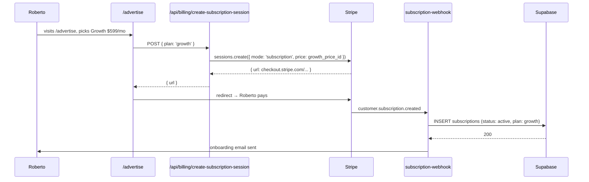
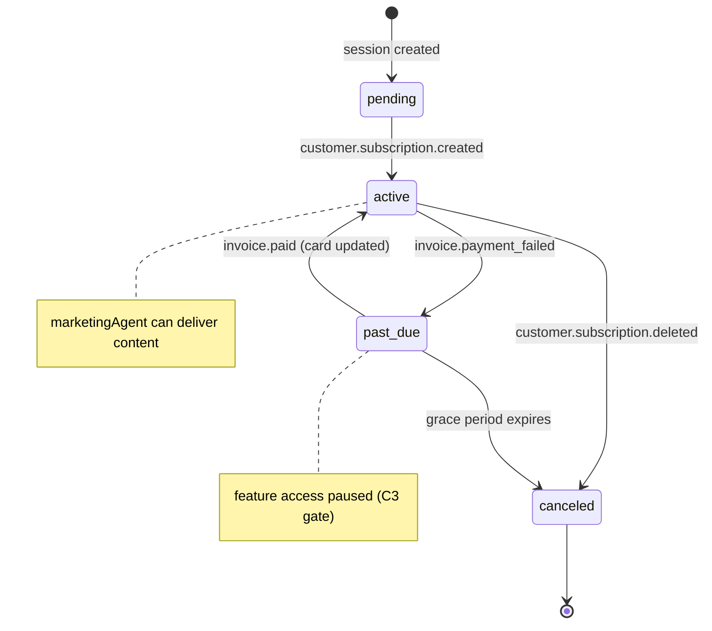

# C1 — Productize the AI Marketing Agency

## 0. Quick Read

**What this does in one sentence:** Roberto visits `/advertise` → **Agency** section, picks a monthly plan, pays with Stripe Billing, and MDE AI starts delivering AI-generated content for his venue — this is the first recurring revenue stream. (C5 adds a separate **Get Listed** section on the same page later.)

**Revenue model:** B2B retainer. Three tiers: Starter $299/mo · Growth $599/mo · Scale $999/mo. 80–95% gross margin — AI delivers content with one human QA pass.

**Why before C2/C3:** The agency generates cash from *existing* capability while Stripe Billing infrastructure is being built in parallel. No new checkout tables, no Connect — just a subscription and a content agent.

| Persona | Before | After |
|---------|--------|-------|
| **Roberto** (host) | No way to buy ongoing marketing help | Visits `/advertise` Agency section, picks Growth plan, pays, gets onboarding email in minutes |
| **Venue owner** | Must DM the team to ask about AI marketing | Self-serve: pick a package → subscribe → Mastra delivers content calendar |
| **Patricia** (ops) | Zero recurring revenue | `SELECT plan, count(*), sum(price) FROM subscriptions WHERE status='active'` → MRR |





---

## 1. Purpose

MDE AI can already generate content and draft social posts via `conciergeAgent` tools. C1 wraps that raw capability into a **productized service** that Roberto and venue owners can buy on a recurring subscription. This is the fastest path to first MRR: no new data tables, no checkout sessions, no Connect — just a Billing subscription and a Mastra agent that delivers the work.

**Revenue model:** B2B retainer. Three tiers (Starter $299/mo, Growth $599/mo, Scale $999/mo). 80–95% gross margin since delivery is AI + one human QA pass.

**Why first (before C2/C3):** Productizing the agency generates cash from existing capability while the Stripe Billing + checkout infrastructure (C3 + C2) is being built in parallel.

## 2. Goals

- Stripe Billing product + 3 price objects created (Starter/Growth/Scale) in Stripe dashboard
- `subscriptions` Supabase table migrated (id, user_id, stripe_customer_id, stripe_subscription_id, plan, status, current_period_end)
- `/advertise` page live with package comparison, CTA → Stripe Billing hosted checkout
- `MarketingAgent` skeleton registered in Mastra (uses `gen_content`, `wa_campaign`, `schedule_post` tools — stubs acceptable in C1; fill in C7)
- Intake form captures client name, business type, social handles → stored in `subscriptions` row
- Stripe webhook `customer.subscription.created` → updates `subscriptions.status = active`
- `npm run build` exits 0; Vitest floor stays ≥ 401

## 3. Persona value

| Persona | Before | After |
|---------|--------|-------|
| **Roberto** (host) | No way to buy ongoing marketing help | Visits `/advertise`, picks Growth plan, pays via Stripe Billing, gets onboarding email |
| **Venue owner** (B2B) | Has to DM team manually to ask about AI marketing | Self-serve: picks a package, subscribes, gets a Mastra-assisted content calendar |
| **Patricia** (ops) | No recurring revenue — only one-off ticket commissions | Dashboard shows active subscribers + MRR estimate |

## 4. Wiring plan

| Layer | File | Action |
|-------|------|--------|
| Agent | `src/mastra/agents/marketing-agent.ts` | Create — `MarketingAgent` with stub tools |
| Tool stub | `src/mastra/tools/gen-content.ts` | Create — `gen_content` tool (returns draft social post) |
| Tool stub | `src/mastra/tools/wa-campaign.ts` | Create — `wa_campaign` tool stub (schedules to `wa_outbox`) |
| Tool stub | `src/mastra/tools/schedule-post.ts` | Create — `schedule_post` tool stub (inserts into `content_schedule`) |
| Agent registry | `src/mastra/agents/index.ts` | Export `marketingAgent` |
| Mastra index | `src/mastra/index.ts` | Register `marketingAgent` in `Mastra({ agents: {…} })` |
| Migration | `supabase/migrations/YYYYMMDD_subscriptions.sql` | Create — `subscriptions` table (RLS: owner reads own rows; service-role for webhook writes) |
| Webhook edge | `supabase/functions/subscription-webhook/index.ts` | Create — handles `customer.subscription.created/updated/deleted` → upserts `subscriptions` |
| Page | `src/app/advertise/page.tsx` | Create — package comparison + CTA buttons |
| Component | `src/components/pricing/PricingCard.tsx` | Create — reusable pricing card component |
| API route | `src/app/api/billing/create-subscription-session/route.ts` | Create — creates Stripe Billing hosted checkout session for selected plan |
| Types | `src/lib/types.ts` | Modify — add `Subscription` type |

## 5. Schema

```sql
-- supabase/migrations/YYYYMMDD_subscriptions.sql
CREATE TABLE public.subscriptions (
  id            uuid PRIMARY KEY DEFAULT gen_random_uuid(),
  user_id       uuid NOT NULL REFERENCES auth.users(id) ON DELETE CASCADE,
  stripe_customer_id      text,
  stripe_subscription_id  text UNIQUE,
  plan          text NOT NULL CHECK (plan IN ('starter', 'growth', 'scale')),
  status        text NOT NULL DEFAULT 'pending'
                CHECK (status IN ('pending', 'active', 'past_due', 'canceled')),
  current_period_end  timestamptz,
  intake_data   jsonb,   -- business type, social handles, goals
  created_at    timestamptz NOT NULL DEFAULT now(),
  updated_at    timestamptz NOT NULL DEFAULT now()
);

ALTER TABLE public.subscriptions ENABLE ROW LEVEL SECURITY;

-- Owners read their own rows
CREATE POLICY "owner_read" ON public.subscriptions
  FOR SELECT USING (user_id = auth.uid());

-- Service role writes from webhook (no user context)
-- Handled by edge function with SUPABASE_SERVICE_ROLE_KEY (webhook context)
```

**RLS note:** The webhook edge function runs with service role (allowed — webhook is not client code per CLAUDE.md F13 carve-out). The `/api/billing/create-subscription-session` route verifies user identity via `createClient()` before creating the Stripe customer, then stores the subscription row with user_id.

## 6. Edge cases

- Stripe Billing webhook must be registered in Stripe dashboard with its own signing secret (`STRIPE_BILLING_WEBHOOK_SECRET`) — separate from the existing `STRIPE_WEBHOOK_SECRET` used by ticket events.
- `gen_content` tool: for C1, implement as a direct Gemini call (`google("gemini-3.5-flash")`) generating a social post draft. Do not call external social APIs yet (that is C7).
- `/advertise` page is listed as `⚫ POST` in `sitemap.md` — update `sitemap.md` status to `🟡 MVP` when the page ships.
- Stripe Billing hosted checkout redirects to `/advertise?subscription=success` — display a confirmation state.
- If user is not logged in when hitting `/advertise` CTA, redirect to `/login?next=/advertise`.

## 7. Real-world examples

**Roberto** (host) visits `/advertise` after publishing his first event. He picks the Growth plan ($599/mo), clicks "Get Started," and completes Stripe Billing checkout. The `subscription-webhook` edge receives `customer.subscription.created`, sets `subscriptions.status = active`. Roberto receives an onboarding email (sent from the webhook) with intake form link.

**Patricia** runs `SELECT plan, count(*), sum(CASE WHEN plan='growth' THEN 599 WHEN plan='scale' THEN 999 ELSE 299 END) as mrr FROM subscriptions WHERE status='active' GROUP BY plan` — her first MRR snapshot.

## 8. Acceptance criteria

1. `GET /advertise` returns HTTP 200 and renders 3 pricing cards (Starter/Growth/Scale).
2. `POST /api/billing/create-subscription-session` with a valid authenticated session returns `{ url: "https://checkout.stripe.com/..." }`.
3. `subscriptions` table exists in Supabase with RLS enabled and the `owner_read` policy active.
4. `subscription-webhook` edge function is deployed and responds 200 to a test `customer.subscription.created` event.
5. `marketingAgent` appears in Mastra Studio agent list after `npm run dev`.
6. `gen_content` tool returns a non-empty string given `{ topic: "jazz night", format: "instagram_caption" }`.
7. `npm run build` exits 0; Vitest floor stays ≥ 401.
8. `sitemap.md` updated: `/advertise` → `🟡 MVP`.

## 9. Outcomes

| | Before | After |
|---|---|---|
| Path to first MRR | None | `/advertise` → Stripe Billing → `subscriptions` active |
| Marketing agent | Non-existent | `marketingAgent` registered; `gen_content` tool live |
| `subscriptions` table | Absent | Migrated with RLS |
| Revenue milestone | $0 recurring | First retainer client possible in week 3 post-MVP |
