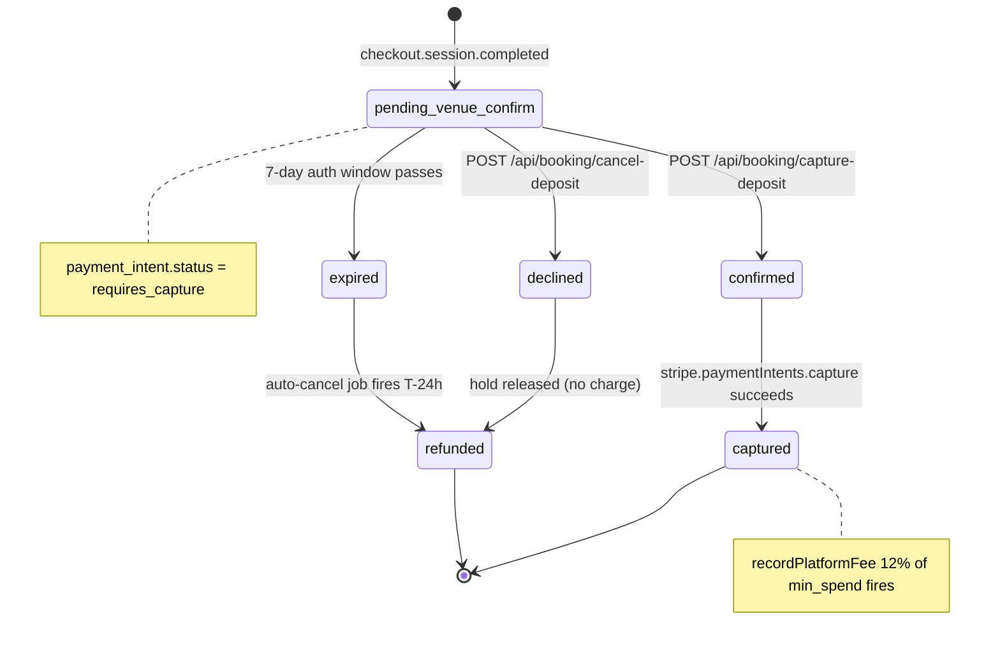
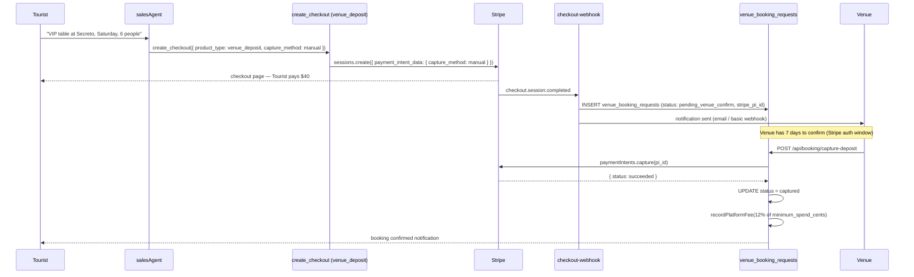

# C10 — Nightlife VIP Booking + Deposit

## 0. Quick Read

**What this does in one sentence:** A tourist pays a $40 deposit to hold a VIP table at Secreto; the venue has 2 hours to confirm — if they confirm, the deposit is captured; if they decline, the hold releases with no charge to the tourist.

**Why authorize-and-capture:** Stripe's manual capture mode puts a hold on the card without charging. The tourist's card is verified and funds reserved, but the venue can still confirm the slot is available before money moves. MDE AI earns 12% of the estimated minimum spend (not just the deposit).

| Persona | Before | After |
|---------|--------|-------|
| **Tourist** | "I want VIP at Secreto" → agent: "Call them directly" → lost booking | Agent shows VIP packages → tourist pays $40 deposit → confirmed within 2 hours |
| **Nightlife venue** (Roberto) | No digital VIP booking; manages WhatsApp manually | Receives booking notification; confirms/declines in venue dashboard (M2) |
| **Patricia** (ops) | Zero nightlife revenue | 12% of estimated spend captured at confirmation |





---

## 1. Purpose

Medellín nightlife (El Poblado, Parque Lleras, La 70) is the #1 tourist activity category in the MDE AI chat logs. Venues currently have no booking infrastructure in MDE AI — a tourist asking for a VIP table gets a "call the venue" reply. C10 closes this gap with a **deposit-first booking flow**:

1. Tourist picks a nightlife venue via chat
2. `salesAgent` (C6) triggers a VIP booking request with deposit
3. Tourist pays deposit via `create_checkout` (C2) — Stripe Checkout holds the deposit
4. Venue receives notification (WhatsApp / email — basic in C10, full in C7)
5. Venue confirms → deposit captured; venue declines → deposit refunded
6. MDE AI takes 10–15% commission on the total estimated spend

**mde-stripe skill:** "Prefer Checkout Sessions for new flows." For VIP deposits: `payment_intent_data.capture_method: 'manual'` on the Checkout Session allows hold-and-capture — venue confirms → `capture`; venue declines → `cancel`.

**mde-stripe rule:** "Idempotency on every payment-creating call. Pass an `idempotencyKey`."

## 2. Goals

- `venue_booking_requests` table extended with VIP-specific fields (package type, guest count, minimum spend, deposit amount)
- `bookings` table extended or new `vip_booking_sessions` table for deposit tracking
- `create_checkout` tool (C2) supports `product_type: 'venue_deposit'` with `capture_method: 'manual'`
- `VIPBookingWidget` React component renders booking summary + deposit CTA
- `useCopilotAction` for `create_checkout` with `venue_deposit` renders `VIPBookingWidget` instead of standard `CheckoutWidget`
- Venue notification: webhook inserts a row in `venue_booking_requests` with status `pending_venue_confirm`
- Commission logic: `platform_fees` (C12) records 12% on the total estimated spend
- `npm run build` exits 0; Vitest floor stays ≥ 401

## 3. Persona value

| Persona | Before | After |
|---------|--------|-------|
| **Tourist** (chat) | "I want VIP at Secreto" → agent: "Call them directly" → lost booking | Agent shows VIP packages → tourist selects → deposit in-chat → confirmed within 2 hours |
| **Nightlife venue** (Roberto-type) | No digital VIP booking; must manage WhatsApp manually | Receives booking notification; confirms or declines in venue dashboard (M2) |
| **Patricia** (ops) | No nightlife revenue | Deposit: 20–30% of total; MDE AI: 12% commission on estimated spend |

## 4. Wiring plan

### 4A — Schema

| Layer | File | Action |
|-------|------|--------|
| Migration | `supabase/migrations/YYYYMMDD_vip_bookings.sql` | Create — see §5 |

### 4B — Checkout extension

| Layer | File | Action |
|-------|------|--------|
| Checkout route | `src/app/api/checkout/create-payment-intent/route.ts` | Modify — when `product_type === 'venue_deposit'`: set `capture_method: 'manual'` on the Checkout Session's `payment_intent_data`; store `payment_intent_id` in `venue_booking_requests` |
| Webhook | `supabase/functions/checkout-webhook/index.ts` | Modify — on `checkout.session.completed` with `venue_deposit` metadata: insert `venue_booking_requests` row with `status: 'pending_venue_confirm'` |
| Capture route | `src/app/api/booking/capture-deposit/route.ts` | Create — POST; venue-facing (authenticated via session); calls `stripe.paymentIntents.capture(id)` |
| Cancel route | `src/app/api/booking/cancel-deposit/route.ts` | Create — POST; calls `stripe.paymentIntents.cancel(id)` + sets `venue_booking_requests.status = 'declined'` |

**mde-stripe pattern:** Authorize-and-capture:
```
sessions.create({
  mode: 'payment',
  payment_intent_data: {
    capture_method: 'manual',        // hold without charging
    metadata: { booking_type: 'vip_deposit', venue_id, booking_request_id },
  },
  ...
})
```
After checkout completes: `payment_intent.status === 'requires_capture'`  
Venue confirms → `stripe.paymentIntents.capture(pi_id)`  
Venue declines → `stripe.paymentIntents.cancel(pi_id)`

### 4C — React UI

| Layer | File | Action |
|-------|------|--------|
| Widget | `src/components/booking/VIPBookingWidget.tsx` | Create — shows venue name, package type, guest count, deposit amount, total estimated spend, 12% commission disclosure |
| CopilotKit action | `src/components/copilot/SalesAction.tsx` | Modify (C6 created) — override `create_checkout` render for `product_type === 'venue_deposit'` to use `VIPBookingWidget` |

### 4D — Mastra tool extension

| Layer | File | Action |
|-------|------|--------|
| create_checkout tool | `src/mastra/tools/create-checkout.ts` | Modify — ensure `product_type: 'venue_deposit'` flows to the correct checkout route with `capture_method: 'manual'` in the request body |

```ts
// In create-checkout.ts execute():
if (input.product_type === 'venue_deposit') {
  body.capture_method = 'manual'
  body.metadata = { ...body.metadata, booking_type: 'vip_deposit' }
}
```

### 4E — Commission

| Layer | File | Action |
|-------|------|--------|
| Shared | `supabase/functions/_shared/record-platform-fee.ts` | Modify — support `vertical: 'venue'` + `commission_rate: 0.12` |
| Checkout webhook | `supabase/functions/checkout-webhook/index.ts` | Modify — when capture confirmed: call `recordPlatformFee` with 12% of total estimated spend (not just deposit) |

## 5. Schema

```sql
-- supabase/migrations/YYYYMMDD_vip_bookings.sql

-- Extend venue_booking_requests if it already exists, or create:
ALTER TABLE public.venue_booking_requests
  ADD COLUMN IF NOT EXISTS booking_type text DEFAULT 'standard'
    CHECK (booking_type IN ('standard', 'vip')),
  ADD COLUMN IF NOT EXISTS vip_package text,            -- 'table_for_4', 'bottle_service', 'vip_area'
  ADD COLUMN IF NOT EXISTS guest_count integer,
  ADD COLUMN IF NOT EXISTS minimum_spend_cents integer,
  ADD COLUMN IF NOT EXISTS deposit_cents integer,
  ADD COLUMN IF NOT EXISTS stripe_payment_intent_id text,
  ADD COLUMN IF NOT EXISTS status text DEFAULT 'pending_venue_confirm'
    CHECK (status IN ('pending_venue_confirm', 'confirmed', 'declined', 'captured', 'refunded'));

-- If venue_booking_requests doesn't exist, create the full table:
CREATE TABLE IF NOT EXISTS public.venue_booking_requests (
  id                       uuid PRIMARY KEY DEFAULT gen_random_uuid(),
  venue_id                 uuid NOT NULL,
  user_id                  uuid REFERENCES auth.users(id),
  booking_type             text NOT NULL DEFAULT 'standard',
  vip_package              text,
  guest_count              integer,
  minimum_spend_cents      integer,
  deposit_cents            integer,
  stripe_payment_intent_id text,
  stripe_checkout_session  text,
  status                   text NOT NULL DEFAULT 'pending_venue_confirm',
  booking_date             date,
  notes                    text,
  created_at               timestamptz NOT NULL DEFAULT now(),
  updated_at               timestamptz NOT NULL DEFAULT now()
);

ALTER TABLE public.venue_booking_requests ENABLE ROW LEVEL SECURITY;

-- User reads their own bookings
CREATE POLICY "user_read_own" ON public.venue_booking_requests
  FOR SELECT USING ((SELECT auth.uid()) = user_id);

-- Service role writes from webhook
-- Venue admins read their venue's requests (add when M2 /business portal ships)
```

**mde-supabase rule:** "`(SELECT auth.uid())` not `auth.uid()` in RLS — caches per query, not per row."

## 6. Edge cases

- **Authorize-and-capture window:** Stripe authorizations expire after 7 days (cards) or 2 days (some payment methods). The venue must confirm within this window or the hold auto-releases. Store expiry in `venue_booking_requests`; add a job to auto-cancel at T-24h if not confirmed.
- **Partial capture:** Stripe allows capturing less than the authorized amount. For VIP, capture only the deposit amount; the remainder of the estimated spend is settled in-venue. Make this explicit in the `VIPBookingWidget` UI.
- **Refund on decline:** When venue declines, `stripe.paymentIntents.cancel` releases the hold (no charge). If the payment was already captured (edge case), issue a `stripe.refunds.create`.
- **Commission on estimated spend, not deposit:** MDE AI's 12% commission is on the `minimum_spend_cents` (what the group is expected to spend), not just the deposit. Record this in `platform_fees.metadata.commission_basis`.
- **Multi-currency:** All amounts in USD for Phase 1. The `minimum_spend_cents` and `deposit_cents` are in cents (integer). Display as `$` in UI.
- **Venue notification:** C10 sends a basic email/Supabase webhook; full WhatsApp confirm loop is C7/M7.

## 7. Real-world examples

**Tourist** in chat: "I want a VIP table at Secreto for Saturday, 6 people." `salesAgent` calls `create_checkout({ product_type: 'venue_deposit', product_id: 'venue_abc', quantity: 1, buyer_email: '...', ... })`. `VIPBookingWidget` renders: "Secreto VIP Table for 6 — Min. spend: $200 — Deposit (20%): $40 — MDE AI fee: $24 (12% of spend). Pay $40 now to reserve?" Tourist pays. Secreto receives a booking notification. They confirm within 2 hours → deposit captured. Tourist gets confirmation.

**Venue manager** (when M2 ships): opens `/business` → sees 3 pending VIP booking requests → clicks "Confirm" on two → `capture-deposit` route fires for each → Stripe captures $40 × 2.

## 8. Acceptance criteria

1. `venue_booking_requests` table has `booking_type`, `vip_package`, `deposit_cents`, `stripe_payment_intent_id`, `status` columns.
2. `create_checkout` with `product_type: 'venue_deposit'` creates a Stripe Checkout Session with `payment_intent_data.capture_method: 'manual'`.
3. After checkout, `venue_booking_requests` row has `status: 'pending_venue_confirm'` and a valid `stripe_payment_intent_id`.
4. `POST /api/booking/capture-deposit` calls `stripe.paymentIntents.capture` and sets status to `captured`.
5. `POST /api/booking/cancel-deposit` calls `stripe.paymentIntents.cancel` and sets status to `declined`.
6. `VIPBookingWidget` renders venue name, package, deposit amount, and estimated spend.
7. `platform_fees` row records 12% of `minimum_spend_cents` on capture.
8. `npm run build` exits 0; Vitest floor stays ≥ 401.

## 9. Outcomes

| | Before | After |
|---|---|---|
| VIP nightlife booking | "Call the venue" | Deposit in-chat, 2-hour confirmation loop |
| Venue booking requests | None | `venue_booking_requests` table live |
| Commission on nightlife | Zero | 12% of estimated spend captured at confirmation |
| Stripe authorize-and-capture | Not implemented | Live for `venue_deposit` product type |
