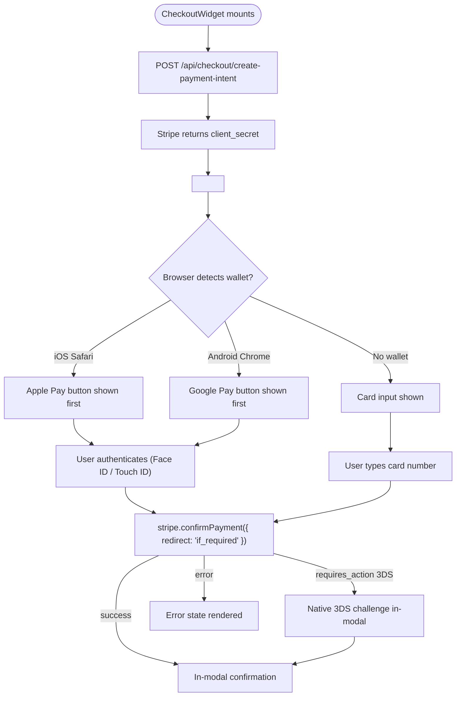

# C11 — Wallets Everywhere

## 0. Quick Read

**What this does in one sentence:** Andrés on his iPhone taps "Buy Ticket," double-clicks the side button, Face ID confirms — payment complete in 2 taps, no card typing, no redirect.

**Why it matters:** Mobile checkout completion rates climb 20–50% after wallet pay is enabled. Latin American markets have high Android penetration alongside iOS — both matter. The existing wallet infrastructure (`wallet-types.ts`, `get-wallet-order.ts`) is wired for digital passes only; this task adds the payment side.

| Persona | Before | After |
|---------|--------|-------|
| **Andrés** (iOS) | Redirected to Stripe hosted page — 6 tap checkout | Face ID → Pay in 2 taps, in-app |
| **Tourist** (Android) | No Google Pay — must type card number in modal | Google Pay one-tap inside chat concierge |
| **Roberto** (venue host) | Future: deposit flow same friction as ticket | Future: wallet-enabled deposit from day 1 via CheckoutWidget |



---

## 1. Purpose

The ticket checkout at `/events/[slug]` already has partial wallet infrastructure:
- `src/lib/tickets/wallet-types.ts` — wallet order types
- `src/lib/tickets/get-wallet-order.ts` — fetches order by token
- `src/app/api/tickets/wallet/route.ts` — GET endpoint for wallet pass data

What is **missing**: the Stripe Payment Element with `applePay` and `googlePay` enabled is not rendered in the checkout modal — the ticket flow still redirects to a hosted Stripe Checkout Session. C11 adds the embedded Payment Element experience so users complete payment without leaving the app, and ensures that same embedded element is available to every future checkout flow (venue deposit, tour booking) via the `CheckoutWidget` built in C2.

**Impact:** Mobile checkout completion rates +20–50% (Apple Pay reduces checkout steps from 6 → 2 on iOS). Latin American markets show high Android penetration — Google Pay is equally important.

**Why after C2:** The `CheckoutWidget` (C2) is the host component. C11 adds the wallet-enabled Payment Element inside it. Attempting C11 without C2 would duplicate checkout UI.

## 2. Goals

- `CheckoutWidget` renders Stripe `PaymentElement` (from `@stripe/react-stripe-js`) with `applePay` and `googlePay` enabled
- Apple Pay domain verification file served at `/.well-known/apple-developer-merchantid-domain-association` (required by Stripe)
- `useCheckout` hook manages `stripe.confirmPayment()` flow with proper error handling
- Loading skeleton renders while Stripe Elements mounts
- Checkout success/cancel states handled without page redirect (in-modal state machine)
- `npm run build` exits 0; Vitest floor stays ≥ 401

## 3. Persona value

| Persona | Before | After |
|---------|--------|-------|
| **Andrés** (iOS buyer) | Redirected to Stripe hosted page — 6 tap checkout | Face ID → Pay in 2 taps inside the app |
| **Tourist** (Android) | No Google Pay — must type card number | Google Pay one-tap inside chat concierge |
| **Roberto** (venue host) | Future: venue deposit flow same friction | Future: wallet-enabled deposit from day 1 |

## 4. Wiring plan

| Layer | File | Action |
|-------|------|--------|
| Stripe provider | `src/components/checkout/StripeProvider.tsx` | Create — wraps `Elements` from `@stripe/react-stripe-js` with `mode: 'payment'`, `currency: 'usd'`, `paymentMethodTypes: ['card', 'apple_pay', 'google_pay']` |
| Payment element | `src/components/checkout/PaymentElement.tsx` | Create — renders `<PaymentElement>` from `@stripe/react-stripe-js` with `layout: 'tabs'` |
| useCheckout hook | `src/hooks/useCheckout.ts` | Create — calls `/api/checkout/confirm` (C2), calls `stripe.confirmPayment()`, returns `{ status, error }` |
| Apple Pay domain | `public/.well-known/apple-developer-merchantid-domain-association` | Create — static file from Stripe dashboard download |
| Next.js config | `next.config.ts` | Modify — ensure `/.well-known/` is served as static (should work by default from `public/`) |
| CheckoutWidget | `src/components/checkout/CheckoutWidget.tsx` | Modify (C2 creates this) — wrap with `StripeProvider`, render `PaymentElement` |
| Ticket checkout modal | `src/components/events/booking-checkout-modal.tsx` | Modify — replace hosted session redirect with `CheckoutWidget` embed (after C2 is in place) |
| Types | `src/lib/tickets/wallet-types.ts` | Modify — add `PaymentElementResult` type |
| Tests | `src/components/checkout/__tests__/PaymentElement.test.tsx` | Create — mock `@stripe/react-stripe-js`, assert element renders |

## 5. Stripe configuration notes

**Verified via docs:** Stripe `PaymentElement` automatically shows Apple Pay / Google Pay when:
1. The page is served over HTTPS (prod) or localhost (test mode)
2. `applePay` domain verification is complete (`/.well-known/apple-developer-merchantid-domain-association`)
3. The `Elements` provider is initialized with a client secret from a `PaymentIntent` or `SetupIntent`

**Payment flow for embedded element:**
```
CheckoutWidget mounts
  → POST /api/checkout/create-payment-intent (C2 generic route)
  → returns { client_secret }
  → <Elements stripePromise clientSecret={client_secret}>
  → User selects Apple Pay / Google Pay / card
  → stripe.confirmPayment({ redirect: 'if_required' })
  → on success: show in-modal confirmation
```

**Important:** The existing ticket flow uses Checkout Sessions (server-side redirect). C11 switches to Payment Intents (client-side embedded). These are different Stripe flows — the webhook handler must also handle `payment_intent.succeeded` in addition to `checkout.session.completed`. This should be gated behind a feature flag until the webhook is updated.

## 6. Edge cases

- Apple Pay only works on Safari/iOS or Chrome-on-macOS. On Android, show Google Pay tab by default. `PaymentElement` handles this automatically via browser detection.
- Test mode: Apple Pay and Google Pay do not complete real payments in test mode — use Stripe's test card number `4242424242424242` for CI. Add a `data-testid="card-input-fallback"` to the card form for Playwright tests.
- If `stripe.confirmPayment()` returns `requires_action` (3DS), the Payment Element handles the native 3DS challenge in-modal automatically.
- Domain verification file must be served with `Content-Type: application/json` — Stripe docs specify this. Verify in production after deploy.

## 7. Real-world examples

**Andrés** opens the event detail page on his iPhone, taps "Buy Ticket." The `CheckoutWidget` renders with an Apple Pay button at the top (because he's on Safari). He double-clicks the side button, Face ID confirms, payment completes. No redirect, no card typing.

**Tourist (Android)** asks the concierge to book a restaurant. The in-chat checkout widget appears with a Google Pay button. One tap, biometric confirm, booking created.

## 8. Acceptance criteria

1. `<PaymentElement>` renders inside `CheckoutWidget` with Apple Pay and Google Pay tabs visible on supported browsers.
2. `/.well-known/apple-developer-merchantid-domain-association` returns 200 with correct content type.
3. `useCheckout` hook calls `stripe.confirmPayment()` on submit and returns `{ status: 'succeeded' }` in test mode with test card.
4. Loading skeleton visible for ≤300ms while Stripe Elements mounts.
5. Error state renders when `stripe.confirmPayment()` returns an error (e.g., card declined).
6. `npm run build` exits 0; Vitest floor stays ≥ 401.
7. Playwright test: Payment Element is visible at `/events/[slug]` checkout modal (mocked Stripe).

## 9. Outcomes

| | Before | After |
|---|---|---|
| Checkout steps (iOS Safari) | 6 (redirect → card entry → return) | 2 (Face ID → confirm) |
| Apple Pay availability | None | Enabled on all checkout flows |
| Google Pay availability | None | Enabled on all checkout flows |
| Checkout abandonment (mobile) | Baseline | Expected –20–50% (industry benchmark) |
