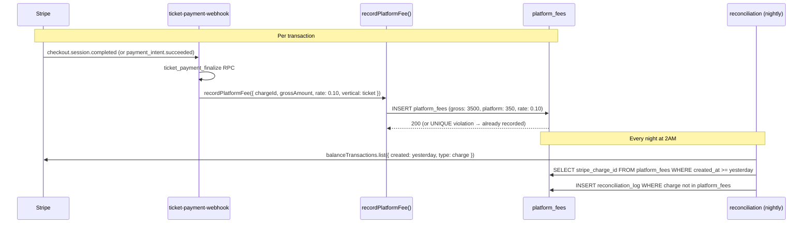
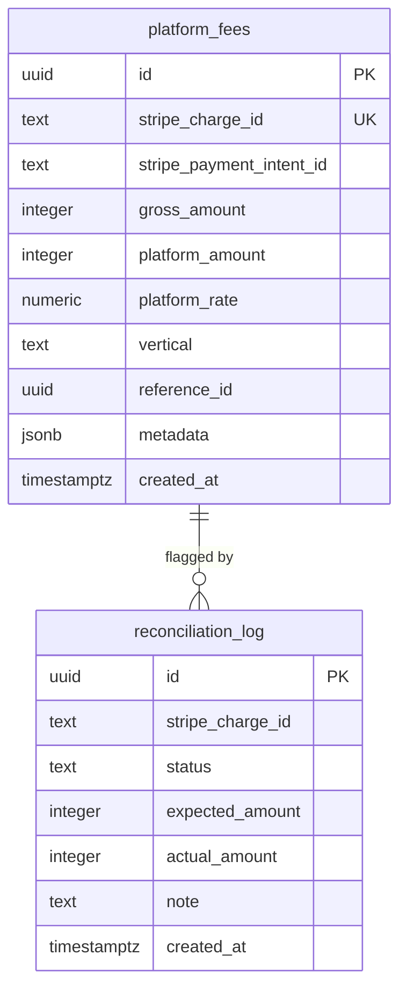

# C12 — `platform_fees` Ledger + Reconciliation

## 0. Quick Read

**What this does in one sentence:** Every Stripe charge that flows through MDE AI generates a `platform_fees` row recording exactly how much is MDE AI's cut — giving Patricia a queryable revenue ledger instead of a manual Stripe dashboard check.

**Why it matters now (not later):** Without this, MDE AI has no programmatic proof of its own revenue. M1 (Stripe Connect) literally cannot be built without it — Connect's `application_fee_amount` must match `platform_fees.platform_amount`. The nightly reconciliation catches any discrepancy before it compounds.

| Persona | Before | After |
|---------|--------|-------|
| **Patricia** (ops) | Revenue = log into Stripe dashboard, manually calculate | `SELECT sum(platform_amount) FROM platform_fees WHERE created_at > now() - '30d'::interval` |
| **Accounting** | No audit trail — just Stripe charge IDs | Immutable ledger: every charge has a timestamped row with rate applied |
| **M1 readiness** | Cannot compute `application_fee_amount` for Connect | `platform_fees.platform_amount` is the Connect fee amount |





---

## 1. Purpose

Today every Stripe payment goes into a single account with no programmatic record of what portion is MDE AI's platform revenue vs. a pass-through to the organizer. Without this table:
- Patricia cannot calculate actual platform MRR from transaction fees
- M1 (Stripe Connect) cannot be built safely — Connect charges an `application_fee_amount` that must be reconciled
- Legal/accounting has no audit trail

**C12 ships the financial spine.** Every transaction that flows through `create_checkout` (C2) or the existing ticket flow generates a `platform_fees` row. The nightly reconciliation job cross-checks these rows against Stripe's balance transaction API and flags any discrepancy.

**mde-stripe skill rule:** "Webhook handlers must be idempotent. Track processed `event.id` in a `processed_webhook_events` table."

**mde-stripe skill rule:** "Idempotency on every payment-creating call."

## 2. Goals

- `platform_fees` table migrated with RLS
- `ticket-payment-webhook` extended: on `payment_intent.succeeded` (or `checkout.session.completed`) → insert `platform_fees` row
- `checkout-webhook` edge function stub created for C2 generic checkout events
- `reconciliation` edge function deployed — runs on a cron trigger, queries Stripe balance transactions for the previous day, compares against `platform_fees`, logs discrepancies to `reconciliation_log`
- `npm run build` exits 0; Vitest floor stays ≥ 401

## 3. Persona value

| Persona | Before | After |
|---------|--------|-------|
| **Patricia** (ops) | Revenue = "check Stripe dashboard" | `SELECT sum(platform_amount) FROM platform_fees WHERE created_at > now() - interval '30d'` → daily MRR |
| **Accounting** | No audit trail | `platform_fees` is source of truth; reconciliation log flags gaps |
| **Legal** | Cannot prove what was collected | Immutable ledger with `stripe_charge_id` per row |

## 4. Wiring plan

### 4A — Schema

| Layer | File | Action |
|-------|------|--------|
| Migration | `supabase/migrations/YYYYMMDD_platform_fees.sql` | Create — see §5 below |

### 4B — Webhook extension

| Layer | File | Action |
|-------|------|--------|
| Ticket webhook | `supabase/functions/ticket-payment-webhook/index.ts` | Modify — after `ticket_payment_finalize` RPC, insert `platform_fees` row (platform_rate: 10%) |
| Checkout webhook | `supabase/functions/checkout-webhook/index.ts` | Create — handles `payment_intent.succeeded` for non-ticket flows (C2 generic checkout); inserts `platform_fees` row |
| Shared | `supabase/functions/_shared/record-platform-fee.ts` | Create — `recordPlatformFee({ chargeId, totalAmount, platformRate, vertical, referenceId })` reused by both webhooks |

**mde-supabase rule:** "Reusing utility methods between Edge Functions → add to `supabase/functions/_shared`."

```ts
// supabase/functions/_shared/record-platform-fee.ts
import { createClient } from 'npm:@supabase/supabase-js@2'

export async function recordPlatformFee({
  stripeChargeId,
  stripePaymentIntentId,
  grossAmount,    // in cents
  platformRate,   // e.g. 0.10 for 10%
  vertical,       // 'ticket' | 'venue' | 'tour' | 'rental'
  referenceId,    // e.g. event_orders.id
  metadata,
}: PlatformFeeInput): Promise<void> {
  const platformAmount = Math.round(grossAmount * platformRate)
  const serviceClient = createClient(
    Deno.env.get('SUPABASE_URL')!,
    Deno.env.get('SUPABASE_SERVICE_ROLE_KEY')!,
  )
  await serviceClient.from('platform_fees').insert({
    stripe_charge_id: stripeChargeId,
    stripe_payment_intent_id: stripePaymentIntentId,
    gross_amount: grossAmount,
    platform_amount: platformAmount,
    platform_rate: platformRate,
    vertical,
    reference_id: referenceId,
    metadata,
  })
}
```

### 4C — Reconciliation job

| Layer | File | Action |
|-------|------|--------|
| Edge function | `supabase/functions/reconciliation/index.ts` | Create — triggered by `pg_cron` or Supabase scheduled function |
| Log table | (inline in migration) | `reconciliation_log` table |

**Reconciliation logic:**
1. Fetch Stripe balance transactions from yesterday: `stripe.balanceTransactions.list({ created: { gte, lt }, type: 'charge' })`
2. For each Stripe charge, check for matching `platform_fees.stripe_charge_id`
3. Missing row → insert into `reconciliation_log` with `status: 'missing'`
4. Amount mismatch → insert with `status: 'mismatch'`
5. Return summary (logged to Supabase function logs)

## 5. Schema

```sql
-- supabase/migrations/YYYYMMDD_platform_fees.sql

CREATE TABLE public.platform_fees (
  id                        uuid PRIMARY KEY DEFAULT gen_random_uuid(),
  stripe_charge_id          text UNIQUE NOT NULL,
  stripe_payment_intent_id  text,
  gross_amount              integer NOT NULL,   -- cents
  platform_amount           integer NOT NULL,   -- cents (gross × platform_rate)
  platform_rate             numeric(5,4) NOT NULL,   -- e.g. 0.1000 = 10%
  vertical                  text NOT NULL
    CHECK (vertical IN ('ticket', 'venue', 'tour', 'rental', 'subscription')),
  reference_id              uuid,               -- event_orders.id, bookings.id, etc.
  metadata                  jsonb,
  created_at                timestamptz NOT NULL DEFAULT now()
);

ALTER TABLE public.platform_fees ENABLE ROW LEVEL SECURITY;

-- No user-facing SELECT (internal ledger). Service role only.
-- Patricia reads via direct SQL or admin API route.
CREATE POLICY "service_role_only" ON public.platform_fees
  USING (false);  -- blocks all anon/authenticated reads; service role bypasses RLS

CREATE TABLE public.reconciliation_log (
  id               uuid PRIMARY KEY DEFAULT gen_random_uuid(),
  stripe_charge_id text,
  status           text NOT NULL CHECK (status IN ('missing', 'mismatch', 'ok')),
  expected_amount  integer,
  actual_amount    integer,
  note             text,
  created_at       timestamptz NOT NULL DEFAULT now()
);
ALTER TABLE public.reconciliation_log ENABLE ROW LEVEL SECURITY;
CREATE POLICY "service_role_only" ON public.reconciliation_log USING (false);
```

**mde-supabase rule:** "Every exposed table has RLS. No exceptions in `public` schema."

## 6. Edge cases

- **Refunds:** `charge.refunded` or `refund.created` events should insert a negative `platform_fees` row (or update the original with a `refunded_at` column). Add to the webhook but keep the ledger append-only.
- **Platform rate varies by vertical:** Tickets = 10%, venue deposits = 12%, tours = 15%. Store the rate applied at transaction time (not a global config) so historic records survive rate changes.
- **Idempotency:** The webhook may fire twice for the same `stripe_charge_id`. The `UNIQUE` constraint on `stripe_charge_id` prevents double-insertion. Catch the unique violation and return 200 (already processed).
- **Amount units:** Stripe amounts are in cents (integer). Never store decimals in `platform_fees` — use integer arithmetic throughout.
- **`processed_webhook_events`** (from C3): re-use the same idempotency table for the checkout-webhook event IDs.

## 7. Real-world examples

**Andrés** buys a ticket. `ticket-payment-webhook` fires → `ticket_payment_finalize` RPC succeeds → `recordPlatformFee` inserts one row: `gross_amount: 3500` (¢35.00 ticket), `platform_amount: 350` (10%), `vertical: 'ticket'`. Patricia queries this daily.

**Nightly at 2AM:** `reconciliation` edge function runs. 47 Stripe charges yesterday. 47 matching `platform_fees` rows. Zero entries in `reconciliation_log` with `status: 'missing'`. Patricia's ops alert stays green.

## 8. Acceptance criteria

1. `platform_fees` table exists with RLS enabled and `service_role_only` policy blocking anon reads.
2. `ticket-payment-webhook` inserts a `platform_fees` row on `checkout.session.completed`.
3. Duplicate webhook delivery (same `stripe_charge_id`) returns 200 without inserting a duplicate row.
4. `reconciliation` edge function deploys and returns 200 when invoked manually.
5. `reconciliation_log` table exists with RLS enabled.
6. `recordPlatformFee()` utility is in `supabase/functions/_shared/`.
7. `npm run build` exits 0; Vitest floor stays ≥ 401.

## 9. Outcomes

| | Before | After |
|---|---|---|
| Platform revenue visibility | Zero — check Stripe dashboard manually | `SELECT sum(platform_amount) FROM platform_fees` |
| Reconciliation | None | Nightly cross-check vs Stripe balance transactions |
| Audit trail | None | Immutable `platform_fees` ledger per charge |
| M1 readiness | Cannot compute `application_fee_amount` | Rate table exists; Connect `application_fee_amount` = `platform_amount` |
