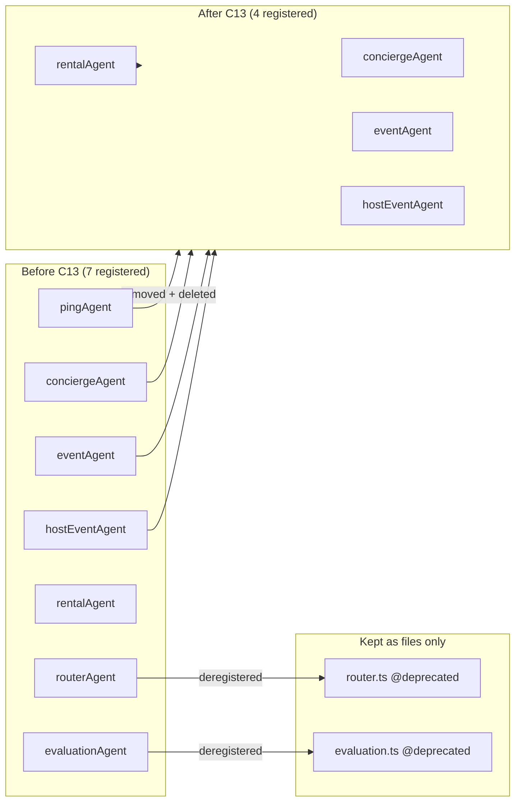

# C13 — Agent Cleanup

## 0. Quick Read

**What this does in one sentence:** Removes three idle Mastra agents (`pingAgent`, `routerAgent`, `evaluationAgent`) from the registry before the revenue sprint adds new ones — cuts per-session COGS with zero user-facing change.

**Why it matters first:** Every cold-start chat session currently burns 2 Gemini Flash calls (ping + concierge). C13 cuts that to 1. With hundreds of sessions per day at MVP launch, the savings compound before C6 adds a third agent.

| Persona | Before | After |
|---------|--------|-------|
| **Sofía** (dev) | Studio shows 7 agents; hard to tell which are active | Clean list: 4 active agents only |
| **Patricia** (ops) | `ai_runs` cluttered with `ping-agent` rows on every session | No spurious ping rows |
| **Camila** | 2 Gemini calls on first chat turn | 1 call — snappier cold-start |

---

## 1. Purpose

`pingAgent`, `routerAgent`, and `evaluationAgent` are registered in the Mastra instance but serve no live product role:

- **`pingAgent`** — day-1 smoke stub. Every chat session that routes through it burns a Gemini Flash call for "wiring is alive." `conciergeAgent` already handles routing.
- **`routerAgent`** — classifies intent (rental/event/chitchat) and dispatches workflows. Redundant: `conciergeAgent` already does multi-intent routing. The `classifyIntentTool` + `extract-intent-slots` tools it uses are reusable without the wrapper agent.
- **`evaluationAgent`** — reranks listings by user preference. Never wired to a live tool call or CopilotKit action. Parked — keep the file, remove from the Mastra registry.

Removing them from `Mastra({ agents: {…} })` stops them from appearing in Mastra Studio, reduces memory footprint, and removes their billing surface.

**Verified state (2026-06-03):**
- `pingAgent`: inline in `src/mastra/agents/index.ts` (lines 17–45), registered in `src/mastra/index.ts`
- `routerAgent`: `src/mastra/agents/router.ts` (48 lines), registered in `src/mastra/index.ts`
- `evaluationAgent`: `src/mastra/agents/evaluation.ts` (34 lines), registered in `src/mastra/index.ts`

## 2. Goals

- `pingAgent` removed from `agents/index.ts` and `mastra/index.ts`; no import left
- `routerAgent` removed from `mastra/index.ts`; `router.ts` file kept but export marked `@deprecated`
- `evaluationAgent` removed from `mastra/index.ts`; `evaluation.ts` kept (future reuse)
- All files that imported `pingAgent` updated (`log-agent-run.ts`, `logging-mastra-agent.ts`, tests)
- `npm run build` exits 0; Vitest floor stays ≥ 401

## 3. Persona value

| Persona | Before | After |
|---------|--------|-------|
| **Sofía** | Studio shows 7 agents — hard to see which are active | Studio shows 4 active agents; dead stubs gone |
| **Patricia** | `ai_runs` rows appear for `ping-agent` on every chat cold-start | No more spurious ping rows in audit log |
| **Camila** | First chat turn burns two Gemini calls (ping + concierge) | One Gemini call per turn |

## 4. Wiring plan

| Layer | File | Action |
|-------|------|--------|
| Agent exports | `src/mastra/agents/index.ts` | Remove `pingAgent` inline def + `Memory` import + `MdeState` export (if only used by ping); remove `routerAgent` + `evaluationAgent` re-exports |
| Mastra registry | `src/mastra/index.ts` | Remove `pingAgent`, `routerAgent`, `evaluationAgent` from `Mastra({ agents: {…} })` and from imports |
| Logging wrapper | `src/mastra/copilotkit/logging-mastra-agent.ts` | Remove reference to `pingAgent` — grep confirms it appears here |
| Log agent run | `src/mastra/lib/log-agent-run.ts` | Remove any `pingAgent` reference |
| Log test | `src/mastra/lib/log-agent-run.test.ts` | Update test fixtures that reference `ping-agent` id |
| Smoke test | `src/mastra/__tests__/smoke.test.ts` | Remove `pingAgent` from agent registry assertions |
| Router tests | `src/mastra/agents/__tests__/router.test.ts` | Convert to unit tests on `classifyIntentTool` directly, or delete if redundant |
| Router file | `src/mastra/agents/router.ts` | Add `@deprecated — use conciergeAgent` JSDoc comment; keep file |
| Evaluation file | `src/mastra/agents/evaluation.ts` | Add `@deprecated — parked for future reuse` JSDoc; keep file |

## 5. Edge cases

- `MdeState` Zod schema and `MdeState` TS type may still be used by `conciergeAgent` — verify before removing from `agents/index.ts`. If used, move the export to a shared location (e.g., `src/lib/types.ts`).
- Smoke test `src/mastra/__tests__/smoke.test.ts` asserts specific agent count — update assertion to 4 (conciergeAgent, rentalAgent, eventAgent, hostEventAgent).
- `routerAgent` workflows (`rentalSearchWorkflow`, `eventDiscoveryWorkflow`) are registered independently in `Mastra({ workflows: {…} })` — do not remove the workflows, only the agent wrapper.

## 6. Real-world examples

**Sofía** opens Mastra Studio the day after C13 ships. She sees 4 agents instead of 7. She starts `conciergeAgent` trace for a failing chat turn — no more noise from `ping-agent` rows polluting the timeline.

**Patricia** runs `SELECT agent_type, COUNT(*) FROM ai_runs GROUP BY agent_type` and no longer sees `ping-agent` rows cluttering the audit table.

## 7. Acceptance criteria

1. `pingAgent` does not appear in `src/mastra/index.ts` agent map.
2. `routerAgent` does not appear in `src/mastra/index.ts` agent map.
3. `evaluationAgent` does not appear in `src/mastra/index.ts` agent map.
4. `npm run build` exits 0 with no TypeScript errors.
5. `npm test -- --run` passes ≥ 401 tests.
6. `src/mastra/agents/router.ts` exists with `@deprecated` JSDoc and `routerAgent` export still present (for any future reimport).
7. `src/mastra/agents/evaluation.ts` exists with `@deprecated` JSDoc.
8. No `import.*pingAgent` left in any non-test file under `src/`.

## 8. Outcomes

| | Before | After |
|---|---|---|
| Active agents in registry | 7 | 4 |
| Gemini calls per cold-start chat turn | 2 (ping + concierge) | 1 |
| `ai_runs` noise rows | `ping-agent` rows on every session | Gone |
| Studio agent list | Cluttered with stubs | Clean — only active agents |
