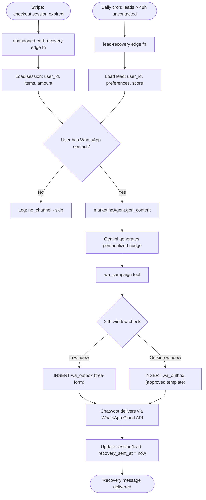
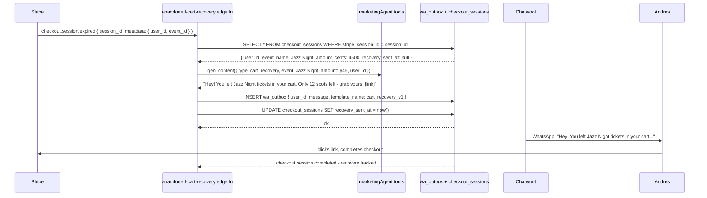

# C14 — Abandoned-Cart & Lead WhatsApp Recovery

## 0. Quick Read

**What this does in one sentence:** When Andrés starts a ticket checkout and walks away, he gets a WhatsApp message 2 hours later — "Hey, you were this close to Jazz Night tickets, they're selling fast" — and MDE AI recovers a booking that would otherwise be lost.

**The revenue case:** Industry average cart abandonment: 70%. Even a 5% recovery rate on 100 abandoned checkouts/month = 5 extra transactions. At average $45/ticket, that is $225 additional GMV/month from a 1-week task.

| Persona | Before | After |
|---------|--------|-------|
| **Andrés** (ticket buyer) | Abandons checkout; never hears from MDE AI again | WhatsApp 2h later: personalized nudge with direct link back to checkout |
| **Camila** (rental lead) | Lead created; host waits; Camila never follows up | WhatsApp 48h later: "Still looking for 2BR in El Poblado? Here are 3 new options" |
| **Patricia** (ops) | Zero recovery visibility | `SELECT count(*), sum(amount) FROM checkout_sessions WHERE status=recovered` |
| **Roberto** (venue host) | Misses bookings from interested-but-distracted tourists | Recovery rate visible per venue; feeds into M9 analytics |





---

## 1. Purpose

Every checkout flow leaks. Andrés opens the ticket widget, gets distracted, and the Stripe session expires. Without C14, that lead evaporates. With C14, a personalized WhatsApp message 2 hours later brings him back when his phone is in his hand.

C14 has two recovery paths:
1. **Checkout abandonment:** triggered by `checkout.session.expired` Stripe webhook. Works for any `product_type` (tickets, experiences, deposits).
2. **Lead recovery:** triggered by a daily cron. Finds `lead_qualifications` rows with `status = 'new'` and `created_at < now() - 48h` — leads that were delivered to a host but never contacted. Re-engages the potential tenant directly.

Both paths use C7's `gen_content` + `wa_campaign` tools for generation and delivery — C14 adds no new send mechanism, only new trigger logic.

## 2. Goals

- `abandoned-cart-recovery` edge function: triggered by `checkout.session.expired`; generates personalized recovery message; inserts `wa_outbox` row
- `lead-recovery` edge function: daily cron; finds uncontacted leads after 48h; sends re-engagement message to the lead (tenant, not the host)
- `checkout_sessions.recovery_sent_at` field tracks whether recovery was sent (prevents duplicate sends)
- `lead_qualifications.recovery_sent_at` field tracks recovery for leads
- Recovery messages use Meta-approved templates (`cart_recovery_v1`, `lead_followup_v1`) since the 24h window will rarely be open for abandoned sessions
- `npm run build` exits 0; Vitest floor stays ≥ 401

## 3. Wiring plan

### 3A — Schema changes (additive only)

| Layer | File | Action |
|-------|------|--------|
| Migration | `supabase/migrations/YYYYMMDD_recovery_tracking.sql` | Create — add `recovery_sent_at timestamptz` to `checkout_sessions` and `lead_qualifications` |

### 3B — Edge functions

| Layer | File | Action |
|-------|------|--------|
| Cart recovery | `supabase/functions/abandoned-cart-recovery/index.ts` | Create — handles `checkout.session.expired`; calls gen_content + wa_campaign via internal API call to marketingAgent; sets `recovery_sent_at` |
| Lead recovery | `supabase/functions/lead-recovery/index.ts` | Create — pg_cron daily; finds stale leads; calls gen_content + wa_campaign; sets `recovery_sent_at` |

### 3C — Meta-approved templates

| Template | Use case | Variables |
|----------|----------|-----------|
| `cart_recovery_v1` | Expired checkout session | `{{ first_name }}`, `{{ item_name }}`, `{{ amount }}`, `{{ checkout_url }}` |
| `lead_followup_v1` | Uncontacted rental lead | `{{ first_name }}`, `{{ neighborhood }}`, `{{ listing_count }}`, `{{ search_url }}` |

## 4. Schema migration

```sql
-- supabase/migrations/YYYYMMDD_recovery_tracking.sql

ALTER TABLE public.checkout_sessions
  ADD COLUMN IF NOT EXISTS recovery_sent_at timestamptz;

ALTER TABLE public.lead_qualifications
  ADD COLUMN IF NOT EXISTS recovery_sent_at timestamptz;
```

Note: No new tables — additive columns only. Both tables are already RLS-protected.

## 5. Edge cases

- **Do not send twice:** Before inserting a `wa_outbox` row, check `checkout_sessions.recovery_sent_at IS NULL`. If already set, skip. The Stripe `checkout.session.expired` event can fire multiple times for one session.
- **Active session check:** The `checkout.session.expired` webhook arrives when a session expires. Verify the session status is actually `expired` (not `complete`) before sending — Stripe can delay webhooks.
- **24h window + templates:** Abandoned sessions will almost always be outside the WhatsApp 24h window (the session expires after 24h). Always use `cart_recovery_v1` template — do not attempt free-form. Template must be pre-approved in WhatsApp Business Manager before C14 ships.
- **Lead recovery opt-in:** Only send `lead_followup_v1` to leads where the user's `audience_members.opted_in = true` for the leads channel, OR where the user explicitly consented to WhatsApp contact during the rental inquiry flow. Never send unsolicited lead recovery to users who did not request rental search help.
- **Unsubscribe link in template:** WhatsApp Business Policy requires an opt-out mechanism in all business-initiated template messages. The `cart_recovery_v1` and `lead_followup_v1` templates must include "Reply STOP to unsubscribe." Chatwoot's CW-3 bridge must handle STOP messages and set `audience_members.opted_in = false`.

## 6. Real-world examples

**Andrés** opens the Jazz Night checkout at 9pm, adds 2 tickets ($90), gets a call, and forgets. At 11pm the Stripe session expires. The edge function fires: loads the session, generates "Hey Andrés! You left 2 Jazz Night tickets in your cart ($90). Only 8 spots left — grab yours before they're gone: [link]." Inserts `wa_outbox` row with `template_name: cart_recovery_v1`. Chatwoot delivers. Andrés clicks the link at 11:15pm, completes checkout. Recovery tracked.

**Camila** submitted a rental inquiry 3 days ago. The daily cron finds her lead: `score = 72`, `status = new`, `recovery_sent_at = null`. Sends: "Hey Camila! Still looking for 2BR in El Poblado? 5 new listings match your criteria this week: [link]." Sets `recovery_sent_at`.

## 7. Acceptance criteria

1. `abandoned-cart-recovery` edge function fires on `checkout.session.expired` and inserts a `wa_outbox` row with `template_name: cart_recovery_v1`.
2. `checkout_sessions.recovery_sent_at` is set after the first recovery send; duplicate events do not insert a second row.
3. `lead-recovery` cron finds `lead_qualifications` with `status = 'new'` and `created_at < now() - 48h` and `recovery_sent_at IS NULL`.
4. No recovery message is sent to a user with `opted_in = false`.
5. All recovery inserts use a `template_name` (not free-form) since the 24h window is always closed for expired sessions.
6. `npm run build` exits 0; Vitest floor stays ≥ 401.

## 8. Outcomes

| | Before | After |
|---|---|---|
| Abandoned checkout recovery | 0% (no re-engagement) | ~5% recovery rate on expired sessions |
| Lead follow-up | Manual (Patricia emails) | Automated WhatsApp at 48h with fresh listings |
| Recovery tracking | None | `recovery_sent_at` queryable; feeds M9 analytics |
| WhatsApp template compliance | No templates registered | `cart_recovery_v1` + `lead_followup_v1` pre-approved |
