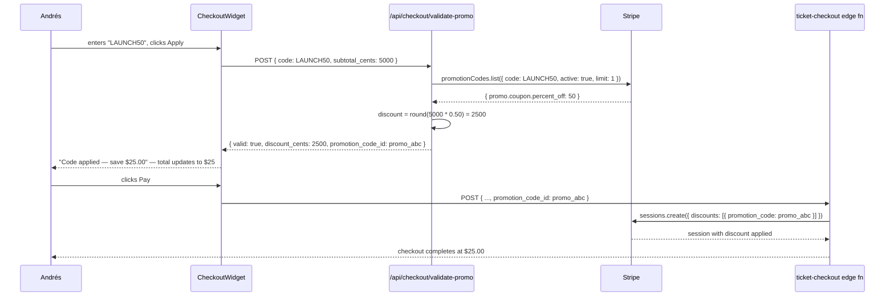

# C15 — Promo / Discount Codes

## 0. Quick Read

**What this does in one sentence:** `LAUNCH50` becomes a real 50%-off code: Andrés types it in the checkout widget, the discount shows immediately, and Stripe applies it to the payment — instead of `apply_promo` always returning `valid: false`.

**The before state:** C6 shipped `apply_promo` as a stub — it always returns `{ valid: false }`. Promo codes are a standard acquisition tool (influencer codes, launch codes, early-bird pricing) but they've been completely non-functional.

| Persona | Before | After |
|---------|--------|-------|
| **Andrés** (buyer) | No discount path — pays full price always | Enters `LAUNCH50` at checkout → 50% off applied automatically |
| **Roberto** (host) | Cannot offer influencer codes for his events | Creates promo code in Stripe dashboard → shares with Instagrammer |
| **Tourist** (chat) | `salesAgent` says "use code LAUNCH50" but it always fails | Promo codes work: agent validates + applies in-chat before checkout |



---

## 1. Purpose

C6 shipped `apply_promo` as a stub (`valid: false` always). C15 makes it real.

Promo codes on tickets are a standard acquisition tool: early-bird codes, influencer codes, launch codes. Stripe handles all the math — MDE AI just needs to validate the code before checkout and pass it to the session.

**mde-stripe skill:** "Prefer Checkout Sessions for new flows." Stripe Checkout Sessions accept a `discounts[0].promotion_code` parameter (not `coupon` — promotion codes are the user-facing string like `LAUNCH50`; coupons are the underlying Stripe object).

**mde-stripe rule:** "API version pin: `apiVersion: '2026-04-22.dahlia'`."

## 2. Goals

- Stripe Coupon objects created for MDE AI discount campaigns (via dashboard or seed script)
- Stripe Promotion Codes attached to coupons (these are the `LAUNCH50`-style strings)
- `apply_promo` Mastra tool updated: calls `stripe.promotionCodes.list({ code })`, validates active + restrictions, returns `discount_cents`
- `CheckoutWidget` renders a promo code input field; on submit calls `apply_promo` tool or inline API route
- `POST /api/checkout/validate-promo` route validates a code and returns discount details without creating a session
- `ticket-checkout` edge function updated: if `promotion_code_id` is in the request body, pass `discounts: [{ promotion_code: id }]` to `sessions.create`
- `npm run build` exits 0; Vitest floor stays ≥ 401

## 3. Persona value

| Persona | Before | After |
|---------|--------|-------|
| **Andrés** (buyer) | No discount path — pays full price | Enters `LAUNCH50` at checkout → 50% off applied automatically |
| **Roberto** (host) | Cannot offer influencer codes for his events | Creates a promo code in Stripe dashboard → shares with Instagrammer |
| **Tourist** | `salesAgent` offers a code but `apply_promo` always returns invalid | Promo codes work: `salesAgent` validates + applies in-chat |

## 4. Wiring plan

### 4A — Stripe objects

| Object | Notes |
|--------|-------|
| Coupon: `LAUNCH_50PCT` | `percent_off: 50`, `duration: once` |
| Promotion Code: `LAUNCH50` | Attached to `LAUNCH_50PCT` coupon; max_redemptions set |
| Coupon: `EARLY_BIRD_20` | `amount_off: 2000` (¢20.00), `currency: usd` |
| Promotion Code: `EARLY20` | Attached to `EARLY_BIRD_20` |

**mde-stripe note:** "Don't use the deprecated `plan` object. Use Prices instead." — Same applies to coupons: use Promotion Code IDs (strings like `promo_123abc`), not raw coupon IDs, when passing to checkout sessions.

### 4B — Mastra tool update

| Layer | File | Action |
|-------|------|--------|
| Tool | `src/mastra/tools/apply-promo.ts` | Modify — replace stub with real Stripe API call |

```ts
// src/mastra/tools/apply-promo.ts (full implementation)
import { createTool } from '@mastra/core/tools'
import { z } from 'zod'

export const applyPromoTool = createTool({
  id: 'apply_promo',
  description: 'Validate a promo code and return the discount amount. Call before create_checkout.',
  inputSchema: z.object({
    code: z.string().min(1).max(50),
    subtotal_cents: z.number().int().positive(),
  }),
  outputSchema: z.object({
    valid: z.boolean(),
    discount_cents: z.number(),
    promotion_code_id: z.string().optional(),
    message: z.string(),
  }),
  execute: async ({ code, subtotal_cents }) => {
    // Calls POST /api/checkout/validate-promo (server-side — Stripe key never in tool process)
    const res = await fetch('/api/checkout/validate-promo', {
      method: 'POST',
      headers: { 'Content-Type': 'application/json' },
      body: JSON.stringify({ code, subtotal_cents }),
    })
    if (!res.ok) {
      return { valid: false, discount_cents: 0, message: 'Promo validation failed.' }
    }
    return res.json()
  },
})
```

**mde-stripe rule:** "`sk_*` never reach the browser." The tool's `execute` runs in the Mastra process (Next.js server-side). It calls the API route which holds the Stripe key. The tool itself does NOT import Stripe directly.

### 4C — API route

| Layer | File | Action |
|-------|------|--------|
| Route | `src/app/api/checkout/validate-promo/route.ts` | Create — POST; validates promo via `stripe.promotionCodes.list({ code, active: true })`; returns discount details |

```ts
// src/app/api/checkout/validate-promo/route.ts
import Stripe from 'stripe'
import { NextResponse } from 'next/server'

const stripe = new Stripe(process.env.STRIPE_SECRET_KEY!, {
  apiVersion: '2026-04-22.dahlia',
})

export async function POST(req: Request) {
  const { code, subtotal_cents } = await req.json()
  const promos = await stripe.promotionCodes.list({ code, active: true, limit: 1 })
  if (!promos.data.length) {
    return NextResponse.json({ valid: false, discount_cents: 0, message: 'Invalid promo code.' })
  }
  const promo = promos.data[0]
  const coupon = promo.coupon
  const discount_cents = coupon.percent_off
    ? Math.round(subtotal_cents * (coupon.percent_off / 100))
    : (coupon.amount_off ?? 0)
  return NextResponse.json({
    valid: true,
    discount_cents,
    promotion_code_id: promo.id,
    message: `Code applied — save $${(discount_cents / 100).toFixed(2)}`,
  })
}
```

### 4D — CheckoutWidget promo field

| Layer | File | Action |
|-------|------|--------|
| Widget | `src/components/checkout/CheckoutWidget.tsx` | Modify — add promo code input + "Apply" button; call `/api/checkout/validate-promo` on submit; display discount |
| Ticket checkout edge | `supabase/functions/ticket-checkout/index.ts` | Modify — accept optional `promotion_code_id` in request body; if present: `sessions.create({ discounts: [{ promotion_code: promotionCodeId }] })` |

**mde-stripe note:** Stripe Checkout Sessions with `discounts` cannot also use `allow_promotion_codes: true` — pick one. Since we're validating before checkout, pass the validated `promotion_code_id` directly.

## 5. Edge cases

- **Minimum order value restriction:** Stripe supports `restrictions.minimum_amount` on promotion codes. The `/api/checkout/validate-promo` route should check this and return a descriptive message: "Minimum order $50 required."
- **Already redeemed (single-use codes):** `promo.times_redeemed >= (promo.max_redemptions ?? Infinity)` → return `valid: false` with "Code already fully redeemed."
- **`amount_off` vs `percent_off`:** Coupon has only one of these set. Handle both in the discount calculation.
- **Currency mismatch:** Stripe `amount_off` coupons are currency-specific. For mdeai (USD only in Phase 1), verify `coupon.currency === 'usd'` before applying.
- **Stripe test codes:** Create test promo codes using test-mode Stripe. Playwright tests can use the code `LAUNCH50` if it's set up in test mode.

## 6. Real-world examples

**Andrés** at checkout: enters `EARLY20` → `CheckoutWidget` shows "Code applied — save $20.00" → total updates. He pays. The `ticket-checkout` edge function receives `promotion_code_id: 'promo_abc123'` → Stripe applies the coupon at session level → Stripe records the discount in the charge object.

**Tourist** in chat: `salesAgent` calls `apply_promo({ code: 'LAUNCH50', subtotal_cents: 5000 })` → `{ valid: true, discount_cents: 2500 }` → agent: "Great news! LAUNCH50 gives you 50% off — total is now $25. Ready to pay?"

## 7. Acceptance criteria

1. `stripe.promotionCodes.list({ code: 'LAUNCH50', active: true })` returns a result in test mode.
2. `POST /api/checkout/validate-promo` with `{ code: 'LAUNCH50', subtotal_cents: 5000 }` returns `{ valid: true, discount_cents: 2500 }`.
3. `POST /api/checkout/validate-promo` with an invalid code returns `{ valid: false }`.
4. `apply_promo` Mastra tool returns `{ valid: true, discount_cents: 2500 }` end-to-end for `LAUNCH50`.
5. `CheckoutWidget` renders a promo code input and shows discount amount when applied.
6. `ticket-checkout` edge function passes `promotion_code_id` to Stripe when present.
7. `npm run build` exits 0; Vitest floor stays ≥ 401.

## 8. Outcomes

| | Before | After |
|---|---|---|
| Promo support | `apply_promo` always returns `valid: false` | Real Stripe Promotion Code validation |
| Checkout promo field | None | Visible in `CheckoutWidget` |
| Agent promo capability | Stub | `salesAgent` can validate + apply codes in-chat |
