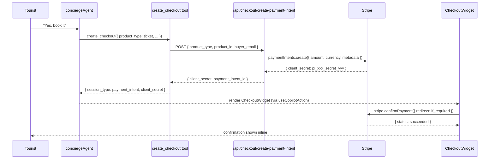

# C2 — `create_checkout` Mastra Tool + CheckoutWidget

## 0. Quick Read

**What this does in one sentence:** The first Mastra transact tool — when a tourist says "book it," `conciergeAgent` calls `create_checkout` and a Stripe payment form appears inline in the chat, no redirect needed.

**Why this unblocks everything:** All 11 existing Mastra tools are read-only. Zero revenue flows until at least one tool can take payment. C2 is that tool — every other revenue task (C6, C10, C11, C12, C15) builds on it.

| Persona | Before | After |
|---------|--------|-------|
| **Tourist** (chat) | Agent recommends but cannot close — dead end | `create_checkout` renders `CheckoutWidget` in-chat → Tourist pays without leaving |
| **Andrés** (buyer) | Must navigate to `/events/[slug]` to buy | Concierge triggers checkout directly from a chat thread |
| **Roberto** (host) | No deposit collection in chat | `product_type: 'venue_deposit'` captures a deposit in-chat |

```mermaid
flowchart TD
    accTitle: create_checkout product routing
    accDescr: How the tool routes different product types to the correct checkout path
    A([Tourist confirms intent to pay]) --> B[conciergeAgent calls create_checkout]
    B --> C{product_type?}
    C -->|ticket| D[ticket-checkout edge fn<br/>reserves qty_pending first]
    C -->|venue_deposit| E[/api/checkout/create-payment-intent<br/>capture_method: manual for C10]
    C -->|tour / rental_deposit| F[/api/checkout/create-payment-intent<br/>standard PaymentIntent]
    C -->|subscription| G[/api/billing/create-subscription-session<br/>mode: subscription]
    D & E & F --> H[Returns client_secret]
    G --> I[Returns session_url]
    H --> J[CheckoutWidget renders PaymentElement]
    I --> K[CheckoutWidget renders Pay button]
    J & K --> L([Tourist pays])
```



---

## 1. Purpose

All 11 existing Mastra tools are read-only (search-rentals, search-events, search-grounded-places, etc.). Zero transact tools exist. **C2 ships the first one.**

`create_checkout` bridges the Mastra agent layer to Stripe, making every discovery flow closeable by an agent. Once `conciergeAgent` and `salesAgent` (C6) have this tool, a Medellín tourist asking "book me a salsa night" can receive a working checkout link without leaving the chat.

`CheckoutWidget` is the client-side mirror: a `useCopilotAction`-powered generative UI component that renders when the agent calls `create_checkout`. It hosts the Stripe Payment Element (wired up in C11) or falls back to a hosted session URL button.

**Verified MCP pattern (Mastra `createTool`):**
```ts
import { createTool } from '@mastra/core/tools';
import { z } from 'zod';

export const myTool = createTool({
  id: 'tool-id',
  description: '…',
  inputSchema: z.object({ … }),
  outputSchema: z.object({ … }),
  execute: async (input) => { … },
});
```
Tool confirmed present in `@mastra/core/tools` (pattern matches `classify-intent.ts`, `search-rentals.ts` in `src/mastra/tools/`).

**Verified Mastra agent invariants (CLAUDE.md):**
- Agent name in `useCoAgent({ name })` must match the key in `Mastra({ agents: {…} })`.
- `useCopilotAction` with `available: "disabled"` + matching name + `render` is the generative-UI mirror of an agent tool.

## 2. Goals

- `create_checkout` tool registered in `src/mastra/tools/create-checkout.ts` with Zod input/output schemas
- Tool added to `conciergeAgent` tools map (and to `salesAgent` when C6 ships)
- Generic `POST /api/checkout/create-payment-intent` route creates Stripe `PaymentIntent` for any product type
- `CheckoutWidget` renders via `useCopilotAction` when agent calls `create_checkout`
- Hosted session fallback: if Payment Element not loaded, show "Pay with Stripe →" button
- Webhook at `ticket-payment-webhook` extended (or new `checkout-webhook` edge) to handle `payment_intent.succeeded`
- `npm run build` exits 0; Vitest floor stays ≥ 401

## 3. Persona value

| Persona | Before | After |
|---------|--------|-------|
| **Tourist** (chat) | Agent can search and recommend but never close | Agent calls `create_checkout` → in-chat Payment Element appears → Tourist pays |
| **Andrés** (event buyer) | Must navigate to `/events/[slug]` to buy | Concierge can trigger checkout directly from a chat thread |
| **Roberto** (venue host) | No deposit collection for future bookings | `create_checkout` with `product_type: 'venue_deposit'` → payment captured |

## 4. Wiring plan

### 4A — Mastra tool

| Layer | File | Action |
|-------|------|--------|
| Tool | `src/mastra/tools/create-checkout.ts` | Create — `createTool` with schemas below |
| Tool index | `src/mastra/tools/index.ts` | Modify — export `createCheckoutTool` |
| Concierge agent | `src/mastra/agents/concierge.ts` | Modify — add `createCheckoutTool` to `tools` map |
| Agent index | `src/mastra/agents/index.ts` | No change (tool added to agent, not a new agent) |
| Types | `src/lib/types.ts` | Modify — add `CheckoutProduct`, `CheckoutResult` types |

### 4B — API route

| Layer | File | Action |
|-------|------|--------|
| Route | `src/app/api/checkout/create-payment-intent/route.ts` | Create — POST; verifies auth; calls Stripe `paymentIntents.create`; returns `{ client_secret, payment_intent_id }` |
| Route | `src/app/api/checkout/confirm/route.ts` | Create — POST; called by `useCheckout` hook after `stripe.confirmPayment()` succeeds; records fulfillment |

### 4C — React component

| Layer | File | Action |
|-------|------|--------|
| Widget | `src/components/checkout/CheckoutWidget.tsx` | Create — renders Stripe `PaymentElement` (C11) or fallback button |
| CopilotKit action | `src/components/copilot/CheckoutAction.tsx` | Create — `useCopilotAction({ name: 'create_checkout', available: 'disabled', render: … })` |
| Hook | `src/hooks/useCheckout.ts` | Create — wraps `stripe.confirmPayment()`, returns status |
| Provider | `src/components/checkout/StripeProvider.tsx` | Create — `<Elements>` wrapper (shares with C11) |

### 4D — Edge function / webhook

| Layer | File | Action |
|-------|------|--------|
| Webhook | `supabase/functions/ticket-payment-webhook/index.ts` | Modify — add `payment_intent.succeeded` handler alongside existing `checkout.session.completed` |
| Platform fees | `supabase/functions/checkout-webhook/index.ts` | Create (optional in C2, required in C12) — records `platform_fees` row |

## 5. Tool schema

```ts
// src/mastra/tools/create-checkout.ts
import { createTool } from '@mastra/core/tools';
import { z } from 'zod';

const productTypeSchema = z.enum(['ticket', 'venue_deposit', 'tour', 'rental_deposit', 'subscription']);

export const createCheckoutTool = createTool({
  id: 'create-checkout',
  description: 'Open a Stripe payment for any bookable product. Call when the user confirms intent to pay.',
  inputSchema: z.object({
    product_type: productTypeSchema,
    product_id:   z.string().describe('UUID of the ticket, venue, tour, or rental'),
    quantity:     z.number().int().positive().default(1),
    buyer_email:  z.string().email(),
    buyer_name:   z.string(),
    success_path: z.string().default('/me/tickets'),
    cancel_path:  z.string().default('/chat'),
  }),
  outputSchema: z.object({
    session_type:  z.enum(['payment_intent', 'hosted_session']),
    client_secret: z.string().optional(),  // present for payment_intent
    session_url:   z.string().optional(),  // present for hosted_session fallback
    payment_intent_id: z.string().optional(),
  }),
  execute: async (input) => {
    // calls POST /api/checkout/create-payment-intent
    // returns client_secret for embedded element
    // falls back to session_url if PaymentIntent creation fails
  },
});
```

**Note:** `execute` runs inside the Mastra agent process (in-process with Next.js). It can call `/api/checkout/create-payment-intent` via `fetch` using a relative or absolute URL. Do not import Stripe SDK directly in the tool — keep Stripe calls server-side in the API route so the secret key never crosses the tool boundary.

## 6. CopilotKit generative-UI wiring

```tsx
// src/components/copilot/CheckoutAction.tsx
import { useCopilotAction } from '@copilotkit/react-core';
import { CheckoutWidget } from '../checkout/CheckoutWidget';

export function CheckoutAction() {
  useCopilotAction({
    name: 'create_checkout',
    available: 'disabled',   // agent-only — not user-triggered
    render: ({ args, status }) => (
      <CheckoutWidget
        productType={args.product_type}
        productId={args.product_id}
        buyerEmail={args.buyer_email}
        buyerName={args.buyer_name}
        clientSecret={args.client_secret}
        sessionUrl={args.session_url}
        isLoading={status === 'inProgress'}
      />
    ),
  });
  return null;
}
```

Mounted inside `<CopilotKit>` provider in `src/components/copilot/copilot-kit-provider.tsx`.

**Invariant check:** `name: 'create_checkout'` must match `id: 'create-checkout'` in the tool. Mastra maps tool `id` to the CopilotKit action `name` via the AG-UI bridge. Verify by checking `src/mastra/copilotkit/logging-mastra-agent.ts` — same pattern as existing tools.

## 7. Edge cases

- `product_type: 'ticket'` must route to the existing `ticket-checkout` edge function for inventory reservation (not a raw PaymentIntent) — tickets reserve `qty_pending` before charging.
- `product_type: 'venue_deposit'` / `tour` / `rental_deposit` → raw `PaymentIntent` (no inventory reservation needed in C2; add in later tasks).
- The Stripe API version in use is `2026-04-22.dahlia` (from existing edge functions) — use the same version for new PaymentIntent calls.
- `client_secret` returned to the browser is safe (it's a client secret, not the secret key). Never log it.
- If the user is not authenticated when the agent calls `create_checkout`, the tool should return an error string prompting the agent to tell the user to log in.

## 8. Real-world examples

**Tourist** in `/chat`: "I want to go to that salsa night Saturday." Concierge searches events, finds a match, asks for confirmation. Tourist says "Yes, book it." Agent calls `create_checkout({ product_type: 'ticket', product_id: '...', buyer_email: '...', ... })`. `CheckoutWidget` renders in-chat. Tourist taps Apple Pay. Done.

**Roberto** sees a venue deposit request from a client. He forwards the chat link. The client opens it, the `CheckoutWidget` is pre-loaded with the deposit amount, they pay by card. Roberto's `venue_booking_requests` row status → `deposit_paid`.

## 9. Acceptance criteria

1. `src/mastra/tools/create-checkout.ts` exports `createCheckoutTool` with `inputSchema` and `outputSchema` matching the spec.
2. `conciergeAgent` includes `createCheckoutTool` in its `tools` map.
3. `POST /api/checkout/create-payment-intent` with valid auth + `{ product_type: 'venue_deposit', product_id: '...', quantity: 1, buyer_email: '...', buyer_name: '...' }` returns `{ client_secret: 'pi_...', payment_intent_id: '...' }`.
4. `<CheckoutWidget>` renders `<PaymentElement>` when `clientSecret` prop is set.
5. `<CheckoutWidget>` renders a "Pay with Stripe →" button fallback when `sessionUrl` is set and `clientSecret` is absent.
6. `CheckoutAction` mounts inside the CopilotKit provider without console errors.
7. `payment_intent.succeeded` webhook is handled (logs event, does not return 400/500).
8. `npm run build` exits 0; Vitest floor stays ≥ 401.

## 10. Outcomes

| | Before | After |
|---|---|---|
| Transact tools in Mastra | 0 | 1 (`create_checkout`) |
| Agent-initiated payments | Impossible | `conciergeAgent` can close any bookable product |
| Checkout surfaces | Events page only | Any page + any chat thread |
| Checkout UX | Hosted redirect | Embedded Payment Element (in-modal) |
