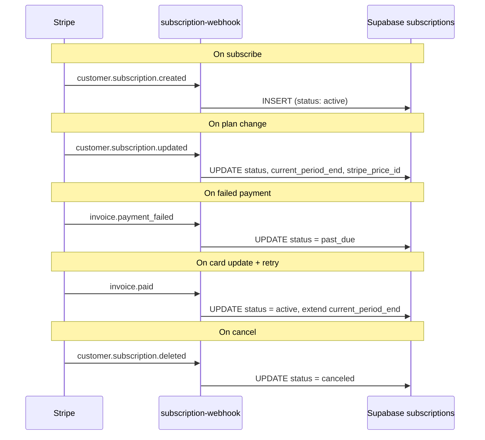
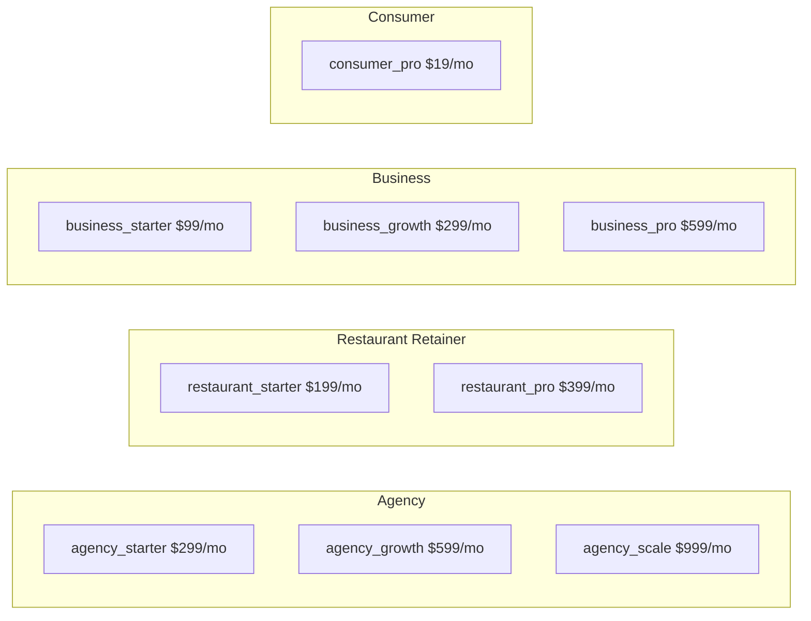

# C3 — Stripe Billing (All-Verticals)

## 0. Quick Read

**What this does in one sentence:** Extends C1's agency-only Stripe Billing to all revenue verticals (restaurant retainers, business tiers, consumer Pro) and adds the Customer Portal so Roberto can cancel his own subscription without emailing the team.

**Why the other tasks depend on it:** C4 needs metered Billing products. C9 needs restaurant Prices. M4 and M12 need business and consumer Prices. Without C3, none of those tasks can wire their checkout sessions to a recurring plan. This is the billing rail everything else runs on.

| Persona | Before | After |
|---------|--------|-------|
| **Roberto** (host) | Subscribed to agency; can't change without emailing team | Visits Customer Portal → upgrades, downgrades, cancels, updates card himself |
| **Venue owner** | No venue-specific plan to subscribe to | Can subscribe to Restaurant Retainer ($199–$399/mo) at `/advertise` |
| **Patricia** (ops) | Webhook only handles `.created`; upgrades/cancels silently fail | Full dunning: failed payment → `past_due`; cancel → `canceled` in Supabase |





---

## 1. Purpose

C1 bootstrapped Stripe Billing for the AI Marketing Agency (3 prices, `subscription-webhook` for `.created`). That's enough to capture the first client. C3 turns that scaffold into a **production billing system** that every other revenue task depends on:

- **C4** (metered lead billing) needs `subscriptions` + metered Billing products
- **C9** (restaurant retainer) needs Billing subscriptions for venue plans
- **M4** (business subscription tiers) needs Prices for all verticals
- **M12** (consumer Pro/VIP) needs a consumer-facing Billing product

**mde-stripe skill rule:** "If the user has a recurring revenue model, use the Billing APIs... Combine Billing APIs with Stripe Checkout for the payment frontend. Checkout Sessions support `mode: 'subscription'`."

**mde-stripe skill rule:** "Don't use the deprecated `plan` object. Use Prices instead."

**What C3 adds on top of C1:**
1. Stripe Products + Prices for restaurant/venue/business/consumer tiers (not just agency)
2. Full dunning webhook: `customer.subscription.updated`, `customer.subscription.deleted`, `invoice.payment_failed`, `invoice.paid`
3. Customer Portal integration (self-service upgrades/downgrades/cancellation)
4. Subscription status middleware for gating premium features

## 2. Goals

- Stripe Products + Prices created via dashboard (or seed script) for: Restaurant Retainer (Starter $199/mo, Pro $399/mo), Business Tier (Starter $99/mo, Growth $299/mo, Pro $599/mo), Consumer Pro ($19/mo)
- `subscription-webhook` edge function extended to handle full event set (see wiring plan)
- `GET /api/billing/portal` creates Stripe Customer Portal session for logged-in user
- Subscription status exposed via `useSubscription()` hook (reads `subscriptions` table — no Stripe API call per request)
- Premium feature gate: `requireSubscription(plan)` middleware in server-side API routes
- `npm run build` exits 0; Vitest floor stays ≥ 401

## 3. Persona value

| Persona | Before | After |
|---------|--------|-------|
| **Roberto** (host) | Subscribed to agency plan; cannot change or cancel without emailing team | Visits Customer Portal → downgrades, cancels, or updates card himself |
| **Venue owner** | No venue-specific retainer product | Can subscribe to Restaurant Retainer at `/advertise` |
| **Patricia** (ops) | Webhook only handles `.created`; upgrades/cancellations silently fail | Full dunning coverage; failed payment → `status: past_due`; cancel → `status: canceled` |

## 4. Wiring plan

### 4A — Stripe objects (Stripe dashboard / seed script)

| Object | Plan | Amount | Interval | Stripe metadata |
|--------|------|--------|----------|----------------|
| Product: `agency` | — | — | — | `{ vertical: 'agency' }` |
| Price: `agency_starter` | Starter | $299 | monthly | attach to `agency` product |
| Price: `agency_growth` | Growth | $599 | monthly | attach to `agency` product |
| Price: `agency_scale` | Scale | $999 | monthly | attach to `agency` product |
| Product: `restaurant_retainer` | — | — | — | `{ vertical: 'restaurant' }` |
| Price: `restaurant_starter` | Starter | $199 | monthly | attach |
| Price: `restaurant_pro` | Pro | $399 | monthly | attach |
| Product: `business` | — | — | — | `{ vertical: 'business' }` |
| Price: `business_starter` | Starter | $99 | monthly | attach |
| Price: `business_growth` | Growth | $299 | monthly | attach |
| Price: `business_pro` | Pro | $599 | monthly | attach |
| Product: `consumer_pro` | — | — | — | `{ vertical: 'consumer' }` |
| Price: `consumer_pro_monthly` | Pro | $19 | monthly | attach |

### 4B — Edge function extension

| Layer | File | Action |
|-------|------|--------|
| Webhook | `supabase/functions/subscription-webhook/index.ts` | Modify — add handlers for: `customer.subscription.updated` → upsert status/period; `customer.subscription.deleted` → set `status: canceled`; `invoice.payment_failed` → set `status: past_due`; `invoice.paid` → extend `current_period_end` |
| Shared | `supabase/functions/_shared/stripe-client.ts` | Create (if not exists) — exports `getStripeClient()` using `STRIPE_SECRET_KEY`, `apiVersion: '2026-04-22.dahlia'` |

**mde-supabase skill rule:** "If you are reusing utility methods between Edge Functions, add them to `supabase/functions/_shared`."

**mde-stripe skill rule:** "Webhook handlers must be idempotent. Track processed `event.id` in a `processed_webhook_events` table."

```ts
// supabase/functions/subscription-webhook/index.ts (pattern from mde-stripe skill)
const rawBody = await req.text()  // RAW body BEFORE any parse (mde-stripe rule 2)
const sig = req.headers.get('stripe-signature') ?? ''
const event = await stripe.webhooks.constructEventAsync(rawBody, sig, whsec)
```

### 4C — Customer Portal

| Layer | File | Action |
|-------|------|--------|
| Route | `src/app/api/billing/portal/route.ts` | Create — POST; auth check; look up `stripe_customer_id` from `subscriptions`; create portal session; return `{ url }` |
| Button | `src/components/billing/ManageSubscriptionButton.tsx` | Create — POST to `/api/billing/portal`, redirect to portal URL |

### 4D — Status hook + middleware

| Layer | File | Action |
|-------|------|--------|
| Hook | `src/hooks/useSubscription.ts` | Create — queries `subscriptions` table via Supabase anon client; returns `{ plan, status, currentPeriodEnd }` |
| Middleware | `src/lib/billing/require-subscription.ts` | Create — server-side guard: reads `subscriptions` for the user; throws 403 if no active subscription of required plan |
| Types | `src/lib/types.ts` | Modify — add `SubscriptionPlan`, `SubscriptionStatus` union types |

## 5. Schema changes

The `subscriptions` table was created in C1. No new table needed. **Column additions if needed:**

```sql
-- If not added in C1 migration, add:
ALTER TABLE public.subscriptions ADD COLUMN IF NOT EXISTS
  stripe_price_id text,  -- for identifying which plan/vertical
  vertical text CHECK (vertical IN ('agency', 'restaurant', 'business', 'consumer'));
```

**Idempotency table (mde-stripe rule 4):**

```sql
CREATE TABLE IF NOT EXISTS public.processed_webhook_events (
  event_id   text PRIMARY KEY,
  processed_at timestamptz NOT NULL DEFAULT now()
);
ALTER TABLE public.processed_webhook_events ENABLE ROW LEVEL SECURITY;
-- Service role only (webhook writes); no user-facing SELECT needed
```

## 6. Edge cases

- **Stripe Customer Portal** requires the customer to have an active subscription or saved payment method. Guard the portal button with `status === 'active' || status === 'past_due'` check.
- **`customer.subscription.updated`** fires on every billing cycle renewal — do not treat it as a plan change unless `items[0].price.id` changed.
- **Test clock:** Use Stripe test clocks in local dev to simulate subscription renewal and `invoice.payment_failed` without waiting 30 days.
- **Multiple subscriptions:** A user could theoretically subscribe to agency AND restaurant retainer. The `subscriptions` table allows multiple rows per user (no unique constraint on `user_id`). The `useSubscription` hook should return an array; the middleware should check for any matching plan.
- **`STRIPE_BILLING_WEBHOOK_SECRET`** must be a separate Supabase secret from `STRIPE_WEBHOOK_SECRET` (ticket webhook). Per mde-stripe: "Each has its own `whsec_*` — don't share signing secrets across endpoints."

## 7. Real-world examples

**Roberto** receives an `invoice.payment_failed` email from Stripe (card expired). His `subscriptions.status` becomes `past_due`. He visits `/me/billing`, sees a "Update payment method" CTA, clicks it, Stripe Customer Portal opens, he updates his card. `invoice.paid` fires next, `status` returns to `active`.

**Patricia** runs `SELECT vertical, status, count(*) FROM subscriptions GROUP BY vertical, status` — first cross-vertical MRR snapshot.

## 8. Acceptance criteria

1. Stripe dashboard has Products for `agency`, `restaurant_retainer`, `business`, `consumer_pro` with Prices per plan.
2. `POST /api/billing/portal` returns `{ url: "https://billing.stripe.com/..." }` for a user with an active subscription.
3. `customer.subscription.updated` webhook updates `subscriptions.status` and `current_period_end`.
4. `customer.subscription.deleted` webhook sets `subscriptions.status = 'canceled'`.
5. `invoice.payment_failed` webhook sets `subscriptions.status = 'past_due'`.
6. `processed_webhook_events` table exists; duplicate `event.id` returns 200 without re-processing.
7. `useSubscription()` hook returns `{ plan, status }` without an extra Stripe API call.
8. `npm run build` exits 0; Vitest floor stays ≥ 401.

## 9. Outcomes

| | Before | After |
|---|---|---|
| Billing coverage | Agency only (3 prices) | All verticals (12 prices across 4 products) |
| Dunning coverage | `.created` only | Full: updated + deleted + payment_failed + paid |
| Self-service | Manual email to cancel | Customer Portal (1-click) |
| Premium feature gating | None | `requireSubscription(plan)` middleware |
