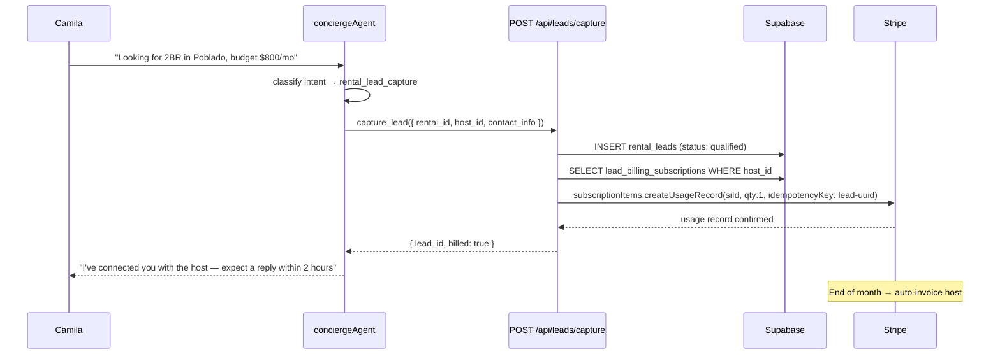
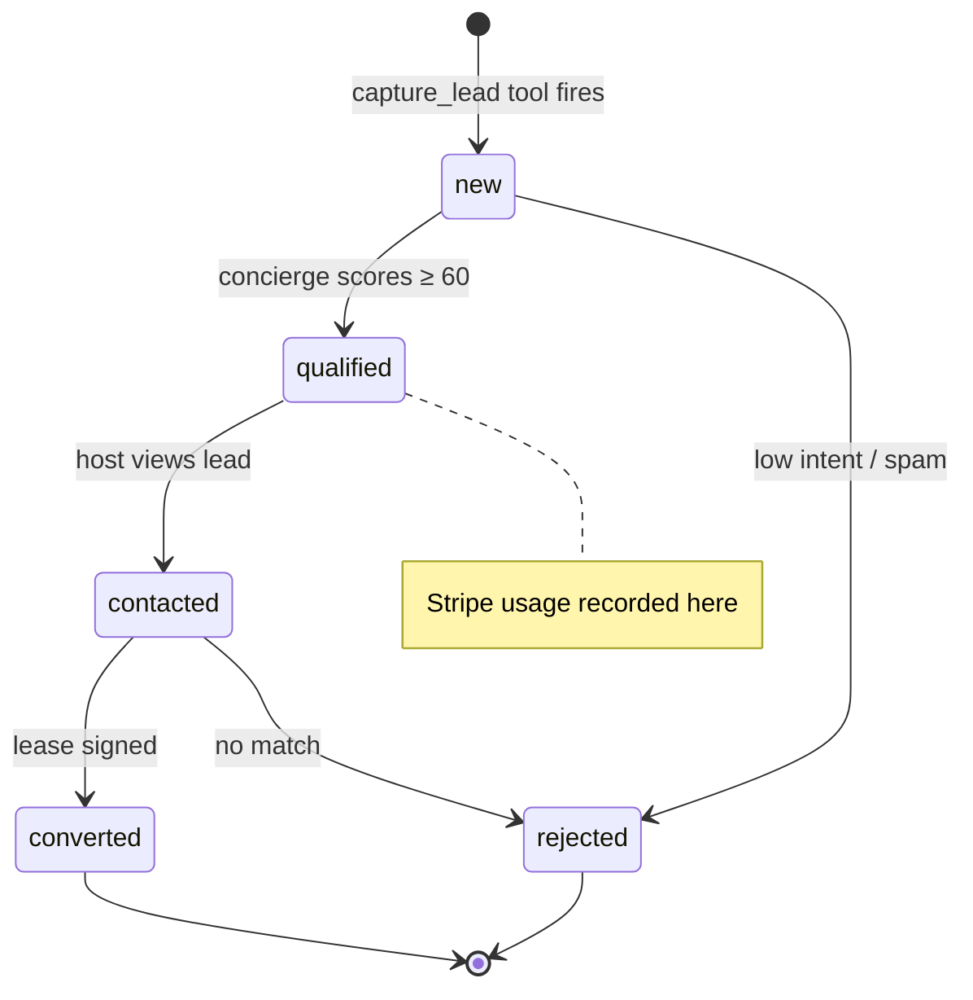

# C4 — Metered Rental-Lead Billing

## 0. Quick Read

**What this does in one sentence:** MDE AI charges property hosts for each rental lead the concierge delivers — Camila's inquiry becomes a billable event the moment she shares her contact info.

**What changes for each persona:**

| Persona | Before | After |
|---------|--------|-------|
| **Camila** | Asks about rentals, agent collects preferences | Same experience — no friction added |
| **Host** (landlord) | Gets Camila's details for free, no accountability loop | Subscribes to lead plan; billed $X/lead delivered; views leads in dashboard |
| **Patricia** (ops) | Rental leads = cost center (concierge time, no revenue) | `SELECT sum(platform_amount) FROM platform_fees WHERE vertical='rental'` → lead revenue |

**User journey — lead billing flow:**
1. Camila asks concierge about El Poblado 2BR apartments
2. She expresses intent + shares email → concierge calls `capture_lead` tool
3. `rental_leads` row created; lead status → `qualified`
4. `recordLeadUsage` calls `stripe.subscriptionItems.createUsageRecord` (idempotent, keyed on lead ID)
5. End of billing period → Stripe invoices host for N qualified leads
6. Host opens `/business` portal → sees lead list + invoice history





---

## 1. Purpose

MDE AI's concierge already collects rental intent signals — Camila says "I need a 2BR in El Poblado for $800/mo, move-in July" and the agent surfaces 3 matching properties. The host currently gets Camila's inquiry for free.

C4 closes this value loop: hosts subscribe to a **metered lead generation plan**; Stripe records one usage unit when a lead is confirmed qualified; Stripe aggregates usage and invoices monthly. The concierge experience is unchanged — the billing fires in the background.

**mde-stripe skill:** "Metered billing uses `stripe.subscriptionItems.createUsageRecord`. The subscription item must have a `recurring.usage_type: 'metered'` Price attached."

**mde-stripe rule:** "Idempotency on every payment-creating call. Pass an `idempotencyKey`." For leads: `idempotencyKey: 'lead-${lead_id}'` ensures a double-fire of the webhook cannot double-bill.

## 2. Goals

- `rental_leads` table stores qualified lead records (user_id, rental_id, host_id, status, contact_info_json)
- `lead_billing_subscriptions` table links host to Stripe subscription item ID (for usage recording)
- `recordLeadUsage` shared utility calls `stripe.subscriptionItems.createUsageRecord` with idempotency
- `metered_lead` Stripe Price created: `recurring.usage_type: 'metered'`, `billing_scheme: 'per_unit'`, amount per lead TBD
- `capture_lead` Mastra tool added to `conciergeAgent` — fires when intent = `rental_lead_capture`
- `POST /api/leads/capture` API route: writes `rental_leads` row + fires usage record
- `npm run build` exits 0; Vitest floor stays ≥ 401

## 3. Wiring plan

### 3A — Stripe objects (dashboard / seed script)

| Object | Config |
|--------|--------|
| Product: `rental_lead_gen` | `{ name: 'Rental Lead Generation', metadata: { vertical: 'rental' } }` |
| Price: `metered_lead` | `unit_amount: TBD`, `recurring: { interval: 'month', usage_type: 'metered' }`, `billing_scheme: 'per_unit'` |

### 3B — Schema migration

| Layer | File | Action |
|-------|------|--------|
| Migration | `supabase/migrations/YYYYMMDD_rental_leads.sql` | Create — see §4 |

### 3C — Shared utility

| Layer | File | Action |
|-------|------|--------|
| Utility | `supabase/functions/_shared/record-lead-usage.ts` | Create — `recordLeadUsage(subscriptionItemId, leadId)` |

```ts
// supabase/functions/_shared/record-lead-usage.ts
import Stripe from 'npm:stripe@14'

const stripe = new Stripe(Deno.env.get('STRIPE_SECRET_KEY')!, {
  apiVersion: '2026-04-22.dahlia',
})

export async function recordLeadUsage(
  subscriptionItemId: string,
  leadId: string,
): Promise<void> {
  await stripe.subscriptionItems.createUsageRecord(
    subscriptionItemId,
    {
      quantity: 1,
      action: 'increment',
      timestamp: Math.floor(Date.now() / 1000),
    },
    { idempotencyKey: `lead-${leadId}` },
  )
}
```

### 3D — API route

| Layer | File | Action |
|-------|------|--------|
| Route | `src/app/api/leads/capture/route.ts` | Create — POST; verifies auth; writes `rental_leads`; looks up `lead_billing_subscriptions` for host; calls `recordLeadUsage`; returns `{ lead_id }` |

### 3E — Mastra tool

| Layer | File | Action |
|-------|------|--------|
| Tool | `src/mastra/tools/capture-lead.ts` | Create — `capture_lead` tool; calls `/api/leads/capture` |
| Concierge | `src/mastra/agents/concierge.ts` | Modify — add `captureLead` to tools map; trigger on `rental_lead_capture` intent |
| Intent schema | `src/mastra/tools/classify-intent.ts` | Modify — add `'rental_lead_capture'` to intent enum |

## 4. Schema

```sql
-- supabase/migrations/YYYYMMDD_rental_leads.sql

CREATE TABLE public.rental_leads (
  id               uuid PRIMARY KEY DEFAULT gen_random_uuid(),
  rental_id        uuid NOT NULL,
  host_id          uuid NOT NULL,
  user_id          uuid REFERENCES auth.users(id),
  status           text NOT NULL DEFAULT 'new'
    CHECK (status IN ('new', 'qualified', 'contacted', 'converted', 'rejected')),
  contact_info     jsonb,
  source           text DEFAULT 'concierge',
  score            integer,
  notes            text,
  created_at       timestamptz NOT NULL DEFAULT now(),
  updated_at       timestamptz NOT NULL DEFAULT now()
);
ALTER TABLE public.rental_leads ENABLE ROW LEVEL SECURITY;
CREATE POLICY "host_read_own" ON public.rental_leads
  FOR SELECT USING (host_id = (SELECT auth.uid()));
CREATE POLICY "user_read_own" ON public.rental_leads
  FOR SELECT USING (user_id = (SELECT auth.uid()));

CREATE TABLE public.lead_billing_subscriptions (
  id                          uuid PRIMARY KEY DEFAULT gen_random_uuid(),
  host_id                     uuid NOT NULL REFERENCES auth.users(id),
  stripe_subscription_id      text NOT NULL,
  stripe_subscription_item_id text NOT NULL,
  plan                        text NOT NULL DEFAULT 'metered_lead',
  active                      boolean NOT NULL DEFAULT true,
  created_at                  timestamptz NOT NULL DEFAULT now()
);
ALTER TABLE public.lead_billing_subscriptions ENABLE ROW LEVEL SECURITY;
CREATE POLICY "host_read_own" ON public.lead_billing_subscriptions
  FOR SELECT USING (host_id = (SELECT auth.uid()));
```

**mde-supabase rule:** "`(SELECT auth.uid())` not `auth.uid()` in RLS — caches per query, not per row."

## 5. Edge cases

- **Lead deduplication:** If Camila inquires about the same rental twice in one session, only one `rental_leads` row should be created. Check for an existing `(user_id, rental_id)` row with `status != 'rejected'` before inserting.
- **Host not subscribed:** If `lead_billing_subscriptions` has no active row for the host, skip the Stripe usage call — log a warning. Do not block the lead capture. Admin can enroll hosts in the billing plan separately.
- **Metered vs capped:** For Phase 1, usage is unbounded (no monthly cap). Add a `monthly_lead_cap` column to `lead_billing_subscriptions` in a follow-up if hosts request it.
- **Score threshold for "qualified":** Leads are `new` on creation; the `capture_lead` tool scores them and sets `status: 'qualified'` only when `score >= 60`. Only qualified leads trigger a usage record.
- **`recordLeadUsage` failure:** If Stripe returns an error, log it but do not throw — the lead is still created in Supabase. A nightly reconciliation job (extend C12's reconciliation) can catch missed usage records.

## 6. Real-world examples

**Camila** in chat: "I'm looking for a 2-bedroom in El Poblado, move-in July, max $900/mo. Here's my email: camila@..." Concierge scores intent at 75 → calls `capture_lead`. Row inserted: `rental_leads.status = 'qualified'`, `score = 75`. Usage record created in Stripe for the host's subscription item. At month end, Stripe invoices the host for 3 qualified leads.

**Host** opens `/business` (M2, future): sees 3 qualified leads, each with Camila-style preference summaries. Clicks "Contact" on the best match. `rental_leads.status → contacted`.

## 7. Acceptance criteria

1. `rental_leads` and `lead_billing_subscriptions` tables exist with RLS + policies.
2. `POST /api/leads/capture` with valid auth inserts a `rental_leads` row and calls `stripe.subscriptionItems.createUsageRecord`.
3. Duplicate `(user_id, rental_id)` call returns the existing lead ID without creating a second row.
4. `capture_lead` tool added to `conciergeAgent` and visible in Mastra Studio.
5. `recordLeadUsage` idempotency: calling twice with same `leadId` does not double-bill (Stripe idempotency key deduplicates).
6. `npm run build` exits 0; Vitest floor stays ≥ 401.

## 8. Outcomes

| | Before | After |
|---|---|---|
| Rental lead revenue | Zero | Per-lead metered billing via Stripe |
| Lead tracking | None | `rental_leads` table with status + score |
| Host accountability | Free leads with no feedback loop | Billed per qualified lead; incentivized to respond |
| C8 unblock | Blocked | `rental_leads` table exists; Lead Agent can qualify + enrich |
