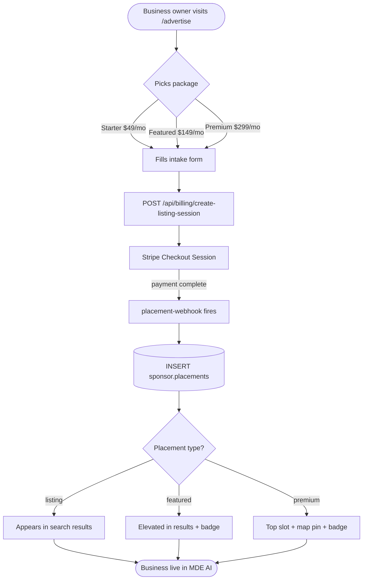
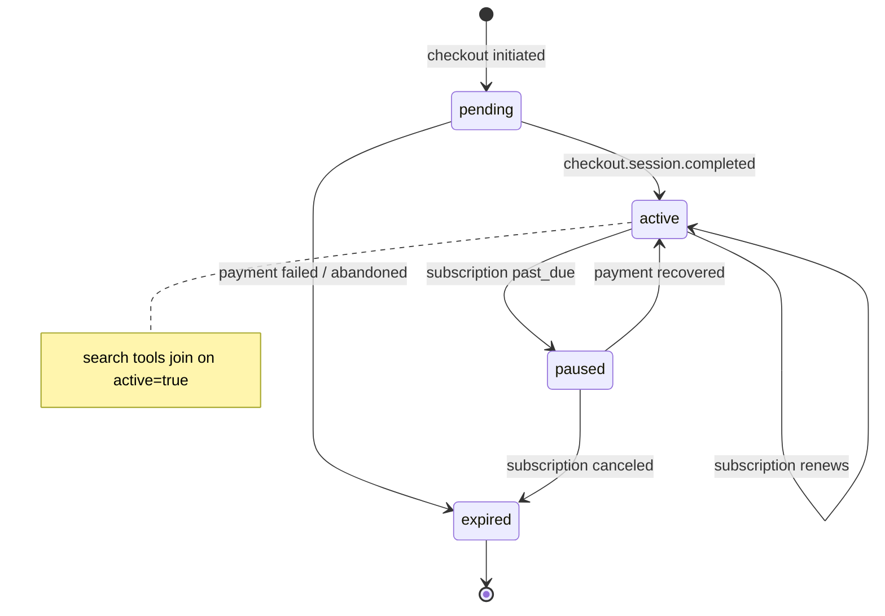

# C5 — /advertise Self-Serve Portal

## 0. Quick Read

**What this does in one sentence:** Any business in Medellín can visit `/advertise`, pick a listing package, pay with Stripe, and go live in MDE AI's discovery results within minutes — no email to the team, no waiting.

**What changes for each persona:**

| Persona | Before | After |
|---------|--------|-------|
| **Restaurant owner** | Emails the team to ask about advertising; waits days | Visits `/advertise`, picks "Starter Listing $49/mo", pays, live immediately |
| **Tourist** | Sees equally-ranked results with no curation signal | Featured listings have a badge; sponsored results labeled clearly |
| **Patricia** (ops) | No self-serve B2B revenue | `SELECT count(*), sum(amount_cents) FROM sponsor.placements WHERE is_active = true` |
| **Camila** | Rental results based on data quality only | Featured properties can appear higher when their host subscribes |

**User journey — self-serve listing:**
1. Business owner visits `/advertise`
2. Scrolls to "Get Listed" section → picks a package (Starter / Featured / Premium)
3. Fills intake form (business name, category, neighborhood, website)
4. Clicks "Subscribe" → Stripe Checkout Session (subscription or one-time)
5. `placement-webhook` fires on `checkout.session.completed` → inserts `sponsor.placements` row
6. Listing goes live; search tools prioritize the placement





---

## 1. Purpose

MDE AI has a `sponsor.*` schema sitting dormant in Supabase — the tables exist but nothing writes to them and no discovery tool reads from them. C5 activates this schema by building a self-serve portal that lets any business buy a listing without involving the sales team.

C5 is **infrastructure** — it activates `sponsor.organizations`, `sponsor.applications`, and `sponsor.placements` and the checkout flow that:
- **C9** extends for restaurant monthly retainers
- **M5** (Sponsor Agent) uses to propose and manage placements autonomously

Distinct from **C1** (managed AI Marketing Agency — MDE AI team delivers content). C5 is purely self-serve: business pays, placement goes live, no human intervention.

**mde-stripe skill:** "Prefer Checkout Sessions for new flows." For monthly listings: `mode: 'subscription'`. For one-time placements: `mode: 'payment'`. Include `metadata: { vertical, business_category, neighborhood }` so the webhook can route correctly.

## 2. Goals

- Reuse existing `sponsor.organizations` + `sponsor.applications`; write active rows to `sponsor.placements`
- `/advertise` page (C1 ships Agency section first) — add **Get Listed** section with 3 listing packages
- `POST /api/billing/create-listing-session` route creates Stripe Checkout Session for selected package
- `placement-webhook` edge function handles `checkout.session.completed` → inserts `sponsor.placements` row
- Search tools updated to JOIN `sponsor.placements` (active only) and sort sponsored first
- `npm run build` exits 0; Vitest floor stays ≥ 401

## 3. Packages

| Package | Price | Placement type | Features |
|---------|-------|---------------|---------|
| Starter Listing | $49/mo | `listing` | Appears in search results; "Listed" badge |
| Featured Listing | $149/mo | `featured` | Top-3 in results; star badge; map highlight |
| Premium Placement | $299/mo | `premium` | #1 slot + featured map pin + chat-priority |

## 4. Wiring plan

### 4A — Schema (use existing `sponsor.*` — no new `public.sponsor_*` tables)

| Layer | File | Action |
|-------|------|--------|
| Migration | `supabase/migrations/YYYYMMDD_c5_listing_checkout.sql` | **Only if needed:** extend `sponsor.applications` metadata columns (neighborhood, package tier) — do **not** duplicate `sponsor.placements` in `public` |
| Edge ACL | existing `sponsor` schema RLS | Verify service-role webhook + authenticated owner reads via `sponsor.placements_select_own` |

**Flow:** checkout → `sponsor.applications` row → `sponsor.invoices` paid → `activate_placements_if_ready()` sets `sponsor.placements.active = true` (see `20260512140000_sponsor_schema_foundation.sql`).

### 4B — Checkout route

| Layer | File | Action |
|-------|------|--------|
| Route | `src/app/api/billing/create-listing-session/route.ts` | Create — POST; auth required; creates Stripe Checkout Session with `metadata: { placement_type, vertical, neighborhood, business_id }` |

```ts
// src/app/api/billing/create-listing-session/route.ts
import Stripe from 'stripe'
import { NextResponse } from 'next/server'
import { createClient } from '@/lib/supabase/server'

const stripe = new Stripe(process.env.STRIPE_SECRET_KEY!, {
  apiVersion: '2026-04-22.dahlia',
})

export async function POST(req: Request) {
  const supabase = await createClient()
  const { data: { user } } = await supabase.auth.getUser()
  if (!user) return NextResponse.json({ error: 'Unauthorized' }, { status: 401 })

  const { package: pkg, business_name, neighborhood, vertical } = await req.json()

  const priceMap: Record<string, string> = {
    starter:  process.env.STRIPE_PRICE_LISTING_STARTER!,
    featured: process.env.STRIPE_PRICE_LISTING_FEATURED!,
    premium:  process.env.STRIPE_PRICE_LISTING_PREMIUM!,
  }

  const session = await stripe.checkout.sessions.create({
    mode: 'subscription',
    line_items: [{ price: priceMap[pkg], quantity: 1 }],
    success_url: `${process.env.NEXT_PUBLIC_URL}/advertise?listing=success`,
    cancel_url:  `${process.env.NEXT_PUBLIC_URL}/advertise`,
    metadata: {
      placement_type: pkg,
      vertical,
      neighborhood,
      business_name,
      user_id: user.id,
    },
  })
  return NextResponse.json({ url: session.url })
}
```

### 4C — Webhook edge function

| Layer | File | Action |
|-------|------|--------|
| Webhook | `supabase/functions/placement-webhook/index.ts` | Create — `checkout.session.completed` → upsert `sponsor.applications` + `sponsor.invoices`; call activation path for `sponsor.placements` |

```ts
// placement-webhook: on checkout.session.completed (service role → sponsor schema)
if (event.type === 'checkout.session.completed') {
  const session = event.data.object as Stripe.Checkout.Session
  const meta = session.metadata ?? {}
  if (meta.placement_type && meta.user_id) {
    // 1. insert sponsor.applications (package tier in metadata)
    // 2. insert sponsor.invoices status=paid
    // 3. insert sponsor.placements (active=false until contract signed OR simplify Phase-1: active=true for self-serve)
    await serviceClient.schema('sponsor').from('placements').insert({ ... })
  }
}
```

### 4D — Discovery integration

| Layer | File | Action |
|-------|------|--------|
| Restaurant tool | `src/mastra/tools/search-restaurants.ts` | Modify — JOIN `sponsor.placements` (active) via application; sort by `weight` / surface |
| Events tool | `src/mastra/tools/search-events.ts` | Modify — same pattern for promoted events |

### 4E — UI

| Layer | File | Action |
|-------|------|--------|
| Page | `src/app/advertise/page.tsx` | Modify (C1 created) — add "Get Listed" section below agency packages |
| Component | `src/components/pricing/ListingPackageCard.tsx` | Create — package card with price, features, CTA |
| Intake form | `src/components/advertise/ListingIntakeForm.tsx` | Create — business name, category, neighborhood, website |

**CLAUDE.md note:** `/advertise` is `⚫ POST` in `sitemap.md` — C1 moves it to `🟡 MVP`; C5 ships its self-serve section on top.

## 5. Schema reference (disk — do not recreate)

Tables already exist under **`sponsor`** schema:

| Table | Role |
|-------|------|
| `sponsor.organizations` | Business profile |
| `sponsor.applications` | Listing / placement application |
| `sponsor.invoices` | Payment state (`paid` triggers activation) |
| `sponsor.contracts` | Signed contract (optional Phase-1 waiver for self-serve) |
| `sponsor.placements` | Active placement rows (`surface`, `weight`, `active`, `start_at`, `end_at`) |

Migration work is **wiring + optional metadata columns only** — not new `public.sponsor_advertisers` / `public.sponsor_placements`.

## 6. Edge cases

- **Activation:** Prefer existing `activate_placements_if_ready()`; for self-serve MVP, document whether contract step is auto-signed or bypassed.
- **Cancellation:** On `customer.subscription.deleted`, set `sponsor.placements.active = false` and `end_at = now()`.
- **Multiple placements per user:** Allowed — a restaurant could have both a Featured Listing and a Premium Placement in different neighborhoods. The LEFT JOIN in search tools must handle multiple matching rows; `ORDER BY placement_type_rank DESC LIMIT 1` per venue.
- **Neighborhood targeting:** For Phase 1, `neighborhood` is a free text field. Phase 2 can add a lookup against `places.neighborhood` enum.
- **`STRIPE_PRICE_LISTING_*` env vars:** Must be added to `.env.local` and Vercel/Supabase secrets. Add them to the `.env.local` template in CLAUDE.md or a secrets checklist.

## 7. Real-world examples

**Tacos y Tequila owner** visits `/advertise`, scrolls to "Get Listed," picks Featured Listing ($149/mo). Enters business name + "El Poblado" neighborhood. Clicks "Subscribe." Stripe Checkout opens, he pays. `placement-webhook` writes `sponsor.applications` + `sponsor.placements` with `active = true`. Next time a tourist asks the concierge for dinner in Poblado, Tacos y Tequila appears in the top-3 with a ⭐ badge.

**Patricia** queries: `SELECT surface, weight, active FROM sponsor.placements WHERE active = true` — advertiser report.

## 8. Acceptance criteria

1. Checkout writes to **`sponsor.applications`** + **`sponsor.placements`** (not `public.sponsor_*`).
2. `GET /advertise` renders 3 listing package cards (Starter / Featured / Premium) below agency packages.
3. `POST /api/billing/create-listing-session` with valid auth returns `{ url: "https://checkout.stripe.com/..." }`.
4. `placement-webhook` activates placement rows on `checkout.session.completed` with listing metadata.
5. `search-restaurants.ts` elevates venues with active `sponsor.placements` rows.
6. `npm run build` exits 0; Vitest floor stays ≥ 401.

## 9. Outcomes

| | Before | After |
|---|---|---|
| `sponsor.*` schema | Dormant | Active — writes on every checkout |
| B2B self-serve revenue | Zero | $49–$299/mo per listing subscriber |
| Discovery ranking | Data quality only | Sponsored + featured placements elevate listings |
| C9 / M5 unblock | Blocked | `sponsor.placements` + checkout flow ready |
