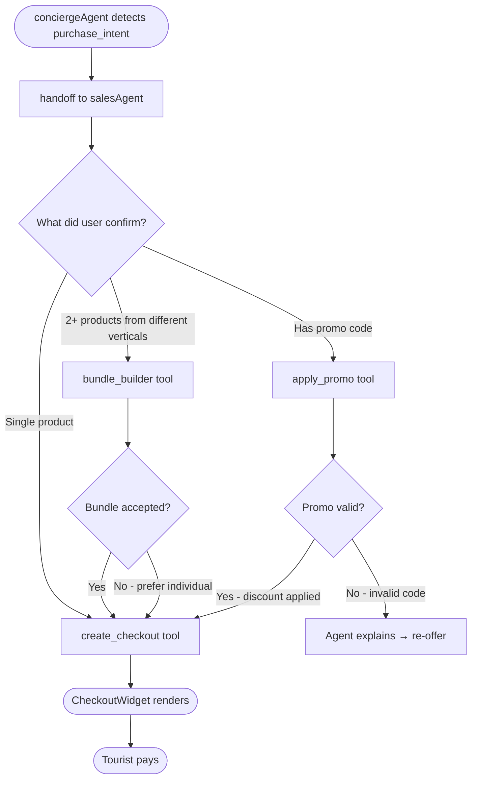
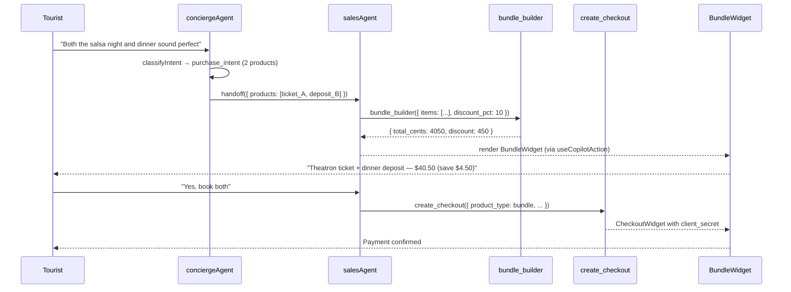

# C6 — Sales Agent

## 0. Quick Read

**What this does in one sentence:** When a tourist shows clear intent to buy, `salesAgent` takes over from the concierge to close the sale — offering a bundle discount, applying a promo code, or triggering checkout directly — all without the user leaving the chat.

**The gap it fills:** `conciergeAgent` is a discovery engine; it has zero commercial capability. A tourist who says "I love both of these events" hits a dead end — no buy path. `salesAgent` is the commercial layer that converts that moment into revenue.

| Persona | Before | After |
|---------|--------|-------|
| **Tourist** (chat) | "I want both the salsa night and dinner" → agent: "Great!" → nothing happens | Agent detects `purchase_intent` → Sales Agent offers bundle: "Both for $40.50 (-10%)" → Tourist pays in 2 taps |
| **Andrés** (buyer) | Navigates to `/events/[slug]` to buy | `salesAgent` triggers `create_checkout` in-chat after he confirms |
| **Patricia** (ops) | AOV = ticket price only | Bundle upsells tracked via `platform_fees.metadata.bundle_discount` |





---

## 1. Purpose

`conciergeAgent` finds what users want. It has no commercial capability. When Camila asks "show me restaurants for tonight" and the agent shows 3 options, there's no mechanism to close the sale — no upsell, no bundle, no promo code. The tourist's session ends without revenue.

**Sales Agent fills this gap.** It activates when a user shows clear purchase intent (confirmed interest in a specific listing), and its job is to close: offer a bundle ("add a restaurant + nightlife for ¢20 off"), apply a promo code, or trigger `create_checkout` directly.

**mastra skill rule:** "Everything you know about Mastra is likely outdated or wrong. Never rely on memory. Always verify against current documentation." — Tools verified from codebase: `createTool` from `@mastra/core/tools`, `new Agent` from `@mastra/core/agent`, pattern confirmed in `src/mastra/tools/classify-intent.ts`.

**copilotkit-integrations skill:** Mastra uses the AG-UI protocol via `@ag-ui/mastra`. The `useCopilotAction` with `available: 'disabled'` is the generative-UI mirror of an agent tool. Agent name in `useCoAgent({ name })` must match key in `Mastra({ agents: {…} })`.

## 2. Goals

- `salesAgent` defined in `src/mastra/agents/sales-agent.ts` and registered in Mastra
- `bundle_builder` tool defined — takes 2–4 product IDs + creates a bundled price with discount
- `apply_promo` tool defined — validates + applies promo codes against Stripe (C15 stub acceptable)
- `salesAgent` has `create_checkout` tool from C2 in its tools map
- `SalesAction` React component wires `useCopilotAction` mirror for all three tools
- `conciergeAgent` hands off to `salesAgent` when intent is `purchase_intent` (new intent class)
- `npm run build` exits 0; Vitest floor stays ≥ 401

## 3. Persona value

| Persona | Before | After |
|---------|--------|-------|
| **Tourist** (chat) | Sees event recommendations; dead end — no buy path in chat | Sales Agent: "Add the restaurant + nightclub? Bundle saves you $15" → pay in-chat |
| **Andrés** (buyer) | Clicks away to `/events/[slug]` to buy | `salesAgent` triggers `create_checkout` in-chat after he confirms |
| **Patricia** (ops) | No upsell coverage — average order value = ticket price only | Bundle upsells trackable via `platform_fees.metadata.bundle_discount` |

## 4. Wiring plan

### 4A — Mastra agent + tools

| Layer | File | Action |
|-------|------|--------|
| Agent | `src/mastra/agents/sales-agent.ts` | Create — see §5 |
| Tool | `src/mastra/tools/bundle-builder.ts` | Create — `bundle_builder` tool |
| Tool | `src/mastra/tools/apply-promo.ts` | Create — `apply_promo` stub (full in C15) |
| Tool re-use | `src/mastra/tools/create-checkout.ts` | Import (C2 — do not duplicate) |
| Agent exports | `src/mastra/agents/index.ts` | Modify — add `export { salesAgent } from './sales-agent'` |
| Mastra registry | `src/mastra/index.ts` | Modify — add `salesAgent` to `Mastra({ agents: {…} })` |

### 4B — Intent expansion

| Layer | File | Action |
|-------|------|--------|
| Intent schema | `src/mastra/tools/classify-intent.ts` | Modify — add `'purchase_intent'` to `intentSchema` enum |
| Router agent | `src/mastra/agents/router.ts` | Modify (or skip if C13 parks router) — update instructions to route `purchase_intent` → `salesAgent` |
| Concierge | `src/mastra/agents/concierge.ts` | Modify — add handoff instruction: "When the user expresses clear intent to purchase a specific item, hand off to salesAgent" |

**mastra skill note:** Verify agent handoff pattern via `mcp__mastra__searchMastraDocs` before implementing. In Mastra, agent-to-agent handoff is done via tool calls (one agent calls another agent's entry point) or workflow steps — not direct method calls.

### 4C — CopilotKit generative UI

| Layer | File | Action |
|-------|------|--------|
| Action | `src/components/copilot/SalesAction.tsx` | Create — mounts 3 `useCopilotAction` mirrors |
| Bundle UI | `src/components/sales/BundleWidget.tsx` | Create — renders bundle offer with price breakdown |
| Mount | `src/components/copilot/copilot-kit-provider.tsx` | Modify — mount `<SalesAction />` alongside `<CheckoutAction />` |

```tsx
// src/components/copilot/SalesAction.tsx
import { useCopilotAction } from '@copilotkit/react-core'  // v1 import
import { BundleWidget } from '../sales/BundleWidget'
import { CheckoutWidget } from '../checkout/CheckoutWidget'

export function SalesAction() {
  useCopilotAction({
    name: 'bundle_builder',
    available: 'disabled',
    render: ({ args, status }) => (
      <BundleWidget
        items={args.items}
        bundleDiscount={args.bundle_discount_cents}
        totalCents={args.total_cents}
        isLoading={status === 'inProgress'}
      />
    ),
  })

  useCopilotAction({
    name: 'apply_promo',
    available: 'disabled',
    render: ({ args, status }) => (
      <div className="text-sm text-green-600">
        {status === 'complete'
          ? `Promo "${args.code}" applied — saved $${(args.discount_cents / 100).toFixed(2)}`
          : 'Applying promo code…'}
      </div>
    ),
  })

  useCopilotAction({
    name: 'create_checkout',
    available: 'disabled',
    render: ({ args, status }) => (
      <CheckoutWidget {...args} isLoading={status === 'inProgress'} />
    ),
  })

  return null
}
```

**copilotkit rule:** Import from `@copilotkit/react-core` (v1.55.2). Never mix v1/v2. `available: 'disabled'` means agent-only — user cannot trigger.

## 5. Agent definition

```ts
// src/mastra/agents/sales-agent.ts
import { Agent } from '@mastra/core/agent'
import { FLASH_MODEL } from '../lib/models'
import { createCheckoutTool } from '../tools/create-checkout'    // C2
import { bundleBuilderTool } from '../tools/bundle-builder'
import { applyPromoTool } from '../tools/apply-promo'             // C15 stub

export const salesAgent = new Agent({
  id: 'sales-agent',
  name: 'Sales Agent',
  model: FLASH_MODEL,
  tools: {
    create_checkout: createCheckoutTool,
    bundle_builder: bundleBuilderTool,
    apply_promo: applyPromoTool,
  },
  instructions: `You are the mdeAI Sales Agent. Your job is to close — convert user interest into a completed purchase.

# When you activate
You receive a confirmed intent: the user has expressed clear interest in one or more specific products (event ticket, venue deposit, restaurant reservation, tour booking).

# Your tools
- bundle_builder: Offer a bundle when the user shows interest in 2+ products from different verticals (e.g. event + restaurant + nightlife). Always price the bundle at least 10% below the sum of individual prices.
- apply_promo: Apply a promo code the user provides. Validate before checkout.
- create_checkout: Open a Stripe payment for a confirmed item. Call ONLY after the user explicitly confirms ("yes", "book it", "let's do it").

# Rules
- Never push a product the user didn't express interest in.
- Always confirm the final amount before calling create_checkout.
- If the user hesitates, offer a bundle or promo — never pressure.
- One create_checkout call per conversation turn. Do not call twice.
- If payment fails, report the error clearly; do not retry automatically.`,
})
```

## 6. Tool schemas

```ts
// src/mastra/tools/bundle-builder.ts
import { createTool } from '@mastra/core/tools'
import { z } from 'zod'

export const bundleBuilderTool = createTool({
  id: 'bundle_builder',
  description: 'Create a discounted bundle from 2–4 products. Call when user shows interest in multiple items.',
  inputSchema: z.object({
    items: z.array(z.object({
      product_type: z.enum(['ticket', 'venue_deposit', 'tour', 'rental_deposit']),
      product_id: z.string(),
      unit_price_cents: z.number().int().positive(),
      label: z.string(),
    })).min(2).max(4),
    bundle_discount_pct: z.number().min(5).max(30).default(10),
  }),
  outputSchema: z.object({
    bundle_id: z.string(),
    items: z.array(z.object({ label: z.string(), unit_price_cents: z.number() })),
    subtotal_cents: z.number(),
    bundle_discount_cents: z.number(),
    total_cents: z.number(),
  }),
  execute: async ({ items, bundle_discount_pct }) => {
    const subtotal = items.reduce((s, i) => s + i.unit_price_cents, 0)
    const discount = Math.round(subtotal * (bundle_discount_pct / 100))
    return {
      bundle_id: crypto.randomUUID(),
      items: items.map(i => ({ label: i.label, unit_price_cents: i.unit_price_cents })),
      subtotal_cents: subtotal,
      bundle_discount_cents: discount,
      total_cents: subtotal - discount,
    }
  },
})

// src/mastra/tools/apply-promo.ts  (stub — full implementation in C15)
export const applyPromoTool = createTool({
  id: 'apply_promo',
  description: 'Validate and apply a promo code. Stub until C15 ships Stripe promo codes.',
  inputSchema: z.object({ code: z.string(), subtotal_cents: z.number().int() }),
  outputSchema: z.object({ valid: z.boolean(), discount_cents: z.number(), message: z.string() }),
  execute: async ({ code }) => ({
    valid: false,
    discount_cents: 0,
    message: `Promo code "${code}" not yet active. Coming soon.`,
  }),
})
```

## 7. Edge cases

- `bundle_builder` must not call `create_checkout` internally — it returns a bundle spec; the agent calls `create_checkout` separately with `product_type: 'bundle'` and a reference to the bundle object.
- Agent handoff from `conciergeAgent` to `salesAgent`: verify the handoff mechanism via `mcp__mastra__searchMastraDocs` for the current Mastra version before implementing. Options: workflow step, tool call, or direct agent invocation.
- `salesAgent` must NOT be exposed to CopilotKit's user-facing interface directly — `conciergeAgent` remains the user-facing agent. `salesAgent` operates as a sub-agent called by concierge.
- If `create_checkout` fails (Stripe error), `salesAgent` must return the error message to the user — never retry silently.

## 8. Real-world examples

**Tourist** in `/chat`: "Book me a salsa night + dinner after." Concierge finds Theatron on Saturday + Tacos y Tequila. Tourist: "Both sound great." Concierge detects `purchase_intent` for 2 products → hands off to `salesAgent`. Sales Agent calls `bundle_builder` → "Bundle: Theatron ticket ($30) + dinner reservation deposit ($15) = $45 → 10% bundle: **$40.50**. Proceed?" Tourist: "Yes." Sales Agent calls `create_checkout` → `CheckoutWidget` renders → payment in 2 taps.

## 9. Acceptance criteria

1. `salesAgent` appears in Mastra Studio after `npm run dev`.
2. `bundle_builder` tool returns a valid `bundle_id` and `total_cents` given 2 items.
3. `apply_promo` tool returns `{ valid: false }` (stub) without errors.
4. `SalesAction` mounts 3 `useCopilotAction` hooks without console errors.
5. `BundleWidget` renders bundle offer with item list and total when given `args.items`.
6. `salesAgent` is registered in `Mastra({ agents: {…} })`.
7. `npm run build` exits 0; Vitest floor stays ≥ 401.

## 10. Outcomes

| | Before | After |
|---|---|---|
| Transact agents | 0 | 1 (`salesAgent`) |
| Bundle capability | None | `bundle_builder` tool live |
| Promo capability | None | `apply_promo` stub (full in C15) |
| Average order value path | Ticket price only | Bundle upsell + promo available |
