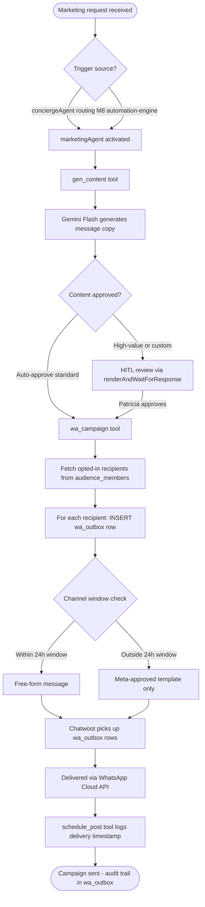
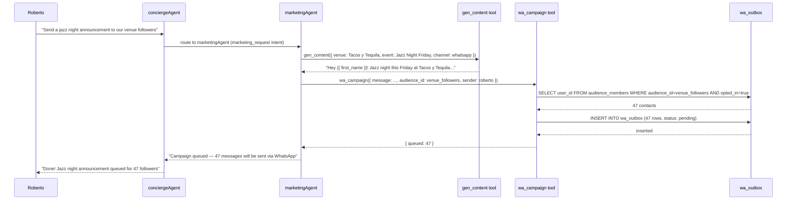

# C7 — Marketing Agent + WhatsApp Automation

## 0. Quick Read

**What this does in one sentence:** When Roberto subscribes to the AI Marketing Agency (C1) and asks for a jazz night announcement, `marketingAgent` writes the WhatsApp copy, queues it to all opted-in venue followers, and sends it through Chatwoot's WhatsApp inbox — the first time MDE AI actually delivers a message to end users.

**The missing link:** C1 sells the agency package. Without C7, it's a subscription to nothing — Patricia writes every message manually. C7 is the engine behind the product.

| Persona | Before | After |
|---------|--------|-------|
| **Roberto** (venue host) | Pays for AI Marketing Agency; team writes messages manually | Asks agent: "Announce jazz night Friday" → 200 WhatsApp sends in 2 min |
| **Patricia** (ops) | Writes every campaign message herself | Reviews and approves AI-generated copy; hit send |
| **Tourist** | Never receives outreach from venues they visited | WhatsApp: "Hey! Jazz night at Tacos y Tequila this Friday — table for 2?" |
| **C1 subscriber** | Subscribed; no delivery | Campaign delivered; `wa_outbox` rows auditable |





---

## 1. Purpose

C1 productized the AI Marketing Agency — Roberto pays $299/mo for AI-powered content + WhatsApp distribution. Without C7, that product has no engine.

C7 builds the `marketingAgent`: a Mastra sub-agent activated from `conciergeAgent` (via supervisor routing) or triggered by the M8 automation-engine edge function. It is the sole agent authorized to write to `wa_outbox`.

**Chatwoot dependency (CRITICAL):** The `wa_outbox` table already exists but has no live send loop. Chatwoot's WhatsApp Cloud API inbox (CW-2 → CW-3) is the bridge that picks up `wa_outbox` rows and delivers them. C7 can be built and tested locally without Chatwoot (just writes to `wa_outbox`), but cannot deliver messages in production until CW-3 ships.

## 2. Goals

- `marketingAgent` defined in `src/mastra/agents/marketing-agent.ts` and registered in Mastra
- `gen_content` tool: calls Gemini Flash to generate WhatsApp-appropriate copy; returns rendered message string
- `wa_campaign` tool: fetches opted-in audience members; respects 24h window rule; inserts `wa_outbox` rows; returns `{ queued: number }`
- `schedule_post` tool: writes to a scheduled queue (time-based campaigns); integrates with M8 automations
- `marketingAgent` activated from `conciergeAgent` on `marketing_request` intent (supervisor pattern, verified against Mastra docs)
- WhatsApp 24-hour window enforced in `wa_campaign` tool (PRODUCTION-BLOCKING compliance)
- `npm run build` exits 0; Vitest floor stays ≥ 401

## 3. Wiring plan

### 3A — Mastra agent + tools

| Layer | File | Action |
|-------|------|--------|
| Agent | `src/mastra/agents/marketing-agent.ts` | Create |
| Tool | `src/mastra/tools/gen-content.ts` | Create — calls Gemini Flash; returns WhatsApp-ready copy |
| Tool | `src/mastra/tools/wa-campaign.ts` | Create — audience fetch + opt-in filter + 24h check + `wa_outbox` INSERT |
| Tool | `src/mastra/tools/schedule-post.ts` | Create — writes to M8 automations queue or `wa_outbox` with future `send_at` |
| Agent exports | `src/mastra/agents/index.ts` | Modify — export `marketingAgent` |
| Mastra registry | `src/mastra/index.ts` | Modify — add `marketingAgent` to agents map |
| Concierge | `src/mastra/agents/concierge.ts` | Modify — add `marketingAgent` to supervisor `agents` property; route `marketing_request` intent |

### 3B — Shared utility

| Layer | File | Action |
|-------|------|--------|
| Shared | `supabase/functions/_shared/wa-window-check.ts` | Create — `isWithin24hWindow(userId): Promise<boolean>`; also used by M8 automation-engine |

## 4. Agent definition

```ts
// src/mastra/agents/marketing-agent.ts
import { Agent } from '@mastra/core/agent'
import { FLASH_MODEL } from '../lib/models'
import { genContentTool } from '../tools/gen-content'
import { waCampaignTool } from '../tools/wa-campaign'
import { schedulePostTool } from '../tools/schedule-post'

export const marketingAgent = new Agent({
  id: 'marketing-agent',
  name: 'Marketing Agent',
  model: FLASH_MODEL,
  tools: {
    gen_content: genContentTool,
    wa_campaign: waCampaignTool,
    schedule_post: schedulePostTool,
  },
  instructions: `You are the MDE AI Marketing Agent. Generate and deliver WhatsApp campaigns for subscribed venue operators.

Pipeline (always in order):
1. gen_content — draft WhatsApp copy. Keep it under 160 characters. No hard-sell. Include the event name, date, and a clear call to action.
2. wa_campaign — queue the message to the target audience. The tool enforces opt-in and 24h window compliance automatically. Never bypass these checks.
3. schedule_post — if the request is time-based, schedule the campaign for the specified send time.

Rules:
- Never generate or send to contacts who are not in an opted-in audience.
- Never send free-form messages outside the WhatsApp 24-hour session window — the tool will reject them. Suggest a Meta-approved template instead.
- Report exactly how many messages were queued, not how many will be "sent."`,
})
```

## 5. wa_campaign tool — 24h window compliance

```ts
// src/mastra/tools/wa-campaign.ts (key logic)
import { createTool } from '@mastra/core/tools'
import { z } from 'zod'

export const waCampaignTool = createTool({
  id: 'wa_campaign',
  description: 'Queue a WhatsApp campaign to an opted-in audience. Enforces 24h session window.',
  inputSchema: z.object({
    message: z.string().max(1024),
    audience_id: z.string().uuid(),
    sender_operator_id: z.string().uuid(),
    template_name: z.string().optional(), // required if outside 24h window
  }),
  execute: async ({ context }) => {
    // 1. Fetch opted-in members
    const members = await supabase
      .from('audience_members')
      .select('user_id, contact_channel')
      .eq('audience_id', context.audience_id)
      .eq('opted_in', true)

    const rows = []
    for (const member of members.data ?? []) {
      // 2. Check 24h window
      const inWindow = await isWithin24hWindow(member.user_id)
      if (!inWindow && !context.template_name) continue // skip; log dropped

      rows.push({
        user_id: member.user_id,
        operator_id: context.sender_operator_id,
        message: context.message,
        template_name: context.template_name ?? null,
        status: 'pending',
      })
    }

    await supabase.from('wa_outbox').insert(rows)
    return { queued: rows.length, dropped: (members.data?.length ?? 0) - rows.length }
  },
})
```

## 6. Edge cases

- **24-hour window (PRODUCTION-BLOCKING):** The `wa_campaign` tool must check `wa_outbox` or `whatsapp_conversations` for the last inbound message timestamp per user before inserting a free-form message. Outside 24h: only insert rows where `template_name` is set. Violation = WhatsApp account ban risk.
- **No Chatwoot in dev:** `wa_outbox` rows can accumulate without a live send loop in development. This is expected — test the INSERT logic; verify delivery only after CW-3 ships.
- **Opt-out at any time:** A user who opts out after the campaign is queued but before Chatwoot picks it up must be checked again at delivery time. Add `opted_in` check in the Chatwoot bridge (CW-3).
- **Rate limits:** WhatsApp Business API has per-account message rate limits. The `wa_campaign` tool should batch sends to stay within 1,000 messages/day for unverified accounts, 100k/day for verified. For now, log a warning if `queued > 500`.
- **gen_content temperature:** Use `temperature: 0.4` — creative enough for variety but not so variable that copy goes off-brand. System prompt enforces brand voice and length limits.

## 7. Acceptance criteria

1. `marketingAgent` appears in Mastra Studio after `npm run dev`.
2. `gen_content` tool returns WhatsApp-ready copy under 160 characters for a standard venue announcement.
3. `wa_campaign` tool inserts `wa_outbox` rows only for `opted_in = true` audience members.
4. `wa_campaign` tool skips (does not insert) rows for users outside the 24h window when no `template_name` is provided.
5. `conciergeAgent` routes to `marketingAgent` on `marketing_request` intent.
6. `npm run build` exits 0; Vitest floor stays ≥ 401.

## 8. Outcomes

| | Before | After |
|---|---|---|
| Campaign delivery | Manual (Patricia writes + sends) | `marketingAgent` generates + queues in < 2 min |
| `wa_outbox` usage | Rows insert ad-hoc from C1 code | Structured tool with opt-in + window compliance |
| 24h window compliance | Unguarded | Enforced in `wa_campaign` tool before every INSERT |
| C1 product delivery | Subscription without engine | Full AI copy + WhatsApp delivery pipeline |
