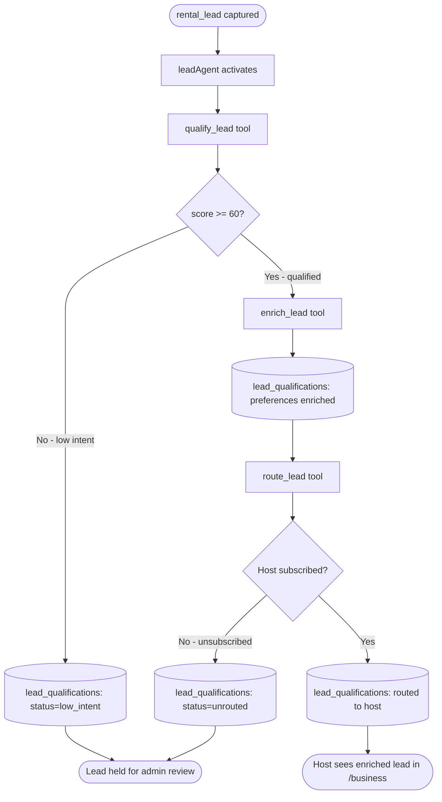
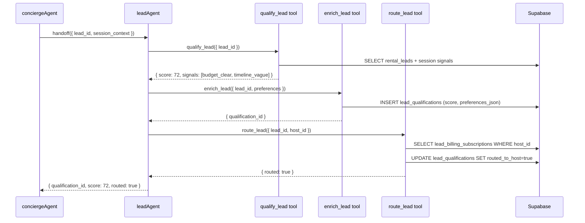

# C8 — Lead Agent

## 0. Quick Read

**What this does in one sentence:** When Camila expresses strong rental intent, `leadAgent` scores her lead, enriches it with preferences from the conversation, and routes it to the right host's CRM row — all before the host even opens their dashboard.

**What changes for each persona:**

| Persona | Before | After |
|---------|--------|-------|
| **Camila** | Inquiry goes into `rental_leads` as raw data | Same — no UX change for her |
| **Host** | Gets a raw lead row with an email address | Gets a scored + enriched qualification: "Budget $800, move-in July, prefers quiet, no pets, floor 3+" |
| **Patricia** | No lead quality signal | `SELECT avg(score), count(*) FROM lead_qualifications WHERE status='qualified'` → lead quality dashboard |
| **Sofía** | Agent registry grows; no new agents | `leadAgent` appears in Mastra Studio with tool traces |

**User journey — lead qualification:**
1. Camila says "I need a 2BR in Envigado, $700/mo max, I have a cat"
2. `conciergeAgent` detects `rental_lead_capture` intent → captures lead (C4)
3. `conciergeAgent` triggers `leadAgent` handoff
4. `leadAgent` calls `qualify_lead({ lead_id })` → score 72 (budget clear, timeline vague)
5. `leadAgent` calls `enrich_lead({ lead_id, preferences })` → writes structured preferences to `lead_qualifications`
6. `leadAgent` calls `route_lead({ lead_id, host_id })` → links qualification to host's CRM view
7. Host opens `/business` (M2) → sees "High-intent lead: 2BR Envigado, cat-friendly, $700 max"





---

## 1. Purpose

C4 captures rental leads into `rental_leads` — but the rows are raw: an email, a timestamp, a rental ID. The host has no signal about budget, timeline, unit preferences, or intent strength. A host with 20 leads has no way to prioritize.

`leadAgent` fills this gap. It reads the lead + the conversation context that generated it, scores intent signals (0–100), extracts structured preferences (budget, timeline, neighborhood preference, pet policy, amenities), and writes a `lead_qualifications` row the host can act on immediately.

**Importantly, C8 has no WhatsApp dependency.** It operates entirely within Supabase. The notification layer (WhatsApp message to host) belongs to C7 and M7. C8's job is data quality, not delivery.

**mastra skill note:** "Everything you know about Mastra is likely outdated or wrong. Never rely on memory. Always verify against current documentation." Agent handoff pattern must be verified via `mcp__mastra__searchMastraDocs` before implementing. The pattern may be: tool call from `conciergeAgent` that invokes `leadAgent.run()`, or a workflow step, or a direct tool call. Do not assume.

**copilotkit-integrations skill:** The `leadAgent` is a sub-agent called by `conciergeAgent` — it should NOT be exposed directly to the CopilotKit user-facing interface. No `useCopilotAction` mirror is needed for internal qualification tools.

## 2. Goals

- `leadAgent` defined in `src/mastra/agents/lead-agent.ts` and registered in Mastra
- `qualify_lead` tool: scores 0–100 based on session signals; writes `score` to `rental_leads`
- `enrich_lead` tool: extracts structured preferences from conversation context; inserts `lead_qualifications` row
- `route_lead` tool: looks up host's `lead_billing_subscriptions`; updates `lead_qualifications.routed_to_host = true`
- `conciergeAgent` triggers `leadAgent` on `rental_lead_capture` intent (after C4's `capture_lead` tool fires)
- `npm run build` exits 0; Vitest floor stays ≥ 401

## 3. Wiring plan

### 3A — Mastra agent + tools

| Layer | File | Action |
|-------|------|--------|
| Agent | `src/mastra/agents/lead-agent.ts` | Create — see §4 |
| Tool | `src/mastra/tools/qualify-lead.ts` | Create — `qualify_lead` tool |
| Tool | `src/mastra/tools/enrich-lead.ts` | Create — `enrich_lead` tool |
| Tool | `src/mastra/tools/route-lead.ts` | Create — `route_lead` tool |
| Agent exports | `src/mastra/agents/index.ts` | Modify — add `export { leadAgent } from './lead-agent'` |
| Mastra registry | `src/mastra/index.ts` | Modify — add `leadAgent` to `Mastra({ agents: {…} })` |

### 3B — Concierge handoff

| Layer | File | Action |
|-------|------|--------|
| Concierge | `src/mastra/agents/concierge.ts` | Modify — after `capture_lead` fires: trigger `leadAgent` handoff via verified pattern |
| Intent schema | `src/mastra/tools/classify-intent.ts` | No change needed — `rental_lead_capture` added in C4 |

**Verify handoff pattern** via `mcp__mastra__searchMastraDocs` before implementing. Options:
- `leadAgent.run({ leadId, sessionContext })` as a direct Mastra agent call from the concierge tool
- A Mastra workflow step that chains lead capture → qualification
- A background task triggered by a Supabase `rental_leads` INSERT trigger

### 3C — Schema

| Layer | File | Action |
|-------|------|--------|
| Migration | `supabase/migrations/YYYYMMDD_lead_qualifications.sql` | Create — see §5 |

## 4. Agent definition

```ts
// src/mastra/agents/lead-agent.ts
import { Agent } from '@mastra/core/agent'
import { FLASH_MODEL } from '../lib/models'
import { qualifyLeadTool } from '../tools/qualify-lead'
import { enrichLeadTool } from '../tools/enrich-lead'
import { routeLeadTool } from '../tools/route-lead'

export const leadAgent = new Agent({
  id: 'lead-agent',
  name: 'Lead Agent',
  model: FLASH_MODEL,
  tools: {
    qualify_lead: qualifyLeadTool,
    enrich_lead: enrichLeadTool,
    route_lead: routeLeadTool,
  },
  instructions: `You are the MDE AI Lead Agent. Your job is to qualify, enrich, and route rental and event leads so hosts receive actionable contact information — not raw data.

# When you activate
A rental or event lead has just been captured. You receive:
- lead_id: the UUID of the new rental_leads row
- session_context: a summary of the user's conversation (budget, timeline, preferences, questions asked)

# Your pipeline — always run in order
1. qualify_lead({ lead_id, session_context }) — score intent 0–100. Signals that raise the score: explicit budget, move-in date, specific neighborhood, contact info shared. Signals that lower it: vague "just browsing", no timeline.
2. If score < 40: stop. Set status "low_intent". Do not proceed.
3. enrich_lead({ lead_id, preferences }) — extract structured preferences from session_context and write to lead_qualifications.
4. route_lead({ lead_id }) — link the qualification to the host.

# Rules
- Never fabricate preferences not present in session_context.
- Score conservatively — a false "high-intent" wastes the host's time.
- Do not call any communication tools. Your output is Supabase rows only.`,
})
```

## 5. Tool schemas

```ts
// src/mastra/tools/qualify-lead.ts
import { createTool } from '@mastra/core/tools'
import { z } from 'zod'

export const qualifyLeadTool = createTool({
  id: 'qualify_lead',
  description: 'Score a rental lead 0–100 based on intent signals in the session context.',
  inputSchema: z.object({
    lead_id: z.string().uuid(),
    session_context: z.string().describe('Summary of user conversation signals'),
  }),
  outputSchema: z.object({
    score: z.number().int().min(0).max(100),
    signals: z.array(z.string()),
    status: z.enum(['qualified', 'low_intent']),
  }),
  execute: async ({ lead_id, session_context }) => {
    // Calls /api/leads/qualify with the context; API route does the scoring
    const res = await fetch('/api/leads/qualify', {
      method: 'POST',
      headers: { 'Content-Type': 'application/json' },
      body: JSON.stringify({ lead_id, session_context }),
    })
    return res.json()
  },
})

// src/mastra/tools/enrich-lead.ts
export const enrichLeadTool = createTool({
  id: 'enrich_lead',
  description: 'Extract structured preferences from session context and write to lead_qualifications.',
  inputSchema: z.object({
    lead_id: z.string().uuid(),
    preferences: z.object({
      budget_max_cents: z.number().int().optional(),
      move_in_date: z.string().optional(),
      neighborhoods: z.array(z.string()).optional(),
      bedrooms: z.number().int().optional(),
      pets: z.boolean().optional(),
      furnished: z.boolean().optional(),
      notes: z.string().optional(),
    }),
  }),
  outputSchema: z.object({ qualification_id: z.string().uuid() }),
  execute: async ({ lead_id, preferences }) => {
    const res = await fetch('/api/leads/enrich', {
      method: 'POST',
      headers: { 'Content-Type': 'application/json' },
      body: JSON.stringify({ lead_id, preferences }),
    })
    return res.json()
  },
})

// src/mastra/tools/route-lead.ts
export const routeLeadTool = createTool({
  id: 'route_lead',
  description: 'Route a qualified lead to the host CRM row.',
  inputSchema: z.object({ lead_id: z.string().uuid() }),
  outputSchema: z.object({ routed: z.boolean(), host_id: z.string().uuid().optional() }),
  execute: async ({ lead_id }) => {
    const res = await fetch('/api/leads/route', {
      method: 'POST',
      headers: { 'Content-Type': 'application/json' },
      body: JSON.stringify({ lead_id }),
    })
    return res.json()
  },
})
```

## 6. Schema

```sql
-- supabase/migrations/YYYYMMDD_lead_qualifications.sql

CREATE TABLE public.lead_qualifications (
  id                 uuid PRIMARY KEY DEFAULT gen_random_uuid(),
  lead_id            uuid NOT NULL REFERENCES public.rental_leads(id),
  score              integer NOT NULL CHECK (score BETWEEN 0 AND 100),
  signals            text[],
  budget_max_cents   integer,
  move_in_date       date,
  neighborhoods      text[],
  bedrooms           integer,
  pets               boolean,
  furnished          boolean,
  notes              text,
  routed_to_host     boolean NOT NULL DEFAULT false,
  status             text NOT NULL DEFAULT 'qualified'
    CHECK (status IN ('qualified', 'low_intent', 'routed', 'converted')),
  created_at         timestamptz NOT NULL DEFAULT now(),
  updated_at         timestamptz NOT NULL DEFAULT now()
);
ALTER TABLE public.lead_qualifications ENABLE ROW LEVEL SECURITY;

-- Host reads qualifications for their leads
CREATE POLICY "host_read_via_lead" ON public.lead_qualifications
  FOR SELECT USING (
    EXISTS (
      SELECT 1 FROM public.rental_leads rl
      WHERE rl.id = lead_id
        AND rl.host_id = (SELECT auth.uid())
    )
  );

-- Service role writes (agent tools call API routes which use service role)
```

**mde-supabase rule:** "`(SELECT auth.uid())` not `auth.uid()` in RLS policies."

## 7. Edge cases

- **Agent handoff pattern:** Verify via `mcp__mastra__searchMastraDocs` before coding. If Mastra doesn't support direct agent-to-agent calls in the current version, implement as a tool within `conciergeAgent` that calls `leadAgent`'s tools directly (bypassing the agent wrapper).
- **`enrich_lead` hallucination guard:** The tool's `execute` must pass the raw `session_context` string to an API route that uses Gemini to extract structured fields. Add a `maxTokens` cap and a `temperature: 0` setting to reduce fabrication risk.
- **No host subscription:** `route_lead` must handle the case where the host has no `lead_billing_subscriptions` row (enrolled manually by admin or hasn't subscribed yet). In this case, set `routed_to_host = false` and `status = 'unrouted'`. Do not error.
- **Low-score leads (< 40):** The agent instructions say to stop. Ensure `qualify_lead` still writes the score to `rental_leads.score` even for low-intent leads — Patricia needs the distribution data.
- **Event leads:** The same agent and tools apply to event leads (when a user shows intent to buy a ticket but hasn't yet). Add `event_lead_capture` to the intent schema and ensure `enrich_lead` handles event-specific preferences (date, group size, price range).

## 8. Real-world examples

**Camila** in chat says "I need a 2BR in Envigado, $700/mo max, I have a cat, move-in August." Concierge captures lead → triggers `leadAgent`. `qualify_lead` scores 78: budget explicit, timeline clear, amenity preference stated. `enrich_lead` writes `{ budget_max_cents: 70000, move_in_date: '2026-08-01', neighborhoods: ['envigado'], pets: true, bedrooms: 2 }`. `route_lead` links to host's qualification row. Host opens `/business` → sees: "High-intent: 2BR Envigado, cat-friendly, $700 max, August move-in. Score: 78/100."

## 9. Acceptance criteria

1. `leadAgent` appears in Mastra Studio after `npm run dev`.
2. `qualify_lead` tool returns `{ score: number, status: 'qualified' | 'low_intent' }` given a session context.
3. `enrich_lead` tool inserts a `lead_qualifications` row with structured preferences.
4. `route_lead` tool sets `lead_qualifications.routed_to_host = true` when host has an active `lead_billing_subscriptions` row.
5. Low-intent leads (score < 40) do not trigger `enrich_lead` or `route_lead`.
6. `lead_qualifications` table has RLS with `host_read_via_lead` policy.
7. `npm run build` exits 0; Vitest floor stays ≥ 401.

## 10. Outcomes

| | Before | After |
|---|---|---|
| Lead quality for hosts | Raw email + timestamp | Scored + enriched with preferences |
| Host prioritization | All leads equal | Score 0–100 — work best leads first |
| M6 unblock | Blocked (no lead data) | `lead_qualifications` is the CRM source of truth |
| Agent count in registry | +0 | +1 (`leadAgent`) |
