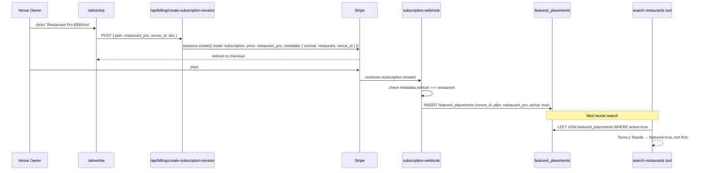
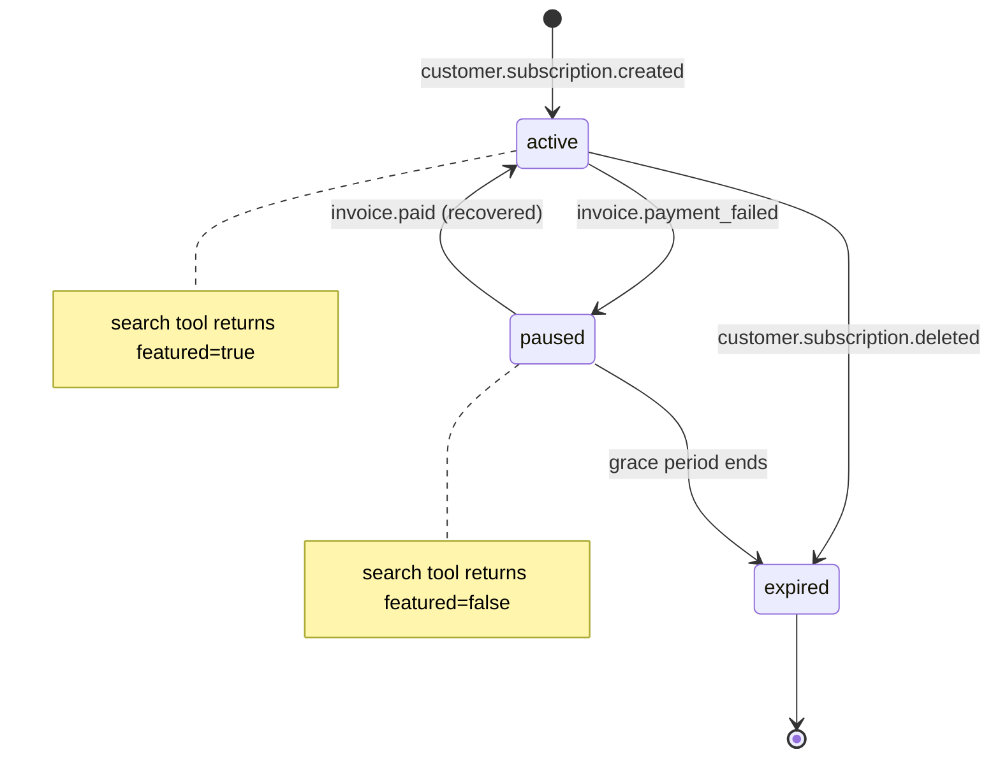

# C9 — Restaurant / Venue Marketing Retainer

## 0. Quick Read

**What this does in one sentence:** A restaurant owner pays $199–$399/mo and their listing always appears first in MDE AI's discovery results — with a star badge on the map and priority in chat recommendations.

**The B2B revenue loop:** Medellín has 4,000+ restaurants competing on equal footing in MDE AI's results today. C9 opens a paid placement channel: a venue subscribes via `/advertise` → Stripe Billing fires a webhook → `featured_placements` row is inserted → the `search-restaurants` tool returns them first.

| Persona | Before | After |
|---------|--------|-------|
| **Restaurant owner** | Competes equally with 4,000 others in search results | Subscribes to Pro → always in top-3 for their neighborhood |
| **Tourist** (chat) | Sees randomly-ranked restaurants | Featured restaurants clearly labeled (curation signal) |
| **Camila** | Rental concierge recommends nearby restaurants by proximity only | Featured restaurants visible with star badge near her shortlisted rentals |
| **Patricia** | Zero B2B venue revenue | Monthly retainer income tracked in `subscriptions` table |





---

## 1. Purpose

Medellín has 4,000+ restaurants and 500+ nightlife venues. Today they appear in MDE AI's discovery results based solely on data quality — there is no paid placement. C9 opens a **B2B recurring revenue channel** where a venue owner pays a monthly retainer to guarantee featured placement in Camila's and the Tourist's discovery feeds.

The `sponsor.*` schema already exists in Supabase (dormant). C9 activates `sponsor.placements` (existing or new table) for venue-specific retainers. The featured pin/card logic routes through the existing `MapContext.mergePins` and search tool infrastructure.

**mde-stripe skill:** "Billing APIs handle renewal, retry logic, and dunning automatically." C9 builds on C3 (Stripe Billing infrastructure already live). No new webhook infrastructure needed — the `subscription-webhook` (C3) already handles `customer.subscription.created/updated/deleted`.

**mde-stripe skill:** "Don't use the deprecated `plan` object. Use Prices instead." — The `restaurant_starter` and `restaurant_pro` prices were created in C3.

## 2. Goals

- `featured_placements` table migrated (or `sponsor.placements` extended) with venue-specific columns
- `/advertise` page (C1) extended with "For Restaurants & Venues" section and pricing cards for `restaurant_starter` ($199/mo) and `restaurant_pro` ($399/mo)
- Stripe Billing checkout session for restaurant plans → on `customer.subscription.created` → insert `featured_placements` row with `active: true`
- `search-restaurants.ts` tool updated: prioritize `featured = true` restaurants at top of results
- Featured map pin rendered with a distinct `src/components/maps/FeaturedPin.tsx` marker
- `npm run build` exits 0; Vitest floor stays ≥ 401

## 3. Persona value

| Persona | Before | After |
|---------|--------|-------|
| **Restaurant owner** | Competes equally with 4,000 other restaurants in MDE AI results | Subscribes to Restaurant Pro → always appears in top-3 results for their neighborhood |
| **Tourist** (chat) | Sees randomly ranked restaurants | Sees featured restaurants clearly labeled (social proof + curation signal) |
| **Camila** (rental seeker) | Rental concierge recommends restaurants based on proximity only | Featured restaurants visible on the map panel near her shortlisted rentals |
| **Patricia** (ops) | Zero B2B venue revenue | Monthly retainer income tracked in `subscriptions` table |

## 4. Wiring plan

### 4A — Schema

| Layer | File | Action |
|-------|------|--------|
| Migration | `supabase/migrations/YYYYMMDD_featured_placements.sql` | Create — see §5 |

### 4B — Stripe + subscription flow

| Layer | File | Action |
|-------|------|--------|
| `/advertise` page | `src/app/advertise/page.tsx` | Modify (C1 created this) — add restaurant/venue pricing section below agency plans |
| Checkout session route | `src/app/api/billing/create-subscription-session/route.ts` | Modify (C1 created) — handle `plan: 'restaurant_starter' | 'restaurant_pro'`; include `metadata: { vertical: 'restaurant', venue_id }` |
| Subscription webhook | `supabase/functions/subscription-webhook/index.ts` | Modify (C3 extended) — on `customer.subscription.created` with `metadata.vertical === 'restaurant'`: insert `featured_placements` row |

```ts
// In subscription-webhook: handling restaurant subscription activation
if (event.type === 'customer.subscription.created') {
  const sub = event.data.object as Stripe.Subscription
  const meta = sub.metadata
  if (meta.vertical === 'restaurant' && meta.venue_id) {
    await serviceClient.from('featured_placements').insert({
      venue_id: meta.venue_id,
      subscription_id: sub.id,
      plan: meta.plan,  // 'restaurant_starter' | 'restaurant_pro'
      active: true,
      starts_at: new Date(sub.current_period_start * 1000).toISOString(),
      ends_at: new Date(sub.current_period_end * 1000).toISOString(),
    })
  }
}
```

### 4C — Discovery integration

| Layer | File | Action |
|-------|------|--------|
| Restaurant tool | `src/mastra/tools/search-restaurants.ts` | Modify — join `featured_placements` on venue; set `featured: true` on matching results; sort featured first |
| Featured pin | `src/components/maps/FeaturedPin.tsx` | Create — `<AdvancedMarker>` variant with a star badge; requires `mapId` on parent `<Map>` (CLAUDE.md rule) |
| Restaurant card | `src/components/restaurants/RestaurantCard.tsx` | Modify — show "Featured" badge when `featured === true` |

**CLAUDE.md rule:** "Every `<AdvancedMarker>`: `mapId` on the parent `<Map>`." Verify `mapId` is set in the parent map before adding `FeaturedPin`.

### 4D — Admin / intake

| Layer | File | Action |
|-------|------|--------|
| Intake form | `src/app/advertise/page.tsx` | Modify — add restaurant intake fields: venue name, venue type, neighborhood, target neighborhood(s) |
| API route | `src/app/api/billing/create-subscription-session/route.ts` | Modify — pass venue_id in `metadata` so webhook can link subscription to venue |

## 5. Schema

```sql
-- supabase/migrations/YYYYMMDD_featured_placements.sql

CREATE TABLE public.featured_placements (
  id               uuid PRIMARY KEY DEFAULT gen_random_uuid(),
  venue_id         uuid NOT NULL,  -- FK to venues table (or sponsor_* if using existing schema)
  subscription_id  text NOT NULL,  -- Stripe subscription ID
  plan             text NOT NULL CHECK (plan IN ('restaurant_starter', 'restaurant_pro')),
  active           boolean NOT NULL DEFAULT true,
  placement_type   text NOT NULL DEFAULT 'featured_listing'
                   CHECK (placement_type IN ('featured_listing', 'map_pin', 'chat_priority')),
  starts_at        timestamptz NOT NULL,
  ends_at          timestamptz,
  created_at       timestamptz NOT NULL DEFAULT now(),
  updated_at       timestamptz NOT NULL DEFAULT now()
);

ALTER TABLE public.featured_placements ENABLE ROW LEVEL SECURITY;

-- Public read (anyone can see which venues are featured — no PII exposed)
CREATE POLICY "public_read" ON public.featured_placements
  FOR SELECT USING (active = true);

-- Service role writes (webhook only)
-- No user-facing INSERT/UPDATE/DELETE
```

**mde-supabase rule:** "Every exposed table has RLS. No exceptions in `public` schema." Here `public_read` is intentional — the agent tools can read featured placements without auth.

## 6. Edge cases

- **Subscription cancellation:** When `customer.subscription.deleted` fires (from C3 webhook), set `featured_placements.active = false` for rows matching `subscription_id`.
- **`restaurant_pro` vs `restaurant_starter`:** Pro plan should give priority in chat results AND map pin; Starter gives featured badge in list results only. Encode this in `placement_type` or use two rows.
- **Venue ID linkage:** The intake form must capture a venue_id that exists in the `venues` table. Add a venue autocomplete input using the venue search infrastructure (VEN tasks).
- **Duplicate featured placement:** If a venue owner subscribes twice (e.g. cancels + resubscribes), `featured_placements` may have two rows. The tool query should use `WHERE active = true LIMIT 1` per venue_id.
- **Discovery tool JOIN:** The `search-restaurants.ts` tool currently queries Supabase directly. Adding the `featured_placements` JOIN should use `LEFT JOIN` so non-featured restaurants still appear — just not at the top.

## 7. Real-world examples

**Tacos y Tequila owner** visits `/advertise`, clicks "Restaurant Pro" ($399/mo). Completes Stripe Billing checkout with venue_id in metadata. `subscription-webhook` fires → `featured_placements` row inserted. Next time a tourist asks the concierge for dinner in Poblado, Tacos y Tequila appears first with a ★ badge.

**Patricia** queries: `SELECT v.name, fp.plan, fp.starts_at FROM featured_placements fp JOIN venues v ON v.id = fp.venue_id WHERE fp.active = true ORDER BY fp.plan DESC` — B2B venue revenue report.

## 8. Acceptance criteria

1. `featured_placements` table exists with RLS: `public_read` policy for `active = true` rows.
2. `/advertise` shows restaurant pricing section with `Restaurant Starter` ($199/mo) and `Restaurant Pro` ($399/mo) cards.
3. Stripe Billing session with `plan: 'restaurant_starter'` + `venue_id` metadata creates a subscription and triggers webhook.
4. `subscription-webhook` inserts a `featured_placements` row on `customer.subscription.created` with `metadata.vertical === 'restaurant'`.
5. `search-restaurants.ts` returns featured restaurants first (verified by Vitest with mock `featured_placements` data).
6. `FeaturedPin` renders a star badge marker (requires `mapId` on parent `<Map>`).
7. `npm run build` exits 0; Vitest floor stays ≥ 401.

## 9. Outcomes

| | Before | After |
|---|---|---|
| B2B venue revenue | Zero | Restaurant retainer: $199–$399/mo per venue |
| Discovery priority | Random data quality | Featured restaurants always first |
| `sponsor.placements` / `featured_placements` | Dormant schema | Active with webhook-driven inserts |
| Map featured pin | None | `FeaturedPin` component live |
