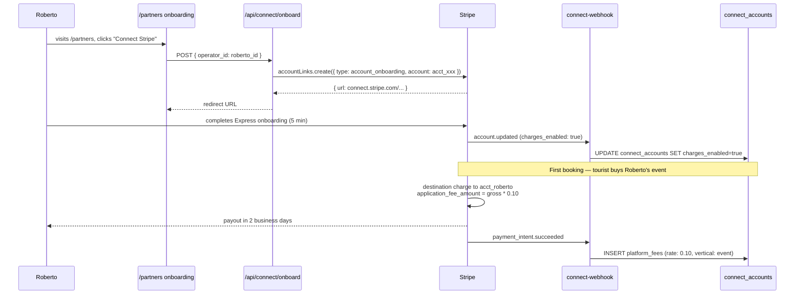
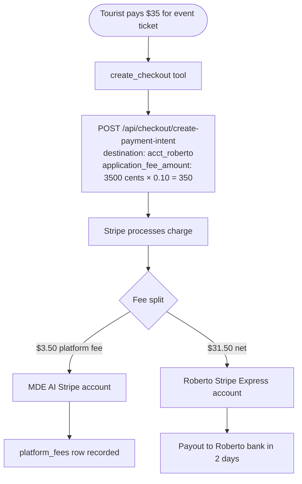

# M1 — Stripe Connect Express

## 0. Quick Read

**What this does in one sentence:** Roberto signs up as a Stripe Connect operator in 5 minutes; when a tourist buys his event ticket, Stripe automatically sends Roberto his share and deducts MDE AI's 10% platform fee — no manual wire transfers, no reconciliation spreadsheets.

**Why this is the marketplace foundation:** Every transaction before M1 goes into MDE AI's single Stripe account. After M1, money flows to operators automatically. This unlocks tour operators (M3), rental deposits (M10), trip bundles (A1), and the full marketplace (A3).

| Persona | Before | After |
|---------|--------|-------|
| **Roberto** (host) | Receives payout via manual bank transfer weeks later | Stripe Express dashboard: payouts every 2 days, instant visibility |
| **Tour operator** | Cannot list on MDE AI (no payout infrastructure) | Connects Stripe Express account → goes live → receives 85% of booking |
| **Patricia** (ops) | Manually calculates MDE AI's fee per transaction | `application_fee_amount` is collected automatically by Stripe |
| **Andrés** (buyer) | Experience unchanged | Checkout is identical — Connect is invisible to buyers |





---

## 1. Purpose

Today every Stripe charge goes into a single MDE AI account. Roberto receives his payout via a manual bank transfer long after the event. Tour operators and rental hosts cannot list on MDE AI at all — there is no infrastructure to pay them.

Stripe Connect Express solves this: operators complete a 5-minute onboarding and receive a Stripe Express account. Every charge is a **destination charge**: Stripe routes the operator's share directly to their account and retains MDE AI's `application_fee_amount` automatically.

**mde-stripe pattern — destination charges (Connect):**
```ts
// PaymentIntent with destination + application_fee
await stripe.paymentIntents.create({
  amount: 3500,
  currency: 'usd',
  transfer_data: { destination: 'acct_roberto_express' },
  application_fee_amount: 350,   // 10% — MDE AI keeps this
  metadata: { operator_id: 'roberto', vertical: 'event' },
})
```

**mde-stripe rule:** "Idempotency on every payment-creating call." Pass `idempotencyKey` to all Connect charge creation calls.

**mde-stripe rule:** "Each webhook endpoint has its own `whsec_*`." The Connect webhook uses `STRIPE_CONNECT_WEBHOOK_SECRET`, separate from the ticket webhook.

**Verified Mastra/Next.js pattern:** Connect onboarding and webhook handling live in Next.js API routes + Supabase edge functions — not in Mastra agent tools (no Stripe keys in tool layer).

## 2. Goals

- `connect_accounts` table tracks operator → Stripe Express account linkage + `charges_enabled` status
- `/api/connect/onboard` route creates a Connect Account + AccountLink; redirects operator to Stripe
- `/api/connect/return` handles post-onboarding return, polls `accounts.retrieve` to confirm `charges_enabled`
- `connect-webhook` edge function handles `account.updated`, `account.application.deauthorized`
- `create-payment-intent` route updated: when `operator_id` is present, add `transfer_data.destination` + `application_fee_amount`
- `platform_fees` ledger (C12) updated: record `application_fee_amount` from Connect charges as platform revenue
- `npm run build` exits 0; Vitest floor stays ≥ 401

## 3. Wiring plan

### 3A — Schema

| Layer | File | Action |
|-------|------|--------|
| Migration | `supabase/migrations/YYYYMMDD_connect_accounts.sql` | Create — see §4 |

### 3B — Onboarding routes

| Layer | File | Action |
|-------|------|--------|
| Onboard | `src/app/api/connect/onboard/route.ts` | Create — POST; auth check; create/retrieve Stripe account; create AccountLink; return `{ url }` |
| Return | `src/app/api/connect/return/route.ts` | Create — GET; retrieve account; update `connect_accounts.charges_enabled`; redirect to `/partners` |
| Refresh | `src/app/api/connect/refresh/route.ts` | Create — GET; re-creates AccountLink (Stripe links expire in ~5 min) |

```ts
// src/app/api/connect/onboard/route.ts
const account = await stripe.accounts.create({
  type: 'express',
  country: 'CO',
  capabilities: { card_payments: { requested: true }, transfers: { requested: true } },
  metadata: { operator_id: user.id },
})
await supabase.from('connect_accounts').insert({
  operator_id: user.id,
  stripe_account_id: account.id,
  charges_enabled: false,
})
const accountLink = await stripe.accountLinks.create({
  account: account.id,
  refresh_url: `${process.env.NEXT_PUBLIC_URL}/api/connect/refresh`,
  return_url: `${process.env.NEXT_PUBLIC_URL}/api/connect/return`,
  type: 'account_onboarding',
})
return NextResponse.json({ url: accountLink.url })
```

### 3C — Webhook edge function

| Layer | File | Action |
|-------|------|--------|
| Webhook | `supabase/functions/connect-webhook/index.ts` | Create — handles `account.updated`, `account.application.deauthorized` |

### 3D — Checkout route update

| Layer | File | Action |
|-------|------|--------|
| Route | `src/app/api/checkout/create-payment-intent/route.ts` | Modify (C2) — look up `connect_accounts` for `operator_id`; if found: add `transfer_data.destination` + `application_fee_amount` |

### 3E — UI

| Layer | File | Action |
|-------|------|--------|
| Partners page | `src/app/partners/page.tsx` | Create — operator onboarding landing; "Connect Stripe" CTA; payout status |
| Status component | `src/components/connect/ConnectStatus.tsx` | Create — shows `charges_enabled` badge; links to Stripe Express dashboard |

## 4. Schema

```sql
-- supabase/migrations/YYYYMMDD_connect_accounts.sql

CREATE TABLE public.connect_accounts (
  id                  uuid PRIMARY KEY DEFAULT gen_random_uuid(),
  operator_id         uuid NOT NULL REFERENCES auth.users(id),
  stripe_account_id   text NOT NULL UNIQUE,
  charges_enabled     boolean NOT NULL DEFAULT false,
  payouts_enabled     boolean NOT NULL DEFAULT false,
  country             text DEFAULT 'CO',
  onboarded_at        timestamptz,
  deauthorized_at     timestamptz,
  created_at          timestamptz NOT NULL DEFAULT now(),
  updated_at          timestamptz NOT NULL DEFAULT now()
);
ALTER TABLE public.connect_accounts ENABLE ROW LEVEL SECURITY;
CREATE POLICY "operator_read_own" ON public.connect_accounts
  FOR SELECT USING (operator_id = (SELECT auth.uid()));
-- Service role writes from webhook; no user INSERT
```

## 5. Edge cases

- **Colombia as country:** Stripe Express in Colombia may require specific capability configuration. Verify `card_payments` + `transfers` capability availability for `CO` before shipping. If unavailable, use `type: 'custom'` with a manual payout schedule (requires more KYC).
- **`charges_enabled = false`:** Operators with incomplete onboarding cannot receive destination charges. The `create-payment-intent` route must check `charges_enabled` before adding `transfer_data`; if not enabled, fall back to standard charge (no payout to operator until they complete onboarding).
- **AccountLink expiry:** Stripe AccountLinks expire after ~5 minutes. The `/api/connect/refresh` route re-creates one. The `/partners` page must handle the `?refresh=true` query parameter Stripe adds on expiry.
- **Platform fee rate varies by vertical:** Tickets = 10%, venue deposits = 12%, tours = 15%. Read the rate from `platform_fees` config rather than hardcoding in the checkout route.
- **Connect webhook vs payment webhook:** Use separate Supabase edge functions and separate `whsec_*` secrets. Never mix signing secrets.
- **Deauthorization:** When `account.application.deauthorized` fires, set `connect_accounts.deauthorized_at = now()` and `charges_enabled = false`. Future checkouts fall back to direct charges.

## 6. Real-world examples

**Roberto** clicks "Connect Stripe" on `/partners`. AccountLink redirect → 5-minute Express onboarding (bank account, ID). Returns to `/partners` → status shows "Payouts enabled." Next time Andrés buys his event ticket, Stripe routes $31.50 to Roberto's account automatically and deducts $3.50 for MDE AI. Roberto checks his Stripe Express dashboard and sees the payout.

**Tour operator** (new supply) can now onboard without emailing the team. They list a tour, a tourist books via `salesAgent`, Stripe delivers 85% to the operator the next business day.

## 7. Acceptance criteria

1. `connect_accounts` table exists with RLS and `operator_read_own` policy.
2. `POST /api/connect/onboard` returns `{ url: "https://connect.stripe.com/..." }` for an authenticated user.
3. After completing Express onboarding, `connect_accounts.charges_enabled = true`.
4. `POST /api/checkout/create-payment-intent` with a `operator_id` that has `charges_enabled = true` creates a PaymentIntent with `transfer_data.destination` and `application_fee_amount`.
5. `connect-webhook` sets `charges_enabled = true` on `account.updated` event.
6. `platform_fees` records the `application_fee_amount` as platform revenue on Connect charges.
7. `npm run build` exits 0; Vitest floor stays ≥ 401.

## 8. Outcomes

| | Before | After |
|---|---|---|
| Operator payouts | Manual bank transfers | Automatic via Stripe Express (2-day rolling) |
| Platform fee collection | Manual calculation | `application_fee_amount` deducted by Stripe automatically |
| New operator supply | Cannot join (no payout infra) | Self-serve onboarding via `/partners` |
| M3, M10, A1 | Blocked | Unblocked — destination charges available |
