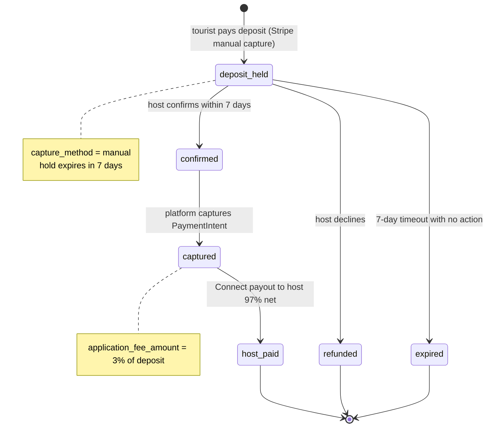
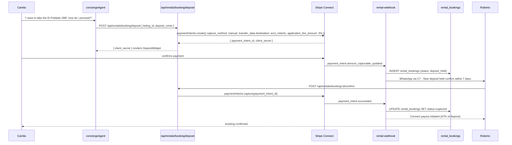

# M10 — Rental Deposit & Booking via Connect

## 0. Quick Read

**What this does in one sentence:** When Camila finds a 2BR in El Poblado and decides to take it, she pays a deposit through MDE AI — the funds are held by Stripe until Roberto (the host) confirms within 7 days, then released to his Connect account, with the platform taking 3% automatically.

**The current gap:** C4 tracks and bills leads. But a lead converting to an actual rental has no payment flow on MDE AI. Camila arranges payment directly with the host (cash, Nequi), MDE AI captures zero commission, and there is no escrow protection for either party.

| Persona | Before | After |
|---------|--------|-------|
| **Camila** (tenant) | Pays deposit via Nequi or cash; no protection if host cancels | Pays via MDE AI; held in escrow until host confirms; full refund if declined |
| **Roberto** (rental host) | Receives cash; no formal booking record | Gets notified → confirms within 7 days → Connect account receives 97% |
| **Patricia** | Zero rental commission revenue | `SELECT SUM(platform_fee_cents) FROM rental_bookings` — rental commission stream |
| **Tourist (general)** | Unsafe off-platform payment | Escrow hold: money protected until confirmed |





---

## 1. Purpose

C4 (metered billing) charges hosts per qualified lead delivered. M10 closes the transaction loop: when a lead converts into an actual rental booking, the money flows through Stripe with escrow protection and automatic commission capture.

The manual capture pattern is essential for rentals: the tenant's card is authorized but not charged immediately. The host has 7 days to confirm the booking (check availability, verify the tenant, review preferences from C8). If the host confirms, Stripe captures the hold and pays out. If the host declines or ignores the request, the hold is released and the tenant is never charged.

**M10 vs C10 (nightlife VIP deposit):** C10 handles a 2-hour confirmation window for event night VIP table holds. M10 handles multi-day rental deposit holds with a 7-day window. Same manual capture pattern, different timelines and commission rates.

## 2. Goals

- `POST /api/rentals/booking/deposit` creates a Stripe PaymentIntent with `capture_method: 'manual'` and Connect destination charge
- `POST /api/rentals/booking/:id/confirm` — host confirms; triggers `paymentIntents.capture`
- `POST /api/rentals/booking/:id/decline` — host declines; triggers `paymentIntents.cancel`
- `rental-webhook` edge function handles `payment_intent.amount_capturable_updated`, `payment_intent.succeeded`, `payment_intent.canceled`
- Auto-release cron: releases uncaptured deposits after 7 days (`paymentIntents.cancel`)
- `rental_bookings` table tracks every deposit with status lifecycle
- `npm run build` exits 0; Vitest floor stays ≥ 401

## 3. Wiring plan

### 3A — Schema

| Layer | File | Action |
|-------|------|--------|
| Migration | `supabase/migrations/YYYYMMDD_rental_bookings.sql` | Create — see §4 |

### 3B — API routes

| Layer | File | Action |
|-------|------|--------|
| Deposit | `src/app/api/rentals/booking/deposit/route.ts` | Create — POST; auth; validate listing; compute 3% fee; create PaymentIntent |
| Confirm | `src/app/api/rentals/booking/[id]/confirm/route.ts` | Create — POST; host auth; verify ownership; capture PaymentIntent |
| Decline | `src/app/api/rentals/booking/[id]/decline/route.ts` | Create — POST; host auth; cancel PaymentIntent; trigger refund |

### 3C — Edge functions

| Layer | File | Action |
|-------|------|--------|
| Webhook | `supabase/functions/rental-webhook/index.ts` | Create — handles PaymentIntent lifecycle events; updates `rental_bookings` status |
| Auto-release | `supabase/functions/rental-deposit-cleanup/index.ts` | Create — scheduled daily; finds `deposit_held` rows past `hold_expires_at`; calls `paymentIntents.cancel` |

### 3D — Tool update

| Layer | File | Action |
|-------|------|--------|
| Checkout tool | `src/mastra/tools/create-checkout.ts` | Modify (C2) — add `product_type: 'rental_deposit'` branch calling `/api/rentals/booking/deposit` |

## 4. Schema

```sql
-- supabase/migrations/YYYYMMDD_rental_bookings.sql

CREATE TABLE public.rental_bookings (
  id                        uuid PRIMARY KEY DEFAULT gen_random_uuid(),
  listing_id                uuid NOT NULL,
  tenant_user_id            uuid REFERENCES auth.users(id),
  host_operator_id          uuid NOT NULL,
  deposit_cents             integer NOT NULL CHECK (deposit_cents > 0),
  platform_fee_cents        integer NOT NULL,
  net_host_cents            integer NOT NULL GENERATED ALWAYS AS (deposit_cents - platform_fee_cents) STORED,
  stripe_payment_intent_id  text UNIQUE NOT NULL,
  status                    text NOT NULL DEFAULT 'deposit_held'
    CHECK (status IN ('deposit_held', 'confirmed', 'captured', 'declined', 'refunded', 'expired')),
  hold_expires_at           timestamptz NOT NULL DEFAULT (now() + INTERVAL '7 days'),
  move_in_date              date,
  notes                     text,
  created_at                timestamptz NOT NULL DEFAULT now(),
  updated_at                timestamptz NOT NULL DEFAULT now()
);
ALTER TABLE public.rental_bookings ENABLE ROW LEVEL SECURITY;
CREATE POLICY "tenant_read_own" ON public.rental_bookings
  FOR SELECT USING (tenant_user_id = (SELECT auth.uid()));
CREATE POLICY "host_read_own" ON public.rental_bookings
  FOR SELECT USING (host_operator_id = (SELECT auth.uid()));
```

## 5. Edge cases

- **7-day hold expiry:** Stripe PaymentIntents with `capture_method: 'manual'` have a 7-day hold. The `rental-deposit-cleanup` cron must run daily and cancel any `deposit_held` bookings where `hold_expires_at < now()`. Set status to `expired`.
- **Host confirmation after expiry:** If a host tries to confirm a booking after the hold expired, the `paymentIntents.capture` call will fail. The API must handle this gracefully: return `410 Gone` with "Booking hold has expired — tenant must re-submit deposit."
- **Duplicate deposits:** Verify no existing `deposit_held` or `confirmed` booking exists for the same `(listing_id, tenant_user_id)` before creating a new PaymentIntent.
- **Currency (COP vs USD):** Colombian landlords price in COP. Use `currency: 'cop'` for the PaymentIntent when the listing price is in COP. Ensure `application_fee_amount` is in the same currency as the PaymentIntent.
- **Fee calculation — integer arithmetic only:** `platform_fee_cents = Math.round(deposit_cents * 0.03)`. Never use floating-point math on money.

## 6. Real-world examples

**Camila** tells the concierge: "I want to take the El Poblado apartment — how do I lock it in?" Concierge calls `create_checkout` with `product_type: 'rental_deposit'`. API creates PaymentIntent: deposit = $1,800 (first month), `application_fee_amount` = $54 (3%), `capture_method: 'manual'`. Camila pays with her Visa. Status: `deposit_held`. Roberto gets notified via WhatsApp. Roberto opens `/business`, sees the deposit, verifies Camila's profile, clicks "Confirm." PaymentIntent captured. Roberto's Connect account receives $1,746. MDE AI retains $54.

## 7. Acceptance criteria

1. `POST /api/rentals/booking/deposit` creates a `manual` capture PaymentIntent with correct `application_fee_amount` (3%).
2. `rental-webhook` sets `rental_bookings.status = 'deposit_held'` on `payment_intent.amount_capturable_updated`.
3. `POST /api/rentals/booking/:id/confirm` captures the PaymentIntent and sets status to `captured`.
4. `POST /api/rentals/booking/:id/decline` cancels the PaymentIntent and sets status to `declined`.
5. `rental-deposit-cleanup` cron cancels and expires `deposit_held` rows older than 7 days.
6. `platform_fee_cents` is calculated as 3% using integer arithmetic only (no floating-point).
7. `npm run build` exits 0; Vitest floor stays ≥ 401.

## 8. Outcomes

| | Before | After |
|---|---|---|
| Rental deposit safety | Off-platform (Nequi/cash), zero protection | Stripe escrow hold; full refund if host declines |
| Platform commission | Zero | 3% of deposit — first recurring rental revenue stream |
| Host payout | Manual; external | Automatic Connect payout on confirmation |
| Booking record | None | `rental_bookings` with full payment audit trail |
