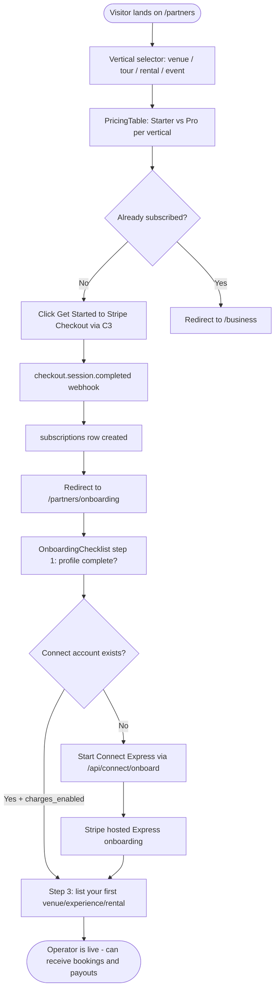
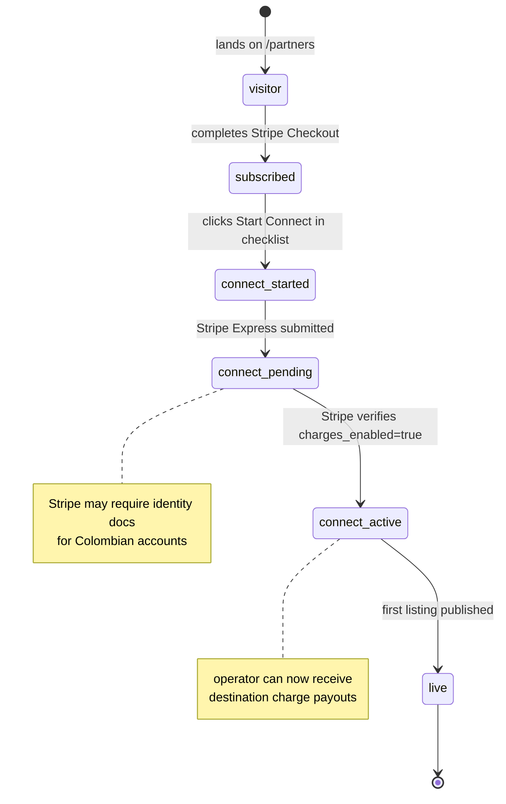

# M11 — /partners Operator Onboarding

## 0. Quick Read

**What this does in one sentence:** Roberto lands on `/partners`, reads what he gets for $299/mo, clicks "Get Started," subscribes, and is guided step-by-step through Connect Express — so his first venue booking payout hits his Colombian bank account within 7 business days.

**Why `/partners` matters:** M1 builds the Connect backend; M4 configures the Stripe Price objects; M2 provides the portal. But none of that matters without a front door. `/partners` is how new operators discover MDE AI, compare plans, and start earning.

| Persona | Before | After |
|---------|--------|-------|
| **Roberto** (new venue host) | Hears about MDE AI → no clear signup path | `/partners` → tier picker → subscribe → Connect onboarding checklist → live in < 15 min |
| **Tour operator** | Unsure what subscription covers | Tier comparison table: Starter (30-day leads) vs Pro (12-month analytics + priority placement) |
| **Patricia** (ops) | Manually guides new operators through setup | Operators self-onboard; Patricia only notified if Connect verification fails |
| **Rental host** | Separate signup flow for different verticals | Vertical selector on `/partners`: venue / tour / rental / event → correct price shown |





---

## 1. Purpose

M1 builds the Connect Express backend. M4 defines the subscription Prices. M2 is the portal for existing operators. M11 is the **acquisition and onboarding funnel** — the page that turns curious business owners into paying, connected operators.

Without `/partners`, the entire revenue stack (M1–M10) has no front door. Roberto has to be manually onboarded by Patricia, which does not scale.

M11 makes onboarding self-serve: a business owner can go from "never heard of MDE AI" to "live on the platform receiving bookings" in under 15 minutes.

## 2. Goals

- `/partners` marketing page with vertical selector and plan comparison (Starter vs Pro per vertical from M4)
- `GET /partners/onboarding` checklist page (post-subscribe): profile → Connect → first listing
- Connect onboarding triggered from the checklist (calls M1 `/api/connect/onboard`)
- `OnboardingChecklist` shows live status: Connect `charges_enabled` badge from `connect_accounts`
- `npm run build` exits 0; Vitest floor stays ≥ 401

## 3. Wiring plan

### 3A — Pages

| Layer | File | Action |
|-------|------|--------|
| Marketing | `src/app/partners/page.tsx` | Create — server component; vertical selector; PricingTable; subscribe CTA |
| Onboarding | `src/app/partners/onboarding/page.tsx` | Create — post-subscribe checklist; reads subscriptions + connect_accounts |

### 3B — Components

| Layer | File | Action |
|-------|------|--------|
| Pricing | `src/components/partners/PricingTable.tsx` | Create — 4 verticals × 2 tiers; highlight recommended; CTA per plan |
| Checklist | `src/components/partners/OnboardingChecklist.tsx` | Create — step tracker: Subscribe ✓ → Connect → First listing |
| Connect CTA | `src/components/partners/ConnectOnboardingButton.tsx` | Create — calls `/api/connect/onboard`; redirects to Stripe hosted flow |
| Vertical selector | `src/components/partners/VerticalSelector.tsx` | Create — tabs: Venue / Tour / Rental / Event → filters PricingTable |

### 3C — Route update

| Layer | File | Action |
|-------|------|--------|
| Middleware | `src/middleware.ts` | Modify — add `/partners/onboarding` to authenticated routes; `/partners` stays public |

## 4. Schema

No new tables. M11 reads from:
- `subscriptions` (C3) — to determine if operator is already subscribed
- `connect_accounts` (M1) — to show `charges_enabled` status in the checklist

Key read:
```sql
-- Checklist status for operator
SELECT
  s.status            AS subscription_status,
  s.plan,
  ca.charges_enabled,
  ca.account_id       AS connect_account_id
FROM public.subscriptions s
LEFT JOIN public.connect_accounts ca ON ca.operator_id = s.operator_id
WHERE s.operator_id = (SELECT auth.uid())
ORDER BY s.created_at DESC
LIMIT 1;
```

## 5. Edge cases

- **Operator already subscribed:** `/partners` detects `subscriptions` row → shows "You're already a partner" with link to `/business` instead of the pricing table.
- **Connect onboarding abandonment:** Operator starts Connect Express but closes the browser. `connect_accounts` row will have `charges_enabled = false`. The checklist shows "Connect setup incomplete — resume." The resume button calls `AccountLinks.create` again with `type: 'account_onboarding'`.
- **Vertical mismatch:** A rental host who accidentally subscribed to the venue plan needs to switch. Route them to Stripe Customer Portal (M4/C3) to update their subscription — don't handle this in M11.
- **Colombia-specific Connect verification:** Stripe may require identity documents for Colombian accounts. The checklist should show a "Verification pending" state with an estimated 1–3 business day timeline. Email Patricia if verification fails.
- **`/partners` is public:** Anyone can browse the pricing page without logging in. The "Get Started" button prompts auth if not logged in (redirect to `/login?next=/partners`).

## 6. Real-world examples

**Roberto** finds MDE AI via a colleague's recommendation. Opens `/partners`, selects "Venue" tab, compares Starter ($99/mo, 3 placements, 30-day analytics) vs Pro ($299/mo, unlimited placements, 12-month analytics, priority in discovery). Clicks "Start with Pro." Completes Stripe Checkout. Lands on `/partners/onboarding`: Step 1 ✓ (subscribed), Step 2 in progress (Connect Express — needs bank account + business ID). Completes Connect in 8 minutes. Step 3: adds first venue. Live.

## 7. Acceptance criteria

1. `/partners` renders vertical selector and PricingTable for all 4 verticals without authentication.
2. "Get Started" for any plan triggers Stripe Checkout for the correct M4 Price object.
3. Post-subscribe redirect lands on `/partners/onboarding` with checklist.
4. Checklist accurately reflects subscription + Connect status from live Supabase data.
5. `ConnectOnboardingButton` calls `/api/connect/onboard` and redirects to Stripe Express URL.
6. Connect `charges_enabled = true` marks step 2 complete in the checklist.
7. `npm run build` exits 0; Vitest floor stays ≥ 401.

## 8. Outcomes

| | Before | After |
|---|---|---|
| Operator acquisition | Manual (Patricia guides each one) | Self-serve; < 15 min from visit to live |
| Plan discovery | None | Full tier comparison with vertical-specific pricing |
| Connect onboarding | Manual setup help | Guided 3-step checklist; resume-on-abandonment |
| Time to first payout | Days (manual setup) | < 15 min onboarding + 2–7 days Stripe verification |
