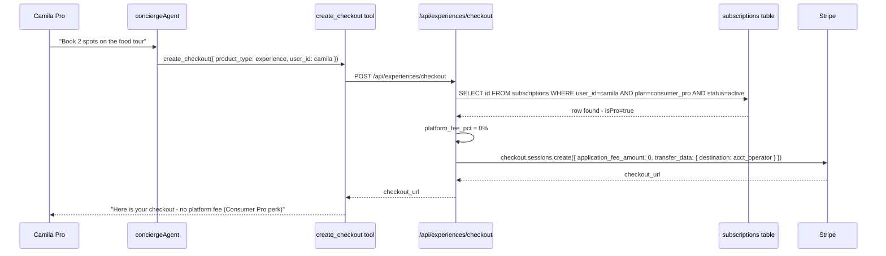

# M12 — Consumer Pro Subscription

## 0. Quick Read

**What this does in one sentence:** Camila upgrades to Consumer Pro for $19/mo and gets richer AI trip plans, zero booking fees on experiences, and priority concierge access — turning MDE AI from a free discovery tool into a daily travel companion she actually pays for.

**The business case:** The operator subscription stack (C3, M4) monetizes B2B. Consumer Pro monetizes B2C — the high-frequency travel planners. Target conversion: 3–5% of MAU at $19/mo. A user who books one experience per month saves more in waived fees than the subscription costs.

| Persona | Before | After |
|---------|--------|-------|
| **Camila** (frequent traveler) | Free tier: 5 AI suggestions/day, basic 1-day itinerary | Pro: unlimited suggestions, 7-day multi-stop itineraries, zero booking fees |
| **Andrés** (ticket buyer) | Pays 5% platform fee on tickets | Consumer Pro: 0% platform fee → saves $3 on a $60 ticket |
| **Patricia** (ops) | B2C revenue = zero | Consumer Pro MRR: `SELECT count(*), sum(plan_amount) FROM subscriptions WHERE plan='consumer_pro'` |
| **Tourist (general)** | Hits rate limits on AI queries | Pro: unlimited concierge turns, priority queue |

```mermaid
flowchart TD
    accTitle: Consumer Pro feature gates
    accDescr: What features unlock at each tier for consumers
    A([User opens app]) --> B{Consumer Pro subscriber?}
    B -->|"No - Free"| C["5 AI suggestions/day"]
    B -->|"No - Free"| D["Basic itinerary: 1-day"]
    B -->|"No - Free"| E[Standard booking fees apply]
    B -->|"No - Free"| F[Standard concierge queue]
    B -->|"Yes - Pro"| G[Unlimited AI suggestions]
    B -->|"Yes - Pro"| H["Extended itinerary: 7-day multi-stop"]
    B -->|"Yes - Pro"| I[Zero platform booking fees]
    B -->|"Yes - Pro"| J[Priority concierge access]
    C & D & E & F --> K{Hits limit?}
    K -->|Yes| L["Upgrade prompt: Consumer Pro $19/mo"]
    L --> N[/me/upgrade Stripe Checkout]
    N --> O[subscription created - pro unlocked]
    G & H & I & J --> P([Pro user experience])
    O --> P
```



---

## 1. Purpose

All previous revenue tasks (C1–C15, M1–M11) monetize operators: subscription fees, lead billing, booking commissions. M12 is the first direct consumer monetization layer.

The target persona is Camila — a traveler who uses MDE AI 2–3× per week to plan outings, find experiences, and book tables. For her, the free tier is useful but limited. Consumer Pro removes friction: no fees, no rate limits, richer AI output.

**Why $19/mo:** Aligns with C3 `consumer_pro` Price. Annual plan ($149/yr) is ~35% off — incentivizes commitment and reduces churn.

**Key implementation note:** The zero-platform-fee perk requires the checkout routes (M3, C10) to check `subscriptions` for the user before computing `application_fee_amount`. This check must be server-side — never trust client-side "I'm a Pro" claims.

## 2. Goals

- Two Stripe Price objects: Consumer Pro monthly ($19) + annual ($149) — reuse C3 `consumer_pro_monthly` Price
- `POST /api/billing/consumer-pro/checkout` creates a subscription Checkout session
- `/me/upgrade` page renders plan comparison (free vs Pro) and initiates checkout
- Checkout routes (M3, C10) check `subscriptions` server-side to waive platform fee for Pro
- `useConsumerPro()` hook returns `{ isPro: boolean }` for UI feature gating
- Pro badge in `/me` profile and chat header
- Free-tier rate limit lifted for Pro users in `conciergeAgent`
- `npm run build` exits 0; Vitest floor stays ≥ 401

## 3. Wiring plan

### 3A — Stripe Products

| Layer | File | Action |
|-------|------|--------|
| Price config | `src/lib/stripe/prices.ts` | Modify — add `CONSUMER_PRO_MONTHLY` + `CONSUMER_PRO_ANNUAL` Price IDs |

### 3B — API routes

| Layer | File | Action |
|-------|------|--------|
| Checkout | `src/app/api/billing/consumer-pro/checkout/route.ts` | Create — POST; create Stripe Checkout session for consumer_pro plan |
| Status | `src/app/api/consumer/pro/status/route.ts` | Create — GET; returns `{ isPro: bool, expiresAt }` from subscriptions table |

### 3C — Checkout fee waiver

| Layer | File | Action |
|-------|------|--------|
| Experience checkout | `src/app/api/experiences/checkout/route.ts` | Modify (M3) — check consumer_pro subscription before setting `application_fee_amount` |
| Ticket checkout | `src/app/api/tickets/checkout/route.ts` | Modify (C2) — same Pro fee waiver check |

### 3D — UI

| Layer | File | Action |
|-------|------|--------|
| Upgrade page | `src/app/me/upgrade/page.tsx` | Create — plan comparison; monthly vs annual selector; CTA |
| Hook | `src/hooks/useConsumerPro.ts` | Create — reads `/api/consumer/pro/status`; returns `{ isPro }` |
| Pro badge | `src/components/ui/ProBadge.tsx` | Create — small badge component; shown in header + profile |

## 4. Schema

No new tables. Reads from existing `subscriptions` (C3) where `plan = 'consumer_pro'`.

Pro check used in every checkout route:

```sql
SELECT id
FROM public.subscriptions
WHERE user_id = (SELECT auth.uid())
  AND plan = 'consumer_pro'
  AND status = 'active'
LIMIT 1;
```

If a row exists: `application_fee_amount = 0`.
If no row: apply standard fee (15–20% for experiences, 5% for tickets).

## 5. Edge cases

- **Pro check must be server-side:** Never set `application_fee_amount = 0` based on a client-passed flag. Always re-verify subscription status from `subscriptions` in the checkout API handler.
- **Grace period on lapsed Pro:** If a Pro subscription is `past_due` (before cancellation), treat as still-Pro for 7 days. Read `subscriptions.status IN ('active', 'past_due')` for the Pro check and record when `past_due` first occurred.
- **Annual plan proration:** If a monthly Pro user upgrades to annual, use Stripe's built-in prorate option. Do not implement custom proration logic.
- **Rate limiting for free tier:** The `conciergeAgent` rate limit for free users is enforced in the agent instructions (or via middleware on `/api/copilotkit`). Pro users bypass this check. Implementation: check `GET /api/consumer/pro/status` → if `isPro`, skip rate limit enforcement.
- **In-chat upgrade prompt:** The concierge can suggest upgrading when a free user hits rate limits. Use `useCopilotAction` with `renderAndWaitForResponse` to render an in-chat upgrade button: "Upgrade to Consumer Pro for $19/mo to continue." The button links to `/me/upgrade`.

## 6. Real-world examples

**Camila** (free tier) has asked 5 questions today and hits the rate limit. Concierge: "You've reached your daily limit. Upgrade to Consumer Pro for $19/mo — unlimited suggestions + zero booking fees." She clicks the in-chat button → `/me/upgrade` → selects annual ($149/yr) → pays → `subscriptions` row created with `plan: 'consumer_pro'`. Tomorrow she books a food tour: no platform fee (saves ~$12 on a $58 booking). Payback on the annual subscription: less than one booking per month.

## 7. Acceptance criteria

1. Stripe Price objects for `consumer_pro_monthly` and `consumer_pro_annual` exist and are referenced in `prices.ts`.
2. `POST /api/billing/consumer-pro/checkout` creates a Stripe Checkout session for the correct Price.
3. `GET /api/consumer/pro/status` returns `{ isPro: true }` for a user with an active `consumer_pro` subscription.
4. Experience checkout route (M3) applies `application_fee_amount = 0` for Pro users; verified by a Vitest unit test mocking the subscriptions table.
5. Upgrade page at `/me/upgrade` renders correctly with plan comparison.
6. `useConsumerPro()` hook returns `{ isPro: false }` for free users.
7. `npm run build` exits 0; Vitest floor stays ≥ 401.

## 8. Outcomes

| | Before | After |
|---|---|---|
| B2C revenue | Zero | Consumer Pro MRR at 3–5% MAU conversion |
| Booking friction for power users | 15–20% fee on every experience | Zero fee for Pro — direct incentive to subscribe |
| AI rate limits | 5 queries/day cap | Unlimited for Pro subscribers |
| Retention (B2C) | Only habit-based | Financial incentive: fee savings exceed subscription cost |
