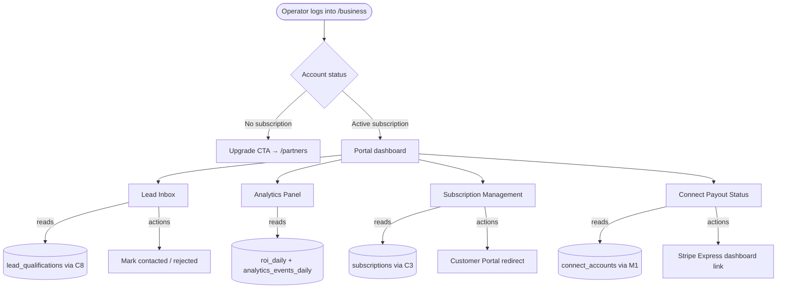
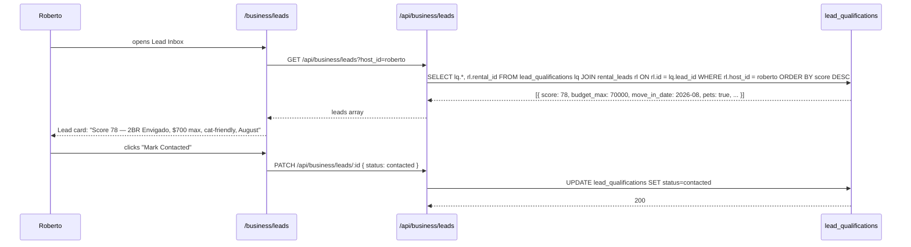

# M2 — /business Portal

## 0. Quick Read

**What this does in one sentence:** Roberto visits `/business`, sees his qualified leads (scored and enriched by C8), checks his venue's 30-day performance, and manages his subscription — all without emailing the team.

**Why this is the retention flywheel:** Every B2B task (C4, C8, M4, M1) generates data that currently lives only in Supabase tables. Without a portal, operators churn — they can't see the value they're paying for. M2 makes the value visible.

| Persona | Before | After |
|---------|--------|-------|
| **Roberto** (venue host) | Subscribes, gets no visibility into leads or performance | Logs into `/business`, sees 3 qualified leads this week + venue click stats |
| **Rental host** | Gets qualified leads (C8) but can't view or action them | Lead inbox: score, preferences, contact info — click to mark contacted |
| **Tour operator** | No insight into how many tourists saw their listing | 30-day impressions, clicks, and booking conversions |
| **Patricia** (ops) | Manages operator relationships via email | Operators self-serve; team notified only for escalations |

---

## 1. Purpose

Every operator-facing task (C4, C8, M1, M4) generates data that sits dormant in Supabase. A rental host has 5 qualified leads scored by `leadAgent` but has no interface to view them. An event organizer's 30-day analytics live in `analytics_events_daily` but require a direct SQL query to read.

M2 surfaces all of this in a single operator portal. It is the primary **retention lever** — an operator who can see their leads, analytics, and payout status churns at a far lower rate than one who subscribes and gets no visibility.

**Why this is later in the queue (order #22):** The portal is only useful if there is data to show. Leads need C8 (`leadAgent`), analytics need existing `roi_daily` tables, subscriptions need C3, payouts need M1. M2 assembles these components into a UI — it does not create them.

**Design notes (CLAUDE.md):** Before building any UI section, read `DESIGN.MD` for color tokens, card anatomy, and skeleton loading patterns. The portal must use oklch color tokens, not hardcoded `gray-*` shades. Every data-loading section needs a skeleton state.

## 2. Goals

- `GET /business` — gated by `requireSubscription` (any active plan) — renders operator dashboard
- Lead Inbox: lists `lead_qualifications` for the operator, sorted by score; shows preferences + contact summary
- Analytics Panel: reads `roi_daily` / `analytics_events_daily` for the operator's listings; 30-day chart
- Subscription section: shows current plan + status; "Manage Plan" → Stripe Customer Portal
- Connect payout section (visible if `connect_accounts` row exists): payout balance + Express dashboard link
- `npm run build` exits 0; Vitest floor stays ≥ 401

## 3. Wiring plan

### 3A — Page and layout

| Layer | File | Action |
|-------|------|--------|
| Page | `src/app/business/page.tsx` | Create — server component; auth + subscription gate; renders sections |
| Layout | `src/app/business/layout.tsx` | Create — sidebar navigation: Leads · Analytics · Subscription · Payouts |
| Auth gate | Middleware | Modify `src/middleware.ts` — add `/business` to authenticated routes |

### 3B — Lead inbox

| Layer | File | Action |
|-------|------|--------|
| API | `src/app/api/business/leads/route.ts` | Create — GET: join `lead_qualifications` + `rental_leads` for operator; PATCH: update status |
| Component | `src/components/business/LeadCard.tsx` | Create — score badge, preferences summary, contact info, action buttons |
| Component | `src/components/business/LeadInbox.tsx` | Create — list of `LeadCard`s with sort/filter by score, status |

### 3C — Analytics panel

| Layer | File | Action |
|-------|------|--------|
| API | `src/app/api/business/analytics/route.ts` | Create — GET: read `roi_daily` or `analytics_events_daily` for operator's listing IDs; last 30 days |
| Component | `src/components/business/AnalyticsPanel.tsx` | Create — line chart (impressions/clicks/bookings over time); needs a charting lib (Recharts/shadcn chart) |

### 3D — Subscription + payout sections

| Layer | File | Action |
|-------|------|--------|
| Component | `src/components/business/SubscriptionSection.tsx` | Create — reads from `useSubscription()` hook (C3); "Manage Plan" button → Customer Portal |
| Component | `src/components/business/PayoutSection.tsx` | Create — reads `connect_accounts` (M1); shows `charges_enabled` badge; Stripe Express link |

## 4. Route and access control

- `/business` — requires any active subscription (free-tier operators redirected to `/partners` upgrade prompt)
- `/business/leads` — Lead Inbox (requires `rental_host` or any subscription with lead delivery)
- `/business/analytics` — Analytics Panel (Starter: 30-day; Pro: 12-month via M4 gate)
- `/business/subscription` — Subscription Management (all subscribed operators)
- `/business/payouts` — Payout Status (only shown if `connect_accounts` row exists)

## 5. Edge cases

- **No leads yet:** Lead Inbox empty state: "No qualified leads yet — your listing will start receiving leads as tourists search in your area." Show a skeleton → empty state, not a blank card.
- **Multiple verticals:** An operator with venue + rental subscriptions sees leads from both. Filter tabs: "Venue leads" / "Rental leads."
- **`roi_daily` table may not exist for all operators:** Use `LEFT JOIN` or null-safe queries. If no data, show empty analytics state with "Analytics will appear after your first listing gets impressions."
- **Stripe Express dashboard URL:** `stripe.accounts.createLoginLink(accountId)` generates a one-time dashboard link. This is an authenticated call — do it server-side in `/api/business/payouts/dashboard-link`, not client-side.
- **Skeleton states:** Every panel must render a skeleton while data loads. Per `DESIGN.MD` rules: use `animate-pulse` with correct oklch surface tokens, not gray shades.

## 6. Real-world examples

**Roberto** logs into `/business`. He sees:
- **Lead Inbox:** "3 new leads this week — top score 82" → clicks into a lead: "2BR El Poblado, $900 max, couple, no pets, move-in August" → clicks "Contact" → status → `contacted`
- **Analytics:** 47 impressions this week, 12 clicks, 2 checkout starts
- **Subscription:** "Venue Pro · $299/mo · renews July 4" → "Manage Plan" opens Customer Portal
- **Payouts:** "Charges enabled ✓ · Last payout: $248.50 on June 1" → "Open Stripe Dashboard"

## 7. Acceptance criteria

1. `GET /business` returns 200 for a subscribed operator and redirects to `/partners` for unsubscribed users.
2. Lead Inbox lists `lead_qualifications` for the operator sorted by score.
3. `PATCH /api/business/leads/:id` updates `lead_qualifications.status`.
4. Analytics Panel renders a 30-day chart from `roi_daily` or `analytics_events_daily`.
5. Subscription section shows correct plan + "Manage Plan" CTA.
6. Every panel has a skeleton loading state.
7. `npm run build` exits 0; Vitest floor stays ≥ 401.

## 8. Outcomes

| | Before | After |
|---|---|---|
| Operator visibility | Zero — blind subscription | Lead inbox + analytics + payout status |
| Lead actioning | None (leads in Supabase only) | Operators mark leads contacted/rejected |
| Churn risk | High (operators see no value) | Sticky: value visible on every login |
| Operator support | Email-based | Self-serve portal; team notified only for escalations |
