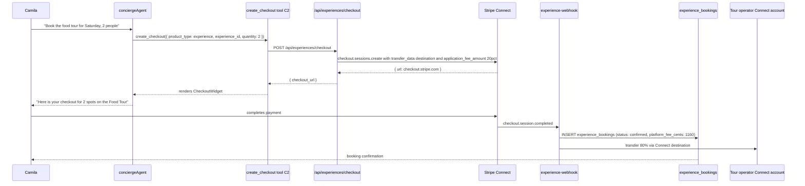
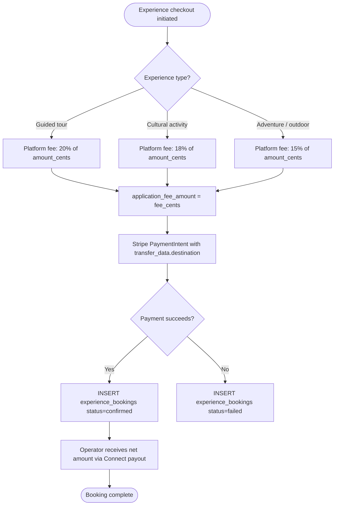

# M3 — Tourism Experience Checkout

## 0. Quick Read

**What this does in one sentence:** When Camila finds a "Medellín street food tour" through the chat concierge and clicks Book, her payment flows through Stripe to MDE AI's platform account, and 82% of it lands in the tour operator's Colombian bank account within 2 business days — with no manual reconciliation.

**The current gap:** MDE AI can discover and recommend experiences. It cannot capture revenue from them. Without M3, every experience booking is a link-out to the operator's own booking page — MDE AI gets zero cut, no data, no retention lever.

| Persona | Before | After |
|---------|--------|-------|
| **Camila** (tourist) | Concierge recommends tour → clicks external link → books somewhere else | Pays directly in chat; receives booking confirmation on MDE AI |
| **Tour operator** | Gets external bookings; no MDE AI integration | New bookings arrive via `experience_bookings`; payout via Connect Express (M1) |
| **Patricia** (ops) | Zero revenue from experience discovery | `SELECT SUM(platform_fee_cents) FROM experience_bookings WHERE created_at > now()-30d` → monthly take |
| **Roberto** (venue/event) | Separate booking systems | Same Connect flow; `experience_bookings` unifies all non-rental bookings |





---

## 1. Purpose

C2 gave the concierge a generic `create_checkout` tool. M3 specializes it for the tourism experience vertical: guided tours, cultural workshops, culinary experiences, adventure activities.

The critical piece is the Connect destination charge: the tourist pays MDE AI's platform account, and Stripe automatically routes 80–85% to the operator's Express account. The platform retains 15–20% as `application_fee_amount`. This is fully automated — no manual transfers, no reconciliation spreadsheets.

**Fee rationale by category:**
- Guided tours: 20% (highest margin; high-volume, standardized)
- Cultural / culinary: 18%
- Adventure / outdoor: 15% (lower due to higher operator costs)

## 2. Goals

- `POST /api/experiences/checkout` creates a Stripe Checkout session with Connect destination charge
- `experience-webhook` edge function handles `checkout.session.completed` and records `experience_bookings`
- `create_checkout` tool (C2) extended with `product_type: 'experience'` routing
- `experience_bookings` table tracks every booking with `platform_fee_cents` recorded
- Booking confirmation available at `GET /api/experiences/bookings/:id` for Camila's receipt
- `npm run build` exits 0; Vitest floor stays ≥ 401

## 3. Wiring plan

### 3A — Schema

| Layer | File | Action |
|-------|------|--------|
| Migration | `supabase/migrations/YYYYMMDD_experience_bookings.sql` | Create — see §4 |

### 3B — API routes

| Layer | File | Action |
|-------|------|--------|
| Checkout | `src/app/api/experiences/checkout/route.ts` | Create — POST; auth; compute fee by type; create Stripe session with destination charge |
| Booking | `src/app/api/experiences/bookings/[id]/route.ts` | Create — GET; user reads own booking (RLS-safe) |

### 3C — Edge function

| Layer | File | Action |
|-------|------|--------|
| Webhook | `supabase/functions/experience-webhook/index.ts` | Create — handles `checkout.session.completed`; verify `STRIPE_CONNECT_WEBHOOK_SECRET`; INSERT experience_bookings |

### 3D — Tool update

| Layer | File | Action |
|-------|------|--------|
| Checkout tool | `src/mastra/tools/create-checkout.ts` | Modify (C2) — add `product_type: 'experience'` branch that calls `/api/experiences/checkout` |

## 4. Schema

```sql
-- supabase/migrations/YYYYMMDD_experience_bookings.sql

CREATE TABLE public.experience_bookings (
  id                          uuid PRIMARY KEY DEFAULT gen_random_uuid(),
  experience_id               uuid NOT NULL,
  user_id                     uuid REFERENCES auth.users(id),
  operator_id                 uuid NOT NULL,
  quantity                    integer NOT NULL DEFAULT 1 CHECK (quantity > 0),
  amount_cents                integer NOT NULL,
  platform_fee_cents          integer NOT NULL,
  net_operator_cents          integer NOT NULL GENERATED ALWAYS AS (amount_cents - platform_fee_cents) STORED,
  stripe_checkout_session_id  text UNIQUE,
  stripe_payment_intent_id    text,
  status                      text NOT NULL DEFAULT 'pending'
    CHECK (status IN ('pending', 'confirmed', 'canceled', 'refunded', 'failed')),
  booked_for_date             date,
  notes                       text,
  created_at                  timestamptz NOT NULL DEFAULT now(),
  updated_at                  timestamptz NOT NULL DEFAULT now()
);
ALTER TABLE public.experience_bookings ENABLE ROW LEVEL SECURITY;
CREATE POLICY "user_read_own" ON public.experience_bookings
  FOR SELECT USING (user_id = (SELECT auth.uid()));
CREATE POLICY "operator_read_own" ON public.experience_bookings
  FOR SELECT USING (operator_id = (SELECT auth.uid()));
```

## 5. Edge cases

- **Operator Connect account not ready:** If `connect_accounts.charges_enabled = false` for the operator, refuse the checkout and return a `400` with `"Operator not accepting payments yet"`. Never let bookings flow to unverified Connect accounts.
- **Refund policy:** Experiences are non-refundable within 24 hours of the scheduled date. Store `booked_for_date` for refund-eligibility checks. Implement `POST /api/experiences/bookings/:id/refund` in M3+ scope.
- **Multi-person bookings:** `quantity` > 1 means `amount_cents` is the per-person price × quantity. Always store the total in `amount_cents` and compute `platform_fee_cents` on the total.
- **Stripe fee pass-through:** Stripe's own processing fee (~2.9% + $0.30) is taken from the operator's payout automatically in destination charge mode. Document this in the `/partners` onboarding materials (M11).
- **Idempotency:** The webhook may fire twice. Check for existing `experience_bookings` row with the same `stripe_checkout_session_id` before inserting.

## 6. Real-world examples

**Camila** asks: "Book 2 spots on the Medellín food tour for this Saturday." Concierge retrieves the experience: $29/person, operator is "Sabor Local Tours." `create_checkout` creates session: amount = $58.00, `application_fee_amount` = $11.60 (20%), `transfer_data.destination` = Sabor Local's Connect account. Camila pays. Webhook fires: `experience_bookings` row inserted (confirmed, `platform_fee_cents` = 1160). Sabor Local receives $46.40 in their Stripe Express dashboard. MDE AI nets $11.60.

## 7. Acceptance criteria

1. `POST /api/experiences/checkout` creates a Stripe session with correct `application_fee_amount` for each experience type.
2. `experience-webhook` inserts `experience_bookings` with `status: confirmed` on `checkout.session.completed`.
3. `platform_fee_cents` and `net_operator_cents` are correctly calculated and stored.
4. Webhook is idempotent: duplicate events for the same `stripe_checkout_session_id` do not create duplicate rows.
5. Checkout fails with 400 if operator `charges_enabled = false`.
6. `GET /api/experiences/bookings/:id` returns 200 only to the booking's `user_id` or `operator_id`.
7. `npm run build` exits 0; Vitest floor stays ≥ 401.

## 8. Outcomes

| | Before | After |
|---|---|---|
| Experience revenue capture | Zero (link-out only) | 15–20% platform fee per booking |
| Operator payout | Manual / external | Automatic Connect destination charge |
| Booking record | None | `experience_bookings` with full audit trail |
| Camila retention | Leaves MDE AI to book | Completes booking in chat; receipt on MDE AI |
