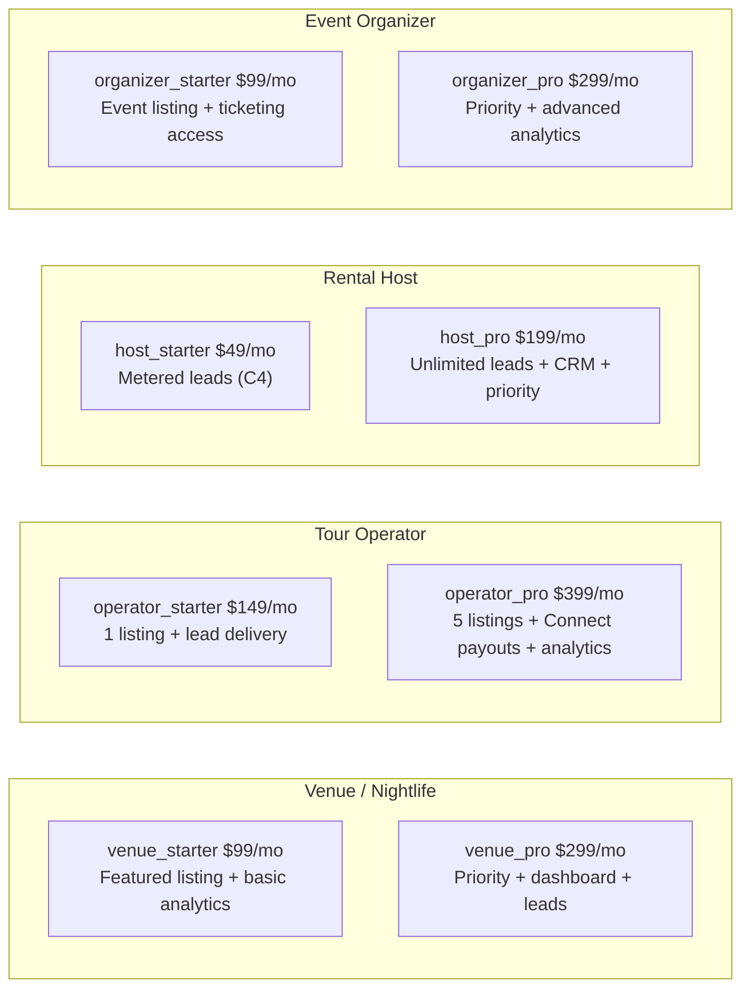
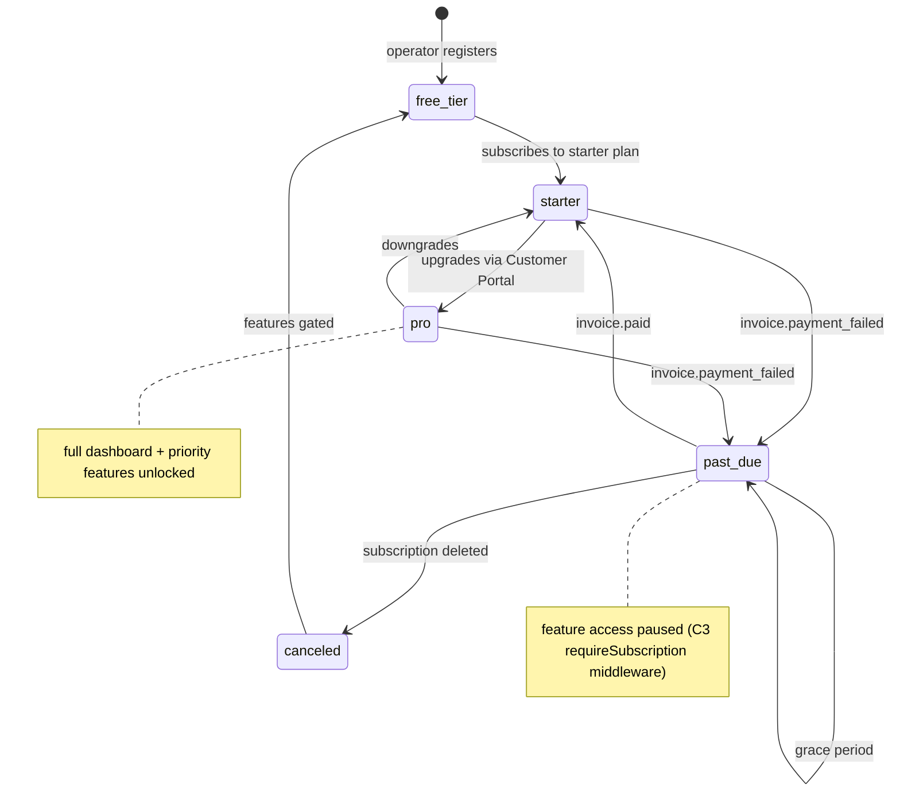

# M4 — Business Subscription Tiers

## 0. Quick Read

**What this does in one sentence:** Roberto can subscribe as a "Venue Pro" for $299/mo and unlock a full business dashboard, priority lead delivery, featured placement, and analytics — making MDE AI a recurring SaaS product for Medellín operators, not just a transaction platform.

**The B2B SaaS layer:** C3 created the billing rails; M4 defines the tier structure and feature gates. Every operator vertical gets a plan with a clear upgrade path. Patricia's MRR query gains a meaningful `vertical` dimension.

| Persona | Before | After |
|---------|--------|-------|
| **Roberto** (venue host) | Subscribed to agency plan (C1) only | Chooses "Venue Pro" → gets business dashboard + analytics + priority |
| **Tour operator** | No platform subscription option | "Operator Starter" gives self-serve lead delivery + 1 featured listing |
| **Rental host** | Platform delivers leads for free (or metered C4) | "Host Pro" gives unlimited leads + CRM dashboard + priority response SLA |
| **Patricia** (ops) | Agency MRR only | Multi-vertical SaaS MRR: `SELECT vertical, plan, count(*) FROM subscriptions` |





---

## 1. Purpose

C3 built Stripe Billing with Products/Prices for agency, restaurant, business, and consumer. M4 fills in the operator verticals that C3 sketched but didn't fully define — particularly the tiers that go with Connect (M1), the business portal (M2), and analytics (M9).

**Why recurring SaaS matters more than transaction fees alone:**
- A restaurant paying $299/mo generates $3,588/yr regardless of transaction volume
- SaaS MRR is 5–7× more fundable than GMV-based revenue
- Feature gates create natural upgrade pressure: a host on Starter hitting their lead cap upgrades to Pro

**mde-stripe rule:** "Don't use the deprecated `plan` object. Use Prices instead." — All M4 prices are created as Stripe Price objects attached to Products.

**mde-stripe rule:** "Billing APIs handle renewal, retry logic, and dunning automatically." — M4 re-uses the C3 `subscription-webhook` — no new webhook needed.

## 2. Goals

- Stripe Products + Prices created for all operator verticals (see §3)
- `subscriptions` table (C1/C3) `vertical` column populated for all new plans
- `useSubscription()` hook (C3) extended to return `tier: 'starter' | 'pro'` per vertical
- `requireSubscription(vertical, tier)` middleware gates features per vertical + tier combination
- `/business` pricing page section (or `/partners`) shows operator plans with upgrade CTAs
- Customer Portal (C3) handles upgrade/downgrade between tiers in the same vertical
- `npm run build` exits 0; Vitest floor stays ≥ 401

## 3. Stripe Products and Prices

| Product | Price ID (env var) | Plan | Amount | Interval |
|---------|-------------------|------|--------|---------|
| `venue` | `STRIPE_PRICE_VENUE_STARTER` | venue_starter | $99 | monthly |
| `venue` | `STRIPE_PRICE_VENUE_PRO` | venue_pro | $299 | monthly |
| `tour_operator` | `STRIPE_PRICE_OPERATOR_STARTER` | operator_starter | $149 | monthly |
| `tour_operator` | `STRIPE_PRICE_OPERATOR_PRO` | operator_pro | $399 | monthly |
| `rental_host` | `STRIPE_PRICE_HOST_STARTER` | host_starter | $49 | monthly |
| `rental_host` | `STRIPE_PRICE_HOST_PRO` | host_pro | $199 | monthly |
| `event_organizer` | `STRIPE_PRICE_ORGANIZER_STARTER` | organizer_starter | $99 | monthly |
| `event_organizer` | `STRIPE_PRICE_ORGANIZER_PRO` | organizer_pro | $299 | monthly |

**Feature access matrix:**

| Feature | Starter | Pro |
|---------|---------|-----|
| Featured listing | 1 placement | 3 placements |
| Lead delivery (C4) | Metered billing | Unlimited |
| Business dashboard (M2) | Read-only | Full |
| Analytics (M9) | 30-day window | 12-month history |
| Connect payouts (M1) | — | Automatic |
| Priority support | — | SLA 4h |

## 4. Wiring plan

### 4A — Stripe objects (dashboard / seed script)

Create Products and Prices per the table in §3. Use `metadata: { vertical, tier }` on each Price for webhook routing.

### 4B — Subscription webhook extension

The `subscription-webhook` (C3) already handles `customer.subscription.created/updated/deleted`. M4 only needs the webhook to correctly populate `subscriptions.vertical` and `subscriptions.plan` from the Price metadata.

```ts
// subscription-webhook: reading vertical + tier from Price metadata
const sub = event.data.object as Stripe.Subscription
const price = sub.items.data[0]?.price
const vertical = price?.metadata?.vertical ?? 'unknown'
const tier = price?.metadata?.tier ?? 'starter'
await serviceClient.from('subscriptions').upsert({
  stripe_subscription_id: sub.id,
  stripe_price_id: price?.id,
  vertical,
  plan: `${vertical}_${tier}`,
  status: sub.status,
  current_period_end: new Date(sub.current_period_end * 1000).toISOString(),
})
```

### 4C — Feature gate middleware

| Layer | File | Action |
|-------|------|--------|
| Middleware | `src/lib/billing/require-subscription.ts` | Modify (C3) — add `vertical` + `tier` params; check `subscriptions` for `vertical AND tier >= required` |
| Hook | `src/hooks/useSubscription.ts` | Modify (C3) — return `{ [vertical]: { plan, tier, status } }` keyed by vertical |

### 4D — UI

| Layer | File | Action |
|-------|------|--------|
| Pricing section | `src/app/partners/page.tsx` | Modify (M1 creates `/partners`) — add operator tier pricing cards |
| Tier card | `src/components/pricing/OperatorTierCard.tsx` | Create — shows features checklist + CTA; calls `create-subscription-session` |

## 5. Edge cases

- **Vertical stacking:** An operator can hold subscriptions in multiple verticals (e.g., a venue + a tour operator). The `subscriptions` table allows multiple rows per `user_id`. `requireSubscription('venue', 'pro')` checks for any active row with `vertical='venue' AND tier='pro'`.
- **Upgrade path:** Pro tier must use the same Stripe Product as Starter — just a different Price. Stripe Customer Portal handles tier changes within the same Product automatically.
- **Free tier:** Operators without any subscription fall through to `free_tier` — they can list but have no priority, no dashboard, and metered lead billing only (C4). This is the default state for all operators.
- **`organizer_starter` vs C1 agency:** An event organizer on `organizer_starter` is different from an agency client on `agency_starter` (C1). They use separate Products and separate feature sets.
- **Proration:** When an operator upgrades mid-month, Stripe prorates automatically. No custom proration logic needed.

## 6. Real-world examples

**Roberto** (venue host) opens `/partners`, sees the Venue tier card. Picks "Venue Pro $299/mo" → Stripe checkout → `subscriptions` row: `vertical: venue, plan: venue_pro, status: active`. He opens his `/business` dashboard (M2) → sees full analytics and lead list. He's on a Pro plan, so the `requireSubscription('venue', 'pro')` gate passes.

**Patricia** runs `SELECT vertical, plan, count(*), sum(plan_price) AS mrr FROM subscriptions WHERE status='active' GROUP BY vertical, plan ORDER BY mrr DESC` — first multi-vertical SaaS MRR snapshot.

## 7. Acceptance criteria

1. Stripe Products exist for all 4 operator verticals with Starter + Pro Prices each.
2. `subscription-webhook` populates `subscriptions.vertical` and `subscriptions.plan` from Price metadata.
3. `useSubscription()` returns `{ venue: { plan: 'venue_pro', status: 'active' } }` for a subscribed operator.
4. `requireSubscription('venue', 'pro')` returns 403 for a `venue_starter` user.
5. Operator tier pricing cards render on `/partners` with correct prices.
6. Customer Portal supports upgrade/downgrade within a vertical.
7. `npm run build` exits 0; Vitest floor stays ≥ 401.

## 8. Outcomes

| | Before | After |
|---|---|---|
| Operator subscription options | Agency only (C1) | 8 plans across 4 operator verticals |
| Feature gating | None | `requireSubscription(vertical, tier)` middleware |
| B2B SaaS MRR | Agency revenue only | Multi-vertical: venue + tour + host + organizer |
| Upgrade path | Manual email | Self-serve via Stripe Customer Portal |
