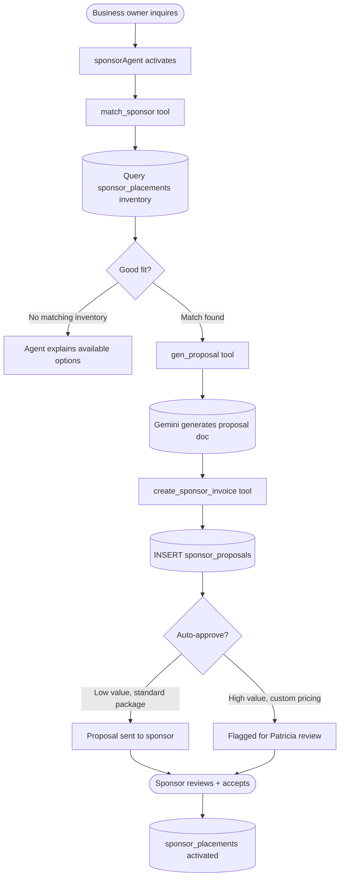
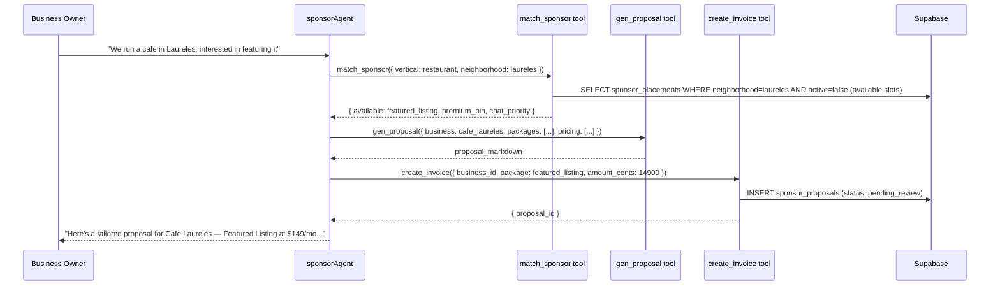

# M5 — Sponsor Agent

## 0. Quick Read

**What this does in one sentence:** When a business contacts MDE AI about advertising, `sponsorAgent` evaluates their fit, generates a placement proposal with pricing, and issues an invoice — all without Patricia needing to touch it.

**The manual process being replaced:** Today a business emails asking about advertising. Patricia manually reviews, responds with pricing, drafts a proposal, and sends an invoice. `sponsorAgent` compresses this to minutes.

| Persona | Before | After |
|---------|--------|-------|
| **Business owner** | Emails team → waits 2 days for a proposal | Talks to agent → gets a tailored proposal with pricing in < 2 min |
| **Patricia** (ops) | Drafts proposals manually for each sponsor inquiry | Reviews auto-generated proposals; approves or edits with one click |
| **Tourist** | Sponsored placements may be stale or mis-targeted | `sponsorAgent` matches sponsors to relevant discovery contexts |





---

## 1. Purpose

C5 built the self-serve checkout for sponsors. But the highest-value sponsors — restaurants with multiple locations, tour operators, hotels — don't self-serve. They reach out through contact forms or WhatsApp and expect a personalized proposal.

`sponsorAgent` handles this consultative sales motion autonomously: it qualifies the fit, checks placement inventory, generates a Gemini-drafted proposal, and issues an invoice — escalating to Patricia only for high-value or non-standard deals.

**Mastra supervisor pattern (verified from docs):** `sponsorAgent` uses sub-tools for each step of the pipeline. Per the Mastra docs, agent-to-agent delegation uses the `agents` property on the supervisor — but for M5's linear pipeline (match → propose → invoice), tool-based chaining is sufficient and simpler.

**mde-supabase rule:** "Service-role key never reaches the browser." The `create_invoice` tool calls an API route; the route holds the service-role key to write `sponsor_proposals`.

## 2. Goals

- `sponsorAgent` defined in `src/mastra/agents/sponsor-agent.ts` and registered in Mastra
- `match_sponsor` tool: queries `sponsor_placements` inventory for available slots matching vertical + neighborhood
- `gen_proposal` tool: calls Gemini to draft a tailored proposal in markdown; returns proposal text
- `create_sponsor_invoice` tool: writes `sponsor_proposals` row to Supabase; flags high-value deals for review
- `sponsor_proposals` table tracks proposal lifecycle (draft → pending_review → approved → accepted → active)
- `sponsorAgent` accessible from the concierge when a user/business shows sponsor interest intent
- `npm run build` exits 0; Vitest floor stays ≥ 401

## 3. Wiring plan

### 3A — Mastra agent + tools

| Layer | File | Action |
|-------|------|--------|
| Agent | `src/mastra/agents/sponsor-agent.ts` | Create |
| Tool | `src/mastra/tools/match-sponsor.ts` | Create |
| Tool | `src/mastra/tools/gen-proposal.ts` | Create — calls Gemini Flash |
| Tool | `src/mastra/tools/create-sponsor-invoice.ts` | Create — calls `/api/sponsor/create-invoice` |
| Agent exports | `src/mastra/agents/index.ts` | Modify — export `sponsorAgent` |
| Mastra registry | `src/mastra/index.ts` | Modify — add `sponsorAgent` |

### 3B — Schema

| Layer | File | Action |
|-------|------|--------|
| Migration | `supabase/migrations/YYYYMMDD_sponsor_proposals.sql` | Create — see §4 |

### 3C — API route

| Layer | File | Action |
|-------|------|--------|
| Route | `src/app/api/sponsor/create-invoice/route.ts` | Create — POST; auth check; writes `sponsor_proposals`; flags for review if `amount_cents > 50000` |

## 4. Schema

```sql
-- supabase/migrations/YYYYMMDD_sponsor_proposals.sql

CREATE TABLE public.sponsor_proposals (
  id             uuid PRIMARY KEY DEFAULT gen_random_uuid(),
  business_name  text NOT NULL,
  vertical       text NOT NULL,
  neighborhood   text,
  package        text NOT NULL,
  amount_cents   integer NOT NULL,
  proposal_text  text,
  status         text NOT NULL DEFAULT 'pending_review'
    CHECK (status IN ('draft', 'pending_review', 'approved', 'accepted', 'declined', 'active')),
  review_flag    boolean NOT NULL DEFAULT false,
  created_by     uuid REFERENCES auth.users(id),
  created_at     timestamptz NOT NULL DEFAULT now(),
  updated_at     timestamptz NOT NULL DEFAULT now()
);
ALTER TABLE public.sponsor_proposals ENABLE ROW LEVEL SECURITY;
CREATE POLICY "service_role_only" ON public.sponsor_proposals USING (false);
-- Patricia reads via admin API route; no user-facing SELECT
```

## 5. Agent definition

```ts
// src/mastra/agents/sponsor-agent.ts
import { Agent } from '@mastra/core/agent'
import { FLASH_MODEL } from '../lib/models'
import { matchSponsorTool } from '../tools/match-sponsor'
import { genProposalTool } from '../tools/gen-proposal'
import { createSponsorInvoiceTool } from '../tools/create-sponsor-invoice'

export const sponsorAgent = new Agent({
  id: 'sponsor-agent',
  name: 'Sponsor Agent',
  model: FLASH_MODEL,
  tools: { match_sponsor: matchSponsorTool, gen_proposal: genProposalTool, create_sponsor_invoice: createSponsorInvoiceTool },
  instructions: `You are the MDE AI Sponsor Agent. Qualify sponsor inquiries and produce a placement proposal + invoice.
Pipeline (always in order):
1. match_sponsor — find available placements for their vertical + neighborhood.
2. gen_proposal — draft a tailored proposal in plain English. Be specific: include the placement type, impressions estimate, and pricing.
3. create_sponsor_invoice — create the invoice row. Deals over $500/mo must be flagged for review.
Rules: Never fabricate pricing not in the match_sponsor result. Never hard-sell. One proposal per conversation turn.`,
})
```

## 6. Edge cases

- **No inventory available:** If `match_sponsor` returns zero available slots, the agent should explain what will be available in the next 30 days (query `ends_at < now() + interval '30 days'`) and offer to put the sponsor on a waitlist.
- **Auto-approve threshold:** Deals ≤ $299/mo and standard packages (`listing`, `featured`) are auto-approved. Deals > $299/mo or `premium` packages set `review_flag = true` — Patricia gets a Supabase notification (or email via edge function trigger).
- **Proposal quality:** `gen_proposal` uses Gemini Flash with `temperature: 0.3` — structured but not robotic. The proposal must include: placement type, expected impressions, duration, price, and a call to action.
- **`sponsor-agent` vs `concierge-agent`:** `sponsorAgent` is a sub-agent. It activates when `conciergeAgent` detects `sponsor_inquiry` intent — same supervisor pattern as `salesAgent` (C6).

## 7. Acceptance criteria

1. `sponsorAgent` appears in Mastra Studio after `npm run dev`.
2. `match_sponsor` tool returns available placement slots for `{ vertical: 'restaurant', neighborhood: 'laureles' }`.
3. `gen_proposal` tool returns non-empty proposal markdown.
4. `create_sponsor_invoice` writes a `sponsor_proposals` row with `status: pending_review`.
5. Proposals with `amount_cents > 50000` have `review_flag = true`.
6. `npm run build` exits 0; Vitest floor stays ≥ 401.

## 8. Outcomes

| | Before | After |
|---|---|---|
| Sponsor proposal time | 2 days (manual) | < 2 min (agent) |
| Proposal volume | Limited by Patricia's bandwidth | Unlimited (agent scales) |
| Review load | Every proposal | Only high-value / custom deals |
| `sponsor_proposals` table | Absent | Active — full lifecycle tracked |
