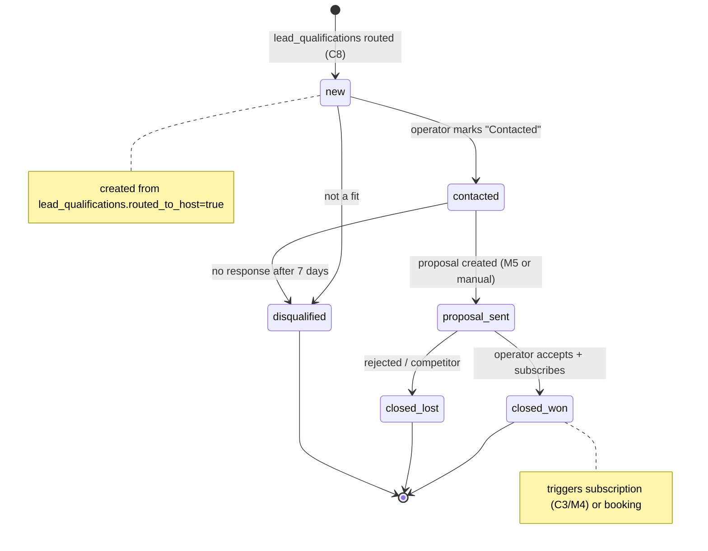
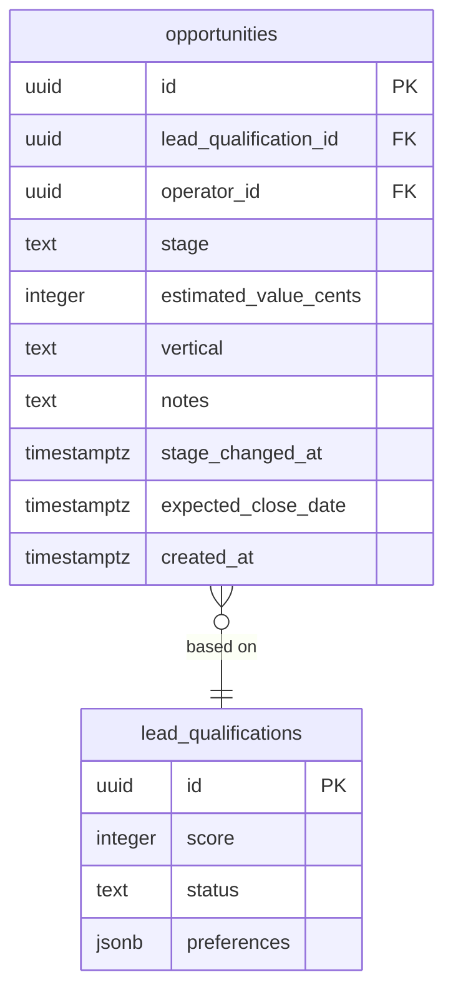

# M6 — `opportunities` CRM Pipeline

## 0. Quick Read

**What this does in one sentence:** Each qualified lead (C8) becomes an `opportunity` that Patricia and the operator can track through stages — New → Contacted → Proposal Sent → Closed Won / Closed Lost — turning a raw lead table into a real sales funnel.

**The gap:** C8's `leadAgent` produces excellent `lead_qualifications` rows, but there's no stage tracking, no owner assignment, no forecast. Without a pipeline, Patricia doesn't know if the team is actively working 20 leads or ignoring them.

| Persona | Before | After |
|---------|--------|-------|
| **Patricia** (ops) | Leads sit in `lead_qualifications` with no visibility | `SELECT stage, count(*) FROM opportunities GROUP BY stage` → conversion funnel |
| **Roberto** (host) | Cannot see pipeline status in `/business` | Sees his opportunity stages + estimated close value |
| **Operator** | Leads show up in inbox (M2); no next-step tracking | Stages: Contacted → Proposal Sent → Closed Won |





---

## 1. Purpose

`leadAgent` (C8) scores and routes leads to operators. But a lead delivered is not a lead closed. Operators need to track which leads they've contacted, which proposals are out, and which deals are won. Patricia needs a conversion funnel to understand pipeline health and forecast MRR.

M6 is intentionally lightweight: a single `opportunities` table with a stage enum and a few key fields. It does not replace a full CRM (Salesforce, HubSpot). It gives the MDE AI team enough signal to know what's working before committing to heavier tooling.

## 2. Goals

- `opportunities` table created with stage enum + linkage to `lead_qualifications` and operator
- `POST /api/crm/opportunities` creates an opportunity from a routed lead
- `PATCH /api/crm/opportunities/:id` updates stage + notes
- `GET /api/crm/pipeline` returns stage counts + estimated pipeline value (Patricia-facing)
- Stage transitions auto-trigger from: `leadAgent` routing (new), M5 proposal creation (proposal_sent)
- `npm run build` exits 0; Vitest floor stays ≥ 401

## 3. Wiring plan

### 3A — Schema

| Layer | File | Action |
|-------|------|--------|
| Migration | `supabase/migrations/YYYYMMDD_opportunities.sql` | Create — see §4 |

### 3B — API routes

| Layer | File | Action |
|-------|------|--------|
| Create | `src/app/api/crm/opportunities/route.ts` | Create — POST; creates opportunity from lead_qualification_id + operator_id |
| Update | `src/app/api/crm/opportunities/[id]/route.ts` | Create — PATCH; updates stage, notes, estimated_value |
| Pipeline | `src/app/api/crm/pipeline/route.ts` | Create — GET; returns `{ stage: count, total_value }` for Patricia's dashboard |

### 3C — Trigger integration

| Layer | File | Action |
|-------|------|--------|
| route_lead tool | `src/mastra/tools/route-lead.ts` | Modify (C8) — after updating `lead_qualifications`, create an opportunity row via `/api/crm/opportunities` |
| create_sponsor_invoice tool | `src/mastra/tools/create-sponsor-invoice.ts` | Modify (M5) — on invoice creation, advance opportunity stage to `proposal_sent` |

## 4. Schema

```sql
-- supabase/migrations/YYYYMMDD_opportunities.sql

CREATE TABLE public.opportunities (
  id                       uuid PRIMARY KEY DEFAULT gen_random_uuid(),
  lead_qualification_id    uuid REFERENCES public.lead_qualifications(id),
  operator_id              uuid NOT NULL,
  stage                    text NOT NULL DEFAULT 'new'
    CHECK (stage IN ('new', 'contacted', 'proposal_sent', 'closed_won', 'closed_lost', 'disqualified')),
  vertical                 text,
  estimated_value_cents    integer,
  notes                    text,
  stage_changed_at         timestamptz NOT NULL DEFAULT now(),
  expected_close_date      date,
  created_at               timestamptz NOT NULL DEFAULT now(),
  updated_at               timestamptz NOT NULL DEFAULT now()
);
ALTER TABLE public.opportunities ENABLE ROW LEVEL SECURITY;
CREATE POLICY "operator_read_own" ON public.opportunities
  FOR SELECT USING (operator_id = (SELECT auth.uid()));
-- Patricia reads via admin API route with service role
```

## 5. Edge cases

- **Duplicate opportunities:** An operator may have multiple leads from the same user (different rentals). Allow multiple `opportunities` per `operator_id` — but flag duplicates in the UI for Patricia to merge.
- **Estimated value calculation:** For rental leads, estimate annual value as `score × avg_rental_commission`. For sponsor leads (M5), use the proposal `amount_cents`. Store the estimate as a nullable integer — don't force a value at creation.
- **Auto-disqualify:** A cron job should set `stage = disqualified` for opportunities stuck in `contacted` for > 14 days with no activity. Add this as a Supabase scheduled function in the migration.
- **Closed won → subscription:** When an operator closes a deal and subscribes (C3/M4), link the `subscriptions` row back to the `opportunities` row. Add `subscription_id uuid` as a nullable FK.

## 6. Real-world examples

**Patricia** opens the admin pipeline view: "14 opportunities — 6 new, 4 contacted, 3 proposal sent, 1 closed won. Total pipeline: $18,200/yr." She clicks into a `contacted` opportunity that's been idle 10 days: "Still no response from Tacos y Tequila — auto-disqualify in 4 days." She adds a note: "Tried WhatsApp, no reply."

## 7. Acceptance criteria

1. `opportunities` table exists with RLS and `operator_read_own` policy.
2. `POST /api/crm/opportunities` creates an opportunity linked to a `lead_qualification_id`.
3. `PATCH /api/crm/opportunities/:id` updates stage and logs `stage_changed_at`.
4. `route_lead` tool (C8) auto-creates an opportunity row on lead routing.
5. `GET /api/crm/pipeline` returns stage counts and total estimated value.
6. `npm run build` exits 0; Vitest floor stays ≥ 401.

## 8. Outcomes

| | Before | After |
|---|---|---|
| Lead → close visibility | None | Full stage funnel |
| Pipeline value estimate | Zero | Estimated annual value per stage |
| Auto-advance | Manual only | `route_lead` + `create_sponsor_invoice` advance stages |
| Conversion reporting | Not possible | `SELECT stage, count(*) FROM opportunities GROUP BY stage` |
