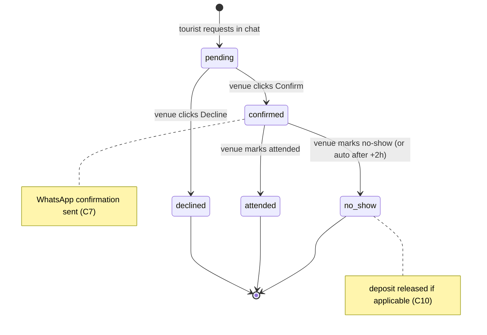
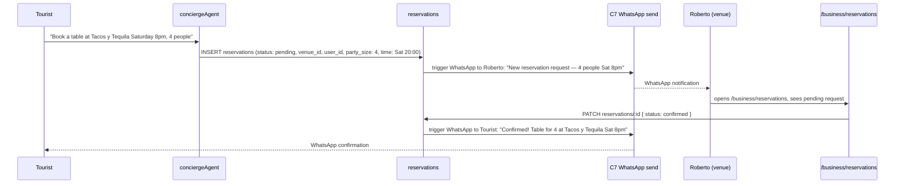

# M7 — Restaurant Reservation Management

## 0. Quick Read

**What this does in one sentence:** Roberto gets a reservation request in his `/business` inbox, clicks "Confirm" or "Decline" — the tourist gets an instant WhatsApp confirmation, and MDE AI captures its commission.

**The current gap:** C10 ships deposit-hold bookings for nightlife VIP. Regular restaurant reservations (no deposit, just a hold) have no management surface. Roberto's `venue_booking_requests` rows pile up with no interface to action them.

| Persona | Before | After |
|---------|--------|-------|
| **Roberto** (venue host) | Receives WhatsApp notification (C7) but has no portal inbox | `/business` Reservations tab: confirm, decline, mark no-show |
| **Tourist** | Makes reservation in chat; no confirmation follows | WhatsApp: "Your table at Tacos y Tequila for Saturday 8pm is confirmed" |
| **Patricia** | No-show rate unknown; no data | `no_show_rate = count(no_show) / count(confirmed)` per venue |





---

## 1. Purpose

C10 handles VIP deposit-hold bookings. M7 handles the much higher-volume regular reservation flow — walk-in tables, dinner reservations, event-night bookings — where no deposit is taken but the venue still needs to confirm.

The confirm loop requires two things working together: the WhatsApp notification (C7 sends the message) and the portal interface (M7 provides the inbox). M7 depends on C7 because without a live WhatsApp send loop, venue notifications go nowhere.

**M7 scope:** The portal inbox + status machine. Notification delivery is C7's responsibility. M7 calls a `notify_venue` utility that C7 implements.

## 2. Goals

- `reservations` table with confirm/decline/no-show status machine
- `POST /api/reservations` creates a reservation from `conciergeAgent` tool call
- `PATCH /api/reservations/:id` updates status (confirm / decline / attended / no_show)
- `/business/reservations` tab in M2 portal lists pending + upcoming reservations
- On confirm: `notify_venue` utility sends WhatsApp confirmation to tourist (C7 dependency)
- Auto no-show: cron job sets `status = no_show` if reservation is `confirmed` and `reservation_time + 2h` has passed without `attended` mark
- `npm run build` exits 0; Vitest floor stays ≥ 401

## 3. Wiring plan

### 3A — Schema

| Layer | File | Action |
|-------|------|--------|
| Migration | `supabase/migrations/YYYYMMDD_reservations.sql` | Create — see §4 |

### 3B — API routes

| Layer | File | Action |
|-------|------|--------|
| Create | `src/app/api/reservations/route.ts` | Create — POST; auth check; INSERT reservations; call notify_venue for WhatsApp to venue |
| Update | `src/app/api/reservations/[id]/route.ts` | Create — PATCH; update status; on confirmed: call notify_venue for tourist confirmation |

### 3C — Mastra tool

| Layer | File | Action |
|-------|------|--------|
| Tool | `src/mastra/tools/create-reservation.ts` | Create — `create_reservation` tool; calls `/api/reservations` |
| Concierge | `src/mastra/agents/concierge.ts` | Modify — add `createReservationTool` to tools map |

### 3D — Portal section

| Layer | File | Action |
|-------|------|--------|
| Section | `src/components/business/ReservationsSection.tsx` | Create — list of pending + upcoming; Confirm/Decline/No-show buttons |

## 4. Schema

```sql
-- supabase/migrations/YYYYMMDD_reservations.sql

CREATE TABLE public.reservations (
  id                uuid PRIMARY KEY DEFAULT gen_random_uuid(),
  venue_id          uuid NOT NULL,
  user_id           uuid REFERENCES auth.users(id),
  party_size        integer NOT NULL CHECK (party_size > 0),
  reservation_time  timestamptz NOT NULL,
  status            text NOT NULL DEFAULT 'pending'
    CHECK (status IN ('pending', 'confirmed', 'declined', 'attended', 'no_show', 'canceled')),
  notes             text,
  venue_response    text,
  created_at        timestamptz NOT NULL DEFAULT now(),
  updated_at        timestamptz NOT NULL DEFAULT now()
);
ALTER TABLE public.reservations ENABLE ROW LEVEL SECURITY;
CREATE POLICY "venue_read_own" ON public.reservations
  FOR SELECT USING (
    EXISTS (SELECT 1 FROM public.connect_accounts ca WHERE ca.operator_id = (SELECT auth.uid()) AND ca.operator_id = venue_id)
  );
CREATE POLICY "user_read_own" ON public.reservations
  FOR SELECT USING (user_id = (SELECT auth.uid()));
```

## 5. Edge cases

- **C7 dependency:** If C7 has not shipped, the WhatsApp notification falls back to email or Supabase push notification. Add a `notification_channel: 'whatsapp' | 'email' | 'none'` flag to `reservations`.
- **No-show auto-mark:** The cron job uses `reservation_time + INTERVAL '2 hours'` as the cutoff. Run as a Supabase scheduled edge function (or `pg_cron`). Auto-mark only if `status = 'confirmed'` — never auto-mark `pending` (venue hasn't confirmed yet).
- **Deposit-hold reservations (C10):** VIP bookings already use `venue_booking_requests`. Regular reservations use the new `reservations` table. Both eventually appear in the venue's `/business` inbox — add a unified view in M2 that queries both tables.
- **Timezone:** `reservation_time` is stored in UTC. The `/business` UI must display in the operator's local timezone (Colombia = UTC-5, no DST).
- **Capacity:** M7 does not enforce venue capacity limits — that is M7+ scope. For now, accept all reservations and let the venue manually manage capacity via the inbox.

## 6. Real-world examples

**Tourist** in chat: "Can you book a table at Tacos y Tequila for Saturday at 8pm, 4 people?" Concierge calls `create_reservation`. Roberto gets a WhatsApp: "New reservation — 4 people, Saturday 8pm. Confirm?" Roberto opens `/business/reservations` → sees the request → clicks "Confirm" → Tourist gets WhatsApp: "Confirmed! See you Saturday at 8pm."

**Patricia** runs `SELECT venue_id, count(*), avg(CASE WHEN status='no_show' THEN 1 ELSE 0 END) AS no_show_rate FROM reservations WHERE created_at > now() - '30d'::interval GROUP BY venue_id`.

## 7. Acceptance criteria

1. `reservations` table exists with RLS (venue + user read own policies).
2. `POST /api/reservations` creates a reservation and notifies the venue.
3. `PATCH /api/reservations/:id` with `{ status: confirmed }` updates status and notifies the tourist.
4. Reservations section in `/business` (M2) shows pending + upcoming with action buttons.
5. Auto no-show cron marks `confirmed` reservations as `no_show` after `reservation_time + 2h`.
6. `npm run build` exits 0; Vitest floor stays ≥ 401.

## 8. Outcomes

| | Before | After |
|---|---|---|
| Reservation management | WhatsApp chaos | Structured inbox in `/business` |
| Tourist confirmation | None | WhatsApp confirmation on venue accept |
| No-show tracking | Unknown | `no_show_rate` queryable per venue |
| Venue reliability signal | None | Confirmation rate visible in analytics (M9) |
