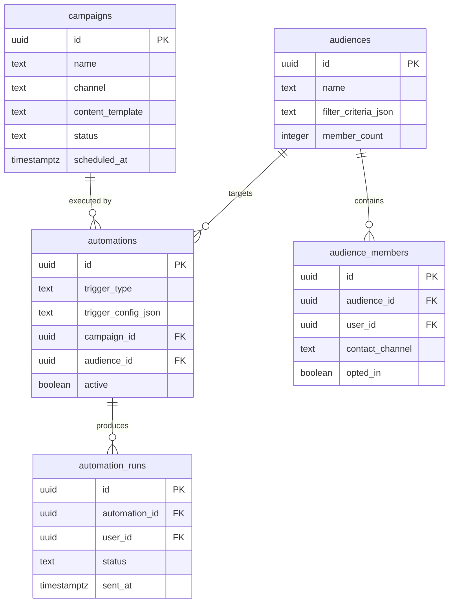
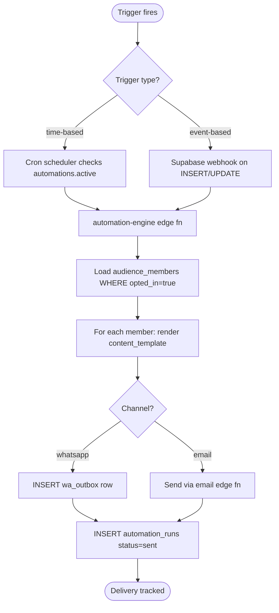

# M8 — Campaigns / Audiences / Automations Engine

## 0. Quick Read

**What this does in one sentence:** Replaces the ad-hoc `wa_outbox` fire-and-forget pattern with a proper marketing automation schema where Roberto defines an audience (VIP event buyers), creates a campaign (jazz night announcement), sets a trigger (48h before event), and the engine executes and tracks delivery.

**Why structure matters:** C7 can send WhatsApp messages. Without M8, every campaign is hand-coded — a specific `wa_outbox` INSERT for a specific scenario. With M8, Patricia configures reusable automations (e.g., "send booking confirmation to all new reservations") once and they fire forever.

| Persona | Before | After |
|---------|--------|-------|
| **Roberto** (host) | Asks team to blast his event — manual one-off | Creates "Jazz Night" campaign in `/business`, picks audience, schedules send |
| **Patricia** (ops) | No visibility into what campaigns are running | `SELECT c.name, c.status, count(ar.id) FROM campaigns c JOIN automation_runs ar ON ar.campaign_id=c.id GROUP BY c.name` |
| **Tourist** | Receives untracked WhatsApp messages | Receives tracked campaigns; unsubscribe honored; `automation_runs` shows delivery |





---

## 1. Purpose

C7 gave the Marketing Agent a WhatsApp send capability. The agent can generate content and insert `wa_outbox` rows. But without a structured data model, every campaign is bespoke — Patricia cannot see what's running, Roberto cannot self-serve a campaign, and there is no audit trail.

M8 defines the tables that turn ad-hoc sends into a repeatable automation engine:
- **Campaigns:** What to send (template, channel, content)
- **Audiences:** Who to send to (a named, filtered group of opted-in users)
- **Automations:** When to trigger (time-based cron or event-based Supabase trigger)
- **Automation runs:** Audit trail of every message sent + delivery status

**mde-supabase rule:** "Reusing utility methods between Edge Functions → add to `supabase/functions/_shared`." The automation runner calls a shared `renderTemplate` function to hydrate content templates with contact data.

## 2. Goals

- Five tables migrated with RLS (see §4 schema)
- `automation-engine` edge function: triggered by cron or Supabase webhook; processes active automations; enqueues messages
- `campaigns` API routes: CRUD for Patricia / Roberto to create campaigns
- `audiences` API routes: create audience with filter criteria; member count auto-updated
- Marketing Agent (C7) updated to use `campaigns` as output rather than direct `wa_outbox` INSERT
- `npm run build` exits 0; Vitest floor stays ≥ 401

## 3. Wiring plan

### 3A — Schema

| Layer | File | Action |
|-------|------|--------|
| Migration | `supabase/migrations/YYYYMMDD_campaigns.sql` | Create — see §4 |

### 3B — Edge function

| Layer | File | Action |
|-------|------|--------|
| Engine | `supabase/functions/automation-engine/index.ts` | Create — polls active time-based automations; renders templates; inserts `wa_outbox` rows; logs `automation_runs` |
| Shared | `supabase/functions/_shared/render-template.ts` | Create — `renderTemplate(template, variables)` substitution engine |

### 3C — API routes

| Layer | File | Action |
|-------|------|--------|
| Campaigns | `src/app/api/marketing/campaigns/route.ts` | Create — GET + POST |
| Audiences | `src/app/api/marketing/audiences/route.ts` | Create — GET + POST; member count from filter |
| Automations | `src/app/api/marketing/automations/route.ts` | Create — GET + POST + PATCH (active toggle) |

### 3D — Marketing Agent update

| Layer | File | Action |
|-------|------|--------|
| Tool | `src/mastra/tools/wa-campaign.ts` | Modify (C7) — instead of direct `wa_outbox` INSERT, create a `campaigns` row + `automations` row with `trigger_type: immediate` |

## 4. Schema

```sql
-- supabase/migrations/YYYYMMDD_campaigns.sql

CREATE TABLE public.campaigns (
  id                uuid PRIMARY KEY DEFAULT gen_random_uuid(),
  operator_id       uuid REFERENCES auth.users(id),
  name              text NOT NULL,
  channel           text NOT NULL CHECK (channel IN ('whatsapp', 'email', 'push')),
  content_template  text NOT NULL,
  status            text NOT NULL DEFAULT 'draft' CHECK (status IN ('draft', 'scheduled', 'sent', 'paused', 'canceled')),
  scheduled_at      timestamptz,
  created_at        timestamptz NOT NULL DEFAULT now()
);
ALTER TABLE public.campaigns ENABLE ROW LEVEL SECURITY;
CREATE POLICY "operator_read_own" ON public.campaigns
  FOR SELECT USING (operator_id = (SELECT auth.uid()));

CREATE TABLE public.audiences (
  id               uuid PRIMARY KEY DEFAULT gen_random_uuid(),
  operator_id      uuid REFERENCES auth.users(id),
  name             text NOT NULL,
  filter_criteria  jsonb NOT NULL DEFAULT '{}',
  member_count     integer NOT NULL DEFAULT 0,
  created_at       timestamptz NOT NULL DEFAULT now()
);
ALTER TABLE public.audiences ENABLE ROW LEVEL SECURITY;
CREATE POLICY "operator_read_own" ON public.audiences
  FOR SELECT USING (operator_id = (SELECT auth.uid()));

CREATE TABLE public.audience_members (
  id               uuid PRIMARY KEY DEFAULT gen_random_uuid(),
  audience_id      uuid NOT NULL REFERENCES public.audiences(id) ON DELETE CASCADE,
  user_id          uuid REFERENCES auth.users(id),
  contact_channel  text,
  opted_in         boolean NOT NULL DEFAULT true,
  created_at       timestamptz NOT NULL DEFAULT now()
);
ALTER TABLE public.audience_members ENABLE ROW LEVEL SECURITY;
CREATE POLICY "audience_operator_read" ON public.audience_members
  FOR SELECT USING (
    EXISTS (SELECT 1 FROM public.audiences a WHERE a.id = audience_id AND a.operator_id = (SELECT auth.uid()))
  );

CREATE TABLE public.automations (
  id                  uuid PRIMARY KEY DEFAULT gen_random_uuid(),
  campaign_id         uuid NOT NULL REFERENCES public.campaigns(id),
  audience_id         uuid NOT NULL REFERENCES public.audiences(id),
  trigger_type        text NOT NULL CHECK (trigger_type IN ('time_based', 'event_based', 'immediate')),
  trigger_config      jsonb NOT NULL DEFAULT '{}',
  active              boolean NOT NULL DEFAULT true,
  created_at          timestamptz NOT NULL DEFAULT now()
);
ALTER TABLE public.automations ENABLE ROW LEVEL SECURITY;
CREATE POLICY "service_role_only" ON public.automations USING (false);

CREATE TABLE public.automation_runs (
  id              uuid PRIMARY KEY DEFAULT gen_random_uuid(),
  automation_id   uuid NOT NULL REFERENCES public.automations(id),
  user_id         uuid REFERENCES auth.users(id),
  status          text NOT NULL CHECK (status IN ('pending', 'sent', 'failed', 'bounced')),
  sent_at         timestamptz,
  error           text,
  created_at      timestamptz NOT NULL DEFAULT now()
);
ALTER TABLE public.automation_runs ENABLE ROW LEVEL SECURITY;
CREATE POLICY "service_role_only" ON public.automation_runs USING (false);
```

## 5. Edge cases

- **Opt-out compliance:** `audience_members.opted_in = false` must be respected in every run. The engine must filter `WHERE opted_in = true` before rendering templates. Never send to opted-out contacts.
- **WhatsApp 24-hour window (CRITICAL):** The engine must check if the target user has sent a message in the last 24 hours before inserting a free-form `wa_outbox` row. Outside the window: only Meta-approved template messages. This is a production-blocking ban risk if violated. See `docs/prd/chatwoot-integration-plan.md` §4.
- **Template variable injection:** The `renderTemplate` function must sanitize variables to prevent injection. Use a simple `{{ variable_name }}` substitution; no eval, no script execution.
- **Idempotency:** The engine cron may fire twice. Check `automation_runs` for existing `(automation_id, user_id)` rows with `status = sent` before re-sending.
- **Event-based triggers:** `trigger_type: event_based` needs a Supabase webhook configured to call the edge function on specific table events (e.g., `INSERT` on `reservations`). Defer event-based triggers to M8+; ship time-based + immediate first.

## 6. Real-world examples

**Roberto** creates a "Jazz Night Announcement" campaign in `/business`: channel = WhatsApp, template = "Hey {{ first_name }}! Jazz night this Friday at [venue] — grab a table: [link]". He picks his audience "VIP buyers" (filtered: `event_purchases > 0 AND last_visit < 30 days`). Sets automation: time-based, fires 48h before event. Engine runs, renders 47 messages, inserts `wa_outbox` rows (only for opted-in, within 24h window), logs 47 `automation_runs`.

## 7. Acceptance criteria

1. Five tables exist with RLS policies.
2. `automation-engine` edge function processes active time-based automations and creates `automation_runs` rows.
3. `audience_members.opted_in = false` prevents message creation.
4. WhatsApp 24-hour window check is enforced before inserting `wa_outbox` rows.
5. `renderTemplate` handles `{{ variable }}` substitution with sanitization.
6. `npm run build` exits 0; Vitest floor stays ≥ 401.

## 8. Outcomes

| | Before | After |
|---|---|---|
| Campaign tracking | None (ad-hoc `wa_outbox` INSERTs) | Full `campaigns` + `automation_runs` audit trail |
| Audience management | None | Named audiences with filter criteria + member counts |
| WhatsApp compliance | Unguarded | 24-hour window enforced in engine |
| Marketing Agent output | Direct `wa_outbox` INSERT | Structured campaign row → engine executes |
