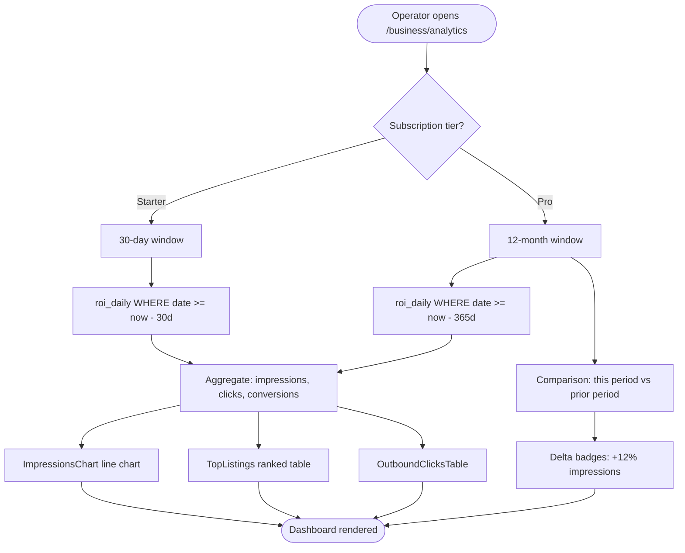
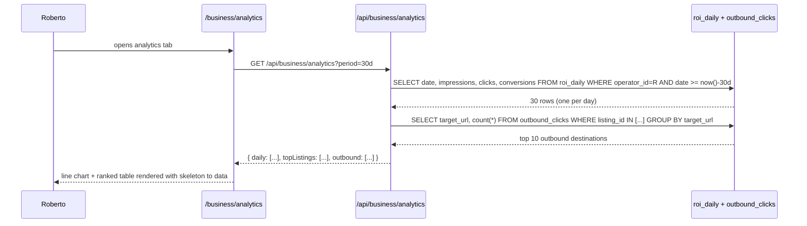

# M9 — Organizer & Venue Analytics Dashboards

## 0. Quick Read

**What this does in one sentence:** Roberto opens `/business/analytics`, sees exactly how many tourists viewed his venue, clicked through, and bought tickets — broken down by day and compared to last month — so he knows whether his $299/mo Pro plan is paying off.

**Why this matters now:** M2 ships a 30-day line chart. M9 makes that chart useful: ranked listings, outbound click tracking, period comparison, and a Pro gate for 12-month history. Without this, Roberto subscribes blind.

| Persona | Before | After |
|---------|--------|-------|
| **Roberto** (venue host) | Sees a generic impressions line in M2 | Ranked breakdown: "Jazz Night got 48 clicks, 12 event page opens, 3 ticket purchases" |
| **Tour operator** | Subscribed; zero analytics | "Medellín food tour: 91 impressions this week, 6 outbound clicks, 2 bookings" |
| **Patricia** (ops) | Cannot see which operators are underperforming | Cross-operator ROI table: sort by `roi_daily.conversion_rate` descending |
| **Roberto (Pro)** | 30-day window only | 12-month trend: "Q1 vs Q2 — 40% more impressions after listing upgrade" |





---

## 1. Purpose

M2 ships the analytics panel as one section of the business portal — a 30-day line chart of impressions and clicks. That is the minimum. M9 turns it into a real ROI dashboard operators use to justify their subscription.

The three data sources are already written by earlier tasks:
- `roi_daily` — daily rollup: impressions, clicks, conversions per listing
- `analytics_events_daily` — event-specific: page views, ticket click-throughs, capacity fill rate
- `outbound_clicks` — every time a tourist clicks from MDE AI to an external booking URL

M9 wires these into a period-selectable dashboard with tier gating (Pro unlocks 12-month history).

## 2. Goals

- `/business/analytics` renders a full analytics dashboard with period selector (7d / 30d / 90d / 12mo[Pro])
- `ImpressionsChart` line chart from `roi_daily` — impressions + clicks + conversions
- `TopListings` table — ranked by impressions; sortable by clicks, conversion rate
- `OutboundClicksTable` — which external URLs tourists clicked through to
- Pro-only: period comparison (this period vs prior) with delta badges
- `GET /api/business/analytics/export` — CSV export (Pro only)
- `npm run build` exits 0; Vitest floor stays ≥ 401

## 3. Wiring plan

### 3A — API routes

| Layer | File | Action |
|-------|------|--------|
| Analytics | `src/app/api/business/analytics/route.ts` | Modify (M2 creates stub) — add period param + tier gate; aggregate roi_daily + outbound_clicks |
| Export | `src/app/api/business/analytics/export/route.ts` | Create — GET; Pro tier check; return CSV of raw roi_daily for date range |

### 3B — Components

| Layer | File | Action |
|-------|------|--------|
| Dashboard | `src/components/business/AnalyticsDashboard.tsx` | Create — period selector + all chart sub-components |
| Chart | `src/components/business/ImpressionsChart.tsx` | Create — Recharts LineChart; impressions / clicks / conversions |
| Table | `src/components/business/TopListings.tsx` | Create — sortable table; columns: listing name, impressions, clicks, CTR, conversions |
| Table | `src/components/business/OutboundClicksTable.tsx` | Create — destination URL + click count |
| Pro gate | `src/components/business/ProGate.tsx` | Create — blurs Pro-only sections with "Upgrade to Pro" CTA for Starter operators |

### 3C — Page update

| Layer | File | Action |
|-------|------|--------|
| Page | `src/app/business/analytics/page.tsx` | Create — replaces inline analytics section from M2; renders AnalyticsDashboard |

## 4. Schema

M9 reads from existing tables — no new migrations. The `roi_daily`, `analytics_events_daily`, and `outbound_clicks` tables are assumed to exist from earlier F-series event analytics tasks.

Key queries:

```sql
-- Impressions + clicks + conversions per day (30-day window)
SELECT
  date,
  SUM(impressions) AS impressions,
  SUM(clicks)      AS clicks,
  SUM(conversions) AS conversions
FROM public.roi_daily
WHERE operator_id = $1
  AND date >= CURRENT_DATE - INTERVAL '30 days'
GROUP BY date
ORDER BY date ASC;

-- Top listings by impressions
SELECT
  listing_id,
  SUM(impressions)                                                                AS total_impressions,
  SUM(clicks)                                                                     AS total_clicks,
  ROUND(SUM(clicks)::numeric / NULLIF(SUM(impressions), 0), 4)                  AS ctr
FROM public.roi_daily
WHERE operator_id = $1
  AND date >= CURRENT_DATE - INTERVAL '30 days'
GROUP BY listing_id
ORDER BY total_impressions DESC
LIMIT 10;

-- Outbound click destinations
SELECT
  target_url,
  COUNT(*) AS click_count
FROM public.outbound_clicks
WHERE listing_id = ANY($1::uuid[])
  AND clicked_at >= NOW() - INTERVAL '30 days'
GROUP BY target_url
ORDER BY click_count DESC
LIMIT 10;
```

## 5. Edge cases

- **Missing `roi_daily` data:** Many operators will have no `roi_daily` rows if their listings have never been viewed. Show empty state: "Analytics will appear once your listing receives its first impression." Never error on empty — use `COALESCE(SUM(...), 0)`.
- **Pro gate on 12-month data:** The API must enforce the tier check server-side — not just hide the UI. A Starter operator querying `?period=365d` should receive a 403. The client Pro gate is UX-only; the server is the real guard.
- **CSV export rate limiting:** `GET /api/business/analytics/export` should add a `429` rate limit of 5 requests per hour per operator. Large date ranges can produce thousands of rows.
- **DESIGN.MD compliance:** Charts must use oklch color tokens for line colors — not hardcoded Tailwind `blue-500`. Skeleton loading required for every chart while data fetches. See DESIGN.MD for the `animate-pulse` pattern.
- **Event analytics vs venue analytics:** `analytics_events_daily` tracks per-event metrics; `roi_daily` tracks per-listing. Both appear in the same dashboard — use tabs or a dropdown to switch between "Listing analytics" and "Event analytics."

## 6. Real-world examples

**Roberto (Venue Pro):** Opens analytics for "Tacos y Tequila." Sees: impressions this month 847, clicks 112, 14 ticket purchases. Top outbound: "tacos-y-tequila.com/reservations" (67 clicks). Period comparison vs last month: +23% impressions, +8% clicks. Conversion rate 1.65% — lower than venue average. Roberto upgrades the listing photos.

**Patricia (admin):** Runs the cross-operator export to find which venues have >500 impressions but <1% CTR — those need listing-quality intervention.

## 7. Acceptance criteria

1. `/business/analytics` renders ImpressionsChart, TopListings, and OutboundClicksTable from live `roi_daily` data.
2. 7d / 30d / 90d period selectors change the data fetched from the API.
3. 12-month period is visible but gated behind Pro (Starter sees upgrade CTA; API returns 403 if bypassed).
4. `GET /api/business/analytics/export` returns a CSV for Pro operators.
5. Empty state rendered when no `roi_daily` rows exist for the operator.
6. All panels render a skeleton state during data loading.
7. `npm run build` exits 0; Vitest floor stays ≥ 401.

## 8. Outcomes

| | Before | After |
|---|---|---|
| Analytics depth | Single M2 line chart | Full dashboard: ranked listings, outbound clicks, period comparison |
| Tier value signal | Invisible | Pro operators see 12-month trend; clear ROI for $299/mo |
| Export | None | CSV export for Pro operators |
| Retention lever | Weak | Operators log in to check their numbers weekly |
