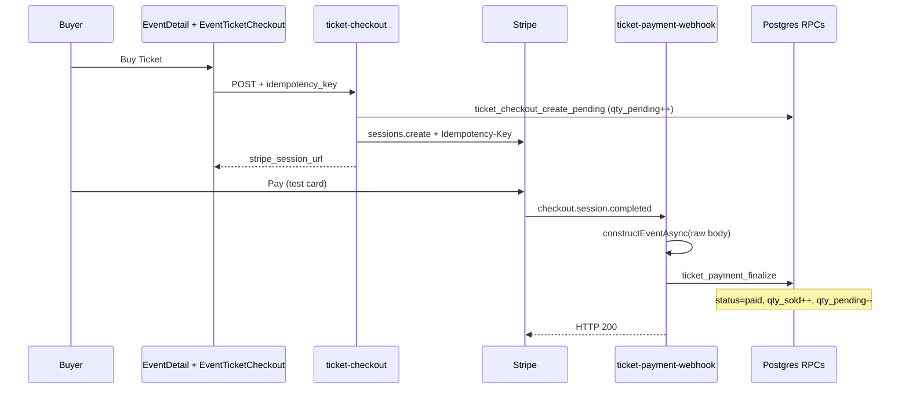

# Stripe Proof 001 — Reference Guide

**Status:** Complete for **test-mode MVP** ticket payments (merged `f404ff2` on `main`)  
**Date range:** 2026-05-18  
**Branch:** `fix/mvp-proof-001-stripe-ticket-purchase` · [PR #41](https://github.com/amo-tech-ai/mdeai/pull/41)  
**Supabase project:** `zkwcbyxiwklihegjhuql`

This doc answers three questions:

1. What did Proof 001 prove?
2. What broke, and how was it fixed?
3. If we built Stripe ticket checkout again, what is the correct order?

**Related task files:** `001` → `006` → `011` → `012` → `013` → `014` in this folder.

---

## What Proof 001 proved

**User journey:**

```
/events/:id → Buy Ticket → Stripe Checkout → webhook → event_orders.status = paid
```

**Evidence (test mode):**

| Proof | Order ID | Session | PaymentIntent | Result |
|-------|----------|---------|---------------|--------|
| Stuck order (recovered) | `7faf36d8-260f-4057-88e5-9e9a5ea69cbc` | `cs_test_a1VopRJs…` | `pi_3TYVwBFAkFMiToA10uWEkF3g` | Recovered via replay after ops fix |
| Fresh preview payment | `5a85a638-b410-4276-b9c3-dc8cbda60d8a` | `cs_test_a1rh4iR7…` | `pi_3TYWxEFAkFMiToA10gtrTkEh` | Auto-finalized (~47s) |
| Production smoke | `c164ba66-7e51-4ba4-be34-690180248d1c` | `cs_test_a1n8dba2…` | `pi_3TYXWMFAkFMiToA12BbZeFpV` | Auto-finalized; Playwright 4/4 |

**Verdict:** Test-mode checkout + webhook path is **operationally proven**. Real-money launch still needs live Stripe account readiness and follow-ups in `014-proof-001-follow-up-tasks.md`.

---

## Architecture (correct state after Proof 001)



**Key design choices that worked:**

| Layer | Pattern |
|-------|---------|
| Frontend | `EventTicketCheckout` sends UUID `idempotency_key`, buyer/attendee data, success/cancel URLs |
| Checkout edge | `verify_jwt=false` (anon buyers); Zod validate; reserve inventory in DB **before** Stripe call |
| Stripe | Checkout Sessions (not Payment Element) — hosted UI, PCI scope minimal |
| Webhook edge | `verify_jwt=false`; **raw body** signature verify; `checkout.session.completed` as primary fulfillment event |
| DB | `ticket_payment_finalize` RPC — atomic order + attendees + inventory in one transaction |
| Idempotency | App table + Stripe `Idempotency-Key` on session create + `stripe_evt_*` on webhook replay |

---

## Problems encountered (and fixes)

### Code problems (fixed in PR #41)

| # | Problem | Symptom | Fix |
|---|---------|---------|-----|
| 1 | Webhook only handled `payment_intent.succeeded` | Dashboard sends `checkout.session.completed` → order stays `pending` | Add handlers for `checkout.session.completed`, `checkout.session.async_payment_succeeded`, `checkout.session.expired` |
| 2 | No expired-session handler | Abandoned checkout leaves `qty_pending` stuck | On `checkout.session.expired` → `ticket_checkout_cancel` RPC |
| 3 | No Stripe idempotency key on session create | Double-click / retry could create duplicate sessions | `sessions.create(..., { idempotencyKey: body.idempotency_key })` |
| 4 | Stripe API version drift | Pinned `2024-06-20` vs skill `2026-04-22.dahlia` | Align both edge functions to `2026-04-22.dahlia` |
| 5 | `verify:edge` failed | Deno 2.7 type error on `crypto.subtle.verify` | Pass `new Uint8Array(sigBytes)` in `_shared/jwt.ts` |
| 6 | Playwright skipped Buy Ticket on prod | False green smoke | Remove `isProduction` waiver in `events-buyer-032-034.spec.ts` |
| 7 | Buy Ticket UI not wired on prod | No CTA visible | Wire `EventTicketCheckout` in `EventDetail.tsx` when V2 tiers exist |

### Ops problem (the big one — stuck payment)

| | |
|---|---|
| **Symptom** | Payment succeeded in Stripe; buyer redirected to `/me/tickets?checkout=success`; DB order stayed `pending` |
| **Root cause** | **No Stripe test-mode webhook endpoint registered.** Event had `pending_webhooks: 0` — Stripe never POSTed to Supabase |
| **Confusion** | Live mode **did** have endpoint `we_1TTbsU…` with 5 events; test mode had **zero** endpoints. Configuring webhooks in Dashboard for "live" does not help preview/test Checkout |
| **Fix** | Create test endpoint `we_1TYW8MFAkFMiToA1lx5q9CEJ` → same Supabase URL, 5 events; sync `STRIPE_WEBHOOK_SECRET` on Supabase to match endpoint signing secret |
| **Transient** | First Stripe resend returned **400 BAD_SIGNATURE** because Supabase secret was stale; fixed with `supabase secrets set` |

**Ruled out:** Edge handler bugs (manual replay + Stripe resend both returned 200 and finalized order), wrong Supabase project, missing RPC.

### Remaining gaps (not blockers for test-mode MVP)

| Gap | Status |
|-----|--------|
| 13 stale `pending` orders / elevated `qty_pending` | Needs cleanup PR (see `014`) |
| Ticket RPCs lack explicit `SET search_path` | Security hardening migration |
| Webhook event idempotency written **after** handler (race window) | Low severity — RPC is state-idempotent |
| No webhook failure alerts | Ops/monitoring follow-up |
| Local `.env.local` webhook secret may be stale | Update from Dashboard "Reveal" for replay scripts |
| Real-money live charges/payouts | Stripe account verification before live keys |

---

## If we did it again — correct implementation order

Follow this sequence. **Do not skip ops steps** — the #1 production failure was missing test webhook endpoint, not bad code.

### Phase 0 — Prerequisites (before any code)

1. **Read skills:** `mde-stripe`, `mde-supabase`, `mde-worktree-pr-flow`, `testing`
2. **Confirm schema exists:** `event_orders`, `event_tickets`, `event_attendees`, `idempotency_keys` with RLS
3. **Confirm RPCs exist:** `ticket_checkout_create_pending`, `ticket_payment_finalize`, `ticket_checkout_cancel`, `ticket_payment_refund`
4. **Clean worktree:** branch from `origin/main`, one PR, allowed files only (see `001-stripe-ticket-purchase-proof.md` §3)
5. **Stripe Dashboard — BOTH modes:**
   - Test endpoint → `https://<project>.supabase.co/functions/v1/ticket-payment-webhook`
   - Live endpoint → same URL (separate `whsec_*`)
   - Subscribe **5 events:** `checkout.session.completed`, `checkout.session.expired`, `checkout.session.async_payment_succeeded`, `payment_intent.succeeded`, `charge.refunded`
6. **Supabase secrets:** `STRIPE_SECRET_KEY`, `STRIPE_WEBHOOK_SECRET` (ticket-only; separate from sponsor)

### Phase 1 — Backend spine (edge + DB behavior)

| Step | Task | File(s) | Verify |
|------|------|---------|--------|
| 1.1 | Pin Stripe API version | `ticket-checkout/index.ts`, `ticket-payment-webhook/index.ts` | `grep apiVersion` |
| 1.2 | Checkout: validate body (Zod), call `ticket_checkout_create_pending`, create Session with metadata `{ order_id }` | `ticket-checkout/index.ts` | `scripts/evt069-stripe-smoke.sh` step 1 → HTTP 200 + `cs_test_` |
| 1.3 | Pass Stripe idempotency key on session create | `ticket-checkout/index.ts` | Deno smoke asserts `idempotencyKey` |
| 1.4 | Webhook: `req.text()` → `constructEventAsync` → branch on event type | `ticket-payment-webhook/index.ts` | Deno smoke |
| 1.5 | Primary fulfillment: `checkout.session.completed` (+ async variant) → `ticket_payment_finalize` | same | Deliver test event |
| 1.6 | Expired cleanup: `checkout.session.expired` → `ticket_checkout_cancel` | same | Expire a test session; SQL `qty_pending` drops |
| 1.7 | Keep `payment_intent.succeeded` as idempotent fallback (optional) | same | Replay → 200, no duplicate paid rows |
| 1.8 | Webhook idempotency: check/store `stripe_${event.id}` | same | Replay same event → `{ replayed: true }` |
| 1.9 | `verify_jwt=false` in `supabase/config.toml` for checkout + webhook | `config.toml` | `src/lib/ticket-edge-verify-jwt.test.ts` |
| 1.10 | Deploy both functions | CLI | `supabase functions list` shows ACTIVE |

**Gate:** `npm run verify:edge` exit 0 · `deno test supabase/functions/tests/ticket_stripe_smoke_test.ts` all pass

### Phase 2 — Frontend buyer UI

| Step | Task | File(s) | Verify |
|------|------|---------|--------|
| 2.1 | Load ticket tiers for event | `useEventTicketTiers.ts` | Unit test |
| 2.2 | Render Buy Ticket when tiers exist | `EventDetail.tsx` | Playwright sees CTA |
| 2.3 | Collect buyer + attendees; generate UUID idempotency key | `EventTicketCheckout.tsx` | Network tab shows key in POST body |
| 2.4 | Redirect to `stripe_session_url`; success URL → `/me/tickets?checkout=success` | same | Browser completes flow |
| 2.5 | Wallet + QR pages | `MyTickets.tsx`, `TicketDetail.tsx` | QR renders after paid |

**Gate:** Playwright `events-buyer-032-034.spec.ts` @ `:8080` — 4/4, **no prod waiver**

### Phase 3 — Ops proof (mandatory before "done")

| Step | Action | Success criteria |
|------|--------|------------------|
| 3.1 | `stripe webhook_endpoints list` — confirm **test** endpoint exists with 5 events | Non-empty `data[]` for test mode |
| 3.2 | Confirm Supabase `STRIPE_WEBHOOK_SECRET` matches test endpoint signing secret | Stripe resend → edge HTTP **200** (not 400) |
| 3.3 | Vercel preview: complete one test purchase | SQL `status = paid`, PI non-null, duplicate PI count = 1 |
| 3.4 | Stripe Dashboard: delivery attempt shows 2xx | Not manual replay only |
| 3.5 | Merge to main | CI green |
| 3.6 | Production smoke on `www.mdeai.co` | Same SQL proof + Playwright |

**Do not declare complete** until step 3.3 uses a **fresh payment after** webhook endpoint exists — replaying a stuck order proves recovery, not normal flow.

### Phase 4 — Hardening (separate PRs, post-MVP)

From `014-proof-001-follow-up-tasks.md`:

1. **P1** — Reconcile stale pending orders / `qty_pending`
2. **P1** — Verify live Stripe `charges_enabled` + `payouts_enabled`
3. **P2** — RPC `SET search_path` migration
4. **P2** — Webhook failure monitoring / alerts
5. **P2** — Atomic idempotency claims (checkout + webhook)
6. **P3** — Local `.env.local` secret parity for replay scripts
7. **P3** — Align live webhook endpoint API version

---

## Verification commands (copy-paste)

### Local / CI

```bash
npm run typecheck
npm run verify:edge
npm run test -- --run src/hooks/useEventTicketTiers.test.ts src/lib/event-ticket-storage.test.ts src/lib/ticket-edge-verify-jwt.test.ts
cd supabase/functions && deno test --allow-read tests/ticket_stripe_smoke_test.ts
PLAYWRIGHT_BASE_URL=http://127.0.0.1:8080 npx playwright test tests/smoke/events-buyer-032-034.spec.ts --config playwright.smoke.config.ts
```

### Stripe ops

```bash
# Endpoint inventory (test + live)
stripe webhook_endpoints list --limit 20 \
  | jq -r '.data[] | [.id, .livemode, .status, .url, (.enabled_events|join(","))] | @tsv'
stripe webhook_endpoints list --live --limit 20 \
  | jq -r '.data[] | [.id, .livemode, .status, .url, (.enabled_events|join(","))] | @tsv'

# Checkout smoke (creates pending order + session URL)
bash scripts/evt069-stripe-smoke.sh

# Recover stuck event (incident only — not closure proof)
python3 scripts/evt069-deliver-webhook.py <evt_id>
# or: stripe events resend <evt_id> --webhook-endpoint <we_id>
```

### SQL proof (after payment)

```sql
select id, status, stripe_session_id, stripe_payment_intent, created_at, paid_at
from public.event_orders
where id = '<order_id>';

select count(*) as duplicate_pi
from public.event_orders
where stripe_payment_intent = '<payment_intent_id>';

select id, qty_total, qty_sold, qty_pending
from public.event_tickets
where id = '<ticket_id>';

select status, count(*)
from public.event_attendees
where order_id = '<order_id>'
group by status;
```

**Expected:** `status = paid`, `paid_at` set, duplicate PI = 1, attendees `active`, inventory counters correct.

---

## Files touched in successful Proof 001

| Area | Files |
|------|-------|
| Frontend | `src/pages/EventDetail.tsx`, `src/components/events/EventTicketCheckout.tsx` |
| Edge | `supabase/functions/ticket-checkout/index.ts`, `supabase/functions/ticket-payment-webhook/index.ts`, `_shared/jwt.ts` |
| Config | `supabase/config.toml` (`verify_jwt=false`) |
| Tests | `ticket_stripe_smoke_test.ts`, `events-buyer-032-034.spec.ts`, `ticket-edge-verify-jwt.test.ts` |
| Scripts | `scripts/evt069-stripe-smoke.sh` |

**Out of scope (do not mix in):** Maps, Mastra, scanner PWA, sponsor checkout, rental leads, broad migrations.

---

## Stripe webhook checklist (test + live)

Register **both** endpoints pointing at:

```
https://zkwcbyxiwklihegjhuql.supabase.co/functions/v1/ticket-payment-webhook
```

| Event | Purpose |
|-------|---------|
| `checkout.session.completed` | **Primary** fulfillment for card payments |
| `checkout.session.async_payment_succeeded` | Delayed payment methods |
| `checkout.session.expired` | Release `qty_pending` on abandon |
| `payment_intent.succeeded` | Legacy/idempotent fallback |
| `charge.refunded` | Refund path |

**Secrets:** One `STRIPE_WEBHOOK_SECRET` per endpoint in Supabase. Do **not** reuse sponsor `whsec`. Sync local `.env.local` only for replay scripts — never commit.

---

## Scores at completion (from audit 012)

| Dimension | Score | Notes |
|-----------|------:|-------|
| Architecture | 84 | Checkout → pending → webhook → RPC is correct |
| Operational maturity | 68 | Fixed endpoint gap; no automated drift check yet |
| Production readiness (test mode) | 92 | Preview + prod test payments auto-finalized |
| Real-money launch | 72 | Needs live account + pending cleanup |

---

## Lessons (read before next Stripe work)

1. **Test and live webhooks are separate.** Empty `stripe webhook_endpoints list` in test mode = every test payment stays `pending` forever.
2. **Fulfill on `checkout.session.completed`, not only `payment_intent.succeeded`.** Stripe Checkout docs treat session events as the fulfillment trigger.
3. **Raw body before JSON.** `await req.text()` then `constructEventAsync` — parsed JSON breaks HMAC.
4. **Prove normal flow, not just replay.** Manual `evt069-deliver-webhook.py` fixes incidents; fresh payment after ops setup is closure proof.
5. **Secret mismatch = 400, silent to buyer.** Buyer sees success URL; order stays pending until secret sync or replay.
6. **One worktree, one PR.** Proof 001 started from hundreds of dirty files — shipped from isolated worktree `mde-proof-001`.
7. **Playwright must assert Buy Ticket.** Waiving prod checks hid missing UI.

---

## Quick reference — task doc index

| File | Purpose |
|------|---------|
| `001-stripe-ticket-purchase-proof.md` | Original scope, forbidden files, success criteria |
| `006-proof-001-fix-plan.md` | Blocker → fix matrix, implementation tasks P1-1..P1-8 |
| `011-proof-001-webhook-debug.md` | Stuck payment incident timeline and root cause |
| `012-stripe-webhook-production-hardening.md` | Full audit, risk matrix, merge/production gates |
| `013-stripe-mermaid-diagrams.md` | Architecture diagrams (broken vs fixed vs best practice) |
| `014-proof-001-follow-up-tasks.md` | Post-MVP hardening backlog |

**Merge commit on `main`:** `f404ff2` — `fix(events): complete proof 001 ticket purchase gate`
