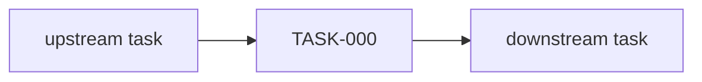

# TASK-000 — Title

## At a glance

| | |
|---|---|
| **For** | Persona |
| **Surface** | Route |
| **Track** | Discovery Beta |

## Dependency graph

## DoD (every row = command + expected)

| # | Acceptance | Verify command | Expected |
|---|------------|----------------|----------|
| 1 | … | `cd mdeapp && npm test -- --run path.test.ts` | exit 0 |
| 2 | Prod persona journey | `npm run verify:task -- TASK-000 --base https://www.mdeai.co` | exit 0 |

## Integration surface

| Surface | This task |
|---------|-----------|
| CopilotKit in-process | Yes / No |
| Mastra tool key | must match `useCopilotAction` name |

## Anti-fake-done

- [ ] Re-probed disk — not status field alone
- [ ] Evidence file written
- [ ] `tasks.md` row updated

**Playbook:** [`tasks/notes/improve.md`](../notes/improve.md)
