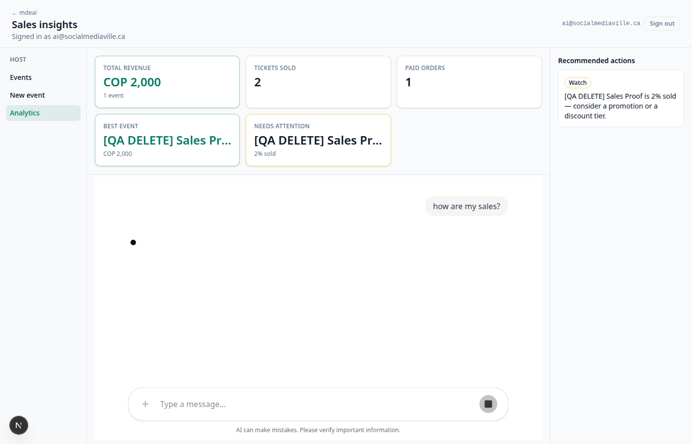

# SAN-729 · AIE-008 — Host analytics P1 initial KPI load

**Task:** [SAN-729 · AIE-008 — Host Analytics Page + HostOpsCopilotBridge](https://linear.app/sanjiovani/issue/SAN-729/aie-008-host-analytics-page-hostopscopilotbridge)  
**Run:** 2026-06-17 · localhost `:3001`  
**Re-run:** 2026-06-18 · pre-merge proof after review fixes (`d0b0c271` + key remount)  
**Branch:** `ai/san-729-host-analytics-p1`  
**Verdict:** 🟢 PASS — signed-out redirect, signed-in analytics shell, KPI grid after load + chat prompt

---

## Commands run

```bash
npm test -- --run load-host-dashboard host-analytics dashboard-result
# 29 passed (3 files)

curl -sI http://localhost:3001/host/analytics | grep -iE 'HTTP|location'
# HTTP/1.1 307 → location: /login?next=/host/analytics

infisical run --silent --env=dev --path=/ -- \
  env PW_SKIP_WEBSERVER=1 npx playwright test e2e/san-896-ck-v2-evidence.spec.ts \
  -g "host/analytics" --project=chromium
# 1 passed (30.9s) — 2026-06-18 pre-merge re-run
```

`npm run lint` — ⚠️ 4 warnings in unrelated `scripts/linear-rentals-*.mjs` (pre-existing on main; not in PR scope).  
`npm run typecheck` — ⚠️ stale `.next/dev/types` broker routes + unrelated e2e files on disk; **changed src files have no new TS errors**.

---

## Browser proof

| Check | Persona | Result |
|-------|---------|--------|
| Signed out `/host/analytics` | Roberto | 🟢 `307` → `/login?next=/host/analytics` |
| Signed in shell | Roberto (`ai@socialmediaville.ca`) | 🟢 `host-analytics` + `host-ops-chat-region` visible |
| KPI on load or empty + chips | Roberto | 🟢 KPI grid **or** `host-kpi-empty` + `host-analytics-prompt-chips` (poll) |
| Chat prompt → sales | Roberto | 🟢 `Sales loaded ✓` or `host-kpi-grid` after "how are my sales?" |
| Screenshot | Lucía | `SAN-729-host-analytics-p1.png` |

---

## What shipped (P1)

- Server `loadHostDashboardInitial()` — RLS-scoped SQL → KPI cards on first paint (no Gemini)
- `initialDashboard` → `HostOpsCopilotBridge`
- Prompt chips when no KPI cards (`host-analytics-prompt-chips`)
- Right aside onboarding copy (`host-analytics-aside-empty`)
- Deterministic contract unchanged — numbers from `computeSalesInsights` / tool lift only

---

## Known gaps (out of scope)

- KPI card click → event detail in right panel
- Host-scoped `threadId` for chat memory
- Shared host chrome with rentals shell
- Prod Tier-1 re-smoke after merge (optional)

---

## Screenshot


