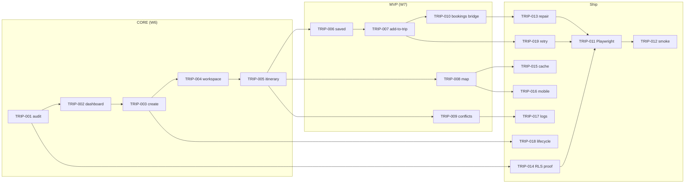

# 1. Executive summary

## What it is

The **Trips Management System** is Camila's persistent planning layer across mdeai — one place to hold a Medellín move, a nightlife weekend, or Andrés's ticketed event run. A **trip** is a user-owned container (`trips`) with a **timeline** (`trip_items` grouped by `start_at`), **shortlists** (`saved_places` + `collections`), and **confirmed commerce** (`event_orders`, `showings`, `bookings`) mirrored into the itinerary when paid or scheduled.

```text
Chat / cards (CopilotKit)
  → Mastra tools (orchestrate, never own truth)
  → Supabase (trips, trip_items, saves, orders)
  → Workspace UI (/trips, /trips/[id], /saved)
  → Maps (pins; routes deferred)
```

## Why it matters

| Persona | Trip job | Without trips |
|---------|----------|---------------|
| **Camila** | "Move to Laureles" — rentals + viewings + restaurants on one timeline | Every chat turn forgets the move context |
| **Andrés** | Ticket for salsa Friday lands on the same weekend plan | Wallet exists but plan is fragmented |
| **Tourist** | Saved Comuna 13 + dinner spots before committing | Hearts scattered across sessions |
| **Roberto** | Host sees demand indirectly; trips don't block host MVP | N/A for W3–W4 |

Trips are **retention**, not a separate product. Revenue still flows through events (Stripe) and rentals (leads → showings). Trips make those purchases **stick**.

## Forensic verdict

| Lens | Score | Reading |
|------|------:|---------|
| **Schema readiness** | 78/100 | `trips`, `trip_items`, `saved_places`, `collections`, `conflict_resolutions`, `budget_tracking` exist with RLS ✅ |
| **App readiness** | 45/100 | `/trips` + `/trips/[id]` shells exist; no create flow, `/saved`, add-to-trip, trip-scoped chat, or real map |
| **Agent readiness** | 25/100 | No `tripAgent` / `add_to_trip` tools; concierge is global-only |
| **Overbuild risk** | High if unchecked | Wireframes include Calendar, Media, Chats, Ideas, `/bookings` inbox — **defer** most tabs |

**Rule:** Ship **CORE + MVP** on existing tables. Do **not** add `trip_days`, `timeline_events`, `collection_items`, or `itinerary_suggestions` for Phase 1.

---

# 2. Core user stories

| # | Story | Acceptance (MVP) |
|---|-------|------------------|
| US-1 | Camila creates **"Move to Laureles"** with dates + budget | `trips` row; optional `budget_tracking` row |
| US-2 | Camila saves apartments / events / restaurants | `saved_places` + optional `collections` |
| US-3 | Camila adds ticket + viewing to itinerary | `trip_items` with `item_type` + `source_id` + `start_at` |
| US-4 | Camila sees **conflicts** (Fri 9pm overlap) | Client `detectScheduleOverlaps` + optional `conflict_resolutions` persist |
| US-5 | Camila opens **map pins** for scheduled items | Pins for items with lat/lng (Google Map in MVP-2; list MVP-1) |
| US-6 | User returns and continues **trip-scoped chat** | `mastra_threads.metadata.trip_id` or active trip in CopilotKit context |
| US-7 | Andrés buys ticket → item appears on trip | Webhook/finalize writes `trip_items` when `trip_id` known |
| US-8 | User A cannot see User B's trips | RLS + Playwright isolation test |

---

# 3. Required screens

Wireframe sources: [`wireframes/`](./wireframes/) · Screen specs: `012-scr-*`, `013-scr-*`, `014-scr-*`.

| Route / surface | Wireframe | Screen ID | Phase | Status on disk |
|-----------------|-----------|-----------|-------|----------------|
| `/trips` Trips Dashboard | [012-wire-trips-dashboard](./wireframes/012-wire-trips-dashboard.md) | SCREEN-012 | CORE | Shell ✅ — missing create modal, status groups |
| Create trip modal | same | — | CORE | ❌ |
| `/trips/[id]` Trip Workspace | [012-wire-trip-workspace](./wireframes/012-wire-trip-workspace.md) | SCREEN-013 | CORE | Shell ✅ — tabs stub Ideas/Bookings |
| Itinerary tab | [013-wire-itinerary-planner](./wireframes/013-wire-itinerary-planner.md) | SCREEN-013 | CORE | ✅ day groups + conflict banner |
| Map tab | workspace wire | SCREEN-013 | MVP | List pins ✅ — Google Map MAP-008+ |
| Ideas tab | workspace wire | — | POST-MVP | Stub only |
| Bookings tab (trip-scoped) | workspace wire | — | MVP | Stub — reads `event_orders` + `showings` |
| `/saved` Saved collections | [014-wire-saved-collections](./wireframes/014-wire-saved-collections.md) | SCREEN-011 | MVP | ❌ no route |
| Add to trip modal | — | — | MVP | ❌ |
| Conflict resolution UI | itinerary wire | — | MVP | Detect ✅ — resolve via chat/HITL ❌ |
| Booking checkout modal | [010-wire-booking-checkout](./wireframes/010-wire-booking-checkout.md) | SCREEN-008/009 | Events/rentals | Exists elsewhere — link `trip_id` |
| `/bookings` inbox | [010-wire-bookings-inbox](./wireframes/010-wire-bookings-inbox.md) | — | **ADVANCED** | Frozen Phase 5+ |
| Onboarding wizard | [023-wire-onboarding-wizard](./wireframes/023-wire-onboarding-wizard.md) | F30 | POST-MVP | Defer |
| Explore unified | [016-wire-explore-unified](./wireframes/016-wire-explore-unified.md) | — | POST-MVP | Defer |

### Mobile

- Dashboard: stacked cards, FAB **+ New trip**
- Workspace: **chat OR workspace** toggle (not 3-panel Mindtrip desktop split on phone)
- Itinerary: full-screen tab; map via bottom sheet after MAP ships

### Empty states (required copy)

| Surface | CTA |
|---------|-----|
| `/trips` (no rows) | "Start from chat" + "Blank trip" |
| `/trips/[id]` itinerary | "Save rentals or events from chat" |
| `/saved` | "Heart a listing or event in chat" |

---

# 4. Feature matrix

| Feature | CORE | MVP | POST-MVP | ADVANCED |
|---------|:----:|:---:|:--------:|:--------:|
| User-owned `trips` CRUD | ✅ | | | |
| `/trips` dashboard list | ✅ | | | |
| Create trip modal | ✅ | | | |
| `/trips/[id]` workspace shell | ✅ | | | |
| Day-grouped itinerary (`start_at`) | ✅ | | | |
| Client-side overlap detection | ✅ | | | |
| `/saved` collections page | | ✅ | | |
| Save heart → `saved_places` | | ✅ | | |
| Add to trip from rental/event card | | ✅ | | |
| Trip map pins (Google Map) | | ✅ | | |
| Persist conflicts → `conflict_resolutions` | | ✅ | | |
| Ticket checkout → `trip_items` | | ✅ | | |
| Viewing schedule → `trip_items` | | ✅ | | |
| Trip-scoped CopilotKit chat | | ✅ | | |
| Bookings tab (trip-scoped) | | ✅ | | |
| Budget bar (`budget_tracking`) | | | ✅ | |
| Ideas tab (shortlist promote) | | | ✅ | |
| Drag reorder itinerary | | | ✅ | |
| AI optimize itinerary | | | ✅ | |
| Travel time / routes (ADK) | | | ✅ | |
| Calendar / Media / Chats tabs | | | | ✅ |
| `/bookings` global inbox | | | | ✅ |
| WhatsApp trip reminders | | | | ✅ |
| OpenClaw enrichment drafts | | | | ✅ |
| Group trips / invite | | | | ✅ |
| Email receipt parse → booking row | | | | ✅ |

---

# 5. Supabase data requirements

Live audit: [`../data/audit-supabase.md`](../data/audit-supabase.md) §4 · Project `zkwcbyxiwklihegjhuql`.

## 5.1 Table inventory (MVP — use as-is)

| Table | Rows (live) | Purpose | MVP action |
|-------|------------:|---------|------------|
| `trips` | 2 | Trip container | **Use** — no migration |
| `trip_items` | 4 | Polymorphic timeline | **Use** — extend `item_type` enum in app only |
| `saved_places` | 0 | Hearts / collection members | **Use** |
| `collections` | 0 | Named lists | **Use** |
| `conflict_resolutions` | 0 | Stored conflict state | **Use** when user resolves |
| `budget_tracking` | 0 | Spent vs budget | POST-MVP UI |
| `bookings` | 0 | Generic booking row (`trip_id` FK ✅) | MVP read-only tab |
| `event_orders` | 35 | Ticket truth | Mirror to `trip_items` on confirm |
| `showings` | 0 | Viewing truth | Mirror via data-021 bridge |
| `leads` | 11 | Viewing request | Source for showing → trip item |

## 5.2 Column notes

### `trips`

| Column | Required | Notes |
|--------|----------|-------|
| `user_id` | ✅ | Ownership root |
| `title`, `start_date`, `end_date`, `status` | ✅ | Dashboard cards |
| `destination`, `budget`, `currency` | Optional | Create modal |
| `deleted_at` | ✅ | Soft delete / archive |

**RLS:** SELECT/INSERT/UPDATE/DELETE own rows only ✅  
**Indexes:** `idx_trips_user_id`, `idx_trips_start_date`, `idx_trips_status` ✅  
**Realtime:** Not required MVP  
**Triggers:** None required  

### `trip_items`

| Column | Required | Notes |
|--------|----------|-------|
| `trip_id`, `item_type`, `source_id`, `title` | ✅ | Polymorphic link |
| `start_at`, `end_at` | Schedule | Group by day in app |
| `latitude`, `longitude`, `location_name`, `address` | Map | Hydrate from source entity on insert |
| `metadata` | Status, ticket QR ref, showing state | No `status` column in DB — use metadata |
| `created_by` | Audit | Optional |

**RLS:** CRUD via parent trip ownership ✅  
**Indexes:** `idx_trip_items_trip`, `unique_trip_item (trip_id, item_type, source_id)`, `idx_trip_items_dates` ✅  
**Gap:** No FK on `source_id` per type — **app validates** entity exists before insert  
**Missing index (P2):** `(trip_id, start_at)` covering — add in data task if query slow  

### `saved_places`

| Column | Notes |
|--------|-------|
| `location_type`, `location_id` | Polymorphic: `apartment`, `event`, `restaurant`, `poi` |
| `collection_id`, `trip_id` | Optional scoping |
| `tags`, `notes`, `priority` | Ideas tab later |

**RLS:** Own rows ✅ (+ service_role ALL — edge only)

### `collections`

Share token + public read for future share links. MVP: private only.

### `conflict_resolutions`

Use when overlap persists beyond client detect — store `affected_items` JSON, `resolution_options`, HITL pick.

### `mastra_threads`

**No `trip_id` column.** MVP: `metadata->>'trip_id'` (uuid string). POST-MVP: optional migration if query volume warrants.

## 5.3 Tables to **NOT** create (MVP)

| Proposed | Verdict | Substitute |
|----------|---------|------------|
| `trip_days` | ❌ Defer | Group by `start_at` date in `itinerary-logic.ts` |
| `timeline_events` | ❌ Never | `trip_items` only |
| `collection_items` | ❌ Defer | `saved_places.collection_id` |
| `itinerary_suggestions` | ❌ POST-MVP | Gemini draft in thread; user approves → insert |
| `trip_bookings` | ❌ Defer | `bookings.trip_id` + `event_orders` |

## 5.4 Recommended data tasks (`tasks/data/tasks-data/`)

| ID | Title | Priority |
|----|-------|----------|
| **data-026** | Trips schema inventory + golden queries | P0 |
| **data-027** | `trip_items` insert RPC with ownership check + entity validation | P1 |
| **data-029** | `event_orders`/`leads`/`showings` trip_id FKs | P1 |
| **data-028** | `event_orders` / `showings` → `trip_items` sync | P1 |
| **data-030** | Trips golden queries pack | P1 |
| **data-031** | `idx_trip_items_trip_start_at` | P2 |
| **data-032** | `mastra_threads.metadata.trip_id` index | P2 |

*Do not execute migrations until TRIP-001 evidence file exists.*

---

# 6. Data model rules

## 6.1 Polymorphic `trip_items`

| `item_type` | `source_id` points to | Schedule source |
|-------------|----------------------|-----------------|
| `rental` | `apartments.id` | Viewing from `showings` |
| `event` | `events.id` | `event_orders.event_date` + tier time |
| `restaurant` | `restaurants.id` | User-set or reservation |
| `poi` / `attraction` | `tourist_destinations.id` | User-set |
| `booking` | `bookings.id` | `start_date` + `start_time` |
| `showing` | `showings.id` | `scheduled_at` |
| `custom_note` | `trip_items.id` (self) or null UUID | User-set |

App type union today: `event | restaurant | rental | poi | other` — extend to `showing | booking | custom_note` in `trip-item-types.ts`.

## 6.2 Ownership

```text
auth.uid() = trips.user_id
  → trip_items.* via trip_id policy
  → conflict_resolutions.* via trip_id
  → budget_tracking.* via trip_id
  → saved_places.user_id direct
```

## 6.3 Idempotency

`unique_trip_item (trip_id, item_type, source_id)` prevents duplicate adds from double-click or webhook retry.

## 6.4 Truth hierarchy

| Claim | Source of truth |
|-------|-----------------|
| Ticket paid? | `event_orders.status` |
| Viewing confirmed? | `showings.status` |
| Item on calendar? | `trip_items` (derived/mirrored) |
| AI suggestion? | Ephemeral until user approves insert |

Gemini **must not** invent places, prices, ticket status, or booking state.

---

# 7. Mastra agents and workflows

**Principle:** One orchestrator, typed tools — not five autonomous agents fighting for writes.

| Agent / workflow | Responsibility | Tools (allowed writes) | Forbidden | Approval |
|------------------|----------------|------------------------|-----------|----------|
| **conciergeAgent + trip tools** | Classify trip intent; pick active trip; call deterministic tools | `create_trip`, `add_trip_item`, `list_trip_items`, `resolve_trip_conflict` | Create or reschedule without user confirm | HITL for create/conflict |
| **Logical conflict module** | Overlap detect, suggest options | `detect_conflicts`, `create_conflict_resolution` through existing tool surface | Auto-move items | User picks resolution |
| **Logical saved module** | Promote `saved_places` to `trip_items` | `promote_saved_to_trip` through existing tool surface | Bulk promote | Confirm card |
| **Read-only recommendation module** | "What's next?" from trip context | Read-only search/list tools | Insert without card | N/A |

**MVP implementation:** Extend **`conciergeAgent`** with trip context + 3-4 tools rather than registering new autonomous agents. Split agents only when the tool surface exceeds ~8 trip-specific tools and the split has runtime proof.

### Suggested tools (MVP)

```text
create_trip(title, destination, start_date, end_date, budget?)
add_trip_item(trip_id, item_type, source_id, start_at?, end_at?)
list_trip_items(trip_id)
save_place(location_type, location_id, collection_id?)
```

Writes use **user-scoped Supabase client** (JWT), never service role in agent path.

---

# 8. CopilotKit integration

| Pattern | MVP | Notes |
|---------|-----|-------|
| Trip-scoped chat | ✅ | `useCopilotReadable({ tripId, items })` on workspace |
| Generative trip summary card | POST-MVP | Gemini summarize from read-only state |
| **Add to trip** action | ✅ | `useCopilotAction` mirrors `add_trip_item` tool |
| Itinerary conflict card | ✅ | `renderAndWaitForResponse` — pick slot A/B |
| Booking confirmation card | ✅ | After Stripe return; links to trip |
| Saved collection card | MVP | From `/saved` promote flow |
| Human approval | ✅ | Any schedule change affecting paid order |

Mount: workspace page wraps `<CopilotKit>` with `threadId` from `mastra_threads.metadata`.

---

# 9. Google ADK + Maps integration

| Capability | Phase | Implementation |
|------------|-------|----------------|
| Map pins for trip items | MVP-1 | List with coords (current) |
| `<Map>` + `<AdvancedMarker>` | MVP-2 | MAP-008; parent `mapId` required |
| Place details hydrate | MVP | `place_details_cache` on restaurant/poi items |
| Travel time between items | POST-MVP | Routes API; cache in `metadata` first |
| Nearby recommendations | POST-MVP | Concierge search tools scoped to trip bbox |
| Route cache table | ADVANCED | Defer — use Places + Routes response cache pattern from MAP docs |
| Source attribution | Always | Google Maps ToS on map tab |

ADK grounding: **read-only** context for neighborhood explain — not itinerary writes.

---

# 10. Gemini tools (draft / summarize only)

| Tool | Input | Output | Guardrail |
|------|-------|--------|-----------|
| `summarize_trip` | trip_items + saves | Natural language recap | Read-only |
| `suggest_itinerary_slots` | gaps in timeline | Proposed inserts (no write) | User approves card |
| `detect_conflicts_nl` | user message + items | Conflict explanation | Deterministic overlap still runs in TS |
| `explain_neighborhood` | hood name | Text from `neighborhoods` table | No invented stats |
| `draft_whatsapp_reminder` | trip_item | Message draft | ADVANCED; approval queue |
| `whats_next` | upcoming items | Suggestion list | Search tools for entities |

Model: `gemini-3.5-flash` default.

---

# 11. OpenClaw + WhatsApp (ADVANCED only)

Future-safe, approval-gated:

| Flow | Gate |
|------|------|
| Trip reminder 24h before event | Opt-in + `suppression_list` |
| Viewing reminder | Landlord confirmed + user opt-in |
| Booking follow-up | `wa_outbox` + Patricia approval queue |
| OpenClaw trip research | File workspace only — **no auto-insert** to `trip_items` |
| Enrichment drafts | `approval_requests` table pattern |

**Compliance:** Colombia WhatsApp = template messages; no cold outbound. Phase 2+ only.

---

# 12. MVP implementation roadmap

Ordered tasks — app track in `tasks/trips/tasks/` (create folder) or extend screen specs.

| Order | ID | Title | Depends | Output | Proof |
|------:|-----|-------|---------|--------|-------|
| 1 | **TRIP-001** | Supabase trips audit + evidence | data-001 | `tasks/trips/evidence/TRIP-001.md` | MCP row counts + RLS note |
| 2 | **TRIP-002** | `/trips` dashboard polish | TRIP-001, AUTH-003 | Status groups, item counts | SCREEN-012 Playwright |
| 3 | **TRIP-003** | Create trip modal + server action | TRIP-002 | Insert `trips` | Browser + RLS test |
| 4 | **TRIP-004** | `/trips/[id]` workspace shell | TRIP-003 | Tabs wired | SCREEN-013 route 200 |
| 5 | **TRIP-005** | Itinerary tab hardening | TRIP-004 | Day groups + conflicts | Unit tests exist ✅ |
| 6 | **TRIP-006** | `/saved` collections page | SCREEN-005 save CTA | SCREEN-011 | Playwright `/saved` |
| 7 | **TRIP-007** | Add-to-trip from rental/event cards | TRIP-006, F17 | `trip_items` insert | E2E save → trip |
| 8 | **TRIP-008** | Map pins (Google Map) | MAP-008, TRIP-005 | Real map tab | mapId + markers |
| 9 | **TRIP-009** | Conflict detection persist + HITL | TRIP-005 | `conflict_resolutions` | Conflict card test |
| 10 | **TRIP-010** | Booking confirm → trip item | EVP-001, data-028 | Ticket + viewing on timeline | Webhook + lead path |
| 11 | **TRIP-013** | Booking reconciliation repair worker | TRIP-010, data-028 | `repair_missing_trip_items()` or equivalent | Missing paid item repaired |
| 12 | **TRIP-014** | RLS penetration verification | TRIP-001, TRIP-003, TRIP-007, TRIP-009 | Two-user JWT tests | No read/update/delete/join leakage |
| 13 | **TRIP-015** | Places cache + hydration | TRIP-008, MAP-005, data-007 | Snapshot/cache-first map hydration | No browser Places call |
| 14 | **TRIP-016** | Mobile workspace hardening | TRIP-004, TRIP-008, TRIP-009 | Bottom-sheet/collapsed map behavior | Mobile Playwright proof |
| 15 | **TRIP-017** | Observability + sync logs | TRIP-010, TRIP-013, TRIP-009 | Structured sync/conflict/tool logs | Trace id evidence |
| 16 | **TRIP-018** | Trip lifecycle states + archival | TRIP-001, TRIP-003, TRIP-004 | `planning/active/completed/cancelled` transitions | Invalid transition rejected |
| 17 | **TRIP-019** | Retry + optimistic UI recovery | TRIP-007, TRIP-006 | Pending/rollback/retry pattern | Failed insert rolls back |
| 18 | **TRIP-011** | Playwright suite | TRIP-002–010, TRIP-014, TRIP-019 | `e2e/screens/SCREEN-012/013/011` | All pass |
| 19 | **TRIP-012** | Production smoke + floor | TRIP-011, TRIP-013, TRIP-015, TRIP-016, TRIP-017, TRIP-018 | Vercel `/trips` 200 | `npm run floor` |

### Phase timeline



### Cross-domain dependencies

| Trips task | Blocked by |
|------------|------------|
| TRIP-007 add rental | data-020 `leads.apartment_id`, rental cards |
| TRIP-010 ticket | EVP-001 ticket checkout proof |
| TRIP-010 viewing | data-021 showings bridge |
| TRIP-008 map | MAP-008 AdvancedMarker |
| TRIP-006 saved | Save CTA on rental/event cards |
| TRIP-013 repair | pg_cron installed + data-028 |
| TRIP-015 cache | MAP-005 + data-007 |
| TRIP-016 mobile | TRIP-008 map behavior |

---

# 13. Acceptance criteria (MVP Done gate)

- [ ] RLS isolation: User A cannot SELECT User B `trips` / `trip_items` / `saved_places`
- [ ] `/trips` returns 200 authenticated; empty + populated states
- [ ] `/trips/[id]` returns 200 for owner; 404 for other user
- [ ] Saved item can be added to trip (`unique_trip_item` respected)
- [ ] Event ticket (paid) appears as `trip_items` row with correct `start_at`
- [ ] Repair worker/backstop can recover a paid order with missing `trip_items`
- [ ] Rental viewing appears after schedule-viewing flow
- [ ] Map tab renders Google pins with mapId, bounds, clustering fixture, and no browser Places call
- [ ] Conflict banner when overlaps exist
- [ ] Failed add-to-trip rolls back optimistic UI and offers retry
- [ ] Trip status transitions are enforced against live values: `planning`, `active`, `completed`, `cancelled`
- [ ] Mobile workspace keeps itinerary controls reachable when map is open
- [ ] Structured sync/conflict/tool logs include traceable ids
- [ ] `npm run floor` exit 0
- [ ] Evidence files for SCREEN-011, 012, 013

---

# 14. Risk audit

| Risk | Severity | Mitigation |
|------|----------|------------|
| **Mindtrip clone** | 🔴 | Ship 4 tabs max; freeze Calendar/Media/Chats/Invites |
| **Schema duplication** | 🔴 | Ban `trip_days`, `timeline_events`; one timeline table |
| **RLS exposure** | 🟠 | TRIP-014 two-user JWT + nested join/count tests; extend middleware `/trips`, `/saved` |
| **AI hallucination** | 🟠 | Gemini read-only; inserts only via approved tools |
| **Booking truth drift** | 🔴 | Mirror from `event_orders`/`showings`; TRIP-013 repair worker; never trust LLM for paid state |
| **Overbuilding agents** | 🟡 | Start with concierge + 3 trip tools |
| **Optimistic UI false success** | 🟠 | TRIP-019 rollback/retry/dedupe tests |
| **Google Places cost spike** | 🟠 | TRIP-015 cache/proxy proof; no browser Places API New |
| **Mobile clutter** | 🟠 | TRIP-016 bottom-sheet/collapsed map proof |
| **WhatsApp compliance** | 🟡 | ADVANCED only; templates + opt-in |
| **Empty product** | 🟡 | Trips valuable only after save + checkout paths live — sequence TRIP-006/007 before marketing |

---

# 15. What's already on disk

| Asset | Path | Notes |
|-------|------|-------|
| Trips dashboard page | `mdeapp/src/app/trips/page.tsx` | Auth + empty states |
| Trip workspace page | `mdeapp/src/app/trips/[id]/page.tsx` | Loads items + conflicts |
| Itinerary logic | `mdeapp/src/lib/trips/itinerary-logic.ts` | Day group + overlap ✅ tests |
| Loaders | `load-user-trips.ts`, `load-trip-workspace.ts` | RLS-scoped |
| UI | `trips-dashboard-grid`, `trip-workspace-view`, `itinerary-panel` | Map = text list |

**Not built:** create modal, `/saved`, Mastra trip tools, CopilotKit trip scope, Google Map tab, booking bridge, Playwright specs marked in screen frontmatter.

---

# 16. Recommended files to create / update

| Action | Path |
|--------|------|
| **Create** | `tasks/trips/tasks/TRIP-001-*.md` … `TRIP-019-*.md` (one spec per roadmap row) |
| **Create** | `tasks/data/tasks-data/data-026-trips-data-inventory.md` |
| **Create** | `tasks/data/tasks-data/data-027-trip-items-insert-rpc.md` |
| **Create** | `tasks/data/tasks-data/data-028-booking-trip-item-sync.md` |
| **Update** | `tasks/trips/INDEX.md` — link this PRD + task table |
| **Update** | `tasks/data/tasks-data/INDEX-data.md` — trips section |
| **Implement** | `mdeapp/src/app/saved/page.tsx` |
| **Implement** | `mdeapp/src/components/trips/create-trip-modal.tsx` |
| **Implement** | `mdeapp/src/mastra/tools/add-trip-item.ts` |
| **Implement** | `mdeapp/e2e/screens/SCREEN-012-trips.spec.ts` |
| **Implement** | `repair_missing_trip_items()` or equivalent scheduled repair routine |
| **Defer** | `tasks/trips/wireframes/010-wire-bookings-inbox.md` (Frozen) |

---

# 17. MVP vs Advanced (summary table)

| | CORE + MVP | ADVANCED |
|---|------------|----------|
| **Routes** | `/trips`, `/trips/[id]`, `/saved` | `/bookings`, creator dashboard |
| **Tabs** | Itinerary, Map, Bookings (read) | Ideas, Calendar, Chats, Media |
| **Tables** | Existing 6-table cluster | `route_cache`, Hermes analytics |
| **AI** | 3 trip tools + conflict card | 5 agents, optimize, WhatsApp |
| **Maps** | Pins | Routes, multi-day optimization |
| **Commerce** | Mirror tickets + viewings | Stay booking Stripe, receipt OCR |

---

*Last updated: 2026-05-26 · Forensic audit via Supabase MCP + mdeapp disk review*
