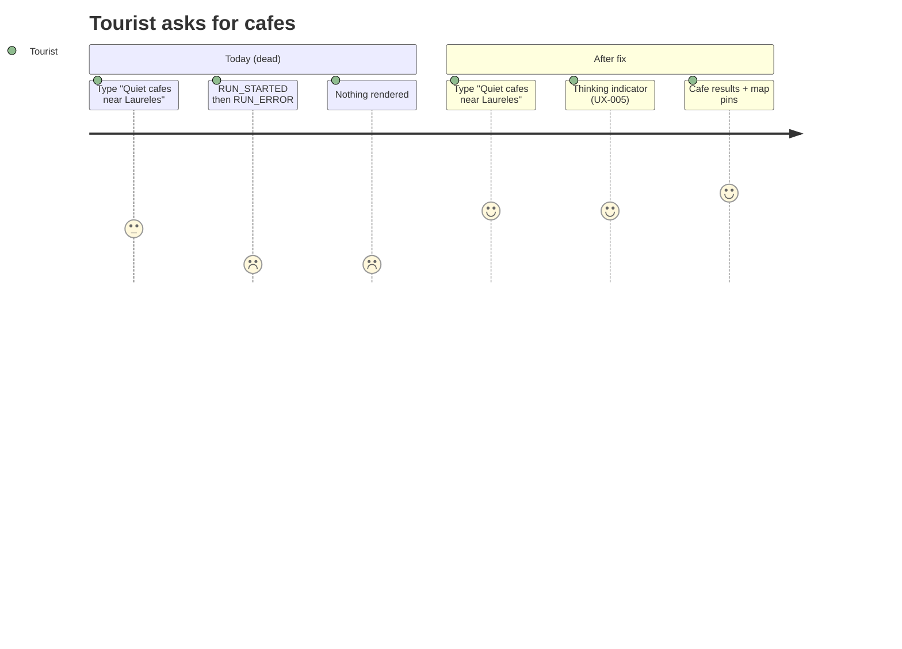
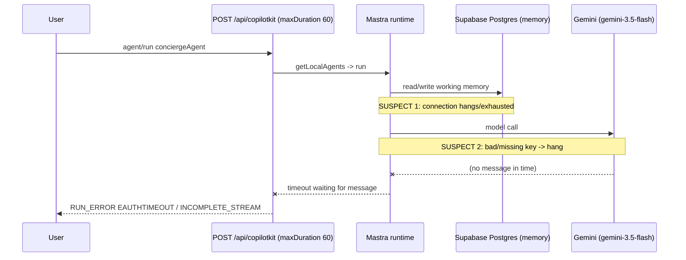
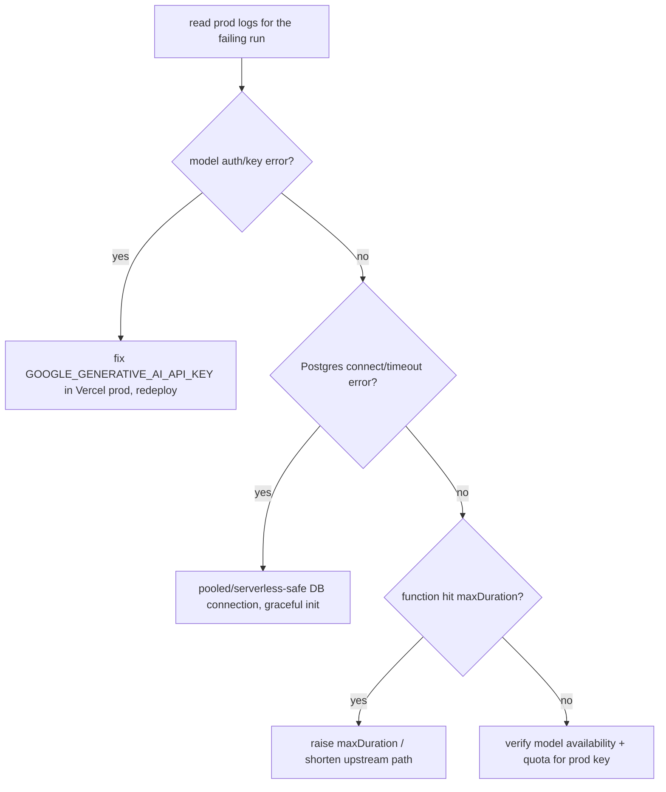

# UX-001 — Restore conciergeAgent on production

> 🔴 **Highest-impact task in this set.** Cafés, restaurants, attractions, day-trips, and events all route through `conciergeAgent`. On prod, all of them are dead. Fixing this lifts the production-readiness score from ~48 to ~75 (per the UX audit) without touching the rental path.
>
> 🔬 **This is a diagnosis task first.** Do **not** start editing agent code on a guess. Read prod logs, form a hypothesis, prove it, then fix the proven cause.

> 🧭 **Diagnosis update (2026-05-28, evidence-backed).** Phase A is largely done — see [`../testing/evidence/2026-05-28/concierge-diagnosis-and-ux-verification.md`](../testing/evidence/2026-05-28/concierge-diagnosis-and-ux-verification.md). Proven from disk + live prod probes + `ai_runs`:
> - The **in-process agent is healthy on prod**: `POST https://www.mdeai.co/api/copilotkit` returns a structured `400` in ~5.5s (alive, not hanging); `ai_runs` shows **504 `success` runs** for `concierge-agent` (latest today 21:23, Gemini `gemini-3.5-flash`, 7–24s). So the original "all dead" framing is **overstated** — the Pattern-1 backend works.
> - The captured failure (`runId ab1d8c49…`, `threadId 5b322d4c…`) has **0 rows in `ai_runs`** → it **never reached our route**. The error tokens `EAUTHTIMEOUT` / `INCOMPLETE_STREAM` originate in `@copilotkit/runtime/**/v2/**` + `@copilotkit/shared/finalize-events.ts`, which **our v1 route never executes**.
> - **Leading root cause:** prod ships in **CopilotKit Cloud mode** (`NEXT_PUBLIC_COPILOTKIT_PUBLIC_API_KEY` set → `publicApiKey` branch in `src/lib/copilotkit-client-props.ts:22`). Cloud runs its own **v2 runtime** and cannot reach our **in-process** (`getLocalAgents`) agents, so it auth-times-out and finalizes with `INCOMPLETE_STREAM`. **Fix direction:** force prod onto the same-origin Pattern-1 route (`runtimeUrl: "/api/copilotkit"`) — i.e. stop using `publicApiKey` / unset the Vercel prod var. Config-level, Gemini-only, no schema.
> - **One link still unproven (needs Vercel access):** is `NEXT_PUBLIC_COPILOTKIT_PUBLIC_API_KEY` actually set in the **Vercel production** env? It is set in local `mdeapp/.env.local`. Confirm before the fix (see Phase A step 3).

## Plain-English problem

On https://www.mdeai.co, every AI concierge request (café/event/restaurant/attraction/day-trip) starts and then dies. The live SSE stream emits `RUN_STARTED` and then, after a wait, the terminal error below — no text, no tool calls, no completion:

```
data: {"type":"RUN_ERROR","message":"(EAUTHTIMEOUT) timeout while waiting for message","code":"INCOMPLETE_STREAM"}
```

(captured verbatim — `tasks/testing/evidence/2026-05-28/events-in-laureles-RUN_ERROR-613.network-response`). "Timeout while waiting for message" = the runtime waited for the agent to produce a message and it never did within the window.

## User impact

- **3 of the 4 advertised pillars** (events, food, attractions/day-trips) return nothing. The homepage promises them; the product can't deliver them.
- The **Tourist** persona is entirely unserved today. The **Camila** rental path still works (it bypasses the LLM), which is why this outage is easy to miss without targeted QA.

## Persona affected

**Tourist** (primary — all concierge verticals). **Camila** (secondary — any non-fast-path, LLM-routed ask).

## Root cause

**LEADING (evidence-backed 2026-05-28), one link unproven.** Hypotheses re-ranked after the Phase-A probes above:

1. 🟢 **Prod uses CopilotKit Cloud, which can't reach our in-process agents (LEADING).** `src/lib/copilotkit-client-props.ts:22` returns `{ publicApiKey }` in production when `NEXT_PUBLIC_COPILOTKIT_PUBLIC_API_KEY` is set → the browser talks to **CopilotKit Cloud**, not our same-origin route. Cloud runs the **v2 runtime** (`@copilotkit/runtime/**/v2/**` + `@copilotkit/shared/finalize-events.ts`, the only place `INCOMPLETE_STREAM`/`EAUTHTIMEOUT` exist — and code our **v1** route never executes). Cloud has **no reachable agent backend** (ours run in-process via `getLocalAgents`), so it auth-times-out → `INCOMPLETE_STREAM`. Explains all three anomalies: failure has 0 `ai_runs` rows, route is healthy, 504 successes are the in-process/dev path. **Unproven link:** confirm `NEXT_PUBLIC_COPILOTKIT_PUBLIC_API_KEY` is set in the **Vercel production** env (it's set in local `mdeapp/.env.local`).
2. ⚪ **Gemini auth/key in prod env** — **largely disproven**: `ai_runs` shows 504 `success` runs on `gemini-3.5-flash` (latest today), so the key + model work. Only relevant if prod is actually on Pattern-1 (hypothesis 1 false).
3. ⚪ **Mastra storage init on serverless** (`src/mastra/lib/storage.ts`, Postgres `max:3`) — **not supported by evidence**: the live route returns `400` in ~5.5s (no hang) and runs complete in 7–24s. Re-open only if hypothesis 1 is disproven.
4. ⚪ **Function timeout vs upstream latency** (`route.ts maxDuration=60`) — **not supported**: all 504 logged runs finish well under 60s. The captured failure isn't a Vercel timeout signature.
5. ⚪ **Model availability** — **disproven**: `gemini-3.5-flash` returns success repeatedly today.

> ⚠️ **`ai_runs` blind spot (important for this diagnosis).** The Pattern-1 logging wrapper (`src/mastra/copilotkit/logging-mastra-agent.ts`) (a) **never populates `error_message`** — `tap({error})` only flips a status flag (0/11 error rows carry text), and (b) only fires in `finalize()` **after** `super.run()` starts, so any failure that **bypasses our route** (CopilotKit Cloud) or **kills the function before flush** leaves **no row at all**. So "read `ai_runs` for the failing run" is **necessary but not sufficient** — **Vercel function logs + the browser's actual request target are authoritative.** (The 11 logged `error` rows are a *separate*, already-quiet mode: anonymous, fast 1–3s fails on the in-process route, last seen 2026-05-25, none since.)

## Files likely involved

| File | Role |
|------|------|
| `mdeapp/src/app/api/copilotkit/route.ts` | Runtime endpoint; `maxDuration=60`, `runtime="nodejs"`, `getLocalAgentsWithLogging` bridge |
| `mdeapp/src/mastra/agents/concierge.ts` (81–248) | The agent; `model: FLASH_MODEL` at ~236, memory at ~247 |
| `mdeapp/src/mastra/lib/models.ts` (7) | `google("gemini-3.5-flash")` |
| `mdeapp/src/mastra/lib/storage.ts` (38–90) | Postgres (prod) / LibSQL (dev) adapter — connection is a prime suspect |
| `mdeapp/src/mastra/index.ts` (22–42) | Mastra construction + agent registration |
| `mdeapp/src/mastra/copilotkit/logging-mastra-agent.ts` (44–68) | Server-side run logging — your window into the failure |
| Vercel project env (`amo100/mdeai`) | `GOOGLE_GENERATIVE_AI_API_KEY`, `DATABASE_URL` |

## Tech stack involved

Mastra (agent + memory) · CopilotKit 1.55.2 runtime · AG-UI stream · Gemini via `@ai-sdk/google` · Supabase Postgres (Mastra storage) · Vercel (Fluid Compute, function `maxDuration`, env vars, logs). **Constraint (CLAUDE.md): production AI is Gemini only — do not introduce `@anthropic-ai/*` or OpenAI. Service-role/DB access stays within the F13 carve-out (`src/mastra/lib/**`).**

## Skills to load

`copilotkit-debug` (trace the AG-UI run + reproduce), `mastra` (agent/memory/storage), `gemini` (model + key verification via `gemini-api-docs-mcp`), `mde-vercel` (read prod logs + env + function config), `testing` + `mastra-smoke-test` (regression gate), `mde-task-lifecycle`.

## Implementation steps

**Phase A — diagnose (do not skip):**
1. Reproduce on prod and re-capture the terminal SSE (confirm it still ends in `RUN_ERROR`/`EAUTHTIMEOUT`).
2. Read **prod logs** for the failing `POST /api/copilotkit` invocation (Vercel function logs + the `logging-mastra-agent` output + `mastra_ai_spans`/`ai_runs` rows). Look for: model auth error, Postgres connection error/timeout, or function-duration cutoff.
3. Verify prod env: is `GOOGLE_GENERATIVE_AI_API_KEY` set and valid in the Vercel **production** environment? Is `DATABASE_URL` reachable from the function (pooled connection string)?
4. Verify the model: confirm `gemini-3.5-flash` is current and available to the prod key (`gemini-api-docs-mcp`). 
5. **Form one proven hypothesis** before changing code. Write it in the evidence file with the log line that proves it.

**Phase B — fix (the change depends on what Phase A proves):**
- If key/env → fix the Vercel env var, redeploy. (No app code change.)
- If storage/connection → use a pooled/serverless-safe Postgres connection, ensure graceful init, and confirm the adapter doesn't block the run; consider lazy/warm init.
- If timeout → raise `maxDuration` (Vercel default is now 300s) and/or shorten the upstream path.
- If model → update the model ID per the verified Gemini registry.

**Phase C — verify + re-enable:**
6. Prove a café and an events prompt reach `RUN_FINISHED` with real content on prod.
7. Flip `CONCIERGE_ENABLED=true` (undo UX-004) and confirm the chips/greeting return.
8. Land UX-009 (synthetic monitor) so this can't silently regress.

## Tests required

- **Prod smoke (the real gate):** a `POST /api/copilotkit` `agent/run` for "Quiet cafés near Laureles" and for an events prompt reaches `RUN_FINISHED` (not `RUN_ERROR`) with assistant content, within the function window. Capture both SSE streams.
- **Local Mastra smoke** (`mastra-smoke-test`): conciergeAgent produces output locally against the same model/storage config.
- **Regression:** rental fast-path still works (it must be unaffected); `npm run floor` exits 0.
- Hand the prod smoke to **UX-009** to run on a schedule.

## Acceptance criteria

- [ ] Root cause is **proven from a prod log line**, written in the evidence file (no guesses).
- [ ] On prod, café + events prompts return real assistant content and reach `RUN_FINISHED`.
- [ ] No `RUN_ERROR`/`EAUTHTIMEOUT` on a normal concierge request.
- [ ] Rental fast-path unaffected; `npm run floor` exits 0.
- [ ] UX-004's flag flipped back on; chips + full greeting restored.
- [ ] Still Gemini-only; no service-role leakage outside the carve-out.

## Failure cases to handle

- Intermittent (cold-start only) failures — verify a *warm* and a *cold* invocation both succeed.
- Partial output then error — ensure the fix yields a complete run, not just a faster failure.
- Fix masks the symptom but not the cause (e.g., raising timeout when the real issue is a hung DB connection) — Phase A must isolate the true cause first.

## Rollback plan

- Env-only fix → revert the env var + redeploy.
- Code fix → revert the PR; UX-004's flag keeps the dead chips hidden, so a rollback degrades gracefully (no new dead-ends).
- Keep UX-002 (error visibility) in place regardless, so any rollback still surfaces failures to users.

## Evidence required before marking Done

- The **prod log line** proving root cause, quoted in `tasks/testing/evidence/<date>/`.
- Two prod SSE captures (café + events) ending in `RUN_FINISHED` with content.
- `npm run floor` exit 0 + rental fast-path regression screenshot.
- Confirmation `CONCIERGE_ENABLED` is back on and chips/greeting restored on prod.

## User journey diagram



## Technical flow diagram



Diagnostic decision tree (Phase A):



## Beginner explanation

When you ask the concierge something, three things have to happen on the server: it remembers your chat (reads/writes a database), it asks Google's Gemini AI for an answer, and it streams that answer back to your screen. Right now one of those steps hangs on the live server, so the server gives up and sends back an error code — and (until UX-002) you see nothing. We don't yet know *which* step hangs, so the first job is to read the server's logs to find the exact failing step, prove it, and only then fix that one thing. The likely culprits are a missing/wrong Google API key or a database connection that won't open on the serverless function.

## Do not overbuild

- **Do not** rewrite the agent, swap frameworks, or "refactor while we're in here." Find the one broken step and fix it.
- **Do not** change the model to a non-Gemini provider — that violates a hard rule.
- **Do not** guess-and-deploy. One proven root cause, one targeted fix.
- **Do not** touch the rental fast-path.
- Keep UX-002's error visibility and UX-009's monitor as the durable safety net rather than over-hardening the agent itself.
