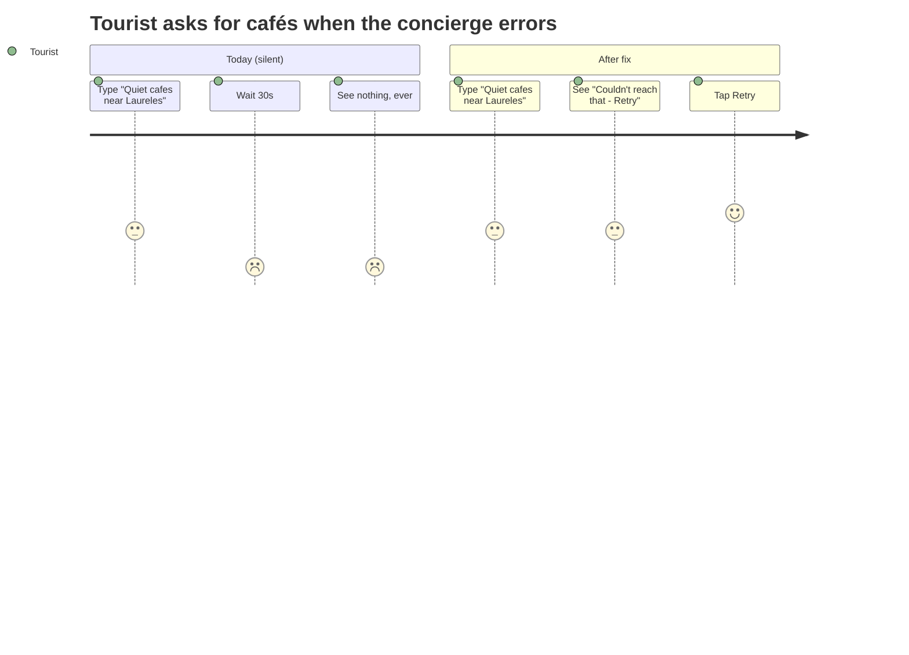
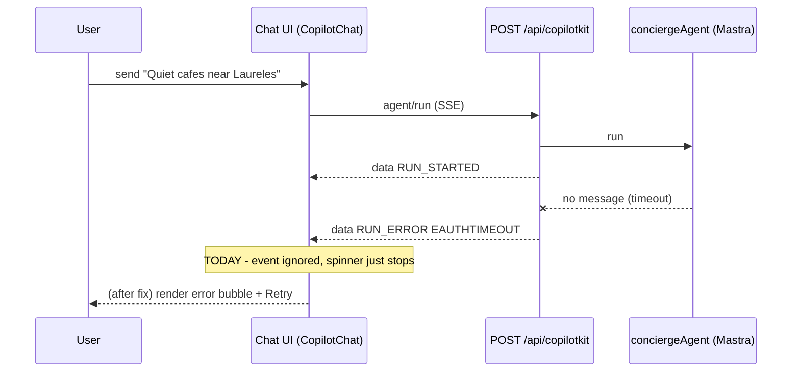

# UX-002 — Render a user-facing, retryable error on RUN_ERROR / timeout

> **Why before UX-001?** The user explicitly asked to *fix failure visibility first.* Even after the concierge is restored, transient timeouts will recur — this task makes them survivable instead of silent.

## Plain-English problem

When a café/event/restaurant request fails, the user sees **their own message and then nothing — forever.** No spinner ends, no error, no retry. Today on prod every `conciergeAgent` run ends in `RUN_ERROR (EAUTHTIMEOUT) … INCOMPLETE_STREAM` (see UX-001), and the chat UI swallows it. The person is left staring at a dead chat with no idea what happened.

## User impact

- A first-time **Tourist** asks "Quiet cafés near Laureles", waits, sees silence, and concludes the app is broken. They leave.
- Even once the concierge works, any network blip or model timeout reproduces the same silent dead-end.
- Silence is the **worst** chat failure mode: the user can't tell "thinking" from "dead" and has nothing to act on.

## Persona affected

**Tourist** (cafés, restaurants, attractions, day-trips, events — all concierge-routed). Also **Camila** whenever she asks anything that routes to the LLM rather than the rental fast-path.

## Root cause

**KNOWN (client-side gap).** Per the codebase map: the chat renders via CopilotKit `<CopilotChat>` with a custom `Messages` prop (`src/components/chat/concierge-chat-messages.tsx`), and the assistant message handler (`src/components/chat/concierge-assistant-message.tsx`) *strips* tool/raw payloads. There is **no client handler** for AG-UI `RUN_ERROR` / stream-incomplete events — only CopilotKit's `inProgress` flag from `useCopilotChatInternal()`, which simply flips back to false with no message rendered. The terminal SSE event observed verbatim:

```
data: {"type":"RUN_ERROR","message":"(EAUTHTIMEOUT) timeout while waiting for message","code":"INCOMPLETE_STREAM"}
```

## Files likely involved

| File | Change |
|------|--------|
| `mdeapp/src/app/layout.tsx:43` — the single `<CopilotKit>` provider (props from `getCopilotKitClientProps("conciergeAgent")` at `src/lib/copilotkit-client-props.ts:11`). **Verified 2026-05-28: the provider is here, NOT in `geo-chat-shell.tsx` — that shell has no `<CopilotKit>`.** | Add an `onError` handler to catch runtime/stream errors |
| `mdeapp/src/components/chat/concierge-chat-messages.tsx` | Render an error bubble when a run ends in error / times out with no assistant content. Verified: uses `useCopilotChatInternal()` → `inProgress` (:36), renders `interrupt` (:106), shows an activity indicator while `inProgress` (:101-105), but has **no `RUN_ERROR` branch** — confirms the gap. |
| `mdeapp/src/components/chat/concierge-assistant-message.tsx` | Ensure error state is **not** stripped along with tool JSON |
| New small component, e.g. `src/components/chat/concierge-error-notice.tsx` | The visible "Couldn't reach that — Retry" bubble |

## Tech stack involved

CopilotKit 1.55.2 (`useCopilotChat` / `useCopilotChatInternal`, `<CopilotKit onError>`) · AG-UI run-event stream (`RUN_ERROR`, `RUN_FINISHED`) · React · TypeScript · Tailwind / shadcn/ui. Verify the 1.55.2 error API via `copilotkit` / `copilotkit-agui` skills (do not assume a v2 API).

## Skills to load

`copilotkit` + `copilotkit-agui` (the 1.55.2 error/stream API — confirm `onError` shape and whether `RUN_ERROR` surfaces through it), `copilotkit-debug` (reproduce/trace the stream), `testing` (Vitest + Playwright), `mde-task-lifecycle`.

## Implementation steps

1. Confirm the exact 1.55.2 surface for catching a failed run: check whether `<CopilotKit onError>` receives the `RUN_ERROR`, or whether it must be detected by watching `inProgress` flipping false with no new assistant message, or via the AG-UI event stream. Use the `copilotkit-agui` skill / local `CopilotKit/examples` rather than guessing.
2. Add a client error state: when a run terminates in `RUN_ERROR`/`INCOMPLETE_STREAM`, **or** `inProgress` returns to false having produced zero assistant tokens within a timeout window (e.g. ~`maxDuration`), set an error for that turn.
3. Render `<ConciergeErrorNotice>` as an assistant-side bubble: plain-language copy ("Sorry — I couldn't reach the concierge just now.") + a **Retry** button that re-sends the last user message.
4. Make sure the loading indicator (UX-005) is cleared when the error renders — never both spinning *and* errored.
5. Keep the rental fast-path untouched — it does not go through `conciergeAgent`, so its error UX is separate and out of scope here.

## Tests required

- **Vitest (component):** mount the chat messages with a mocked run that ends in `RUN_ERROR`; assert the error notice + Retry button render and the spinner is gone.
- **Playwright (e2e, deterministic):** intercept `POST /api/copilotkit` and return a canned SSE that emits `RUN_STARTED` then `RUN_ERROR`; assert a visible error message appears and Retry re-issues the request. (This makes the test independent of whether prod concierge is healthy.)
- **Playwright (timeout path):** intercept and hang/delay the stream past the timeout window; assert the timeout error renders.

## Acceptance criteria

- [ ] A `RUN_ERROR` SSE results in a visible assistant-side error message (not silence).
- [ ] A stream that produces no tokens within the timeout window also shows the error.
- [ ] The error message has a working **Retry** that re-sends the last user turn.
- [ ] The loading/"thinking" state is cleared whenever the error shows.
- [ ] Rental fast-path behavior is unchanged.
- [ ] `npm run floor` exits 0.

## Failure cases to handle

- Error fires but a late token still arrives → don't show error *and* a real answer; cancel the error if content arrives.
- Repeated retries that keep failing → don't stack infinite error bubbles; collapse to one with a retry count or a "still having trouble" message.
- A genuinely empty-but-successful run (`RUN_FINISHED`, no content) → that's a different state ("no results"), not an error — don't mislabel it.

## Rollback plan

Additive client-only change (new component + an error branch). Feature-flag or revert the PR to remove the error rendering and return to prior behavior. No API/DB/schema change, so rollback is safe.

## Evidence required before marking Done

- Vitest + Playwright runs green (paste output).
- `npm run floor` exit 0.
- **Localhost runtime proof** (CLAUDE.md Done-gate): screenshot of the rendered error bubble + Retry, produced by the deterministic intercepted-`RUN_ERROR` e2e on `npm run dev`. Save under `tasks/testing/evidence/<date>/`.

## User journey diagram



## Technical flow diagram



## Beginner explanation

When you send a message, the app opens a live "stream" to the AI and waits for words to come back. Sometimes the AI never answers and the stream ends with an error code instead of words. Right now the app reads that error code and just throws it away — so the screen shows nothing. This task makes the app *notice* the error and show you a friendly message with a Retry button, so you're never left staring at a frozen chat.

## Do not overbuild

- **Do not** redesign the chat UI — add one error bubble component and one error branch.
- **Do not** build a global toast/notification system; keep the error inline in the conversation where the user is looking.
- **Do not** try to auto-retry forever or add exponential backoff — a single manual Retry button is enough for MVP.
- **Do not** touch the rental fast-path error handling.
