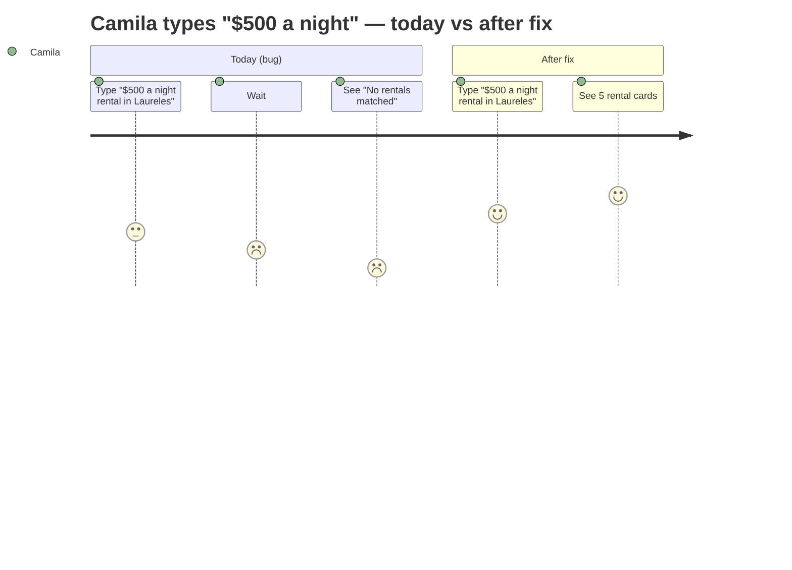
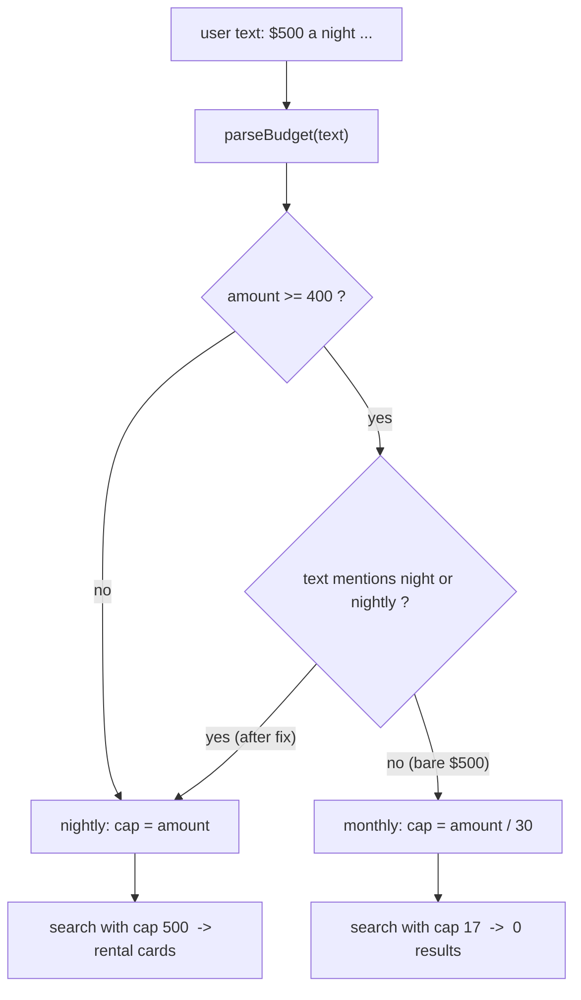

# UX-003 — Deploy the "$500 a night" price-wording parser fix

> ⚠️ **This is the ONLY UX task allowed to touch the rental fast-path.** Every other UX task (UX-001/002/004/005/006/007/008/009) must leave `rental-query-parser.ts` and the fast-path hook untouched.

> ⚠️ **Collides with RE-017 / INT-002 (shares the parser test file).** This task edits `rental-query-parser.ts:78` and **creates** `src/lib/__tests__/rental-query-parser.test.ts`. [RE-017](../real-estate/tasks/RE-017-rental-parser-intelligence.md) (≡ [INT-002](../intelligence/tasks/INT-002-rental-parser-monthly-date-city.md)) edits the **same parser** and creates the **same test file**, and [INT-005](../intelligence/tasks/INT-005-intelligence-regression-tests.md) also lists that test path. **UX-003 is the minimal subset** (one regex widening) and should land **first**; RE-017 then supersets it (date/city/confidence) by *extending* the existing test file, not overwriting it. Whoever lands second rebases onto the shared file. Do not let two PRs each create `rental-query-parser.test.ts` from scratch.

## Plain-English problem

When a user types **"$500 a night rental in Laureles"**, the app replies **"No rentals matched."** But "$500/night" (with a slash) works fine and returns 5 cards. The price parser only recognizes `/night` and `per night` as "nightly" phrasing. Anything else with a number ≥ 400 — like "a night" or "nightly" — is assumed to be a **monthly** budget and silently divided by 30, so `$500` becomes a nightly cap of **$17**. Nothing in Medellín rents for $17/night, so the result is empty.

## User impact

- **Camila** asks for a perfectly normal budget and gets a confidently wrong "nothing found" answer. She has no idea the app misread "$500 a night" as "$17/night."
- This erodes trust in the one part of the product that actually works (the rental fast-path). A silent wrong answer is worse than an error message.

## Persona affected

**Camila** (apartment seeker). Tourist is unaffected (this is the rental path).

## Root cause

**KNOWN — proven on prod 2026-05-28.** `src/lib/rental-query-parser.ts:78`:

```ts
if (amount >= 400 && !/\/\s*night|per night/i.test(text)) {
  return { maxPricePerNight: Math.round(amount / 30), budgetType: "monthly" };
}
```

The guard regex `/\/\s*night|per night/i` matches `/night` and `per night` only. "a night", "nightly", and "/ night" with odd spacing fall through to the monthly branch. Prod evidence (QA F-3): `$500 a night rental in Laureles` produced `POST /api/rentals/search` body `{"neighborhood":"Laureles","minBedrooms":1,"maxPricePerNight":17,"limit":8}`.

## Files likely involved

| File | Change |
|------|--------|
| `mdeapp/src/lib/rental-query-parser.ts` (line ~78) | Widen the nightly guard to `!/\bnight(?:ly)?\b/i` so "a night" / "nightly" count as nightly |
| `mdeapp/src/lib/__tests__/rental-query-parser.test.ts` (**new** — does not exist on `feat/c012-cafe-places-detail`) | Add unit cases for nightly vs monthly wording |

> The fix + test already exist as commit **`0660507`** on branch **`test/rentals-prod-qa-may28`**. Easiest path: cherry-pick / re-apply that commit onto the active branch, then PR. Do **not** assume it is deployed — prod was confirmed still buggy on 2026-05-28.

## Tech stack involved

TypeScript · Vitest (unit) · (no UI, no network — pure function). Deployed via Vercel.

## Skills to load

`mde-real-estate` (rental parser domain), `mastra` (working-memory schema interplay), `testing` (Vitest), `mde-task-lifecycle` (ship/PR bookkeeping).

## Implementation steps

1. From `/home/sk/mdeai/mdeapp`, confirm the active branch and that the bug is present: read `src/lib/rental-query-parser.ts:78`.
2. Replace the nightly guard:
   ```ts
   -  if (amount >= 400 && !/\/\s*night|per night/i.test(text)) {
   +  if (amount >= 400 && !/\bnight(?:ly)?\b/i.test(text)) {
        return { maxPricePerNight: Math.round(amount / 30), budgetType: "monthly" };
      }
   ```
   This keeps the monthly default for bare large numbers (`$500` alone → monthly) but treats any explicit "night"/"nightly" wording as nightly.
3. Create `src/lib/__tests__/rental-query-parser.test.ts` with the cases in **Tests required**.
4. Run `npm test -- rental-query-parser` and confirm green.
5. Run `npm run floor` (lint + typecheck + build + test + audit) — must exit 0.
6. Commit (one worktree, one PR per CLAUDE.md). Do **not** push/merge without explicit user approval.

## Tests required

New `rental-query-parser.test.ts`. **Verified 2026-05-28: `parseBudget` is NOT exported** (`src/lib/rental-query-parser.ts:48` declares `function parseBudget` with no `export`). Assert through the **exported** `scoreRentalQuery` (`:117`), which surfaces `maxPricePerNight` + `budgetType` in its return — do not try to import `parseBudget` directly.

| Input (to `scoreRentalQuery`) | Expect |
|-------|--------|
| `$500/night` | `maxPricePerNight: 500`, `budgetType: "nightly"` |
| `$500 a night` | `maxPricePerNight: 500`, `budgetType: "nightly"` ← the bug case |
| `$500 nightly` | `maxPricePerNight: 500`, `budgetType: "nightly"` |
| `$2000/month` | `maxPricePerNight: ~67`, `budgetType: "monthly"` (the `MONTHLY_RE` at `:67` catches `/month` before the `:78` guard) |
| `$500` (bare) | `budgetType: "monthly"` (preserve existing default) |

## Acceptance criteria

- [ ] `$500 a night` and `$500 nightly` parse as `budgetType: "nightly"` with `maxPricePerNight: 500`.
- [ ] `$500/night` still nightly; `$2000/month` and bare `$500` still monthly (no regression).
- [ ] New unit test file present and green.
- [ ] `npm run floor` exits 0.
- [ ] On prod (post-deploy), `$500 a night rental in Laureles` returns rental cards (not "No rentals matched").

## Failure cases to handle

- Bare `$500` (no time unit) must **stay** monthly — don't over-correct into nightly.
- Mixed/odd spacing ("$500 / night", "$500 per-night") — confirm covered or explicitly out of scope.
- Working-memory carry-over: a later vague turn after this query should still inherit the corrected nightly value (this is the `s.maxPricePerNight ?? q.maxPricePerNight` merge — verify no double-conversion).

## Rollback plan

Single-line regex change + one new test file. Revert the one-line edit (or `git revert` the PR commit) to restore prior behavior. Zero schema/DB/API changes, so rollback is instant and risk-free.

## Evidence required before marking Done

- `npm run floor` exit-0 output pasted into evidence.
- New test run output showing the 5 cases pass.
- **Prod runtime proof** (CLAUDE.md Done-gate): after deploy, a real `$500 a night rental in Laureles` request on https://www.mdeai.co returning cards + the `POST /api/rentals/search` body showing `maxPricePerNight: 500` (not 17). Screenshot + network capture under `tasks/testing/evidence/<date>/`.

## User journey diagram



## Technical flow diagram



## Beginner explanation

The code that reads your message tries to guess whether your budget is **per night** or **per month**. Today it only spots the word pattern "/night" or "per night". If you write "a night" or "nightly", it gets confused, assumes you meant per-month, and divides your number by 30. So "$500 a night" turns into a $17/night search — and nothing costs $17/night, so you see "nothing found." The fix just teaches the guard to also recognize the words "night" and "nightly", so all the natural ways of saying it work the same.

## Do not overbuild

- **Do not** rewrite `parseBudget` or add an LLM/AI budget parser — it's a one-line regex widening.
- **Do not** add new neighborhoods, currencies, or budget types.
- **Do not** touch the fast-path hook, the API route, or the cards.
- Just widen one regex and add the unit test. The fix is already written on `0660507` — prefer reusing it over re-deriving.
