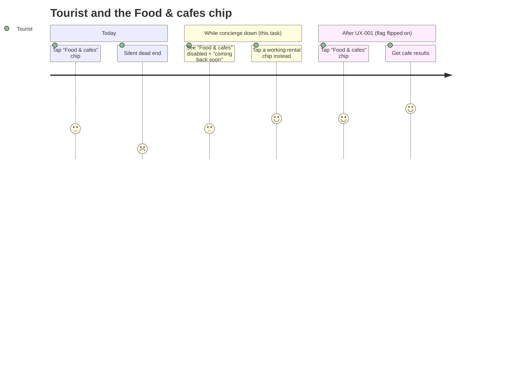
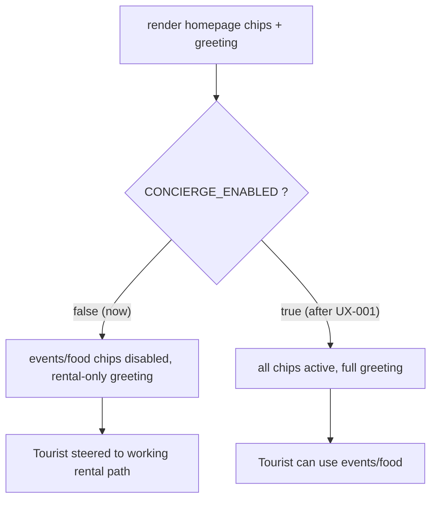

# UX-004 — Disable Events/Food chips + soften greeting while concierge is down

> ⏳ **This is a temporary mitigation, not a permanent change.** Its whole purpose is to stop sending users into a dead end *until* UX-001 restores the concierge. Build it so it is **one flip to undo** (a flag), and reverse it the moment UX-001 is verified on prod.

## Plain-English problem

The homepage actively advertises features that are 100% broken. The greeting says "I can help with rentals, **events, restaurants, and day trips**," and there are tappable **"Events"** and **"Food & cafés"** filter chips. Tapping any of them fires a `conciergeAgent` run, which currently dies silently (UX-001 / F-1). So the most inviting, most tappable elements on the page lead straight to a dead end.

## User impact

- A **Tourist** is drawn to exactly the chips that don't work, gets silence, and concludes the whole app is dead — even though rentals work great.
- This is a 1-hour reputational mitigation that buys time while the real fix (UX-001) is diagnosed from prod logs.

## Persona affected

**Tourist** (Events / Food & cafés chips, and the events/restaurants/day-trips part of the greeting).

## Root cause

**KNOWN (product/UX, not a code bug).** The chips and greeting are static and assume the concierge works:

- Chips: `mdeapp/src/platform/copilot/chat-filter-chips.ts:23-30` (chip IDs include `events` and `food`; event sub-chips at lines 33–42).
- Greeting: `mdeapp/src/components/chat/chat-center-panel.tsx:16-17`.

There is no capability gate tying these to whether the concierge is actually up.

## Files likely involved

| File | Change |
|------|--------|
| `mdeapp/src/platform/copilot/chat-filter-chips.ts` | Mark `events`/`food` (and event sub-chips) disabled when `CONCIERGE_ENABLED` is false; add a `disabledReason` |
| `mdeapp/src/components/chat/chat-center-panel.tsx` | Conditionally render the rental-only greeting when concierge is off |
| Chip render component (consumer of `chat-filter-chips`) | Respect `disabled` + show a "coming back soon" title/tooltip |
| A small config, e.g. `src/lib/feature-flags.ts` or an env read (`NEXT_PUBLIC_CONCIERGE_ENABLED`) | Single source of truth for the gate |

## Tech stack involved

Next.js 16 (env / config) · React · TypeScript · Tailwind / shadcn/ui · CopilotKit chip UI. No backend change.

## Skills to load

`copilotkit-develop` (chip + chat UI), `testing` (Vitest/Playwright), `mde-task-lifecycle`.

## Implementation steps

1. Add a single boolean gate — prefer `NEXT_PUBLIC_CONCIERGE_ENABLED` (defaults to the current "down" state until UX-001) read once in a small `feature-flags` helper.
2. When the gate is **off**: mark the `events`, `food`, and event sub-chips as `disabled` with `disabledReason: "Concierge is temporarily unavailable — coming back soon."` (tooltip/`title`). Keep rental chips (`laureles`, `poblado`, `2br`, `under-80`) fully active.
3. When off, swap the greeting to a rental-first line, e.g. "Hi — I can help you find rentals in Medellín. Try: \"1BR in Laureles under $80/night\"." (Drop the events/restaurants/day-trips promise.)
4. When the gate is **on**, everything renders exactly as today (zero diff in behavior).
5. Document in the PR that UX-001 must flip the flag on (or this PR must be reverted) once concierge is verified.

## Tests required

- **Vitest:** with the gate off, `events`/`food` chips are `disabled` with the reason; rental chips are not. With the gate on, none are disabled.
- **Playwright (e2e):** gate off → assert Events/Food chips are visibly disabled and not clickable, greeting shows the rental-only copy; gate on → assert all chips active and the full greeting.

## Acceptance criteria

- [ ] With `CONCIERGE_ENABLED=false`, Events + Food & cafés (and event sub-chips) are disabled with a friendly reason; rental chips stay active.
- [ ] Greeting no longer promises events/restaurants/day-trips while the gate is off.
- [ ] With the gate on, the page is byte-for-byte the current behavior.
- [ ] The gate is a single flip (no scattered conditionals).
- [ ] `npm run floor` exits 0.

## Failure cases to handle

- Don't disable rental chips by accident — only the concierge-routed ones.
- A user with a deep link / typed café query can still hit the concierge — that path is covered by UX-002 (error message), not this task. (This task only removes the *invitations*, not the route.)
- Flag misconfig (undefined) should fail to the safe state for the moment (down → disabled) until UX-001, then default on.

## Rollback plan

It *is* a rollback mechanism: flip `CONCIERGE_ENABLED=true` (or revert the PR) to restore the chips and greeting. No data/API change. UX-001's Done step includes flipping it back on.

## Evidence required before marking Done

- Vitest + Playwright green.
- `npm run floor` exit 0.
- **Localhost runtime proof:** two screenshots from `npm run dev` — gate off (chips disabled, rental-only greeting) and gate on (full chips + greeting). Save under `tasks/testing/evidence/<date>/`.
- A note in the PR + `tasks/ux/INDEX.md` linking the eventual re-enable to UX-001.

## User journey diagram

## Technical flow diagram

## Beginner explanation

Imagine a restaurant menu that lists five dishes, but three of them are out of stock and the kitchen says nothing when you order them. The honest fix is to grey out the unavailable dishes and tell people "back soon." That's all this does: it greys out the buttons that currently lead nowhere (Events, Food & cafés) and changes the welcome message so it only promises what works (rentals) — until the kitchen (the concierge) is fixed in UX-001, when we turn the buttons back on with one switch.

## Do not overbuild

- **Do not** delete the chips or the concierge code — just gate the *invitations* behind one flag.
- **Do not** add a status page, health-check polling, or auto-detection of concierge health — a manual flag flipped by UX-001 is enough for MVP.
- **Do not** touch the rental chips or fast-path.
- Keep it to one flag + a tooltip + a greeting swap.
