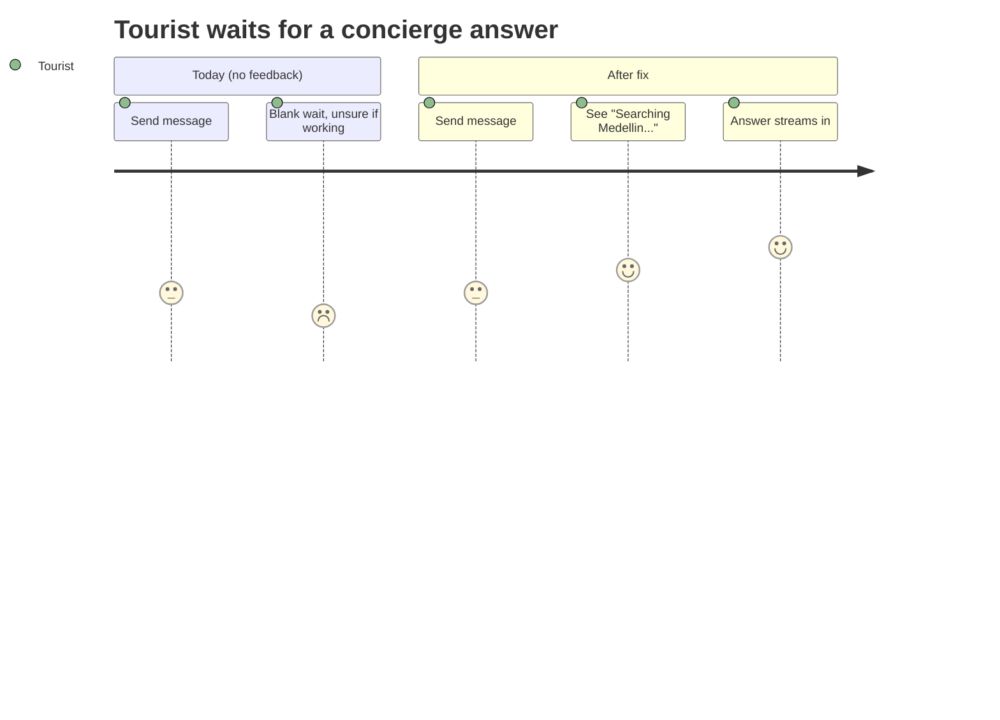
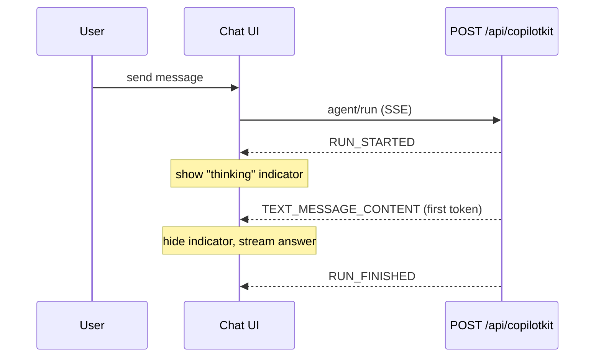

# UX-005 — Add a visible "thinking" indicator for concierge runs

## Plain-English problem

When you send a concierge message, there's no clear signal the AI is working. During QA, no "thinking" state was observed between sending and (eventual) failure — the chat just sits there. A chat with no typing/loading indicator feels broken even when it's healthy, and it makes a *slow* answer indistinguishable from a *dead* one.

## User impact

- The **Tourist** can't tell "the concierge is composing an answer" from "the concierge is hung." They give up early on requests that would have succeeded.
- Pairs with UX-002: together they cover the two states a waiting user needs — "working" (this task) and "failed, retry" (UX-002).

## Persona affected

**Tourist** (all concierge verticals) and **Camila** for any LLM-routed ask.

## Root cause

**KNOWN (UX gap, not a bug).** The chat uses CopilotKit's `inProgress` flag (`useCopilotChatInternal()`, surfaced around `src/components/chat/chat-center-panel.tsx` / `concierge-chat-messages.tsx`), but there is no prominent custom "thinking" affordance rendered while a run is in flight before the first token. The flag exists; the visible indicator does not.

## Files likely involved

| File | Change |
|------|--------|
| `mdeapp/src/components/chat/concierge-chat-messages.tsx` | Render a "thinking" bubble while `inProgress` and no assistant tokens yet |
| `mdeapp/src/components/chat/chat-center-panel.tsx` | Wire the `inProgress` / run state if not already exposed |
| New small component, e.g. `src/components/chat/concierge-thinking-indicator.tsx` | Animated dots / "Searching Medellín…" affordance |

## Tech stack involved

CopilotKit 1.55.2 (`inProgress`, AG-UI `RUN_STARTED` / first `TEXT_MESSAGE_CONTENT` / `RUN_FINISHED` / `RUN_ERROR`) · React · TypeScript · Tailwind / shadcn/ui.

## Skills to load

`copilotkit` + `copilotkit-agui` (confirm the 1.55.2 `inProgress` semantics and run-event timing), `testing`, `mde-task-lifecycle`.

## Implementation steps

1. Confirm where `inProgress` (or the run lifecycle) is available in the chat tree; reuse it rather than adding new state.
2. Render `<ConciergeThinkingIndicator>` as an assistant-side bubble when a run has started and no assistant content has streamed yet.
3. Clear it the instant any of these occur: first `TEXT_MESSAGE_CONTENT`/tool render, `RUN_FINISHED`, or `RUN_ERROR` (UX-002 takes over on error).
4. Keep copy concrete and on-brand ("Searching Medellín…") rather than a bare spinner — it reassures the user the right thing is happening.
5. Do not show the indicator for the rental fast-path (that path is near-instant and renders cards directly) unless it already has its own; scope this to concierge runs.

## Tests required

- **Vitest (component):** simulate `inProgress=true` with no assistant content → indicator visible; simulate first token → indicator gone.
- **Playwright (e2e, deterministic):** intercept `POST /api/copilotkit` with an SSE that emits `RUN_STARTED`, pauses, then a token; assert the thinking indicator shows during the pause and disappears when the token arrives.
- **Interplay with UX-002:** on an intercepted `RUN_ERROR`, assert the indicator is gone and the error bubble is shown (never both).

## Acceptance criteria

- [ ] A "thinking" indicator appears on `RUN_STARTED` for concierge runs.
- [ ] It disappears on first token, `RUN_FINISHED`, or `RUN_ERROR`.
- [ ] It and the UX-002 error bubble are never visible at the same time.
- [ ] No indicator leaks onto the rental fast-path cards flow.
- [ ] `npm run floor` exits 0.

## Failure cases to handle

- Run errors before any token → indicator must clear (hand off to UX-002), not spin forever.
- Very fast successful run → indicator may flash for <300ms; consider a small min-delay so it doesn't flicker, but don't over-engineer.
- Multiple rapid sends → only one indicator for the active run.

## Rollback plan

Additive, client-only. Revert the PR (or hide the component behind a flag) to return to the current no-indicator behavior. No data/API change.

## Evidence required before marking Done

- Vitest + Playwright green output.
- `npm run floor` exit 0.
- **Localhost runtime proof:** screenshot/GIF (or snapshot) of the thinking indicator showing during an intercepted slow run and clearing on first token, via `npm run dev`. Save under `tasks/testing/evidence/<date>/`.

## User journey diagram

## Technical flow diagram

## Beginner explanation

When you text a friend, you see "…" while they type — so you know they're answering. Our chat doesn't show that, so a working-but-slow AI looks identical to a dead one. This task adds the "…" (a small "Searching Medellín…" bubble) that appears the moment the AI starts and vanishes the moment it replies or fails.

## Do not overbuild

- **Do not** add progress percentages, step-by-step "agent reasoning" traces, or a streaming-token animation library — a simple animated bubble is enough.
- **Do not** build a global loading system; keep it inline in the chat.
- **Do not** show it on the rental fast-path.
- Reuse CopilotKit's existing `inProgress` signal; don't invent parallel run-tracking state.
