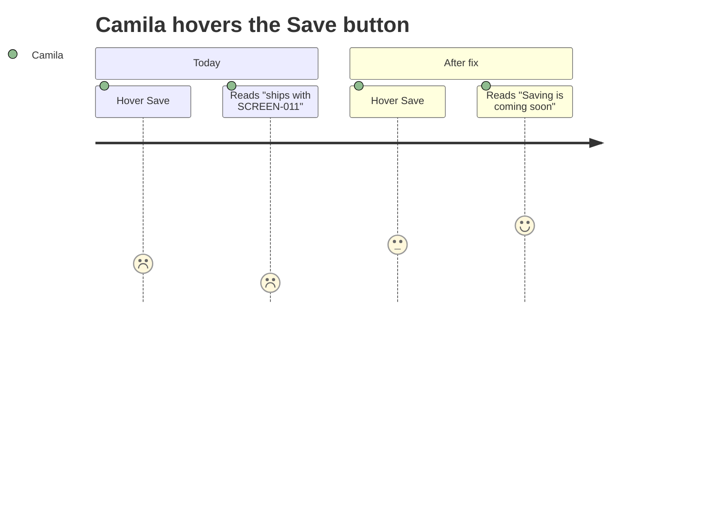
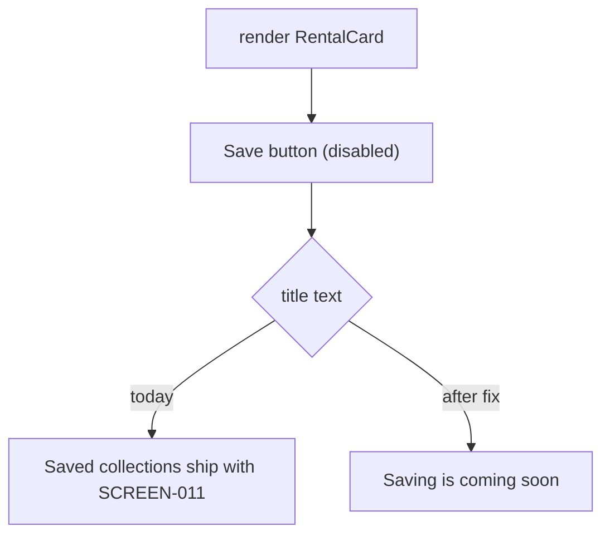

# UX-008 — Replace the internal Save tooltip with user-facing copy

## Plain-English problem

Every rental card has a **Save** (heart) button that's disabled, and hovering it shows the tooltip **"Saved collections ship with SCREEN-011."** "SCREEN-011" is an internal task ID — it means nothing to a user and looks like a leaked dev note. It should read like product copy: "Saving is coming soon."

## User impact

- **Camila** sees an internal ticket reference on a public production page — it looks unfinished/unprofessional and gives no useful information.
- Tiny effort, real polish: removes a visible "this is a dev build" tell.

## Persona affected

**Camila** (rental cards). Same Save control will apply to Tourist's concierge result cards later, so fixing the copy now sets the pattern.

## Root cause

**KNOWN.** `mdeapp/src/components/copilot/rental-card.tsx:186` — the disabled Save button (lines ~180–194, Heart icon, label "Save") has `title="Saved collections ship with SCREEN-011"`, an internal task ID used as user-facing tooltip text.

## Files likely involved

| File | Change |
|------|--------|
| `mdeapp/src/components/copilot/rental-card.tsx` (~line 186) | Replace the `title` string with user-facing copy |

(If the same string appears on other result cards — event/rich-card — update those too; grep for "SCREEN-011".)

## Tech stack involved

React · TypeScript · shadcn/ui / Tailwind (Button + Heart icon). No backend.

## Skills to load

`copilotkit-develop` (card UI), `testing` (DOM assertion), `mde-task-lifecycle`.

## Implementation steps

1. Grep the repo for `SCREEN-011` (and any similar `SCREEN-0xx` strings used as UI copy) to catch all occurrences, not just the rental card.
2. Replace `title="Saved collections ship with SCREEN-011"` with `title="Saving is coming soon"` (or the product-approved phrasing).
3. Keep the button `disabled` (the feature itself is post-MVP — see related Save/SCREEN-011 work; this task is copy-only).
4. Run the tests + floor.

## Tests required

- **Vitest / RTL (DOM):** render `RentalCard`; assert the Save button's `title`/accessible name does **not** contain "SCREEN-011" (or any "SCREEN-0" internal id) and contains the friendly copy. A simple guard test that fails if an internal ticket id leaks into the tooltip.

## Acceptance criteria

- [ ] No rental (or other result) card exposes "SCREEN-011" (or similar internal IDs) in any tooltip/title/visible text.
- [ ] Save button shows friendly "coming soon" copy and remains disabled.
- [ ] `npm run floor` exits 0.

## Failure cases to handle

- The string appears in more than one component → fix all (the grep step catches this).
- Don't accidentally *enable* Save — the feature isn't built; this is copy only.

## Rollback plan

One-line copy change. Revert the edit. Zero risk, no data/API change.

## Evidence required before marking Done

- DOM test green (paste output).
- `npm run floor` exit 0.
- **Localhost runtime proof:** screenshot of a rental card's Save tooltip showing the friendly copy via `npm run dev`. Save under `tasks/testing/evidence/<date>/`.

## User journey diagram

## Technical flow diagram

## Beginner explanation

A "tooltip" is the little text that pops up when you hover a button. Our Save button's tooltip accidentally shows an internal to-do code ("SCREEN-011") instead of a normal sentence. This task just swaps that text for something a real person understands — "Saving is coming soon" — and adds a tiny test so an internal code never sneaks into user-facing text again.

## Do not overbuild

- **Do not** build the Save feature here — that's separate post-MVP work. Copy only.
- **Do not** restyle the button or the card.
- Just change the string (everywhere it appears) and add the guard test.
