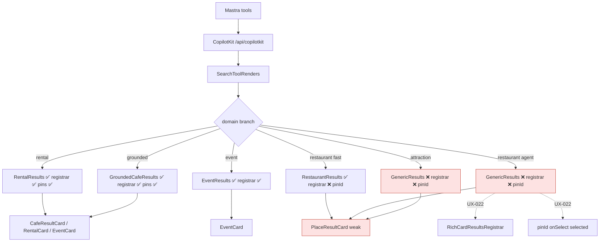

# Unified rich-card system — strategy

> **North star:** One search result = one rich card + one map pin + one detail path.  
> **Benchmark:** `CafeResultCard` (9/10). **Weakest:** `PlaceResultCard` (3/10).  
> **MVP rule:** Converge behavior and pipeline first; extract shell second; no rental redesign.

## Executive summary

The **rendering pipeline is sound** (`SearchToolRenders` → `normalizeToolEnvelope` → domain branch → `ToolPinsSync`). The gaps are **wiring and surface parity**:

| Gap | Severity | Who hurts |
|-----|----------|-----------|
| `GenericResults` (restaurant/attraction) — no `RichCardResultsRegistrar`, no `pinId`/`onSelect` | 🔴 P0 | Tourist sees dup side-panel + dead map hover |
| Agent path `writer.custom` no-op (UX-014) | ✅ Merged | Fast path + disabled tool render; agent path still needs UX-022 registrar |
| `PlaceResultCard` minimal — no image, detail panel, badges | 🟡 P1 | Trust collapse vs cafés |
| Interaction drift — only café has hover→pin | 🟡 P1 | Map feels disconnected |
| Missing `aria-label` on 4/5 cards | 🔴 P0 | WCAG 4.1.2 |
| Orphan `GroundedPlaceCard` | 🟢 P2 | Bundle noise |

**Disk note (2026-06-01, `main`):**

| Path | Registrar | `pinId` on cards |
|------|-----------|------------------|
| rental / grounded / event | ✅ | ✅ |
| `RestaurantResults` (fast path, UX-036) | ✅ | ❌ `GenericResults` |
| `restaurantToolRender` (agent) | ❌ bare `GenericResults` | ❌ |
| `attractionToolRender` | ❌ bare `GenericResults` | ❌ |

**UX-022** fixes agent restaurant/attraction + adds `pinId`/`onSelect` for all restaurant/attraction rows.

---

## 1. Unified card strategy

### 1.1 Layer model

```text
┌─────────────────────────────────────────────────────────┐
│ L4  Domain cards (thin)                                  │
│     RentalCard · CafeResultCard · EventCard              │
│     RestaurantCard · AttractionCard · PlaceResultCard*   │
├─────────────────────────────────────────────────────────┤
│ L3  ResultCardShell (layout + a11y + map hooks)          │
├─────────────────────────────────────────────────────────┤
│ L2  Primitives (media · badges · footer · actions)       │
├─────────────────────────────────────────────────────────┤
│ L1  DomainResults wrapper (pins + registrar + list)      │
├─────────────────────────────────────────────────────────┤
│ L0  SearchToolRenders · normalizeToolEnvelope            │
└─────────────────────────────────────────────────────────┘
  * PlaceResultCard = unknown-category fallback only
```

### 1.2 Shared interaction model

All list cards implement **`CardInteractionProps`** (see §3):

| Event | Behavior |
|-------|----------|
| `mouseenter` / `focus` | `onSelect()` → `panToPin(pinId)` — highlight pin, no panel |
| `click` / `Enter` / `Space` on body | `onOpenDetails()` if set, else `onSelect()` |
| `selected` | `border-primary ring-2 ring-primary/30` via `cn()` |
| Pin click on map | `selectedPinId` → scroll card into view (`data-pin-id` query) |
| Detail CTA | Opens domain panel: `CafeDetailPanel` \| `VenueDetailSheet` |

### 1.3 Detail panel contract

| Domain | Panel | Trigger |
|--------|-------|---------|
| Café | `CafeDetailPanel` (tabs) | Details + book |
| Rental / Event | `VenueDetailSheet` + body slot | Details |
| Restaurant / Attraction | `VenueDetailSheet` or shared `PlaceDetailPanel` (M2+) | Details |
| Fallback | Maps link only until rich card ships | — |

### 1.4 Map sync contract

```typescript
// Every card in a synced list MUST have:
data-pin-id={pinId}        // matches ToolPinsSync pin id
data-result-kind={kind}    // rental | cafe | event | restaurant | attraction | grounded
data-selected="true"|"false"

// Every domain list MUST:
<ToolPinsSync category={category} result={result} />
<RichCardResultsRegistrar category={category} count={rows.length} />
// + pass selectedPinId / panToPin to each card
```

### 1.5 Styling system

- **Container:** `overflow-hidden rounded-lg border bg-card text-sm shadow-sm transition`
- **Selected:** `cn(..., selected ? "border-primary ring-2 ring-primary/30" : "border-border")`
- **Price / hours:** `<Badge variant="outline">` or `secondary` — never raw `<p>`/`<span>`
- **Footer:** `border-t px-3 py-2 flex flex-wrap gap-2` — CTAs outside clickable body (café pattern)
- **Media:** 96×96 square (list) or domain-specific (event banner) via `ResultCardMedia`

### 1.6 Fallback behavior

`PlaceResultCard` remains for:

- Unknown tool categories
- Sparse payloads missing photo/rating (shell degrades: glyph + title + Maps CTA)
- Never the primary path for restaurant/attraction once `RestaurantCard` ships

---

## 2. Proposed component structure

```text
mdeapp/src/components/cards/
  card-interaction-props.ts      # shared types
  base-result-card.tsx           # ResultCardShell — article + a11y + selection chrome
  result-card-media.tsx          # photo | placeholder glyph + attribution slot
  result-card-header.tsx         # rank, title, rating line
  result-card-badges.tsx         # price, open-now, type chips
  result-card-body.tsx           # blurb / address (optional slot)
  result-card-footer.tsx         # map links row + action buttons
  result-card-actions.tsx        # Details | Buy | Schedule | Save (domain-supplied)

mdeapp/src/components/copilot/
  domain-results.tsx             # L1 wrapper — pins + registrar + scroll + map
  cafe-result-card.tsx           # consumes shell (rename optional)
  rental-card.tsx
  event-card.tsx
  restaurant-card.tsx            # new M2
  attraction-card.tsx            # new M3
  place-result-card.tsx          # fallback only

mdeapp/src/platform/copilot/
  rich-card-results.ts           # existing — keep
  card-pin-builders.ts             # optional: restaurantPinId(), etc. — colocate with rentalPinId
```

**Do not** create a generic `cards/` npm package or context provider for cards — props + shell only.

---

## 3. Shared types

```typescript
// src/components/cards/card-interaction-props.ts

export type ResultKind =
  | "rental"
  | "cafe"
  | "event"
  | "restaurant"
  | "attraction"
  | "grounded"
  | "place"; // fallback

export type CardInteractionProps = {
  pinId: string;
  resultKind: ResultKind;
  selected?: boolean;
  /** Highlight pin — hover/focus/click preview */
  onSelect?: () => void;
  /** Open detail panel/sheet */
  onOpenDetails?: () => void;
  testId?: string;
};

export type BaseResultCardProps = CardInteractionProps & {
  title: string;
  rank?: number;
  className?: string;
};

/** Map list parent implements */
export type MapSyncedListProps = {
  category: MapPinCategory;
  rows: unknown[];
  result: unknown;
};

/** Detail opener — domain injects */
export type DetailPanelOpener = (payload: {
  pinId: string;
  placeId?: string;
  title: string;
}) => void;
```

Domain cards **extend** `CardInteractionProps` with domain fields (rating, price, photo, etc.) — do not force one mega prop union.

---

## 4. Standardized behaviors

| Behavior | Standard |
|----------|----------|
| Hover → pin | `onMouseEnter={onSelect}` + `onFocus={onSelect}` on shell |
| Keyboard | Body `role="button"` `tabIndex={0}` Enter/Space → openDetails |
| aria | `aria-label={\`Open details for ${title}\`}` on interactive region |
| Selected | `data-selected`, visual ring, `selectedPinId === pinId` |
| testId | Optional with default per kind: `cafe-result-card`, `rental-card`, … |
| CTA placement | Footer row with `stopPropagation` on buttons/links |
| Images | Proxy URL via `placesPhotoProxyUrl`; alt text or `alt=""` decorative + aria on parent |
| Badges | shadcn `Badge`; price always badge not paragraph |
| Loading | Existing `LoadingCards` — 2× `Skeleton`, `aria-busy="true"` |
| Empty | `EmptyState` / `GenericEmptyState` per category copy |
| Fallback card | Glyph 64×64 + title + Badge price + `View on Maps` Button |

---

## 5. Migration plan (safe phases)

| Phase | Scope | Risk | Rollback |
|-------|-------|------|----------|
| **M0** | `CardInteractionProps` + `ResultCardShell`; refactor café/rental/event onto shell **without visual change** | 🟢 Low | Revert shell import |
| **M1** | `DomainResults` + fix `GenericResults` (registrar + pin sync) | 🟢 Low | Remove wrapper |
| **M1b** | UX-014 agent card emit (prerequisite for agent restaurant path) | 🟡 Med | Tool-only revert |
| **M2** | `RestaurantCard` rich; swap restaurant branch | 🟡 Med | Keep PlaceResultCard branch |
| **M3** | `AttractionCard` rich | 🟡 Med | Same |
| **M4** | Delete orphan `GroundedPlaceCard`, `GroundingAttribution`; collapse event citation surfaces | 🟢 Low | Restore files |
| **M5** | Pin-parity unit tests + Playwright per domain | 🟢 Low | Tests only |

**One domain per PR** after M0/M1. Snapshot rental before/after M0.

---

## 6. Task breakdown

See [`INDEX.md`](INDEX.md) § Card unification (UX-020…030).

| ID | Title | P | Risk | Complexity |
|----|-------|---|------|------------|
| UX-014 | Agent tool card emit (existing) | P0 | 🟡 | M |
| UX-021 | WCAG aria + testId + data-result-kind | P0 | 🟢 | S |
| UX-022 | DomainResults + GenericResults pin/registrar fix | P0 | 🟢 | M |
| UX-027 | RentalCard prod copy leaks | P0 | 🟢 | XS |
| UX-020 | CardInteractionProps + types | P2 | 🟢 | S |
| UX-023 | ResultCardShell + primitives | P1 | 🟡 | L |
| UX-024 | Hover→pin parity rental/event | P1 | 🟢 | S |
| UX-025 | RestaurantCard rich | P1 | 🟡 | M | **Depends UX-022 only** (UX-023 optional) |
| UX-026 | AttractionCard rich | P2 | 🟡 | M |
| UX-028 | PlaceResultCard fallback upgrade | P1 | 🟢 | S |
| UX-029 | Retire GroundedPlaceCard orphan | P2 | 🟢 | S |
| UX-030 | Pin parity + domain Playwright tests | P1 | 🟢 | M | **Depends UX-022 + UX-021** |

---

## 7. Priority order (authoritative — revised 2026-06-01)

**Do not block UX-022 on UX-023 shell.** Cleanup (UX-029) only after rich cards are stable.

```text
1. UX-022  — duplicate panel + pin sync (P0, ship first)
2. UX-020  — shared card types (low risk, can parallel UX-022)
3. UX-024  — hover/focus pin parity (rental/event gaps if any)
4. UX-023  — ResultCardShell extraction (after UX-022 proof)
5. UX-025  — rich RestaurantCard (depends UX-022 only; shell optional)
6. UX-026  — rich AttractionCard
7. UX-029  — delete dead grounded UI
8. UX-030  — full regression suite (depends UX-022 + UX-021)
```

### P0 — Ship blockers
- **UX-022** — restaurant/attraction dup panel + broken map hover (**next PR**)
- **UX-021** — accessibility (required before UX-030 lock-in)
- **UX-027** — ✅ Done

### P1 — UX consistency
- **UX-025** restaurant rich, **UX-028** fallback, **UX-024** hover, **UX-023** shell (non-blocking), **UX-030** tests

### P2 — Maintainability
- **UX-020** types, **UX-026** attraction, **UX-029** cleanup (post UX-025)

### P3 — Polish (defer)
- Rank indicator on EventCard
- Event web citation single-surface collapse (partially tracked in UX-010 M4)
- Save/Trips tooltips (UX-008)

---

## 8. Testing strategy

**Executable specs:** [UX-T-CU](../tasks/tests/UX-T-CU-card-unification-mvp-tests.md) · [UX-T-030](../tasks/tests/UX-T-030-card-unification.spec.md)

| Layer | What | Tool |
|-------|------|------|
| Unit | `CardInteractionProps` defaults; shell slots; badge rendering | Vitest + RTL |
| Unit | `shouldSuppressGenericMapResults` per category after registrar | Vitest |
| Unit | Pin builders: `cards.length === pins.length` | Vitest |
| Component | Each card: aria-label, data-pin-id, hover calls onSelect | Vitest |
| Pipeline | `normalizeToolEnvelope` → domain branch → card count | Vitest |
| A11y | axe on card list fixture | Vitest-axe or Playwright |
| E2E | Per domain: N cards, N markers, 0 `[data-testid="results-pin-row"]` | Playwright |
| E2E | Hover card → pin highlight class/attribute | Playwright |
| E2E | Click Details → panel visible | Playwright |
| SSE | UX-016 RUN_ERROR (separate) | Playwright intercept |
| Fallback | Sparse payload → glyph placeholder, no crash | Vitest |

**Evidence:** `tasks/testing/evidence/<date>/card-unification-{domain}.png`

---

## 9. Real-world UX references

### Airbnb-style list cards
- One photo, title, rating, price badge, primary CTA in consistent footer
- Hover listing → map pin highlights (spatial binding)
- **mdeai lesson:** Tourist trust comes from **visual density parity** — a text-only restaurant row feels like a bug next to a café card with photo + stars

### Google Maps result cards
- Thumbnail left, metadata chips, action row (Directions, Call, Website)
- Selected state ties list ↔ map ↔ optional bottom sheet
- **mdeai lesson:** `SelectedPlaceOverlayCard` already matches Maps InfoWindow; list cards must use the **same pinId** so click flows feel one system

### Why consistency matters for Medellín AI
- **Camila** compares rental cards (92/100) to restaurant results (46/100) in the same session → credibility drops for the whole concierge
- **Tourist** booking cafés then dinner expects the same interaction grammar (hover, Details, Maps links)

---

## 10. Final recommendations

### Best architecture direction
1. Fix **pipeline wiring first** (UX-022 + UX-014) — no shell helps if cards don't render or map sync is missing
2. Extract **ResultCardShell** from `CafeResultCard` without changing café output
3. Migrate domains **rental → event → restaurant → attraction** (rental last visually — already best besides café)

### Do NOT overengineer
- No card registry / plugin system / JSON schema for card layouts
- No CopilotKit v2 migration
- No backend tool schema changes for MVP
- No unified detail panel for all domains — keep `CafeDetailPanel` vs `VenueDetailSheet`
- No nightlife `MapPinCategory` — events facet is enough

### Keep simple for MVP
- Shared **interaction + layout shell**, not one mega-component with 40 props
- `PlaceResultCard` stays as fallback
- Disabled Save buttons stay disabled (UX-008 owns copy)

### Future-safe patterns
- New vertical = new thin card + `DomainResults` row in `search-tool-renders.tsx` + pin builder + `RICH_CARD_CATEGORIES` entry if needed
- `CardInteractionProps` makes adding hover/aria automatic via shell

---

## Pipeline diagram (verified 2026-05-31)



---

## Next steps

1. **UX-022 only** — prove restaurant + attraction: 0 dup side panel, hover→pin, `npm run floor`, Playwright/screenshot evidence
2. **UX-025** — rich restaurant (copy `CafeResultCard`; no backend change)
3. **UX-021** ∥ or before **UX-030** — aria contract
4. **UX-023** shell — after UX-022/025 stable (do not delay P0)
5. **UX-029** cleanup — after rich cards
6. **UX-030** — full domain regression before epic Done

**Proof required every slice:** screenshot + Playwright + `npm run floor` → `tasks/testing/evidence/<date>/`.

Parent spec: [`../UX-010-unified-result-card-architecture.md`](../UX-010-unified-result-card-architecture.md)

Forensic verification: [`UX-TASKS-VERIFICATION-REPORT.md`](UX-TASKS-VERIFICATION-REPORT.md) (superseded for status by §7 above as of 2026-06-01)
