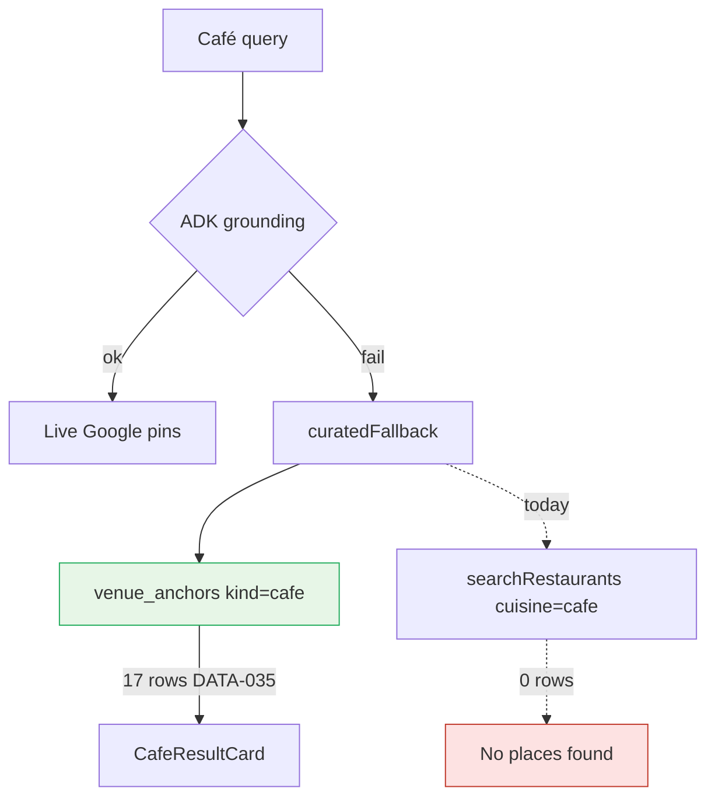

# UX-013 — Wire `venue_anchors` into café search fallback

## Plain-English problem

Tourist asks “specialty coffee in Laureles.” Production shows **“No places found.”** Supabase has **17 verified café anchors** (DATA-035), but `search-grounded-places.ts` fallback queries `restaurants` filtered as café — **0 rows**. The seeded data never reaches the UI.

## User impact

- **Tourist:** Laureles coffee queries fail on [mdeai.co](https://www.mdeai.co/) despite curated Pergamino/Rituales data in DB.
- **Sofía:** DATA-035 marked Done but persona acceptance fails — data without wiring is not shipped.

## Persona affected

**Tourist** (café / food vertical on `/` concierge chat).

## Root cause

**KNOWN.** Supabase MCP: 17 `venue_anchors` (`kind=cafe`); 0 café-tagged `restaurants`. `grep venue_anchors mdeapp/src` → zero reads. Fallback in `search-grounded-places.ts` uses `searchRestaurants({ cuisine: 'cafe' })`.

## Files likely involved

| File | Change |
|------|--------|
| `mdeapp/src/mastra/tools/search-grounded-places.ts` | Replace or extend `curatedFallback` → query `venue_anchors WHERE kind='cafe'` |
| New or existing | `searchVenueAnchors` helper or `/api/venues/search` route |
| `mdeapp/src/components/copilot/search-tool-renders.tsx` | Ensure `GroundedCafeResults` maps anchor rows → `CafeResultCard` shape |
| `mdeapp/src/mastra/agents/concierge.ts` | Prompt/tool path unchanged if tool returns same envelope |

## Skills to load

`mde-task-lifecycle` → `mde-supabase` (schema + RLS read path) → `mastra` (tool execute) → `copilotkit-integrations` (render path) → `testing`.

## Implementation steps

1. Add server-side query: `venue_anchors` where `kind = 'cafe'` and `is_active`, with neighborhood filter when query mentions Laureles/Poblado/etc.
2. Map rows to existing grounded/café card DTO (place_id, name, neighborhood, metadata vibe fields).
3. Wire into `curatedFallback` when ADK fails (keep ADK first when URL is set).
4. Add Vitest: mock Supabase → tool returns ≥1 anchor for “coffee Laureles”.
5. **B-10 interim (verify on disk):** `FALLBACK_RESTAURANTS` café rows + `curatedFallback` cuisine-less retry may already ship — still replace with `venue_anchors` as canonical path (17 DATA-035 rows).
6. Do **not** rely on `restaurants.cuisine_types` or static fallback as long-term fix.

## Tests required

- **Vitest:** `search-grounded-places` curated fallback returns anchor IDs for café query text.
- **Vitest:** empty anchors → structured empty, not throw.
- **Browser / Playwright:** “quiet café Laureles” → ≥1 `CafeResultCard` on localhost **and** prod after deploy.

## Acceptance criteria

- [ ] “specialty coffee in Laureles” returns ≥1 café card from `venue_anchors` on prod.
- [ ] No dependency on `restaurants.cuisine_types` containing café.
- [ ] ADK path unchanged when `ADK_GROUNDING_URL` is valid.
- [ ] `npm run floor` exits 0.
- [ ] Evidence: screenshot + Supabase row IDs under `tasks/testing/evidence/<date>/`.

## Failure cases

- Anchor missing `google_place_id` → skip row, log once.
- Query is restaurant not café → do not return anchors (intent guard).

## Do not overbuild

- No ADK deploy (UX-018).
- No UX-010 card shell refactor — use existing `CafeResultCard`.

## Flow diagram

## Verification (2026-05-31)

| Claim | Result |
|-------|--------|
| venue_anchors in src | 🔴 0 refs — task required |
| RLS public select | ✅ migration `venue_anchors_public_select` |
| B-10 interim fallback | 🟡 Shipped on branch — not canonical |
| Use mde-supabase MCP | Verify row count before Done |
