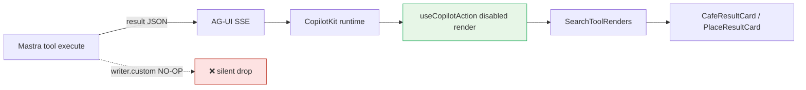

# UX-014 — Emit agent tool cards without `writer.custom`

## Plain-English problem

Agent runs `searchRestaurantsTool`, finds 5 rows, but the chat shows **nothing**. The tool tries `context?.writer?.custom()` which **no-ops** in current Mastra beta — data never crosses AG-UI to React.

## User impact

- **Tourist:** “quiet rooftop dinner Provenza” → agent succeeds → **empty cards** (prod today).
- **Camila:** Same silent failure on any agent-path restaurant/hybrid query.

## Persona affected

**Tourist** (restaurants, attractions, hybrid agent path). Rentals/events fast-path unaffected.

## Root cause

**KNOWN (PR #18 audit R1).** Merged SEARCH-003 uses `writer.custom` for card payload. Working pattern in codebase: `useCopilotAction({ available: "disabled", render })` in `search-tool-renders.tsx` for fast-path tools.

## Files likely involved

| File | Change |
|------|--------|
| `mdeapp/src/mastra/tools/search-restaurants.ts:327` | Remove `context?.writer?.custom` |
| `mdeapp/src/mastra/tools/search-rentals.ts:368` | Same (agent path only — fast-path OK) |
| `mdeapp/src/mastra/tools/search-events.ts:294` | Same |
| `mdeapp/src/mastra/tools/search-attractions.ts:291` | Same |
| `search-grounded-places.ts` | **No writer.custom** — do not touch |
| `mdeapp/src/components/copilot/search-tool-renders.tsx` | Ensure disabled `useCopilotAction` render per tool name |

## Skills to load

`mde-task-lifecycle` → `copilotkit-integrations` (Mastra + CK 1.55.2 pattern from `CopilotKit/examples/integrations/mastra/`) → `copilotkit-agui` → `mastra` → `testing`.

## Implementation steps

1. Trace one failing query end-to-end: tool execute → SSE → `SearchToolRenders` — document gap.
2. Copy pattern from working `searchRentalsTool` / `searchGroundedPlacesTool` disabled render registration.
3. Remove reliance on `context.writer.custom` for restaurant/hybrid tools; return structured `result` only.
4. Vitest: tool execute → envelope shape matches what `normalizeToolEnvelope` expects (no LLM).
5. Browser: “rooftop dinner Provenza” → ≥1 restaurant card visible.

## Tests required

- **Vitest:** tool output schema + render branch selection (not LLM-dependent).
- **Vitest:** `types.ts` fields ⊆ agent Zod working memory.
- **Browser:** agent-path restaurant query shows cards + map pins.

## Acceptance criteria

- [ ] Agent-path `searchRestaurantsTool` shows cards without `writer.custom`.
- [ ] Hybrid rank metadata still available to card if present in result.
- [ ] No duplicate cards (registrar path unchanged for rentals/cafés).
- [ ] `npm run floor` exits 0.
- [ ] Localhost + prod browser evidence saved.

## Do not overbuild

- Do not migrate to CopilotKit v2 (`copilotkit-develop` is reference only).
- Do not refactor UX-010 card shell in same PR — emit first, unify later.

## Flow diagram

## Verification (2026-05-31)

| Claim | Result |
|-------|--------|
| writer.custom in restaurants | ✅ L327 |
| writer in grounded-places | ✅ None |
| Fix pattern | copilotkit-integrations + Mastra example |
