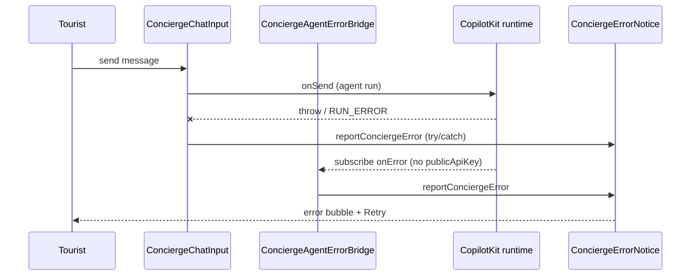

# UX-015 — Ship PR #17 error bridge; split search commits out

## Plain-English problem

PR #17 on GitHub was missing the bridge; **local branch has it mounted**. v2 import **fixed** — bridge now uses v1 `setInternalErrorHandler` (same pattern as `@copilotkit/react-ui` `Chat.tsx`; required because `props.onError` on `<CopilotKit>` only fires when `publicApiKey` is set).

## v1 fix (2026-05-31)

Self-hosted `/api/copilotkit` has no `publicApiKey`, so `handleErrors` skips `props.onError`. Register an **internal error handler** via `useCopilotContext()` instead of `@copilotkit/react-core/v2` `useCopilotKit().subscribe`.

## Files (verified on disk)

| File | Status |
|------|--------|
| `src/components/copilot/concierge-agent-error-bridge.tsx` | ✅ exists |
| `src/components/chat/chat-center-panel.tsx:40` | ✅ mounted |
| `src/components/chat/concierge-chat-input.tsx:108-113` | ✅ try/catch → `reportConciergeError()` |

## Out of scope (move to separate PRs)

| Commit / topic | Target |
|----------------|--------|
| B-09 event classifier | UX-019 on `main` |
| B-10 café restaurant fallback | Superseded by UX-013 |
| `supabase/` migrations/seeds chore | Already `chore(supabase)` slice — separate PR if not merged |
| Search hybrid fixes | SEARCH / main slices |

## Implementation steps

1. `git fetch origin` — confirm remote vs local diff on #17 branch.
2. Interactive rebase or cherry-pick: **UX-only commits** onto clean `feat/ux-002-005-chat`.
3. Push bridge + try/catch + UX-005; force-with-lease only if branch owner agrees.
4. Update PR #17 description: files touched, local smoke PASS reference.
5. Run `npm test` (Vitest error + pending-store suites) before push. **No `smoke:ux005-thinking` script exists** — do not invoke it; cover the thinking-indicator via the existing Vitest pending-store tests.

## Tests required

- Existing Vitest error + pending-store suites green.
- Thinking indicator covered by Vitest pending-store tests (no `smoke:ux005-thinking` script — confirmed absent in `package.json`).

## Acceptance criteria

- [ ] GitHub PR #17 diff includes `ConciergeAgentErrorBridge` + mount.
- [x] Local: `ConciergeAgentErrorBridge` mounted in `chat-center-panel.tsx`.
- [x] Local: `onSend` try/catch → `reportConciergeError()`.
- [x] **No `@copilotkit/react-core/v2` imports** in `mdeapp/src` (v1 `setInternalErrorHandler`).
- [ ] No B-09/B-10/search-grounded changes in #17 diff.
- [x] Vitest error + pending store tests green (7/7).
- [ ] Pushed to origin; ready for merge to `main` before #19.

## Flow diagram

## Verification (2026-05-31)

| Claim | Result |
|-------|--------|
| Bridge file exists | ✅ Verified |
| try/catch on onSend | ✅ L108-113 |
| v1-only CopilotKit | ✅ `setInternalErrorHandler` — zero v2 in `src/` |
| Vitest (error + pending) | ✅ 7/7 pass |
| Pushed to origin | ❌ Push pending |

## Merge gate G1

Merge #17 → Vercel prod → verify error path on self-hosted runtime (no publicApiKey).

## Do not overbuild

- Do not add Playwright here — UX-016.
- Do not merge #19 in same PR.
