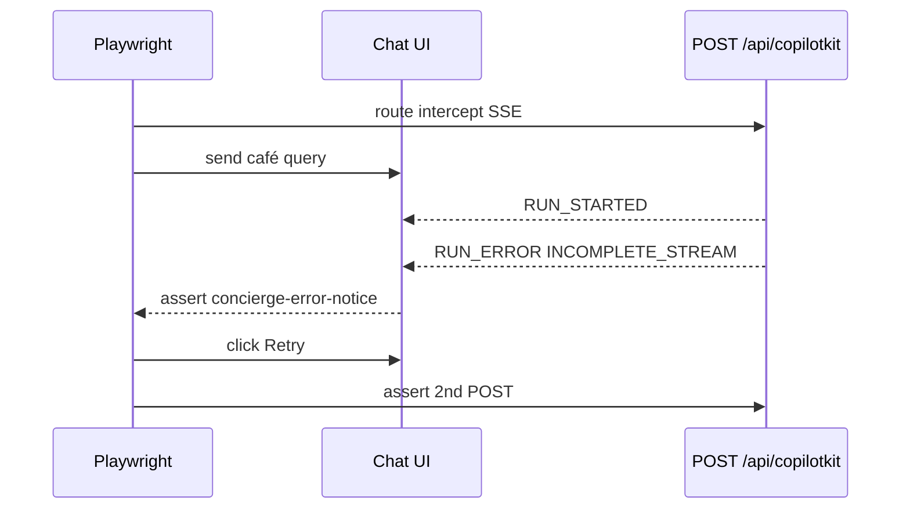

# UX-016 — Playwright RUN_ERROR → error bubble e2e

## Plain-English problem

UX-002 ships error UI with Vitest coverage but **no Playwright proof**. QA cannot regression-gate RUN_ERROR without a live failing concierge.

## User impact

- **Lucía (QA):** Cannot CI-gate “error bubble appears” — audit scored tests 72–80% for #17.

## Root cause

**KNOWN spec gap (audit B4).** Task UX-002 listed Playwright AC; not implemented on remote #17.

## Files likely involved

| File | Change |
|------|--------|
| `mdeapp/e2e/concierge-run-error.spec.ts` (or `tests/e2e/`) | New spec |
| `mdeapp/playwright.config.ts` | Route intercept helper if needed |

## Implementation steps

1. Navigate `/` (concierge chat).
2. `page.route('**/api/copilotkit**')` → return SSE: `RUN_STARTED` then `RUN_ERROR` (`INCOMPLETE_STREAM`).
3. Send user message; assert `[data-testid=concierge-error-notice]` visible.
4. Click Retry; assert second POST issued.
5. Optional: hang route → timeout path asserts same notice.

## Acceptance criteria

- [ ] Playwright spec passes locally and in CI.
- [ ] Does not require prod concierge health or Gemini key.
- [ ] Evidence screenshot under `tasks/testing/evidence/<date>/`.
- [ ] Linked from UX-002 acceptance checklist.

## Do not overbuild

- One spec file; no full concierge conversation suite.

## Flow diagram

## Verification (2026-05-31)

| Claim | Result |
|-------|--------|
| smoke:ux005-thinking script | 🔴 Not in package.json |
| concierge-error-notice testId | ✅ Vitest exists |
| Playwright spec | ❌ Not yet created |
