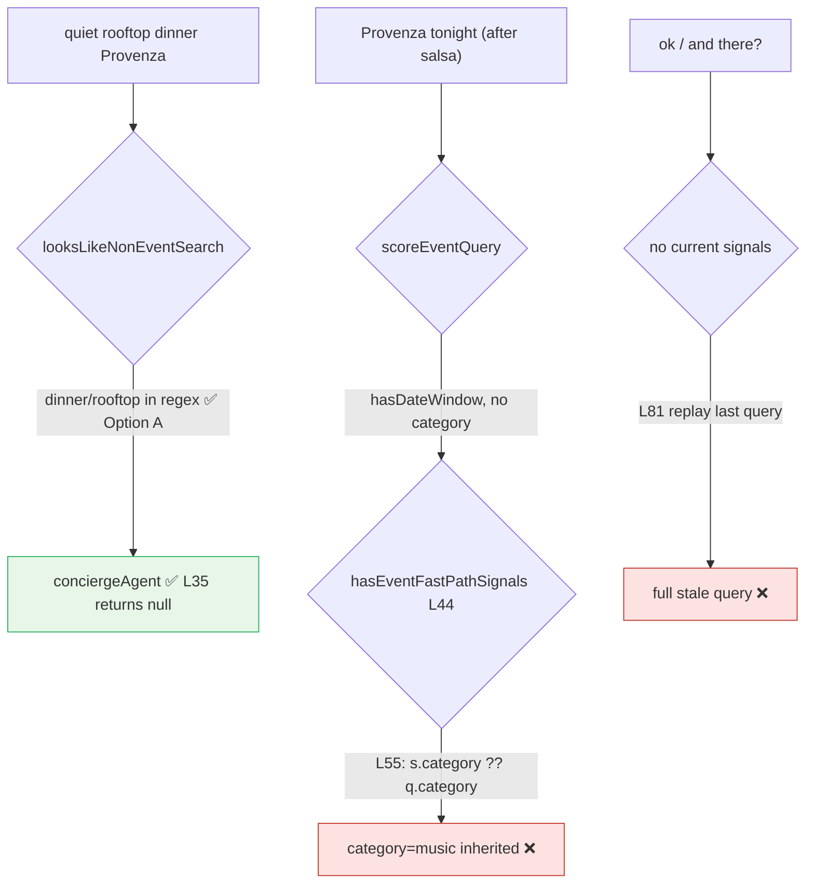

# UX-019 — Event fast-path classifier fix (B-09)

## Plain-English problem

After searching events, **Tourist** asks “quiet rooftop dinner in Provenza” → gets **6 music events** instead of restaurants ([`23-live-audit.md`](../tests/23-live-audit.md) §2c).

## Root cause (forensic trace — re-verified 2026-05-31 @ a8d2e26)

1. `looksLikeNonEventSearch` — **Option A:** extend `NON_EVENT_FOOD_VENUE_RE` with `dinner|lunch|rooftop|bistro|dine|eatery|lounge`  
   → **SHIPPED** at `event-query-classifier.ts:55-56` (commit 73bb50c). Verified: `looksLikeNonEventSearch("quiet rooftop dinner in Provenza")` → `true`, so `buildEventSearchParams` returns `null` at **L35** before any memory path. The headline B-09 case is closed by Option A alone.
2. **Option B (still required — narrower than originally written):** two distinct memory-bleed sites remain in `buildEventSearchParams` (`event-search-fast-path.ts`):
   - **L55 (primary):** inside the fast-path-signals block, `category: s.category ?? q?.category`. A date/neighborhood-only follow-up such as **"Provenza tonight"** (scores `hasDateWindow`, no category token) passes `hasEventFastPathSignals` and inherits stale `q.category = 'music'` from the prior salsa search. **This is the AC-3 leak — not L81.**
   - **L81 (secondary):** `if (q?.category || q?.neighborhood || …)` replays the entire last event query when the current message has **zero** signals (e.g. "ok", "and there?"). Lower-frequency but still a session-order leak.

## Files

| File | Change |
|------|--------|
| `src/lib/event-query-classifier.ts` | ✅ Option A done (L55-56). No further change unless a new food term leaks. |
| `src/lib/event-search-fast-path.ts` | **L55:** do not inherit `q?.category` when the current message has no category token — gate category inheritance on `s.hasCategory` (or an explicit event token in the **current** message). **L81:** require an explicit event signal in the current message before replaying memory. |
| `src/lib/__tests__/event-search-fast-path.test.ts` | Session-order: (a) salsa search → "quiet rooftop dinner in Provenza" → `buildEventSearchParams` returns `null` (Option A, regression lock); (b) salsa search → "Provenza tonight" → result has **no** `category: 'music'` (L55 fix); (c) salsa search → bare "ok" → `null` (L81 fix). |

## Acceptance criteria

- [x] “quiet rooftop dinner Provenza” **after** “salsa events this weekend” → no event fast-path. *(Option A shipped 73bb50c — add regression lock only.)*
- [ ] “salsa events this weekend” still fast-paths. *(regression — must not break.)*
- [ ] “Provenza tonight” alone does not inherit stale `category: music` without a category/event word in the **current** message (Option B / L55).
- [ ] Bare follow-up ("ok", "and there?") after an event search does not replay the last query (Option B / L81).
- [ ] Vitest + evidence in `tasks/testing/evidence/<date>/`.
- [ ] Separate PR from #17; `npm run floor` green.

## Do not overbuild

- No full INT-002 rewrite — classifier + memory guard only.

## Flow diagram

## Verification (2026-05-31 — independent forensic re-probe @ a8d2e26)

| Claim | Result |
|-------|--------|
| Option A regex shipped | ✅ `event-query-classifier.ts` L55-56; B-09 regression test present in `event-query-classifier.test.ts` (9/9 pass) |
| Headline case "rooftop dinner Provenza" | ✅ Closed by Option A at `event-search-fast-path.ts:35` |
| Option B leak site — primary | 🔴 **L55** `s.category ?? q?.category` (NOT L81 as originally written) |
| Option B leak site — secondary | 🟡 **L81** bare-follow-up memory replay |
| Session-order Vitest | ❌ Missing in `event-search-fast-path.test.ts` (12 tests, none cover stale-category inheritance) — add 3 cases |
| Fast-path wired (not dead code) | ✅ via `src/hooks/use-event-search-fast-path.ts` → `concierge-chat-input.tsx` + `chat-query-bar.tsx` |
