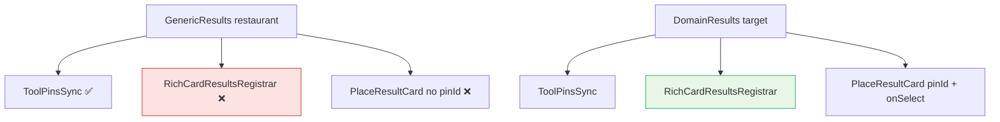

# UX-022 — DomainResults wrapper (P0 ship blocker)

## Purpose

Close the structural bug: **agent-path** restaurant/attraction show **duplicate side-panel rows**; **all** `GenericResults` cards **cannot highlight map pins**.

## Root cause (verified on disk 2026-06-01)

| Path | Registrar | `pinId`/`onSelect` |
|------|-----------|-------------------|
| `RestaurantResults` (fast path) | ✅ ~L423 | ❌ |
| `restaurantToolRender` → bare `GenericResults` | ❌ ~L639 | ❌ |
| `attractionToolRender` → bare `GenericResults` | ❌ ~L658 | ❌ |
| `EventResults` | ✅ ~L343 | ✅ (reference) |

`GenericResults` (`search-tool-renders.tsx` ~433):

- ✅ `ToolPinsSync`
- ❌ No `RichCardResultsRegistrar` *(unless parent `RestaurantResults` wraps it)*
- ❌ `PlaceResultCard` rendered without `pinId`, `selected`, `onSelect`

Compare `RentalResults` / `GroundedCafeResults` / `EventResults` — all three pass `selectedPinId`, `panToPin`, registrar.

## Affected files

| Action | Path |
|--------|------|
| Create | `mdeapp/src/components/copilot/domain-results.tsx` |
| Modify | `search-tool-renders.tsx` — fix `GenericResults` (registrar + pin props); **`restaurantToolRender` → `RestaurantResults`**; attraction through `DomainResults` |
| No change | `place-result-card.tsx` — **already accepts `pinId`/`selected`/`onSelect` (L7-9, `interactive = Boolean(onSelect && pinId)`).** The gap is the caller omitting them, not a missing prop. |
| Test | `domain-results.test.tsx`, update `rich-card-results` tests |

## DomainResults API

```tsx
<DomainResults
  category="restaurant"
  result={result}
  rows={rows}
  renderCard={(row, ctx) => (
    <PlaceResultCard
      pinId={ctx.pinId}
      selected={ctx.selected}
      onSelect={ctx.onSelect}
      ...
    />
  )}
  emptyState={<GenericEmptyState category="restaurant" ... />}
/>
```

Internally: `ToolPinsSync` + `RichCardResultsRegistrar` + scroll-into-view on `selectedPinId` + list ref.

**Verified gap:** `GenericResults` @ `search-tool-renders.tsx:418` — pins only, no registrar, no `pinId`/`onSelect` on cards.

## Flow diagram



## Verification (2026-06-01)

| Claim | Result |
|-------|--------|
| Event has registrar | ✅ ~L343 — **not UX-022 scope** |
| Fast-path restaurant registrar | ✅ `RestaurantResults` — still needs `pinId` in `GenericResults` |
| Agent restaurant registrar | 🔴 `restaurantToolRender` uses bare `GenericResults` |
| Attraction registrar | 🔴 `attractionToolRender` bare `GenericResults` |
| `PlaceResultCard` pin props exist | ✅ Component accepts props — **caller omits them** |
| Cafe/rental/event pattern | ✅ Reference (grounded ~129, rental ~211, event ~343) |

## Tests

- Vitest: mounting DomainResults registers count → `shouldSuppressGenericMapResults(true)`.
- Vitest: unmount clears count.
- Vitest: each row gets unique `data-pin-id`.

## Acceptance

- [x] Restaurant search: 0 duplicate side-panel pin rows when cards visible.
- [x] Click/hover card highlights matching map pin.
- [x] Pin click scrolls card into view.
- [x] Attraction path identical.
- [x] Event/rental/café behavior unchanged.
- [x] `npm run test:e2e:restaurant-fast-path` pass (2026-06-01).
- [x] Vitest `domain-results.test.tsx` green.

## Dependencies

**UX-014** — agent path must emit tool results to UI; wrapper fixes fast-path/render-path sync only.
