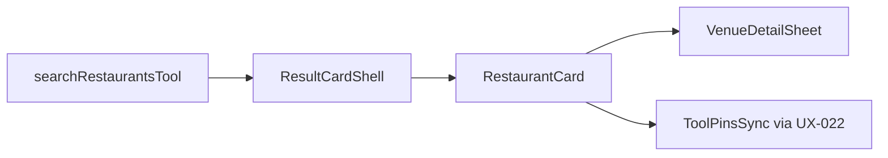

# UX-025 — RestaurantCard rich (M2)

## Purpose

Tourist asking "best ramen Poblado" gets café-quality cards, not title + plain link.

## Affected files

| Create | Modify |
|--------|--------|
| `restaurant-card.tsx` | `search-tool-renders.tsx` restaurant branch |
| | `domain-results.tsx` renderCard |
| | Reuse `places-display` formatters, `placesPhotoProxyUrl` |

## Data source

Consume existing restaurant tool payload fields (place_id, rating, photo, price_level, open_now) — **no tool schema change**.

## Detail panel

Minimum: `VenueDetailSheet` with place summary + Maps links. Full Places enrichment optional follow-up.

## Tests

- Vitest: maps sparse payload → glyph placeholder, no crash.
- Vitest: full payload → photo + Badge price + rating line.
- Playwright: restaurant query → N rich cards, 0 side-panel dup.

## Acceptance

- [x] Restaurant branch renders `RestaurantCard`, not bare `PlaceResultCard`.
- [x] Details CTA opens `CafeDetailPanel` via `openCafeDetail` (shared place sheet).
- [x] Map pin sync via UX-022 contract.
- [x] Vitest + `test:e2e:restaurant-fast-path` pass (2026-06-01).

## Flow diagram

## Verification (2026-06-01)

| Claim | Result |
|-------|--------|
| Depends UX-022 | ✅ pin sync prerequisite — **hard blocker** |
| Depends UX-023 | ⚪ **Optional** — may copy `CafeResultCard` layout before shell lands |
| PlaceResultCard today | 🔴 minimal — thin cards on prod after UX-036 |
| Backend change | ❌ None required |
