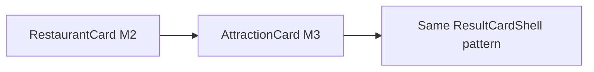

# UX-026 — AttractionCard rich (M3)

## Purpose

Attractions currently share weak `PlaceResultCard` via `GenericResults` — parity with restaurants after UX-025.

## Affected files

- Create `attraction-card.tsx`
- Modify `search-tool-renders.tsx` attraction branch + `DomainResults`

## Acceptance

- [x] Attraction search uses `AttractionCard` via `DomainResults`.
- [x] `PlaceResultCard` only for non restaurant/attraction categories (none wired).
- [x] Vitest green; full `npm run floor` blocked by untracked `supabase/` in tsc (pre-existing).

## Flow diagram

## Verification (2026-05-31)

| Claim | Result |
|-------|--------|
| Blocks on UX-025 | ✅ Correct sequencing |
