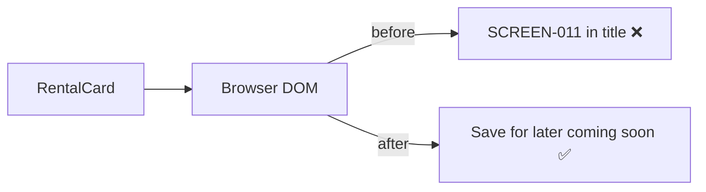

# UX-027 — RentalCard copy leaks (P0 quick win)

## Changes

| Location | Before | After |
|----------|--------|-------|
| Photo placeholder | `"Photo soon"` | `"Photo"` or empty alt-only |
| Save `title` | `"Saved collections ship with SCREEN-011"` | `"Save for later (coming soon)"` (align UX-008) |

## File

`mdeapp/src/components/copilot/rental-card.tsx`

## Acceptance

- [x] No internal ticket IDs in DOM/inspector (`title="Save for later (coming soon)"` @ L186).
- [x] Photo placeholder cleaned (commit a8d2e26).
- [ ] Merged to `main` / prod deploy — verify after #17 merge.

## Flow diagram

## Verification (2026-05-31)

| Claim | Result |
|-------|--------|
| Save title fixed | ✅ L186 |
| On main | ❌ Branch-only until merge |
