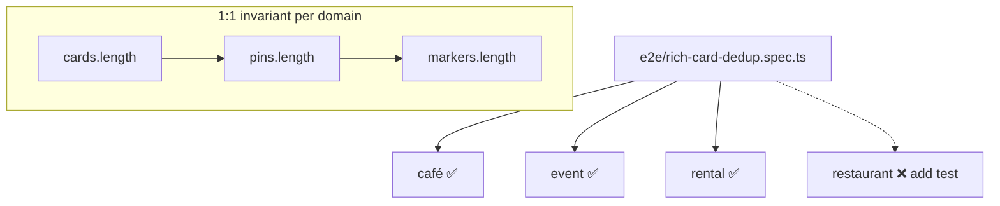

# UX-030 — Card system test suite (M5)

## Purpose

Prevent regression of duplicate panels and broken map sync — the exact bugs UX-010/22-card-audit found.

## Test matrix

| Test | Type | Assert |
|------|------|--------|
| `shouldSuppressGenericMapResults` all categories | Vitest | true when registrar mounted |
| Pin parity builder | Vitest | `rows.length === pins.length` |
| Card `data-pin-id` | Vitest | matches pin id from ToolPinsSync input |
| aria-label present | Vitest | all card kinds |
| Rental domain e2e | Playwright | N cards, N markers, 0 pin-row dup |
| Café domain e2e | Playwright | same |
| Restaurant domain e2e | Playwright | same + rich card testid |
| Event domain e2e | Playwright | same |
| Hover highlight | Playwright | optional data attribute on pin |
| Fallback render | Vitest | sparse payload no throw |

## Files

- `mdeapp/src/platform/copilot/__tests__/rich-card-results.test.ts` (extend)
- `mdeapp/e2e/card-unification.spec.ts` (new)
- `tasks/testing/evidence/<date>/card-unification-*.png`

## Acceptance

- [ ] All new tests pass in CI.
- [ ] `npm run floor` green.
- [ ] Evidence folder populated for Done gate.

## Flow diagram

## Verification (2026-05-31)

| Claim | Result |
|-------|--------|
| rich-card-dedup.spec.ts | ✅ exists — extend for restaurant |
| golden-queries-smoke | 🔴 not on main |
| Pin parity unit tests | Partial in platform/copilot |
