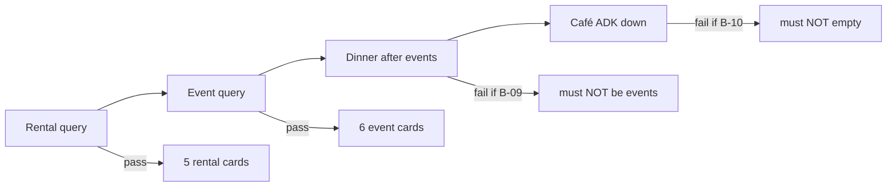

# UX-031 — Live audit vertical smoke

## Purpose

[`23-live-audit.md`](../tests/23-live-audit.md) §1 matrix was manual. Lock it as Playwright or script so **60% → 90%** session score is CI-gated.

## Scenarios (from audit)

| # | Query | Assert |
|---|-------|--------|
| 1 | `1BR in Laureles under $80/night` | `POST /api/rentals/search` 200; ≥1 `[data-testid="rental-card"]`; assistant mentions rentals |
| 2 | `salsa events this weekend` | `POST /api/events/search`; ≥1 event card; optional B-06 fallback copy |
| 3 | **After #2** — `quiet rooftop dinner in Provenza` | **NOT** `/api/events/search`; agent or restaurant path; no "Found N events" |
| 4 | `good specialty coffee in Laureles` | ≥1 café/grounded card OR curated fallback; not "No places found" (with ADK mocked down) |

## Implementation

- Playwright spec `e2e/live-audit-verticals.spec.ts` (create new)
- Reuse helpers from `e2e/helpers/maps-layout.ts`
- **Do not** reference `scripts/intelligence/golden-queries-smoke.ts` — file absent on main branch
- Scenario 3 is the **session-order** case — must run in same browser context after scenario 2
- Scenario 4: route/mock ADK unavailable OR use env flag so fallback path executes

## Acceptance

- [ ] All 4 scenarios pass locally
- [ ] Evidence path: `tasks/testing/evidence/<date>/live-audit-verticals/`
- [ ] Linked from `23-live-audit.md` §11

## Flow diagram

## Verification (2026-05-31)

| Claim | Result |
|-------|--------|
| Manual audit done | ✅ 23-live-audit.md |
| Automated spec | ❌ Not yet |
| Depends UX-019 B-09 | 🔴 Scenario 3 |
