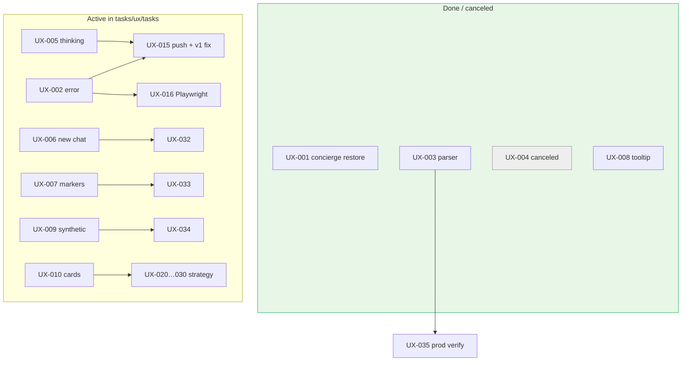

# UX-001…010 → tasks/ux/tasks consolidation

> Original live-site pack lives in [`../`](../INDEX.md). This doc maps each legacy task to **status**, **successor task**, and **action**.

## Summary

| Legacy | Still needed? | Status (disk @ feat/ux-002-005-chat) | Successor in `tasks/ux/tasks/` |
|--------|---------------|--------------------------------------|--------------------------------|
| UX-001 | No (verify prod) | 🟢 **Done** — same-origin runtime | — (keep parent spec as history) |
| UX-002 | Yes (e2e gap) | 🟡 **In Progress** — UI + bridge on branch | **UX-015**, **UX-016** |
| UX-003 | Verify prod only | 🟢 **Done on disk** — tests pass | **UX-035** (prod verify gate) |
| UX-004 | No | 🚫 **Canceled** | — |
| UX-005 | Yes (push) | 🟡 **In Progress** — indicator shipped locally | **UX-015** |
| UX-006 | Yes | ⚪ **Not started** — still `Link href="/"` | **UX-032** |
| UX-007 | Yes (verify-first) | ⚪ **Not started** | **UX-033** |
| UX-008 | No | 🟢 **Done** — same as UX-027 | **UX-027** |
| UX-009 | Yes | ⚪ **Not started** — no prod synthetic | **UX-034** |
| UX-010 | Yes (phased) | 🟡 **Plan only** — M0–M5 not on main | **UX-010-CARD-UNIFICATION-STRATEGY**, **UX-020…030** |

**Do not duplicate parent specs.** Edit executables in `tasks/ux/tasks/`; parent files become archival pointers.

## Per-task detail

### UX-001 — Restore conciergeAgent 🟢 Done

**Probe:** `copilotkit-client-props.ts` always returns `runtimeUrl: "/api/copilotkit"` — never `publicApiKey` (tests in `copilotkit-client-props.test.ts`).

**Remaining:** Confirm Vercel prod env does not re-enable Cloud mode; one prod café query smoke.

**Not re-filed** — closure evidence belongs in parent spec + PR #13.

### UX-002 + UX-005 — Error bubble + thinking 🟡 → UX-015 / UX-016

| Element | Disk |
|---------|------|
| `ConciergeErrorNotice` | ✅ |
| `ConciergeThinkingIndicator` | ✅ |
| `concierge-pending-store` | ✅ |
| `ConciergeAgentErrorBridge` | ✅ (🔴 v2 import — UX-015) |
| Playwright RUN_ERROR e2e | ❌ UX-016 |

### UX-003 — $500 a night parser 🟢 → UX-035

**Probe:** `rental-query-parser.test.ts` lines 21–30 — `$500 a night` → nightly 500.

**Remaining:** Prod deploy proof only (SAN-316).

### UX-004 — Disable chips 🚫 Canceled

Concierge path restored; chips should work after UX-013/019/014. No `CONCIERGE_ENABLED` flag on disk — intentional skip.

### UX-006 — New chat reset ⚪ → UX-032

**Probe:** `chat-nav-rail.tsx:24-30` — still plain `Link href="/"`, no thread/pin/memory reset.

### UX-007 — Stale markers ⚪ → UX-033

Verify-first against current `mergePinsByCategory` + Playwright marker count.

### UX-008 — Save tooltip 🟢 → UX-027

Duplicate. Shipped `a8d2e26` — `title="Save for later (coming soon)"`.

### UX-009 — Prod synthetic ⚪ → UX-034

No `e2e/concierge-agent-smoke.spec.ts`; no Vercel cron. Depends on stable concierge (post UX-001/015).

### UX-010 — Card architecture 🟡 → UX-020…030

Parent doc is the **vision**; executable slices are card-unification pack. Do not implement from parent alone.

## Updated build order (legacy + stack)

```text
Done:     UX-001, UX-004 (cancel), UX-008/027, UX-003 (code)
P0 stack: UX-015 → UX-013/014/019/022
P1:       UX-016, UX-031, UX-035 (prod verify), UX-032, UX-033, UX-034
P2:       UX-020…030 (card unification)
```

## Mermaid — legacy → successor routing


